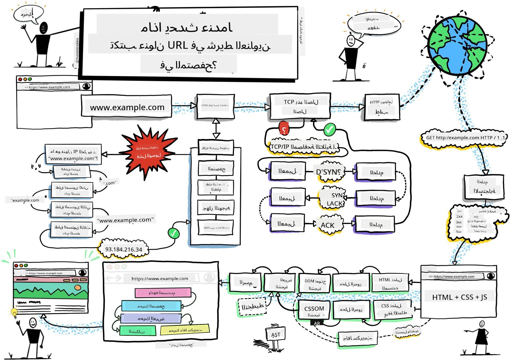
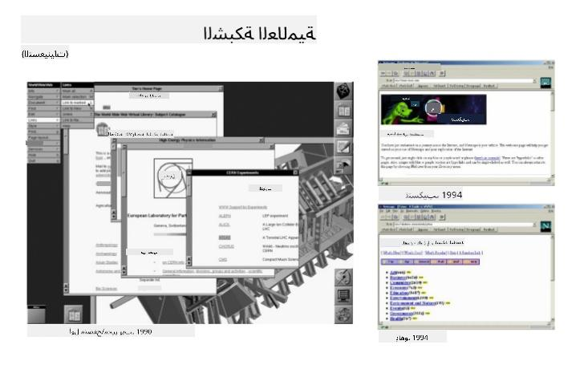
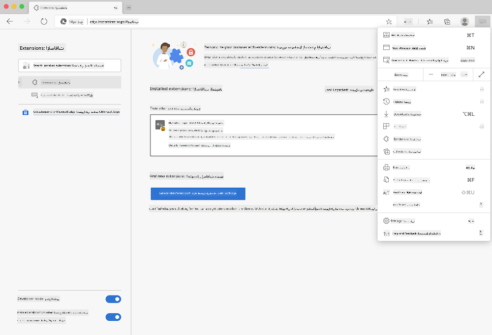
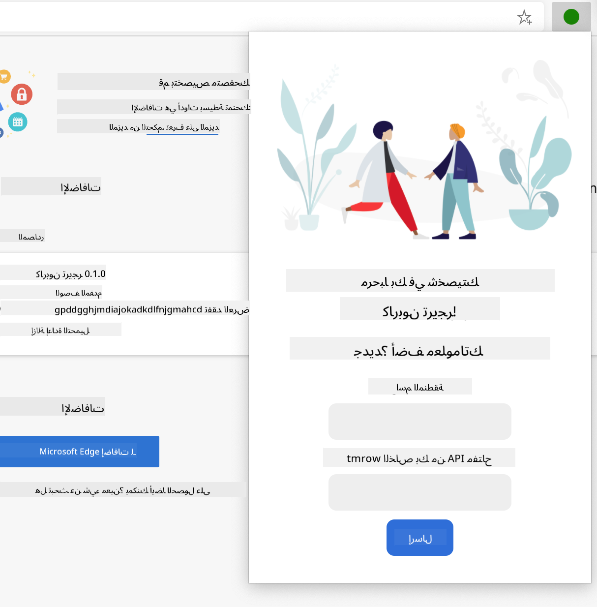

<!--
CO_OP_TRANSLATOR_METADATA:
{
  "original_hash": "0bb55e0b98600afab801eea115228873",
  "translation_date": "2025-08-25T23:36:45+00:00",
  "source_file": "5-browser-extension/1-about-browsers/README.md",
  "language_code": "ar"
}
-->
# الجزء الأول من مشروع إضافة المتصفح: كل شيء عن المتصفحات


> رسم توضيحي بواسطة [وسيم شغام](https://dev.to/wassimchegham/ever-wondered-what-happens-when-you-type-in-a-url-in-an-address-bar-in-a-browser-3dob)

## اختبار ما قبل المحاضرة

[اختبار ما قبل المحاضرة](https://ff-quizzes.netlify.app/web/quiz/23)

### المقدمة

إضافات المتصفح تضيف وظائف إضافية للمتصفح. ولكن قبل أن تبدأ في بناء واحدة، يجب أن تتعلم قليلاً عن كيفية عمل المتصفحات.

### عن المتصفح

في هذه السلسلة من الدروس، ستتعلم كيفية بناء إضافة متصفح تعمل على متصفحات Chrome وFirefox وEdge. في هذا الجزء، ستكتشف كيفية عمل المتصفحات وتضع الهيكل الأساسي لعناصر إضافة المتصفح.

ولكن ما هو المتصفح بالضبط؟ إنه تطبيق برمجي يسمح للمستخدم النهائي بالوصول إلى المحتوى من الخادم وعرضه على صفحات الويب.

✅ قليل من التاريخ: أول متصفح كان يُسمى "WorldWideWeb" وتم إنشاؤه بواسطة السير تيموثي بيرنرز-لي في عام 1990.


> بعض المتصفحات القديمة، عبر [كارين ماكجرين](https://www.slideshare.net/KMcGrane/week-4-ixd-history-personal-computing)

عندما يتصل المستخدم بالإنترنت باستخدام عنوان URL (محدد موقع الموارد الموحد)، عادةً باستخدام بروتوكول نقل النص التشعبي عبر عنوان `http` أو `https`، يتواصل المتصفح مع خادم الويب ويجلب صفحة الويب.

في هذه المرحلة، يقوم محرك العرض الخاص بالمتصفح بعرض الصفحة على جهاز المستخدم، والذي قد يكون هاتفًا محمولًا أو جهاز كمبيوتر مكتبي أو محمول.

تتمتع المتصفحات أيضًا بقدرة على تخزين المحتوى مؤقتًا حتى لا يتم استرجاعه من الخادم في كل مرة. كما يمكنها تسجيل تاريخ نشاط التصفح الخاص بالمستخدم، وتخزين "الكوكيز"، وهي أجزاء صغيرة من البيانات تحتوي على معلومات تُستخدم لتخزين نشاط المستخدم، وغير ذلك.

من المهم جدًا أن تتذكر أن المتصفحات ليست كلها متشابهة! لكل متصفح نقاط قوة وضعف، ويحتاج مطور الويب المحترف إلى فهم كيفية جعل صفحات الويب تعمل بشكل جيد عبر المتصفحات المختلفة. يشمل ذلك التعامل مع الشاشات الصغيرة مثل شاشات الهواتف المحمولة، وكذلك المستخدمين الذين يعملون في وضع عدم الاتصال.

موقع ويب مفيد جدًا قد ترغب في وضع إشارة مرجعية عليه في أي متصفح تفضله هو [caniuse.com](https://www.caniuse.com). عندما تقوم ببناء صفحات ويب، من المفيد جدًا استخدام قوائم التقنيات المدعومة في caniuse لدعم المستخدمين بأفضل طريقة ممكنة.

✅ كيف يمكنك معرفة المتصفحات الأكثر شيوعًا بين مستخدمي موقعك؟ تحقق من تحليلاتك - يمكنك تثبيت حزم تحليلات مختلفة كجزء من عملية تطوير الويب الخاصة بك، وستخبرك هذه الحزم بالمتصفحات الأكثر استخدامًا بين المتصفحات الشائعة.

## إضافات المتصفح

لماذا قد ترغب في بناء إضافة متصفح؟ إنها أداة مفيدة تُضاف إلى متصفحك عندما تحتاج إلى الوصول السريع إلى المهام التي تكررها بشكل متكرر. على سبيل المثال، إذا كنت بحاجة إلى التحقق من الألوان على صفحات الويب المختلفة التي تتفاعل معها، فقد تقوم بتثبيت إضافة متصفح لاختيار الألوان. إذا كنت تواجه صعوبة في تذكر كلمات المرور، فقد تستخدم إضافة لإدارة كلمات المرور.

تطوير إضافات المتصفح ممتع أيضًا. فهي عادةً ما تدير عددًا محدودًا من المهام التي تؤديها بشكل جيد.

✅ ما هي إضافات المتصفح المفضلة لديك؟ ما هي المهام التي تؤديها؟

### تثبيت الإضافات

قبل أن تبدأ في البناء، ألقِ نظرة على عملية بناء ونشر إضافة متصفح. على الرغم من أن كل متصفح يختلف قليلاً في كيفية إدارة هذه العملية، إلا أن العملية متشابهة في Chrome وFirefox مع هذا المثال على Edge:



> ملاحظة: تأكد من تفعيل وضع المطور والسماح بالإضافات من المتاجر الأخرى.

بشكل أساسي، ستكون العملية كالتالي:

- قم ببناء الإضافة باستخدام `npm run build`  
- انتقل في المتصفح إلى لوحة الإضافات باستخدام زر "الإعدادات والمزيد" (أيقونة `...`) في الزاوية العلوية اليمنى  
- إذا كانت عملية تثبيت جديدة، اختر `load unpacked` لتحميل إضافة جديدة من مجلد البناء الخاص بها (في حالتنا هو `/dist`)  
- أو، انقر على `reload` إذا كنت تعيد تحميل الإضافة المثبتة مسبقًا  

✅ هذه التعليمات تتعلق بالإضافات التي تقوم ببنائها بنفسك؛ لتثبيت الإضافات التي تم إصدارها في متجر إضافات المتصفح المرتبط بكل متصفح، يجب الانتقال إلى تلك [المتاجر](https://microsoftedge.microsoft.com/addons/Microsoft-Edge-Extensions-Home) وتثبيت الإضافة التي تختارها.

### ابدأ الآن

ستقوم ببناء إضافة متصفح تعرض البصمة الكربونية لمنطقتك، وتُظهر استهلاك الطاقة في منطقتك ومصدر هذه الطاقة. ستحتوي الإضافة على نموذج يجمع مفتاح API حتى تتمكن من الوصول إلى واجهة برمجة التطبيقات الخاصة بـ CO2 Signal.

**ما تحتاجه:**

- [مفتاح API](https://www.co2signal.com/)؛ أدخل بريدك الإلكتروني في المربع الموجود في هذه الصفحة وسيتم إرسال المفتاح إليك  
- [رمز منطقتك](http://api.electricitymap.org/v3/zones) المرتبط بـ [خريطة الكهرباء](https://www.electricitymap.org/map) (في بوسطن، على سبيل المثال، أستخدم 'US-NEISO')  
- [الكود المبدئي](../../../../5-browser-extension/start). قم بتنزيل مجلد `start`؛ ستكمل الكود في هذا المجلد  
- [NPM](https://www.npmjs.com) - NPM هي أداة لإدارة الحزم؛ قم بتثبيتها محليًا وسيتم تثبيت الحزم المدرجة في ملف `package.json` الخاص بك لاستخدامها في أصول الويب الخاصة بك  

✅ تعرف على المزيد حول إدارة الحزم في هذا [الوحدة التعليمية الممتازة](https://docs.microsoft.com/learn/modules/create-nodejs-project-dependencies/?WT.mc_id=academic-77807-sagibbon)

خذ دقيقة لتصفح قاعدة الكود:

dist  
    -|manifest.json (الإعدادات الافتراضية هنا)  
    -|index.html (تنسيق HTML للواجهة الأمامية هنا)  
    -|background.js (كود JavaScript الخلفي هنا)  
    -|main.js (كود JavaScript المدمج)  
src  
    -|index.js (كود JavaScript الخاص بك هنا)  

✅ بمجرد أن تحصل على مفتاح API ورمز المنطقة الخاص بك، قم بتخزينهما في مكان ما كملاحظة للاستخدام المستقبلي.

### بناء HTML للإضافة

تحتوي هذه الإضافة على عرضين. الأول لجمع مفتاح API ورمز المنطقة:



والثاني لعرض استهلاك الكربون في المنطقة:


لنبدأ ببناء HTML للنموذج وتنسيقه باستخدام CSS.

في مجلد `/dist`، ستقوم ببناء نموذج ومنطقة نتائج. في ملف `index.html`، قم بملء منطقة النموذج المحددة:

```HTML
<form class="form-data" autocomplete="on">
	<div>
		<h2>New? Add your Information</h2>
	</div>
	<div>
		<label for="region">Region Name</label>
		<input type="text" id="region" required class="region-name" />
	</div>
	<div>
		<label for="api">Your API Key from tmrow</label>
		<input type="text" id="api" required class="api-key" />
	</div>
	<button class="search-btn">Submit</button>
</form>	
```  
هذا هو النموذج حيث سيتم إدخال المعلومات المحفوظة وتخزينها محليًا.

بعد ذلك، قم بإنشاء منطقة النتائج؛ تحت العلامة النهائية للنموذج، أضف بعض الأقسام:

```HTML
<div class="result">
	<div class="loading">loading...</div>
	<div class="errors"></div>
	<div class="data"></div>
	<div class="result-container">
		<p><strong>Region: </strong><span class="my-region"></span></p>
		<p><strong>Carbon Usage: </strong><span class="carbon-usage"></span></p>
		<p><strong>Fossil Fuel Percentage: </strong><span class="fossil-fuel"></span></p>
	</div>
	<button class="clear-btn">Change region</button>
</div>
```  
في هذه المرحلة، يمكنك تجربة البناء. تأكد من تثبيت تبعيات الحزمة لهذه الإضافة:

```
npm install
```  

سيستخدم هذا الأمر npm، مدير حزم Node، لتثبيت webpack لعملية بناء الإضافة الخاصة بك. Webpack هو أداة تجميع تتعامل مع تجميع الكود. يمكنك رؤية ناتج هذه العملية من خلال النظر في `/dist/main.js` - سترى أن الكود قد تم تجميعه.

في الوقت الحالي، يجب أن يتم بناء الإضافة وإذا قمت بنشرها في Edge كإضافة، سترى نموذجًا معروضًا بشكل أنيق.

تهانينا، لقد اتخذت الخطوات الأولى نحو بناء إضافة متصفح. في الدروس القادمة، ستجعلها أكثر فاعلية وفائدة.

---

## 🚀 التحدي

ألقِ نظرة على متجر إضافات المتصفح وقم بتثبيت واحدة على متصفحك. يمكنك فحص ملفاتها بطرق مثيرة للاهتمام. ماذا تكتشف؟

## اختبار ما بعد المحاضرة

[اختبار ما بعد المحاضرة](https://ff-quizzes.netlify.app/web/quiz/24)

## المراجعة والدراسة الذاتية

في هذا الدرس، تعلمت قليلاً عن تاريخ متصفح الويب؛ اغتنم هذه الفرصة لتتعرف على كيفية تصور مخترعي الشبكة العنكبوتية العالمية لاستخدامها من خلال قراءة المزيد عن تاريخها. بعض المواقع المفيدة تشمل:

[تاريخ متصفحات الويب](https://www.mozilla.org/firefox/browsers/browser-history/)

[تاريخ الويب](https://webfoundation.org/about/vision/history-of-the-web/)

[مقابلة مع تيم بيرنرز-لي](https://www.theguardian.com/technology/2019/mar/12/tim-berners-lee-on-30-years-of-the-web-if-we-dream-a-little-we-can-get-the-web-we-want)

## الواجب

[أعد تصميم الإضافة الخاصة بك](assignment.md)  

**إخلاء المسؤولية**:  
تم ترجمة هذا المستند باستخدام خدمة الترجمة بالذكاء الاصطناعي [Co-op Translator](https://github.com/Azure/co-op-translator). بينما نسعى لتحقيق الدقة، يرجى العلم أن الترجمات الآلية قد تحتوي على أخطاء أو معلومات غير دقيقة. يجب اعتبار المستند الأصلي بلغته الأصلية المصدر الرسمي. للحصول على معلومات حاسمة، يُوصى بالاستعانة بترجمة بشرية احترافية. نحن غير مسؤولين عن أي سوء فهم أو تفسيرات خاطئة تنشأ عن استخدام هذه الترجمة.