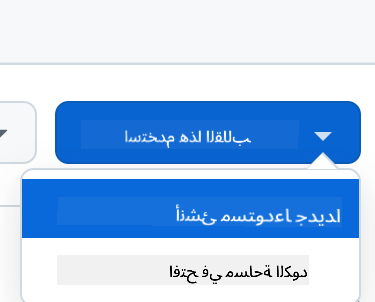
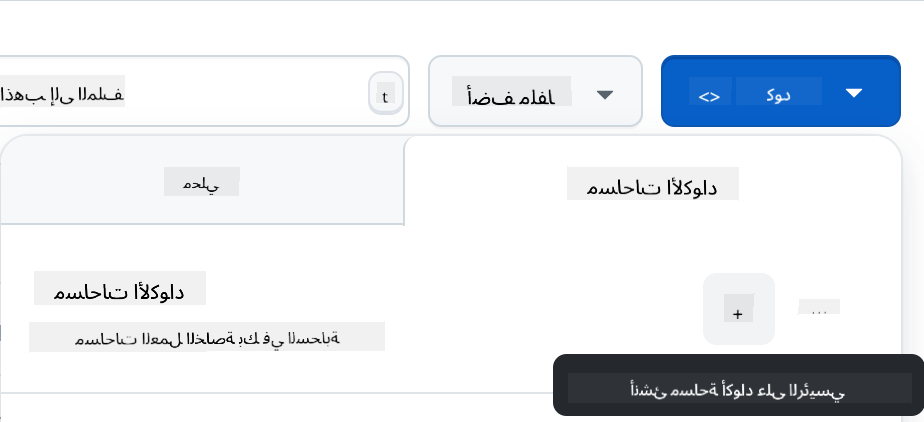

<!--
CO_OP_TRANSLATOR_METADATA:
{
  "original_hash": "cf15ff7770c5a484349383bb27d1131f",
  "translation_date": "2025-08-28T15:56:03+00:00",
  "source_file": "9-chat-project/README.md",
  "language_code": "ar"
}
-->
# مشروع الدردشة

هذا المشروع يوضح كيفية بناء مساعد دردشة باستخدام نماذج GitHub.

إليك كيف يبدو المشروع النهائي:

<div>
  
</div>

بعض السياق، بناء مساعدي دردشة باستخدام الذكاء الاصطناعي التوليدي هو طريقة رائعة للبدء في تعلم الذكاء الاصطناعي. ما ستتعلمه هو كيفية دمج الذكاء الاصطناعي التوليدي في تطبيق ويب خلال هذه الدرس، لنبدأ.

## الاتصال بالذكاء الاصطناعي التوليدي

بالنسبة للجزء الخلفي، نحن نستخدم نماذج GitHub. إنها خدمة رائعة تتيح لك استخدام الذكاء الاصطناعي مجانًا. انتقل إلى منطقة التجربة الخاصة بها واحصل على الكود الذي يتوافق مع لغة الجزء الخلفي التي اخترتها. إليك كيف يبدو ذلك في [GitHub Models Playground](https://github.com/marketplace/models/azure-openai/gpt-4o-mini/playground)

<div>
  
</div>

كما ذكرنا، اختر علامة التبويب "Code" ولغة التشغيل التي اخترتها.

<div>
  
</div>

في هذه الحالة، اخترنا Python، مما يعني أننا سنختار هذا الكود:

```python
"""Run this model in Python

> pip install openai
"""
import os
from openai import OpenAI

# To authenticate with the model you will need to generate a personal access token (PAT) in your GitHub settings. 
# Create your PAT token by following instructions here: https://docs.github.com/en/authentication/keeping-your-account-and-data-secure/managing-your-personal-access-tokens
client = OpenAI(
    base_url="https://models.github.ai/inference",
    api_key=os.environ["GITHUB_TOKEN"],
)

response = client.chat.completions.create(
    messages=[
        {
            "role": "system",
            "content": "",
        },
        {
            "role": "user",
            "content": "What is the capital of France?",
        }
    ],
    model="openai/gpt-4o-mini",
    temperature=1,
    max_tokens=4096,
    top_p=1
)

print(response.choices[0].message.content)
```

لنقم بتنظيف هذا الكود قليلاً ليصبح قابلاً لإعادة الاستخدام:

```python
def call_llm(prompt: str, system_message: str):
    response = client.chat.completions.create(
        messages=[
            {
                "role": "system",
                "content": system_message,
            },
            {
                "role": "user",
                "content": prompt,
            }
        ],
        model="openai/gpt-4o-mini",
        temperature=1,
        max_tokens=4096,
        top_p=1
    )

    return response.choices[0].message.content
```

مع هذه الدالة `call_llm` يمكننا الآن أخذ نص الإدخال ونص النظام، وستعيد الدالة النتيجة.

### تخصيص مساعد الذكاء الاصطناعي

إذا كنت ترغب في تخصيص مساعد الذكاء الاصطناعي، يمكنك تحديد كيفية تصرفه عن طريق ملء نص النظام كما يلي:

```python
call_llm("Tell me about you", "You're Albert Einstein, you only know of things in the time you were alive")
```

## عرضه عبر واجهة برمجة تطبيقات ويب

رائع، لقد انتهينا من جزء الذكاء الاصطناعي، دعونا نرى كيف يمكننا دمجه في واجهة برمجة تطبيقات ويب. بالنسبة لواجهة برمجة التطبيقات، اخترنا استخدام Flask، ولكن أي إطار عمل ويب سيكون جيدًا. لنرى الكود الخاص بذلك:

```python
# api.py
from flask import Flask, request, jsonify
from llm import call_llm
from flask_cors import CORS

app = Flask(__name__)
CORS(app)   # *   example.com

@app.route("/", methods=["GET"])
def index():
    return "Welcome to this API. Call POST /hello with 'message': 'my message' as JSON payload"


@app.route("/hello", methods=["POST"])
def hello():
    # get message from request body  { "message": "do this taks for me" }
    data = request.get_json()
    message = data.get("message", "")

    response = call_llm(message, "You are a helpful assistant.")
    return jsonify({
        "response": response
    })

if __name__ == "__main__":
    app.run(host="0.0.0.0", port=5000)
```

هنا، نقوم بإنشاء واجهة برمجة تطبيقات Flask ونحدد المسار الافتراضي "/" و "/chat". المسار الأخير مخصص لاستخدامه من قبل الواجهة الأمامية لتمرير الأسئلة إليه.

لدمج *llm.py* إليك ما نحتاج إلى القيام به:

- استيراد دالة `call_llm`:

   ```python
   from llm import call_llm
   from flask import Flask, request
   ```

- استدعاؤها من المسار "/chat":

   ```python
   @app.route("/hello", methods=["POST"])
   def hello():
      # get message from request body  { "message": "do this taks for me" }
      data = request.get_json()
      message = data.get("message", "")

      response = call_llm(message, "You are a helpful assistant.")
      return jsonify({
         "response": response
      })
   ```

   هنا نقوم بتحليل الطلب الوارد لاسترداد خاصية `message` من جسم JSON. بعد ذلك، نستدعي LLM بهذا الاستدعاء:

   ```python
   response = call_llm(message, "You are a helpful assistant")

   # return the response as JSON
   return jsonify({
      "response": response 
   })
   ```

رائع، الآن قمنا بما نحتاج إليه.

### إعداد Cors

يجب أن نشير إلى أننا قمنا بإعداد شيء مثل CORS، مشاركة الموارد عبر الأصل. هذا يعني أنه نظرًا لأن الجزء الخلفي والواجهة الأمامية سيعملان على منافذ مختلفة، نحتاج إلى السماح للواجهة الأمامية بالاتصال بالجزء الخلفي. هناك قطعة من الكود في *api.py* تقوم بإعداد هذا:

```python
from flask_cors import CORS

app = Flask(__name__)
CORS(app)   # *   example.com
```

حاليًا تم إعدادها للسماح بـ "*" وهو جميع الأصول، وهذا غير آمن قليلاً، يجب أن نقوم بتقييده بمجرد الانتقال إلى الإنتاج.

## تشغيل المشروع

حسنًا، لدينا *llm.py* و *api.py*، كيف يمكننا جعل هذا يعمل مع الجزء الخلفي؟ حسنًا، هناك شيئان نحتاج إلى القيام بهما:

- تثبيت التبعيات:

   ```sh
   cd backend
   python -m venv venv
   source ./venv/bin/activate

   pip install openai flask flask-cors openai
   ```

- تشغيل واجهة برمجة التطبيقات

   ```sh
   python api.py
   ```

   إذا كنت تستخدم Codespaces، تحتاج إلى الانتقال إلى المنافذ في الجزء السفلي من المحرر، انقر بزر الماوس الأيمن فوقه وانقر على "Port Visibility" واختر "Public".

### العمل على واجهة أمامية

الآن بعد أن أصبح لدينا واجهة برمجة تطبيقات تعمل، دعونا ننشئ واجهة أمامية لهذا. واجهة أمامية بسيطة للغاية سنقوم بتحسينها خطوة بخطوة. في مجلد *frontend*، قم بإنشاء ما يلي:

```text
backend/
frontend/
index.html
app.js
styles.css
```

لنبدأ بـ **index.html**:

```html
<html>
    <head>
        <link rel="stylesheet" href="styles.css">
    </head>
    <body>
      <form>
        <textarea id="messages"></textarea>
        <input id="input" type="text" />
        <button type="submit" id="sendBtn">Send</button>  
      </form>  
      <script src="app.js" />
    </body>
</html>    
```

ما سبق هو الحد الأدنى المطلق الذي تحتاجه لدعم نافذة دردشة، حيث يتكون من منطقة نصية يتم فيها عرض الرسائل، ومدخل لكتابة الرسالة وزر لإرسال رسالتك إلى الجزء الخلفي. دعونا نلقي نظرة على JavaScript بعد ذلك في *app.js*

**app.js**

```js
// app.js

(function(){
  // 1. set up elements  
  const messages = document.getElementById("messages");
  const form = document.getElementById("form");
  const input = document.getElementById("input");

  const BASE_URL = "change this";
  const API_ENDPOINT = `${BASE_URL}/hello`;

  // 2. create a function that talks to our backend
  async function callApi(text) {
    const response = await fetch(API_ENDPOINT, {
      method: "POST",
      headers: { "Content-Type": "application/json" },
      body: JSON.stringify({ message: text })
    });
    let json = await response.json();
    return json.response;
  }

  // 3. add response to our textarea
  function appendMessage(text, role) {
    const el = document.createElement("div");
    el.className = `message ${role}`;
    el.innerHTML = text;
    messages.appendChild(el);
  }

  // 4. listen to submit events
  form.addEventListener("submit", async(e) => {
    e.preventDefault();
   // someone clicked the button in the form
   
   // get input
   const text = input.value.trim();

   appendMessage(text, "user")

   // reset it
   input.value = '';

   const reply = await callApi(text);

   // add to messages
   appendMessage(reply, "assistant");

  })
})();
```

لنقم بمراجعة الكود حسب القسم:

- 1) هنا نحصل على مرجع لجميع العناصر التي سنشير إليها لاحقًا في الكود.
- 2) في هذا القسم، ننشئ دالة تستخدم طريقة `fetch` المدمجة التي تستدعي الجزء الخلفي.
- 3) `appendMessage` تساعد في إضافة الردود وكذلك ما تكتبه كمستخدم.
- 4) هنا نستمع إلى حدث الإرسال وننتهي بقراءة حقل الإدخال، وضع رسالة المستخدم في منطقة النص، استدعاء واجهة برمجة التطبيقات، وعرض الرد في منطقة النص.

دعونا نلقي نظرة على التنسيق بعد ذلك، هنا يمكنك أن تكون مبدعًا حقًا وتجعلها تبدو كما تريد، ولكن إليك بعض الاقتراحات:

**styles.css**

```
.message {
    background: #222;
    box-shadow: 0 0 0 10px orange;
    padding: 10px:
    margin: 5px;
}

.message.user {
    background: blue;
}

.message.assistant {
    background: grey;
} 
```

مع هذه الفئات الثلاث، ستقوم بتنسيق الرسائل بشكل مختلف اعتمادًا على مصدرها سواء من المساعد أو منك كمستخدم. إذا كنت تريد الإلهام، تحقق من مجلد `solution/frontend/styles.css`.

### تغيير عنوان URL الأساسي

كان هناك شيء هنا لم نقم بإعداده وهو `BASE_URL`، هذا غير معروف حتى يتم تشغيل الجزء الخلفي. لإعداده:

- إذا كنت تشغل واجهة برمجة التطبيقات محليًا، يجب أن يتم تعيينه إلى شيء مثل `http://localhost:5000`.
- إذا كنت تشغلها في Codespaces، يجب أن تبدو مثل "[name]app.github.dev".

## المهمة

قم بإنشاء مجلد خاص بك *project* يحتوي على محتوى مثل التالي:

```text
project/
  frontend/
    index.html
    app.js
    styles.css
  backend/
    api.py
    llm.py
```

انسخ المحتوى مما تم توجيهه أعلاه ولكن لا تتردد في تخصيصه حسب رغبتك.

## الحل

[الحل](./solution/README.md)

## إضافي

حاول تغيير شخصية مساعد الذكاء الاصطناعي. عندما تستدعي `call_llm` في *api.py* يمكنك تغيير الوسيطة الثانية إلى ما تريد، على سبيل المثال:

```python
call_llm(message, "You are Captain Picard")
```

قم أيضًا بتغيير CSS والنص حسب رغبتك، لذا قم بإجراء تغييرات في *index.html* و *styles.css*.

## الملخص

رائع، لقد تعلمت من البداية كيفية إنشاء مساعد شخصي باستخدام الذكاء الاصطناعي. قمنا بذلك باستخدام نماذج GitHub، جزء خلفي بلغة Python وواجهة أمامية بـ HTML، CSS و JavaScript.

## الإعداد باستخدام Codespaces

- انتقل إلى: [مستودع Web Dev For Beginners](https://github.com/microsoft/Web-Dev-For-Beginners)
- قم بإنشاء من قالب (تأكد من تسجيل الدخول إلى GitHub) في الزاوية العلوية اليمنى:

    

- بمجرد أن تكون في مستودعك، قم بإنشاء Codespace:

    

    يجب أن يبدأ هذا بيئة يمكنك الآن العمل بها.

---

**إخلاء المسؤولية**:  
تم ترجمة هذا المستند باستخدام خدمة الترجمة الآلية [Co-op Translator](https://github.com/Azure/co-op-translator). بينما نسعى لتحقيق الدقة، يرجى العلم أن الترجمات الآلية قد تحتوي على أخطاء أو معلومات غير دقيقة. يجب اعتبار المستند الأصلي بلغته الأصلية هو المصدر الموثوق. للحصول على معلومات حساسة أو هامة، يُوصى بالاستعانة بترجمة بشرية احترافية. نحن غير مسؤولين عن أي سوء فهم أو تفسيرات خاطئة ناتجة عن استخدام هذه الترجمة.