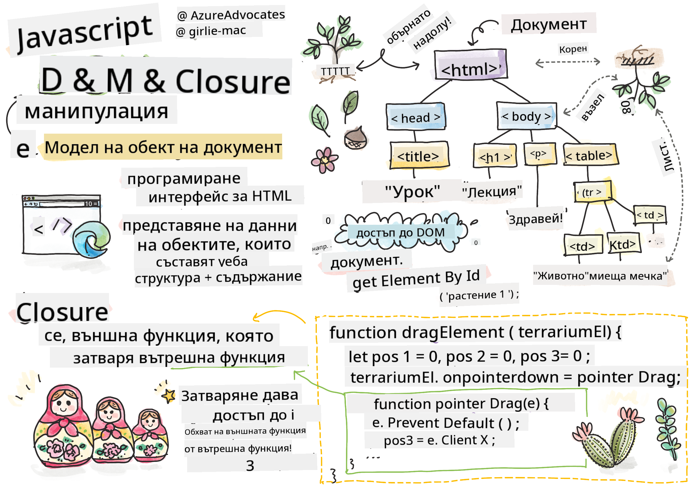
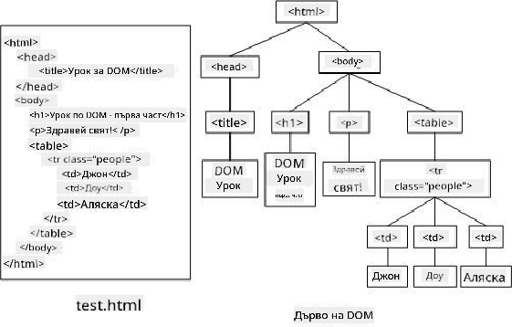

<!--
CO_OP_TRANSLATOR_METADATA:
{
  "original_hash": "30f8903a1f290e3d438dc2c70fe60259",
  "translation_date": "2025-08-28T08:16:29+00:00",
  "source_file": "3-terrarium/3-intro-to-DOM-and-closures/README.md",
  "language_code": "bg"
}
-->
# Проект Терариум Част 3: Манипулация на DOM и Затваряне


> Скица от [Tomomi Imura](https://twitter.com/girlie_mac)

## Предварителен тест

[Предварителен тест](https://ff-quizzes.netlify.app/web/quiz/19)

### Въведение

Манипулирането на DOM, или "Document Object Model", е ключов аспект на уеб разработката. Според [MDN](https://developer.mozilla.org/docs/Web/API/Document_Object_Model/Introduction), "Document Object Model (DOM) е представяне на данните за обектите, които съставляват структурата и съдържанието на документ в уеб." Предизвикателствата около манипулацията на DOM често са причина за използването на JavaScript рамки вместо чист JavaScript за управление на DOM, но ние ще се справим сами!

Освен това, този урок ще въведе идеята за [затваряне в JavaScript](https://developer.mozilla.org/docs/Web/JavaScript/Closures), което можете да си представите като функция, затворена от друга функция, така че вътрешната функция има достъп до обхвата на външната функция.

> Затварянията в JavaScript са обширна и сложна тема. Този урок разглежда най-основната идея, че в кода на този терариум ще намерите затваряне: вътрешна функция и външна функция, конструирани така, че вътрешната функция да има достъп до обхвата на външната функция. За много повече информация за това как работи, моля, посетете [подробната документация](https://developer.mozilla.org/docs/Web/JavaScript/Closures).

Ще използваме затваряне, за да манипулираме DOM.

Представете си DOM като дърво, което представлява всички начини, по които документ на уеб страница може да бъде манипулиран. Различни API (Application Program Interfaces) са написани, за да позволят на програмистите, използвайки избрания от тях език за програмиране, да достъпват DOM и да го редактират, променят, пренареждат и управляват.



> Представяне на DOM и HTML маркировката, която го реферира. От [Olfa Nasraoui](https://www.researchgate.net/publication/221417012_Profile-Based_Focused_Crawler_for_Social_Media-Sharing_Websites)

В този урок ще завършим нашия интерактивен проект за терариум, като създадем JavaScript, който ще позволи на потребителя да манипулира растенията на страницата.

### Предпоставки

Трябва да имате HTML и CSS за вашия терариум готови. До края на този урок ще можете да местите растенията в и извън терариума чрез влачене.

### Задача

В папката на вашия терариум създайте нов файл, наречен `script.js`. Импортирайте този файл в секцията `<head>`:

```html
	<script src="./script.js" defer></script>
```

> Забележка: използвайте `defer`, когато импортирате външен JavaScript файл в HTML файла, за да позволите на JavaScript да се изпълни само след като HTML файлът е напълно зареден. Можете също да използвате атрибута `async`, който позволява скриптът да се изпълнява, докато HTML файлът се парсира, но в нашия случай е важно HTML елементите да са напълно налични за влачене, преди да позволим изпълнението на скрипта за влачене.
---

## Елементите на DOM

Първото нещо, което трябва да направите, е да създадете референции към елементите, които искате да манипулирате в DOM. В нашия случай това са 14-те растения, които в момента чакат в страничните ленти.

### Задача

```html
dragElement(document.getElementById('plant1'));
dragElement(document.getElementById('plant2'));
dragElement(document.getElementById('plant3'));
dragElement(document.getElementById('plant4'));
dragElement(document.getElementById('plant5'));
dragElement(document.getElementById('plant6'));
dragElement(document.getElementById('plant7'));
dragElement(document.getElementById('plant8'));
dragElement(document.getElementById('plant9'));
dragElement(document.getElementById('plant10'));
dragElement(document.getElementById('plant11'));
dragElement(document.getElementById('plant12'));
dragElement(document.getElementById('plant13'));
dragElement(document.getElementById('plant14'));
```

Какво се случва тук? Реферирате документа и търсите в неговия DOM, за да намерите елемент с определен Id. Спомнете си от първия урок за HTML, че дадохте индивидуални Id-та на всяко изображение на растение (`id="plant1"`)? Сега ще използвате този труд. След като идентифицирате всеки елемент, го предавате на функция, наречена `dragElement`, която ще изградите след малко. Така елементът в HTML вече е активиран за влачене, или скоро ще бъде.

✅ Защо реферираме елементи по Id? Защо не по техния CSS клас? Можете да се върнете към предишния урок за CSS, за да отговорите на този въпрос.

---

## Затварянето

Сега сте готови да създадете затварянето `dragElement`, което е външна функция, която затваря вътрешна функция или функции (в нашия случай ще имаме три).

Затварянията са полезни, когато една или повече функции трябва да имат достъп до обхвата на външна функция. Ето пример:

```javascript
function displayCandy(){
	let candy = ['jellybeans'];
	function addCandy(candyType) {
		candy.push(candyType)
	}
	addCandy('gumdrops');
}
displayCandy();
console.log(candy)
```

В този пример функцията `displayCandy` обгражда функция, която добавя нов тип бонбон към масив, който вече съществува във функцията. Ако изпълните този код, масивът `candy` ще бъде недефиниран, тъй като е локална променлива (локална за затварянето).

✅ Как можете да направите масива `candy` достъпен? Опитайте да го преместите извън затварянето. Така масивът става глобален, вместо да остава достъпен само за локалния обхват на затварянето.

### Задача

Под декларациите на елементите в `script.js` създайте функция:

```javascript
function dragElement(terrariumElement) {
	//set 4 positions for positioning on the screen
	let pos1 = 0,
		pos2 = 0,
		pos3 = 0,
		pos4 = 0;
	terrariumElement.onpointerdown = pointerDrag;
}
```

`dragElement` получава своя обект `terrariumElement` от декларациите в началото на скрипта. След това задавате някои локални позиции на `0` за обекта, предаден на функцията. Това са локалните променливи, които ще бъдат манипулирани за всеки елемент, докато добавяте функционалност за влачене и пускане в затварянето към всеки елемент. Терариумът ще бъде попълнен от тези влачени елементи, така че приложението трябва да следи къде са поставени.

Освен това, елементът `terrariumElement`, който се предава на тази функция, получава събитие `pointerdown`, което е част от [web APIs](https://developer.mozilla.org/docs/Web/API), предназначени да помагат при управлението на DOM. `onpointerdown` се активира, когато бутон е натиснат, или в нашия случай, когато докоснете влачим елемент. Този обработчик на събития работи както на [уеб, така и на мобилни браузъри](https://caniuse.com/?search=onpointerdown), с някои изключения.

✅ [Обработчикът на събития `onclick`](https://developer.mozilla.org/docs/Web/API/GlobalEventHandlers/onclick) има много по-голяма поддръжка между браузърите; защо не го използвате тук? Помислете за точния тип взаимодействие с екрана, което се опитвате да създадете тук.

---

## Функцията Pointerdrag

Елементът `terrariumElement` е готов да бъде влачен; когато събитието `onpointerdown` се активира, функцията `pointerDrag` се извиква. Добавете тази функция точно под този ред: `terrariumElement.onpointerdown = pointerDrag;`:

### Задача 

```javascript
function pointerDrag(e) {
	e.preventDefault();
	console.log(e);
	pos3 = e.clientX;
	pos4 = e.clientY;
}
```

Няколко неща се случват. Първо, предотвратявате стандартните събития, които обикновено се случват при pointerdown, като използвате `e.preventDefault();`. Така имате повече контрол върху поведението на интерфейса.

> Върнете се към този ред, когато сте изградили напълно файла със скрипта, и опитайте без `e.preventDefault()` - какво се случва?

Второ, отворете `index.html` в прозорец на браузъра и инспектирайте интерфейса. Когато кликнете върху растение, можете да видите как събитието 'e' се улавя. Разгледайте събитието, за да видите колко информация се събира от едно pointerdown събитие!  

След това, обърнете внимание как локалните променливи `pos3` и `pos4` се задават на e.clientX. Можете да намерите стойностите на `e` в панела за инспекция. Тези стойности улавят x и y координатите на растението в момента, в който го кликнете или докоснете. Ще ви е необходим прецизен контрол върху поведението на растенията, докато ги кликвате и влачите, така че следите техните координати.

✅ Става ли по-ясно защо цялото приложение е изградено с едно голямо затваряне? Ако не беше, как бихте поддържали обхват за всяко от 14-те влачими растения?

Завършете началната функция, като добавите още две манипулации на събитията за указател под `pos4 = e.clientY`:

```html
document.onpointermove = elementDrag;
document.onpointerup = stopElementDrag;
```
Сега указвате, че искате растението да бъде влачено заедно с указателя, докато го местите, и жестът на влачене да спре, когато деселектирате растението. `onpointermove` и `onpointerup` са част от същия API като `onpointerdown`. Интерфейсът ще хвърля грешки сега, тъй като все още не сте дефинирали функциите `elementDrag` и `stopElementDrag`, така че ги изградете следващи.

## Функциите elementDrag и stopElementDrag

Ще завършите вашето затваряне, като добавите още две вътрешни функции, които ще управляват какво се случва, когато влачите растение и спирате да го влачите. Поведението, което искате, е да можете да влачите всяко растение по всяко време и да го поставяте навсякъде на екрана. Този интерфейс е доста непретенциозен (например няма зона за пускане), за да ви позволи да проектирате вашия терариум точно както искате, като добавяте, премахвате и премествате растения.

### Задача

Добавете функцията `elementDrag` точно след затварящата фигурна скоба на `pointerDrag`:

```javascript
function elementDrag(e) {
	pos1 = pos3 - e.clientX;
	pos2 = pos4 - e.clientY;
	pos3 = e.clientX;
	pos4 = e.clientY;
	console.log(pos1, pos2, pos3, pos4);
	terrariumElement.style.top = terrariumElement.offsetTop - pos2 + 'px';
	terrariumElement.style.left = terrariumElement.offsetLeft - pos1 + 'px';
}
```
В тази функция правите много редакции на началните позиции 1-4, които зададохте като локални променливи във външната функция. Какво се случва тук?

Докато влачите, преназначавате `pos1`, като го правите равен на `pos3` (което зададохте по-рано като `e.clientX`) минус текущата стойност на `e.clientX`. Правите подобна операция за `pos2`. След това, нулирате `pos3` и `pos4` на новите X и Y координати на елемента. Можете да наблюдавате тези промени в конзолата, докато влачите. След това манипулирате CSS стила на растението, за да зададете новата му позиция въз основа на новите позиции на `pos1` и `pos2`, като изчислявате горните и левите X и Y координати на растението, сравнявайки неговото отместване с тези нови позиции.

> `offsetTop` и `offsetLeft` са CSS свойства, които задават позицията на елемент въз основа на тази на неговия родител; неговият родител може да бъде всеки елемент, който не е позициониран като `static`. 

Цялото това преизчисляване на позиционирането ви позволява да настроите поведението на терариума и неговите растения.

### Задача 

Последната задача за завършване на интерфейса е да добавите функцията `stopElementDrag` след затварящата фигурна скоба на `elementDrag`:

```javascript
function stopElementDrag() {
	document.onpointerup = null;
	document.onpointermove = null;
}
```

Тази малка функция нулира събитията `onpointerup` и `onpointermove`, така че можете или да рестартирате прогреса на вашето растение, като започнете да го влачите отново, или да започнете да влачите ново растение.

✅ Какво се случва, ако не зададете тези събития на null?

Сега сте завършили вашия проект!

🥇Поздравления! Завършихте вашия красив терариум. 

---

## 🚀Предизвикателство

Добавете нов обработчик на събития към вашето затваряне, за да направите нещо повече с растенията; например, двойно кликване върху растение, за да го преместите на преден план. Бъдете креативни!

## Тест след лекцията

[Тест след лекцията](https://ff-quizzes.netlify.app/web/quiz/20)

## Преглед и самостоятелно обучение

Докато влаченето на елементи по екрана изглежда тривиално, има много начини да го направите и много капани, в зависимост от ефекта, който търсите. Всъщност има цял [API за влачене и пускане](https://developer.mozilla.org/docs/Web/API/HTML_Drag_and_Drop_API), който можете да опитате. Не го използвахме в този модул, защото ефектът, който искахме, беше малко по-различен, но опитайте този API във ваш собствен проект и вижте какво можете да постигнете.

Намерете повече информация за събитията за указатели в [документите на W3C](https://www.w3.org/TR/pointerevents1/) и в [MDN web docs](https://developer.mozilla.org/docs/Web/API/Pointer_events).

Винаги проверявайте възможностите на браузърите, използвайки [CanIUse.com](https://caniuse.com/).

## Задание

[Работете малко повече с DOM](assignment.md)

---

**Отказ от отговорност**:  
Този документ е преведен с помощта на AI услуга за превод [Co-op Translator](https://github.com/Azure/co-op-translator). Въпреки че се стремим към точност, моля, имайте предвид, че автоматичните преводи може да съдържат грешки или неточности. Оригиналният документ на неговия изходен език трябва да се счита за авторитетен източник. За критична информация се препоръчва професионален превод от човек. Ние не носим отговорност за каквито и да е недоразумения или погрешни интерпретации, произтичащи от използването на този превод.