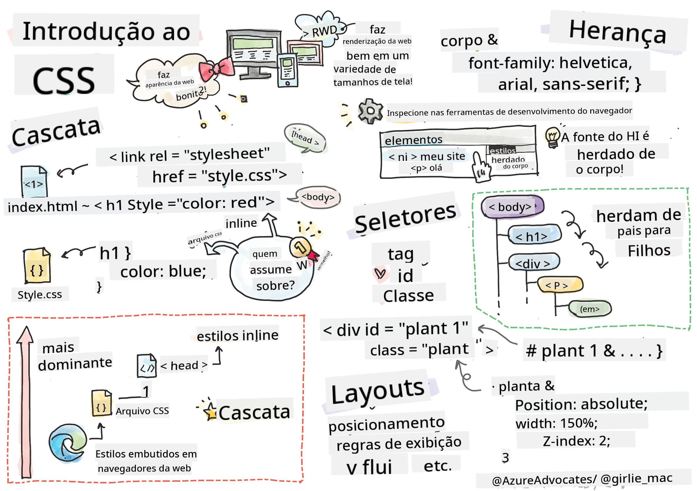
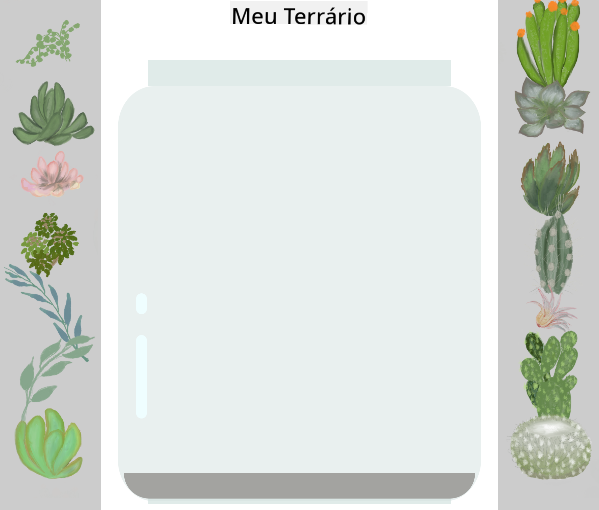

<!--
CO_OP_TRANSLATOR_METADATA:
{
  "original_hash": "e375c2aeb94e2407f2667633d39580bd",
  "translation_date": "2025-08-25T21:27:25+00:00",
  "source_file": "3-terrarium/2-intro-to-css/README.md",
  "language_code": "br"
}
-->
# Projeto Terrário Parte 2: Introdução ao CSS


> Sketchnote por [Tomomi Imura](https://twitter.com/girlie_mac)

## Questionário Pré-Aula

[Questionário pré-aula](https://ff-quizzes.netlify.app/web/quiz/17)

### Introdução

CSS, ou Cascading Style Sheets, resolve um problema importante no desenvolvimento web: como fazer seu site ficar bonito. Estilizar seus aplicativos os torna mais utilizáveis e visualmente agradáveis; você também pode usar CSS para criar um Design Responsivo (RWD) - permitindo que seus aplicativos fiquem bem em qualquer tamanho de tela. CSS não é apenas sobre aparência; sua especificação inclui animações e transformações que possibilitam interações sofisticadas para seus aplicativos. O CSS Working Group ajuda a manter as especificações atuais do CSS; você pode acompanhar o trabalho deles no [site do World Wide Web Consortium](https://www.w3.org/Style/CSS/members).

> Nota: o CSS é uma linguagem que evolui, como tudo na web, e nem todos os navegadores suportam as partes mais recentes da especificação. Sempre verifique suas implementações consultando o [CanIUse.com](https://caniuse.com).

Nesta lição, vamos adicionar estilos ao nosso terrário online e aprender mais sobre vários conceitos do CSS: a cascata, herança, uso de seletores, posicionamento e como usar CSS para criar layouts. Durante o processo, vamos organizar o layout do terrário e criar o próprio terrário.

### Pré-requisito

Você deve ter o HTML do seu terrário pronto para ser estilizado.

> Assista ao vídeo

> 
> [](https://www.youtube.com/watch?v=6yIdOIV9p1I)

### Tarefa

Na pasta do seu terrário, crie um novo arquivo chamado `style.css`. Importe esse arquivo na seção `<head>`:

```html
<link rel="stylesheet" href="./style.css" />
```

---

## A Cascata

As Cascading Style Sheets incorporam a ideia de que os estilos 'cascateiam', de forma que a aplicação de um estilo é guiada por sua prioridade. Estilos definidos pelo autor de um site têm prioridade sobre aqueles definidos pelo navegador. Estilos definidos 'inline' têm prioridade sobre aqueles definidos em uma folha de estilo externa.

### Tarefa

Adicione o estilo inline "color: red" à sua tag `<h1>`:

```HTML
<h1 style="color: red">My Terrarium</h1>
```

Depois, adicione o seguinte código ao seu arquivo `style.css`:

```CSS
h1 {
 color: blue;
}
```

✅ Qual cor é exibida no seu aplicativo web? Por quê? Você consegue encontrar uma maneira de sobrescrever estilos? Quando você gostaria de fazer isso, ou por que não?

---

## Herança

Os estilos são herdados de um estilo ancestral para um descendente, de forma que elementos aninhados herdam os estilos de seus pais.

### Tarefa

Defina a fonte do corpo para uma fonte específica e verifique se um elemento aninhado herda essa fonte:

```CSS
body {
	font-family: helvetica, arial, sans-serif;
}
```

Abra o console do seu navegador na aba 'Elements' e observe a fonte do H1. Ele herda sua fonte do corpo, conforme indicado no navegador:


✅ Você consegue fazer um estilo aninhado herdar uma propriedade diferente?

---

## Seletores CSS

### Tags

Até agora, seu arquivo `style.css` tem apenas algumas tags estilizadas, e o aplicativo parece bem estranho:

```CSS
body {
	font-family: helvetica, arial, sans-serif;
}

h1 {
	color: #3a241d;
	text-align: center;
}
```

Esse método de estilizar uma tag dá controle sobre elementos únicos, mas você precisa controlar os estilos de várias plantas no seu terrário. Para isso, você precisa aproveitar os seletores CSS.

### Ids

Adicione algum estilo para organizar os contêineres esquerdo e direito. Como há apenas um contêiner esquerdo e um direito, eles recebem ids no markup. Para estilizar, use `#`:

```CSS
#left-container {
	background-color: #eee;
	width: 15%;
	left: 0px;
	top: 0px;
	position: absolute;
	height: 100%;
	padding: 10px;
}

#right-container {
	background-color: #eee;
	width: 15%;
	right: 0px;
	top: 0px;
	position: absolute;
	height: 100%;
	padding: 10px;
}
```

Aqui, você posicionou esses contêineres com posicionamento absoluto nas extremidades esquerda e direita da tela, e usou porcentagens para a largura deles, para que possam se ajustar a telas pequenas de dispositivos móveis.

✅ Esse código está bastante repetitivo, portanto não segue o princípio "DRY" (Don't Repeat Yourself). Você consegue encontrar uma maneira melhor de estilizar esses ids, talvez usando um id e uma classe? Você precisaria alterar o markup e refatorar o CSS:

```html
<div id="left-container" class="container"></div>
```

### Classes

No exemplo acima, você estilizou dois elementos únicos na tela. Se quiser aplicar estilos a vários elementos na tela, pode usar classes CSS. Faça isso para organizar as plantas nos contêineres esquerdo e direito.

Observe que cada planta no markup HTML tem uma combinação de ids e classes. Os ids aqui são usados pelo JavaScript que você adicionará mais tarde para manipular o posicionamento das plantas no terrário. As classes, no entanto, dão a todas as plantas um estilo específico.

```html
<div class="plant-holder">
	
</div>
```

Adicione o seguinte ao seu arquivo `style.css`:

```CSS
.plant-holder {
	position: relative;
	height: 13%;
	left: -10px;
}

.plant {
	position: absolute;
	max-width: 150%;
	max-height: 150%;
	z-index: 2;
}
```

Notável neste trecho é a mistura de posicionamento relativo e absoluto, que abordaremos na próxima seção. Observe como as alturas são tratadas com porcentagens:

Você definiu a altura do suporte das plantas como 13%, um bom número para garantir que todas as plantas sejam exibidas em cada contêiner vertical sem necessidade de rolagem.

Você ajustou o suporte das plantas para a esquerda para que as plantas fiquem mais centralizadas dentro do contêiner. As imagens têm uma grande quantidade de fundo transparente para torná-las mais arrastáveis, então precisam ser ajustadas para a esquerda para se encaixarem melhor na tela.

Depois, a própria planta recebeu uma largura máxima de 150%. Isso permite que ela seja redimensionada à medida que o navegador é redimensionado. Experimente redimensionar seu navegador; as plantas permanecem nos contêineres, mas se ajustam para caber.

Também é notável o uso de z-index, que controla a altitude relativa de um elemento (para que as plantas fiquem acima do contêiner e pareçam estar dentro do terrário).

✅ Por que você precisa de um seletor CSS para o suporte das plantas e outro para a planta?

## Posicionamento CSS

Misturar propriedades de posicionamento (existem posições estática, relativa, fixa, absoluta e sticky) pode ser um pouco complicado, mas quando feito corretamente, dá um bom controle sobre os elementos nas suas páginas.

Elementos com posicionamento absoluto são posicionados em relação ao seu ancestral posicionado mais próximo, e se não houver nenhum, são posicionados em relação ao corpo do documento.

Elementos com posicionamento relativo são posicionados com base nas direções do CSS para ajustar seu posicionamento em relação à sua posição inicial.

No nosso exemplo, o `plant-holder` é um elemento com posicionamento relativo que está posicionado dentro de um contêiner com posicionamento absoluto. O comportamento resultante é que os contêineres laterais são fixados à esquerda e à direita, e o `plant-holder` é aninhado, ajustando-se dentro das barras laterais, dando espaço para que as plantas sejam organizadas em uma linha vertical.

> A própria `plant` também tem posicionamento absoluto, necessário para torná-la arrastável, como você descobrirá na próxima lição.

✅ Experimente trocar os tipos de posicionamento dos contêineres laterais e do `plant-holder`. O que acontece?

## Layouts CSS

Agora você usará o que aprendeu para construir o terrário em si, tudo usando CSS!

Primeiro, estilize os filhos da div `.terrarium` como um retângulo arredondado usando CSS:

```CSS
.jar-walls {
	height: 80%;
	width: 60%;
	background: #d1e1df;
	border-radius: 1rem;
	position: absolute;
	bottom: 0.5%;
	left: 20%;
	opacity: 0.5;
	z-index: 1;
}

.jar-top {
	width: 50%;
	height: 5%;
	background: #d1e1df;
	position: absolute;
	bottom: 80.5%;
	left: 25%;
	opacity: 0.7;
	z-index: 1;
}

.jar-bottom {
	width: 50%;
	height: 1%;
	background: #d1e1df;
	position: absolute;
	bottom: 0%;
	left: 25%;
	opacity: 0.7;
}

.dirt {
	width: 60%;
	height: 5%;
	background: #3a241d;
	position: absolute;
	border-radius: 0 0 1rem 1rem;
	bottom: 1%;
	left: 20%;
	opacity: 0.7;
	z-index: -1;
}
```

Observe o uso de porcentagens aqui. Se você redimensionar seu navegador, verá como o jarro também se ajusta. Note também as porcentagens de largura e altura dos elementos do jarro e como cada elemento é posicionado absolutamente no centro, fixado na parte inferior da janela de visualização.

Também estamos usando `rem` para o border-radius, uma medida relativa à fonte. Leia mais sobre esse tipo de medida relativa na [especificação CSS](https://www.w3.org/TR/css-values-3/#font-relative-lengths).

✅ Experimente mudar as cores e a opacidade do jarro em comparação com as da terra. O que acontece? Por quê?

---

## 🚀Desafio

Adicione um brilho de 'bolha' na área inferior esquerda do jarro para fazê-lo parecer mais vítreo. Você estilizará `.jar-glossy-long` e `.jar-glossy-short` para parecerem um reflexo. Veja como ficaria:



Para completar o questionário pós-aula, passe por este módulo do Learn: [Estilize seu aplicativo HTML com CSS](https://docs.microsoft.com/learn/modules/build-simple-website/4-css-basics/?WT.mc_id=academic-77807-sagibbon)

## Questionário Pós-Aula

[Questionário pós-aula](https://ff-quizzes.netlify.app/web/quiz/18)

## Revisão e Autoestudo

CSS parece ser simples à primeira vista, mas há muitos desafios ao tentar estilizar um aplicativo perfeitamente para todos os navegadores e tamanhos de tela. CSS-Grid e Flexbox são ferramentas desenvolvidas para tornar o trabalho um pouco mais estruturado e confiável. Aprenda sobre essas ferramentas jogando [Flexbox Froggy](https://flexboxfroggy.com/) e [Grid Garden](https://codepip.com/games/grid-garden/).

## Tarefa

[Refatoração de CSS](assignment.md)

**Aviso Legal**:  
Este documento foi traduzido utilizando o serviço de tradução por IA [Co-op Translator](https://github.com/Azure/co-op-translator). Embora nos esforcemos para garantir a precisão, esteja ciente de que traduções automatizadas podem conter erros ou imprecisões. O documento original em seu idioma nativo deve ser considerado a fonte autoritativa. Para informações críticas, recomenda-se a tradução profissional realizada por humanos. Não nos responsabilizamos por quaisquer mal-entendidos ou interpretações equivocadas decorrentes do uso desta tradução.