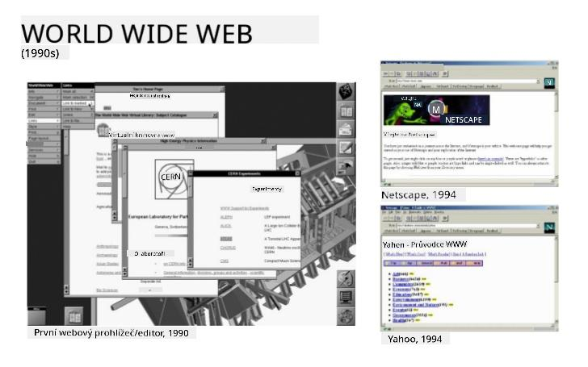
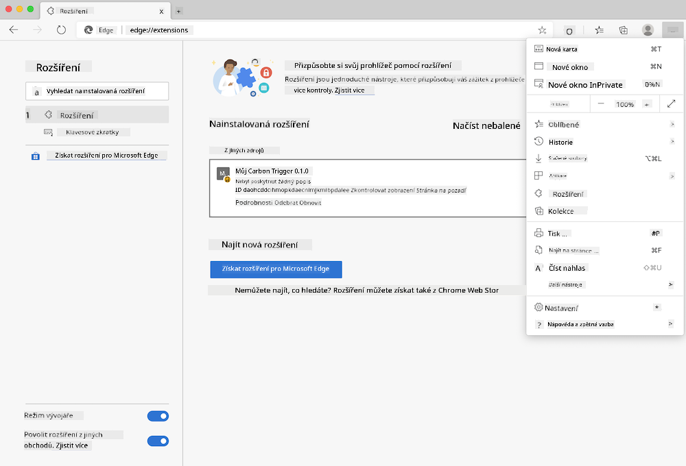
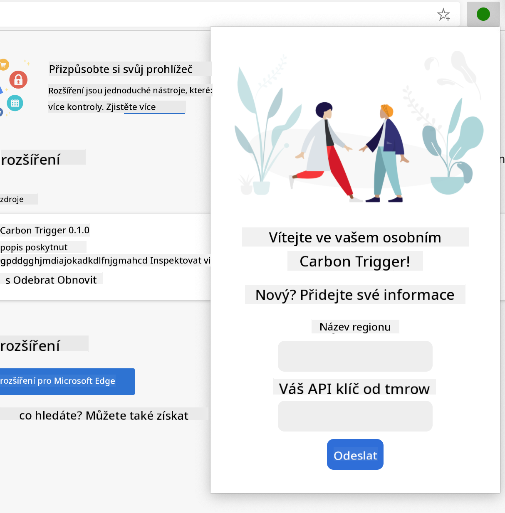
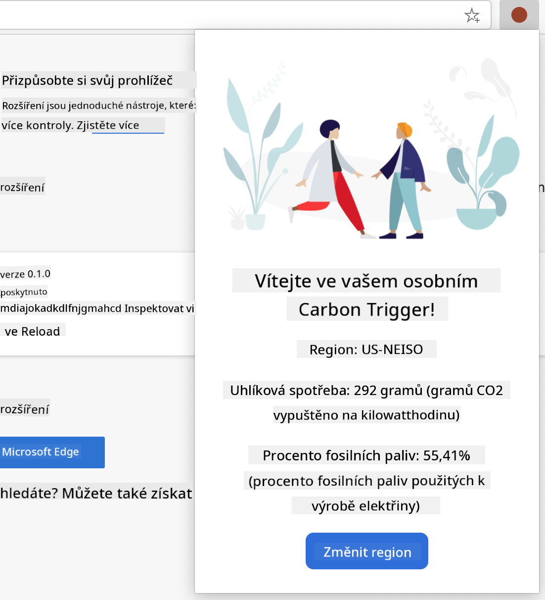

<!--
CO_OP_TRANSLATOR_METADATA:
{
  "original_hash": "0bb55e0b98600afab801eea115228873",
  "translation_date": "2025-08-28T03:40:12+00:00",
  "source_file": "5-browser-extension/1-about-browsers/README.md",
  "language_code": "cs"
}
-->
# Projekt rozšíření prohlížeče, část 1: Vše o prohlížečích


> Sketchnote od [Wassim Chegham](https://dev.to/wassimchegham/ever-wondered-what-happens-when-you-type-in-a-url-in-an-address-bar-in-a-browser-3dob)

## Kvíz před přednáškou

[Kvíz před přednáškou](https://ff-quizzes.netlify.app/web/quiz/23)

### Úvod

Rozšíření prohlížeče přidávají do prohlížeče další funkce. Než však začnete jedno vytvářet, měli byste se nejprve dozvědět něco o tom, jak prohlížeče fungují.

### O prohlížeči

V této sérii lekcí se naučíte, jak vytvořit rozšíření prohlížeče, které bude fungovat v prohlížečích Chrome, Firefox a Edge. V této části zjistíte, jak prohlížeče fungují, a vytvoříte základní prvky rozšíření prohlížeče.

Co je vlastně prohlížeč? Je to softwarová aplikace, která umožňuje koncovému uživateli přistupovat k obsahu ze serveru a zobrazovat jej na webových stránkách.

✅ Trocha historie: první prohlížeč se jmenoval 'WorldWideWeb' a byl vytvořen Sirem Timothym Berners-Leem v roce 1990.


> Některé rané prohlížeče, via [Karen McGrane](https://www.slideshare.net/KMcGrane/week-4-ixd-history-personal-computing)

Když se uživatel připojí k internetu pomocí adresy URL (Uniform Resource Locator), obvykle prostřednictvím protokolu Hypertext Transfer Protocol přes adresu `http` nebo `https`, prohlížeč komunikuje s webovým serverem a načte webovou stránku.

V tomto okamžiku zobrazovací engine prohlížeče zobrazí stránku na zařízení uživatele, což může být mobilní telefon, stolní počítač nebo notebook.

Prohlížeče také dokážou ukládat obsah do mezipaměti, aby jej nemusely pokaždé načítat ze serveru. Mohou zaznamenávat historii prohlížení uživatele, ukládat 'cookies', což jsou malé datové soubory obsahující informace o aktivitě uživatele, a mnoho dalšího.

Je velmi důležité si uvědomit, že prohlížeče nejsou všechny stejné! Každý prohlížeč má své silné a slabé stránky, a profesionální webový vývojář musí rozumět tomu, jak zajistit, aby webové stránky fungovaly dobře napříč různými prohlížeči. To zahrnuje přizpůsobení malým obrazovkám, jako je mobilní telefon, stejně jako uživatelům, kteří jsou offline.

Velmi užitečná webová stránka, kterou byste si měli uložit do záložek v preferovaném prohlížeči, je [caniuse.com](https://www.caniuse.com). Při vytváření webových stránek je velmi užitečné používat seznamy podporovaných technologií na caniuse, abyste mohli co nejlépe podpořit své uživatele.

✅ Jak zjistíte, které prohlížeče jsou nejpopulárnější mezi uživateli vašeho webu? Zkontrolujte své analytické nástroje - můžete nainstalovat různé balíčky analytiky jako součást procesu vývoje webu, které vám řeknou, jaké prohlížeče jsou nejvíce používané.

## Rozšíření prohlížeče

Proč byste chtěli vytvořit rozšíření prohlížeče? Je to praktický nástroj, který se připojí k vašemu prohlížeči, když potřebujete rychlý přístup k úkolům, které často opakujete. Například pokud často kontrolujete barvy na různých webových stránkách, můžete si nainstalovat rozšíření prohlížeče s výběrem barev. Pokud máte potíže s pamatováním hesel, můžete použít rozšíření pro správu hesel.

Vývoj rozšíření prohlížeče je také zábavný. Obvykle se zaměřují na omezený počet úkolů, které zvládají velmi dobře.

✅ Jaká jsou vaše oblíbená rozšíření prohlížeče? Jaké úkoly plní?

### Instalace rozšíření

Než začnete vytvářet, podívejte se na proces vytváření a nasazení rozšíření prohlížeče. I když se každý prohlížeč trochu liší v tom, jak tento úkol spravuje, proces je podobný v Chrome a Firefoxu jako v tomto příkladu na Edge:



> Poznámka: Ujistěte se, že jste zapnuli režim pro vývojáře a povolili rozšíření z jiných obchodů.

V podstatě bude proces následující:

- vytvořte své rozšíření pomocí `npm run build` 
- v prohlížeči přejděte na panel rozšíření pomocí tlačítka "Nastavení a další" (ikona `...`) v pravém horním rohu
- pokud jde o novou instalaci, vyberte `load unpacked`, abyste nahráli nové rozšíření z jeho složky sestavení (v našem případě je to `/dist`) 
- nebo klikněte na `reload`, pokud znovu načítáte již nainstalované rozšíření

✅ Tyto pokyny se týkají rozšíření, která si sami vytvoříte; pokud chcete nainstalovat rozšíření, která byla vydána v obchodě s rozšířeními prohlížeče, měli byste přejít na tyto [obchody](https://microsoftedge.microsoft.com/addons/Microsoft-Edge-Extensions-Home) a nainstalovat rozšíření podle svého výběru.

### Začněte

Budete vytvářet rozšíření prohlížeče, které zobrazí uhlíkovou stopu vašeho regionu, včetně spotřeby energie a zdroje energie. Rozšíření bude obsahovat formulář, který shromáždí API klíč, abyste mohli přistupovat k API CO2 Signal.

**Potřebujete:**

- [API klíč](https://www.co2signal.com/); zadejte svůj e-mail do pole na této stránce a klíč vám bude zaslán
- [kód vašeho regionu](http://api.electricitymap.org/v3/zones) odpovídající [Electricity Map](https://www.electricitymap.org/map) (například v Bostonu používám 'US-NEISO').
- [výchozí kód](../../../../5-browser-extension/start). Stáhněte si složku `start`; budete doplňovat kód v této složce.
- [NPM](https://www.npmjs.com) - NPM je nástroj pro správu balíčků; nainstalujte jej lokálně a balíčky uvedené ve vašem souboru `package.json` budou připraveny k použití

✅ Více o správě balíčků se dozvíte v tomto [vynikajícím modulu Learn](https://docs.microsoft.com/learn/modules/create-nodejs-project-dependencies/?WT.mc_id=academic-77807-sagibbon)

Věnujte chvíli prozkoumání kódové základny:

dist
    -|manifest.json (výchozí nastavení zde)
    -|index.html (HTML značení front-endu zde)
    -|background.js (JS na pozadí zde)
    -|main.js (sestavený JS)
src
    -|index.js (váš JS kód sem)

✅ Jakmile budete mít svůj API klíč a kód regionu připravený, uložte je někam do poznámky pro budoucí použití.

### Vytvořte HTML pro rozšíření

Toto rozšíření má dvě zobrazení. Jedno pro shromáždění API klíče a kódu regionu:



A druhé pro zobrazení uhlíkové spotřeby regionu:



Začněme vytvořením HTML pro formulář a jeho stylováním pomocí CSS.

Ve složce `/dist` vytvořte formulář a oblast výsledků. V souboru `index.html` vyplňte vymezenou oblast formuláře:

```HTML
<form class="form-data" autocomplete="on">
	<div>
		<h2>New? Add your Information</h2>
	</div>
	<div>
		<label for="region">Region Name</label>
		<input type="text" id="region" required class="region-name" />
	</div>
	<div>
		<label for="api">Your API Key from tmrow</label>
		<input type="text" id="api" required class="api-key" />
	</div>
	<button class="search-btn">Submit</button>
</form>	
```
Toto je formulář, kde budou vaše uložené informace zadány a uloženy do místního úložiště.

Dále vytvořte oblast výsledků; pod poslední značku formuláře přidejte několik divů:

```HTML
<div class="result">
	<div class="loading">loading...</div>
	<div class="errors"></div>
	<div class="data"></div>
	<div class="result-container">
		<p><strong>Region: </strong><span class="my-region"></span></p>
		<p><strong>Carbon Usage: </strong><span class="carbon-usage"></span></p>
		<p><strong>Fossil Fuel Percentage: </strong><span class="fossil-fuel"></span></p>
	</div>
	<button class="clear-btn">Change region</button>
</div>
```
V tomto bodě můžete zkusit sestavení. Ujistěte se, že jste nainstalovali závislosti balíčků tohoto rozšíření:

```
npm install
```

Tento příkaz použije npm, správce balíčků Node, k instalaci webpacku pro proces sestavení vašeho rozšíření. Výstup tohoto procesu můžete vidět v `/dist/main.js` - uvidíte, že kód byl zkompilován.

Prozatím by se rozšíření mělo sestavit a pokud jej nasadíte do Edge jako rozšíření, uvidíte čistě zobrazený formulář.

Gratulujeme, udělali jste první kroky k vytvoření rozšíření prohlížeče. V následujících lekcích jej učiníte funkčnějším a užitečnějším.

---

## 🚀 Výzva

Podívejte se na obchod s rozšířeními prohlížeče a nainstalujte si jedno do svého prohlížeče. Můžete zkoumat jeho soubory zajímavými způsoby. Co objevíte?

## Kvíz po přednášce

[Kvíz po přednášce](https://ff-quizzes.netlify.app/web/quiz/24)

## Přehled & Samostudium

V této lekci jste se dozvěděli něco o historii webového prohlížeče; využijte této příležitosti k tomu, abyste se dozvěděli více o tom, jak si vynálezci World Wide Webu představovali jeho využití, a přečtěte si více o jeho historii. Některé užitečné stránky zahrnují:

[Historie webových prohlížečů](https://www.mozilla.org/firefox/browsers/browser-history/)

[Historie webu](https://webfoundation.org/about/vision/history-of-the-web/)

[Rozhovor s Timem Berners-Leem](https://www.theguardian.com/technology/2019/mar/12/tim-berners-lee-on-30-years-of-the-web-if-we-dream-a-little-we-can-get-the-web-we-want)

## Úkol 

[Upravte styl svého rozšíření](assignment.md)

---

**Prohlášení**:  
Tento dokument byl přeložen pomocí služby pro automatický překlad [Co-op Translator](https://github.com/Azure/co-op-translator). I když se snažíme o přesnost, mějte prosím na paměti, že automatické překlady mohou obsahovat chyby nebo nepřesnosti. Původní dokument v jeho původním jazyce by měl být považován za autoritativní zdroj. Pro důležité informace se doporučuje profesionální lidský překlad. Neodpovídáme za žádná nedorozumění nebo nesprávné interpretace vyplývající z použití tohoto překladu.