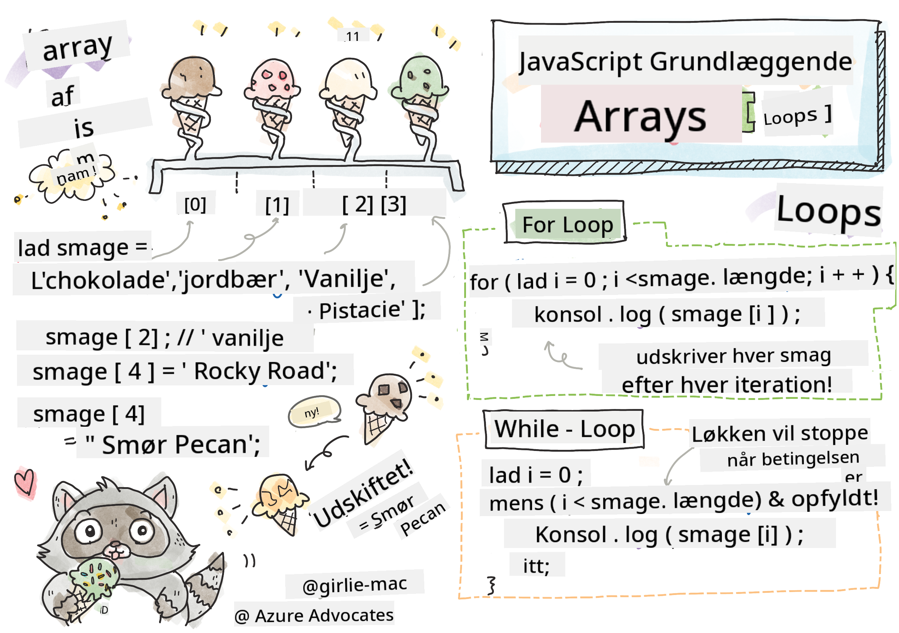

<!--
CO_OP_TRANSLATOR_METADATA:
{
  "original_hash": "3f7f87871312cf6cc12662da7d973182",
  "translation_date": "2025-08-26T21:46:42+00:00",
  "source_file": "2-js-basics/4-arrays-loops/README.md",
  "language_code": "da"
}
-->
# JavaScript Grundlæggende: Arrays og Løkker


> Sketchnote af [Tomomi Imura](https://twitter.com/girlie_mac)

## Quiz før lektionen
[Quiz før lektionen](https://ff-quizzes.netlify.app/web/quiz/13)

Denne lektion dækker det grundlæggende i JavaScript, sproget der giver interaktivitet på nettet. I denne lektion lærer du om arrays og løkker, som bruges til at manipulere data.

[](https://youtube.com/watch?v=1U4qTyq02Xw "Arrays")

[](https://www.youtube.com/watch?v=Eeh7pxtTZ3k "Loops")

> 🎥 Klik på billederne ovenfor for videoer om arrays og løkker.

> Du kan tage denne lektion på [Microsoft Learn](https://docs.microsoft.com/learn/modules/web-development-101-arrays/?WT.mc_id=academic-77807-sagibbon)!

## Arrays

At arbejde med data er en almindelig opgave i ethvert programmeringssprog, og det er en meget lettere opgave, når data er organiseret i en strukturel form, såsom arrays. Med arrays gemmes data i en struktur, der ligner en liste. En stor fordel ved arrays er, at du kan gemme forskellige typer data i ét array.

✅ Arrays er overalt omkring os! Kan du komme i tanke om et eksempel fra det virkelige liv på et array, såsom en solcellepanel-array?

Syntaksen for et array er et par firkantede parenteser.

```javascript
let myArray = [];
```

Dette er et tomt array, men arrays kan deklareres allerede fyldt med data. Flere værdier i et array adskilles med et komma.

```javascript
let iceCreamFlavors = ["Chocolate", "Strawberry", "Vanilla", "Pistachio", "Rocky Road"];
```

Array-værdierne tildeles en unik værdi kaldet **indeks**, et heltal, der tildeles baseret på dets afstand fra begyndelsen af arrayet. I eksemplet ovenfor har strengværdien "Chocolate" et indeks på 0, og indekset for "Rocky Road" er 4. Brug indekset med firkantede parenteser til at hente, ændre eller indsætte array-værdier.

✅ Er det overraskende for dig, at arrays starter ved indeks nul? I nogle programmeringssprog starter indekser ved 1. Der er en interessant historie omkring dette, som du kan [læse på Wikipedia](https://en.wikipedia.org/wiki/Zero-based_numbering).

```javascript
let iceCreamFlavors = ["Chocolate", "Strawberry", "Vanilla", "Pistachio", "Rocky Road"];
iceCreamFlavors[2]; //"Vanilla"
```

Du kan bruge indekset til at ændre en værdi, som dette:

```javascript
iceCreamFlavors[4] = "Butter Pecan"; //Changed "Rocky Road" to "Butter Pecan"
```

Og du kan indsætte en ny værdi på et givet indeks som dette:

```javascript
iceCreamFlavors[5] = "Cookie Dough"; //Added "Cookie Dough"
```

✅ En mere almindelig måde at tilføje værdier til et array er ved at bruge array-operatører såsom array.push()

For at finde ud af, hvor mange elementer der er i et array, skal du bruge `length`-egenskaben.

```javascript
let iceCreamFlavors = ["Chocolate", "Strawberry", "Vanilla", "Pistachio", "Rocky Road"];
iceCreamFlavors.length; //5
```

✅ Prøv det selv! Brug din browsers konsol til at oprette og manipulere et array, du selv har lavet.

## Løkker

Løkker giver os mulighed for at udføre gentagne eller **iterative** opgaver og kan spare meget tid og kode. Hver iteration kan variere i deres variabler, værdier og betingelser. Der er forskellige typer løkker i JavaScript, og de har alle små forskelle, men gør i bund og grund det samme: løkker over data.

### For-løkke

`for`-løkker kræver 3 dele for at iterere:
- `counter` En variabel, der typisk initialiseres med et tal, der tæller antallet af iterationer
- `condition` Udtryk, der bruger sammenligningsoperatorer til at få løkken til at stoppe, når den er `false`
- `iteration-expression` Kører i slutningen af hver iteration, typisk brugt til at ændre counter-værdien
  
```javascript
// Counting up to 10
for (let i = 0; i < 10; i++) {
  console.log(i);
}
```

✅ Kør denne kode i en browserkonsol. Hvad sker der, når du laver små ændringer i counter, condition eller iteration-expression? Kan du få den til at køre baglæns og lave en nedtælling?

### While-løkke

I modsætning til syntaksen for `for`-løkker kræver `while`-løkker kun en betingelse, der stopper løkken, når betingelsen bliver `false`. Betingelser i løkker afhænger normalt af andre værdier som counters og skal administreres under løkken. Startværdier for counters skal oprettes uden for løkken, og alle udtryk for at opfylde en betingelse, inklusive ændring af counter, skal vedligeholdes inde i løkken.

```javascript
//Counting up to 10
let i = 0;
while (i < 10) {
 console.log(i);
 i++;
}
```

✅ Hvorfor ville du vælge en for-løkke frem for en while-løkke? 17K brugere havde det samme spørgsmål på StackOverflow, og nogle af meningerne [kan være interessante for dig](https://stackoverflow.com/questions/39969145/while-loops-vs-for-loops-in-javascript).

## Løkker og Arrays

Arrays bruges ofte med løkker, fordi de fleste betingelser kræver længden af arrayet for at stoppe løkken, og indekset kan også være counter-værdien.

```javascript
let iceCreamFlavors = ["Chocolate", "Strawberry", "Vanilla", "Pistachio", "Rocky Road"];

for (let i = 0; i < iceCreamFlavors.length; i++) {
  console.log(iceCreamFlavors[i]);
} //Ends when all flavors are printed
```

✅ Eksperimentér med at løkke over et array, du selv har lavet, i din browsers konsol.

---

## 🚀 Udfordring

Der er andre måder at løkke over arrays end for- og while-løkker. Der er [forEach](https://developer.mozilla.org/docs/Web/JavaScript/Reference/Global_Objects/Array/forEach), [for-of](https://developer.mozilla.org/docs/Web/JavaScript/Reference/Statements/for...of) og [map](https://developer.mozilla.org/docs/Web/JavaScript/Reference/Global_Objects/Array/map). Skriv din array-løkke om ved hjælp af en af disse teknikker.

## Quiz efter lektionen
[Quiz efter lektionen](https://ff-quizzes.netlify.app/web/quiz/14)

## Gennemgang & Selvstudie

Arrays i JavaScript har mange metoder knyttet til dem, som er ekstremt nyttige til datamanipulation. [Læs om disse metoder](https://developer.mozilla.org/docs/Web/JavaScript/Reference/Global_Objects/Array) og prøv nogle af dem (som push, pop, slice og splice) på et array, du selv har lavet.

## Opgave

[Loop et Array](assignment.md)

---

**Ansvarsfraskrivelse**:  
Dette dokument er blevet oversat ved hjælp af AI-oversættelsestjenesten [Co-op Translator](https://github.com/Azure/co-op-translator). Selvom vi bestræber os på nøjagtighed, skal du være opmærksom på, at automatiserede oversættelser kan indeholde fejl eller unøjagtigheder. Det originale dokument på dets oprindelige sprog bør betragtes som den autoritative kilde. For kritisk information anbefales professionel menneskelig oversættelse. Vi påtager os ikke ansvar for eventuelle misforståelser eller fejltolkninger, der måtte opstå som følge af brugen af denne oversættelse.