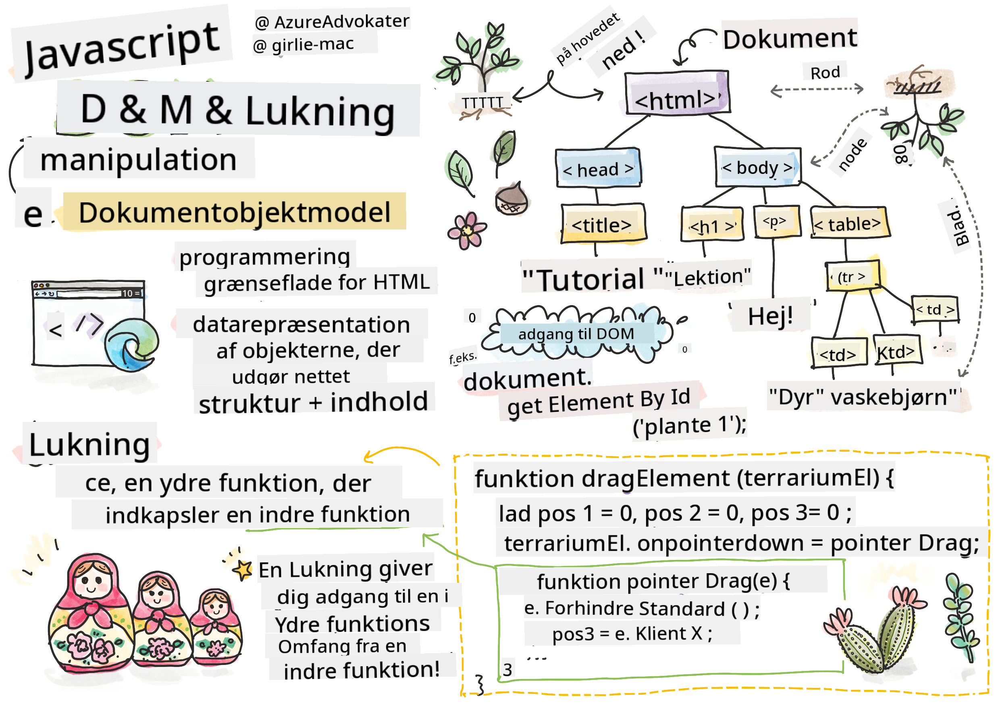
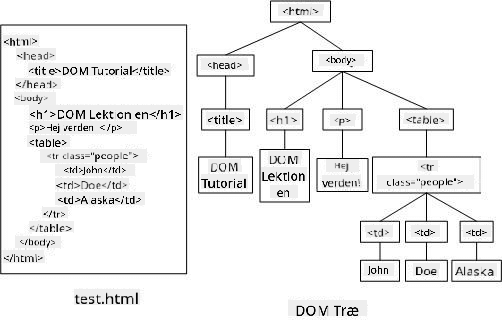
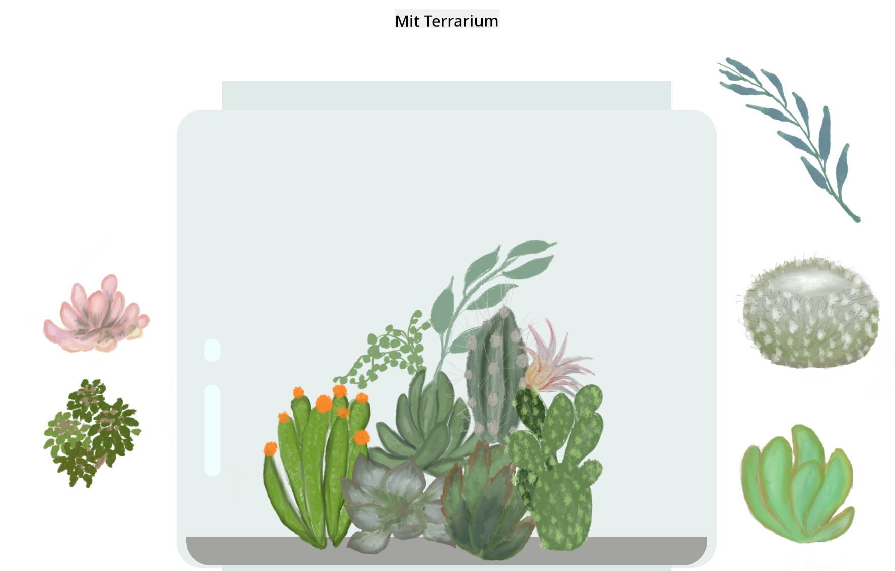

<!--
CO_OP_TRANSLATOR_METADATA:
{
  "original_hash": "30f8903a1f290e3d438dc2c70fe60259",
  "translation_date": "2025-08-26T21:34:00+00:00",
  "source_file": "3-terrarium/3-intro-to-DOM-and-closures/README.md",
  "language_code": "da"
}
-->
# Terrarium Projekt Del 3: DOM-manipulation og en Closure


> Sketchnote af [Tomomi Imura](https://twitter.com/girlie_mac)

## Quiz før lektionen

[Quiz før lektionen](https://ff-quizzes.netlify.app/web/quiz/19)

### Introduktion

Manipulation af DOM, eller "Document Object Model", er en central del af webudvikling. Ifølge [MDN](https://developer.mozilla.org/docs/Web/API/Document_Object_Model/Introduction) er "The Document Object Model (DOM) den datarepræsentation af objekterne, der udgør strukturen og indholdet af et dokument på nettet." Udfordringerne ved DOM-manipulation på nettet har ofte været årsagen til, at man bruger JavaScript-frameworks i stedet for ren JavaScript til at håndtere DOM, men vi klarer os selv!

Derudover vil denne lektion introducere ideen om en [JavaScript closure](https://developer.mozilla.org/docs/Web/JavaScript/Closures), som du kan tænke på som en funktion, der er indkapslet af en anden funktion, så den indre funktion har adgang til den ydre funktions scope.

> JavaScript closures er et omfattende og komplekst emne. Denne lektion berører den mest grundlæggende idé, nemlig at du i terrariets kode vil finde en closure: en indre funktion og en ydre funktion konstrueret på en måde, der giver den indre funktion adgang til den ydre funktions scope. For meget mere information om, hvordan dette fungerer, kan du besøge den [udførlige dokumentation](https://developer.mozilla.org/docs/Web/JavaScript/Closures).

Vi vil bruge en closure til at manipulere DOM.

Tænk på DOM som et træ, der repræsenterer alle de måder, et webside-dokument kan manipuleres på. Forskellige API'er (Application Program Interfaces) er blevet skrevet, så programmører, ved hjælp af deres foretrukne programmeringssprog, kan få adgang til DOM og redigere, ændre, omarrangere og på anden måde administrere det.



> En repræsentation af DOM og HTML-markup, der refererer til det. Fra [Olfa Nasraoui](https://www.researchgate.net/publication/221417012_Profile-Based_Focused_Crawler_for_Social_Media-Sharing_Websites)

I denne lektion vil vi færdiggøre vores interaktive terrarieprojekt ved at skabe den JavaScript, der gør det muligt for en bruger at manipulere planterne på siden.

### Forudsætning

Du bør have HTML og CSS til dit terrarium klar. Ved slutningen af denne lektion vil du kunne flytte planterne ind og ud af terrariet ved at trække dem.

### Opgave

I din terrarium-mappe skal du oprette en ny fil kaldet `script.js`. Importér den fil i `<head>`-sektionen:

```html
	<script src="./script.js" defer></script>
```

> Bemærk: Brug `defer`, når du importerer en ekstern JavaScript-fil i HTML-filen, så JavaScript kun udføres, efter HTML-filen er fuldt indlæst. Du kunne også bruge attributten `async`, som tillader scriptet at udføres, mens HTML-filen parses, men i vores tilfælde er det vigtigt, at HTML-elementerne er fuldt tilgængelige til at trække, før vi tillader drag-scriptet at blive udført.
---

## DOM-elementerne

Det første, du skal gøre, er at oprette referencer til de elementer, du vil manipulere i DOM. I vores tilfælde er det de 14 planter, der i øjeblikket venter i sidebjælkerne.

### Opgave

```html
dragElement(document.getElementById('plant1'));
dragElement(document.getElementById('plant2'));
dragElement(document.getElementById('plant3'));
dragElement(document.getElementById('plant4'));
dragElement(document.getElementById('plant5'));
dragElement(document.getElementById('plant6'));
dragElement(document.getElementById('plant7'));
dragElement(document.getElementById('plant8'));
dragElement(document.getElementById('plant9'));
dragElement(document.getElementById('plant10'));
dragElement(document.getElementById('plant11'));
dragElement(document.getElementById('plant12'));
dragElement(document.getElementById('plant13'));
dragElement(document.getElementById('plant14'));
```

Hvad sker der her? Du refererer til dokumentet og søger gennem dets DOM for at finde et element med et bestemt Id. Husk fra den første lektion om HTML, at du gav individuelle Id'er til hvert plantebillede (`id="plant1"`)? Nu vil du gøre brug af den indsats. Efter at have identificeret hvert element, sender du det til en funktion kaldet `dragElement`, som du vil bygge om lidt. Således er elementet i HTML nu drag-aktiveret, eller vil snart være det.

✅ Hvorfor refererer vi til elementer via Id? Hvorfor ikke via deres CSS-klasse? Du kan henvise til den tidligere lektion om CSS for at besvare dette spørgsmål.

---

## Closure

Nu er du klar til at oprette `dragElement`-closure, som er en ydre funktion, der indkapsler en indre funktion eller funktioner (i vores tilfælde vil vi have tre).

Closures er nyttige, når en eller flere funktioner skal have adgang til en ydre funktions scope. Her er et eksempel:

```javascript
function displayCandy(){
	let candy = ['jellybeans'];
	function addCandy(candyType) {
		candy.push(candyType)
	}
	addCandy('gumdrops');
}
displayCandy();
console.log(candy)
```

I dette eksempel omgiver `displayCandy`-funktionen en funktion, der tilføjer en ny type slik til en array, der allerede eksisterer i funktionen. Hvis du kører denne kode, vil `candy`-arrayet være undefined, da det er en lokal variabel (lokal for closure).

✅ Hvordan kan du gøre `candy`-arrayet tilgængeligt? Prøv at flytte det uden for closure. På denne måde bliver arrayet globalt i stedet for kun at være tilgængeligt i closures lokale scope.

### Opgave

Under elementdeklarationerne i `script.js` skal du oprette en funktion:

```javascript
function dragElement(terrariumElement) {
	//set 4 positions for positioning on the screen
	let pos1 = 0,
		pos2 = 0,
		pos3 = 0,
		pos4 = 0;
	terrariumElement.onpointerdown = pointerDrag;
}
```

`dragElement` får sit `terrariumElement`-objekt fra deklarationerne øverst i scriptet. Derefter sætter du nogle lokale positioner til `0` for det objekt, der sendes ind i funktionen. Disse er de lokale variabler, der vil blive manipuleret for hvert element, når du tilføjer drag-and-drop-funktionalitet inden for closure til hvert element. Terrariet vil blive fyldt med disse trukne elementer, så applikationen skal holde styr på, hvor de placeres.

Derudover tildeles det `terrariumElement`, der sendes til denne funktion, en `pointerdown`-hændelse, som er en del af [web-API'er](https://developer.mozilla.org/docs/Web/API) designet til at hjælpe med DOM-styring. `onpointerdown` udløses, når en knap trykkes, eller i vores tilfælde, når et trækbart element berøres. Denne event handler fungerer på både [web- og mobilbrowsere](https://caniuse.com/?search=onpointerdown), med få undtagelser.

✅ [Event handleren `onclick`](https://developer.mozilla.org/docs/Web/API/GlobalEventHandlers/onclick) har meget mere understøttelse på tværs af browsere; hvorfor ville du ikke bruge den her? Tænk over den præcise type skærminteraktion, du prøver at skabe her.

---

## Pointerdrag-funktionen

`terrariumElement` er klar til at blive trukket rundt; når `onpointerdown`-hændelsen udløses, kaldes funktionen `pointerDrag`. Tilføj den funktion lige under denne linje: `terrariumElement.onpointerdown = pointerDrag;`:

### Opgave 

```javascript
function pointerDrag(e) {
	e.preventDefault();
	console.log(e);
	pos3 = e.clientX;
	pos4 = e.clientY;
}
```

Flere ting sker. Først forhindrer du de standardhændelser, der normalt sker ved pointerdown, i at finde sted ved at bruge `e.preventDefault();`. På denne måde har du mere kontrol over grænsefladens adfærd.

> Vend tilbage til denne linje, når du har bygget scriptfilen helt, og prøv det uden `e.preventDefault()` - hvad sker der?

For det andet skal du åbne `index.html` i et browservindue og inspicere grænsefladen. Når du klikker på en plante, kan du se, hvordan 'e'-hændelsen fanges. Undersøg hændelsen for at se, hvor meget information der indsamles ved én pointerdown-hændelse!  

Dernæst skal du bemærke, hvordan de lokale variabler `pos3` og `pos4` sættes til e.clientX. Du kan finde `e`-værdierne i inspektionspanelet. Disse værdier fanger plantens x- og y-koordinater i det øjeblik, du klikker på den eller rører ved den. Du vil have fin kontrol over planternes adfærd, når du klikker og trækker dem, så du holder styr på deres koordinater.

✅ Bliver det mere klart, hvorfor hele denne app er bygget med én stor closure? Hvis den ikke var det, hvordan ville du opretholde scope for hver af de 14 trækbare planter?

Fuldfør den indledende funktion ved at tilføje to flere pointer-hændelsesmanipulationer under `pos4 = e.clientY`:

```html
document.onpointermove = elementDrag;
document.onpointerup = stopElementDrag;
```
Nu angiver du, at du vil have planten til at blive trukket med pointeren, mens du flytter den, og at trækgesten skal stoppe, når du fravælger planten. `onpointermove` og `onpointerup` er alle dele af den samme API som `onpointerdown`. Grænsefladen vil nu kaste fejl, da du endnu ikke har defineret funktionerne `elementDrag` og `stopElementDrag`, så byg dem ud næste gang.

## Funktionerne elementDrag og stopElementDrag

Du vil fuldføre din closure ved at tilføje to flere interne funktioner, der håndterer, hvad der sker, når du trækker en plante og stopper med at trække den. Den adfærd, du ønsker, er, at du kan trække enhver plante til enhver tid og placere den hvor som helst på skærmen. Denne grænseflade er ret uformel (der er f.eks. ingen drop zone) for at give dig mulighed for at designe dit terrarium præcis, som du vil, ved at tilføje, fjerne og omplacere planter.

### Opgave

Tilføj funktionen `elementDrag` lige efter den afsluttende krøllede parentes for `pointerDrag`:

```javascript
function elementDrag(e) {
	pos1 = pos3 - e.clientX;
	pos2 = pos4 - e.clientY;
	pos3 = e.clientX;
	pos4 = e.clientY;
	console.log(pos1, pos2, pos3, pos4);
	terrariumElement.style.top = terrariumElement.offsetTop - pos2 + 'px';
	terrariumElement.style.left = terrariumElement.offsetLeft - pos1 + 'px';
}
```
I denne funktion redigerer du en masse af de oprindelige positioner 1-4, som du satte som lokale variabler i den ydre funktion. Hvad sker der her?

Mens du trækker, tildeler du `pos1` ved at gøre det lig med `pos3` (som du tidligere satte som `e.clientX`) minus den aktuelle `e.clientX`-værdi. Du udfører en lignende operation på `pos2`. Derefter nulstiller du `pos3` og `pos4` til de nye X- og Y-koordinater for elementet. Du kan se disse ændringer i konsollen, mens du trækker. Derefter manipulerer du plantens CSS-stil for at sætte dens nye position baseret på de nye positioner af `pos1` og `pos2`, og beregner plantens top- og venstre X- og Y-koordinater baseret på sammenligningen af dens offset med disse nye positioner.

> `offsetTop` og `offsetLeft` er CSS-egenskaber, der sætter et elements position baseret på dets forælder; dets forælder kan være ethvert element, der ikke er positioneret som `static`. 

Al denne genberegning af positioner giver dig mulighed for at finjustere terrariets og planternes adfærd.

### Opgave 

Den sidste opgave for at fuldføre grænsefladen er at tilføje funktionen `stopElementDrag` efter den afsluttende krøllede parentes for `elementDrag`:

```javascript
function stopElementDrag() {
	document.onpointerup = null;
	document.onpointermove = null;
}
```

Denne lille funktion nulstiller `onpointerup`- og `onpointermove`-hændelserne, så du enten kan genstarte plantens fremgang ved at begynde at trække den igen, eller begynde at trække en ny plante.

✅ Hvad sker der, hvis du ikke sætter disse hændelser til null?

Nu har du fuldført dit projekt!

🥇Tillykke! Du har færdiggjort dit smukke terrarium. 

---

## 🚀Udfordring

Tilføj en ny event handler til din closure for at gøre noget mere med planterne; for eksempel dobbeltklik på en plante for at bringe den foran. Bliv kreativ!

## Quiz efter lektionen

[Quiz efter lektionen](https://ff-quizzes.netlify.app/web/quiz/20)

## Gennemgang & Selvstudie

Selvom det virker trivielt at trække elementer rundt på skærmen, er der mange måder at gøre dette på og mange faldgruber, afhængigt af den effekt, du søger. Faktisk er der en hel [drag and drop API](https://developer.mozilla.org/docs/Web/API/HTML_Drag_and_Drop_API), som du kan prøve. Vi brugte den ikke i dette modul, fordi den effekt, vi ønskede, var lidt anderledes, men prøv denne API på dit eget projekt og se, hvad du kan opnå.

Find mere information om pointer-hændelser på [W3C-dokumentation](https://www.w3.org/TR/pointerevents1/) og på [MDN web docs](https://developer.mozilla.org/docs/Web/API/Pointer_events).

Tjek altid browserkapabiliteter ved hjælp af [CanIUse.com](https://caniuse.com/).

## Opgave

[Arbejd lidt mere med DOM](assignment.md)

---

**Ansvarsfraskrivelse**:  
Dette dokument er blevet oversat ved hjælp af AI-oversættelsestjenesten [Co-op Translator](https://github.com/Azure/co-op-translator). Selvom vi bestræber os på nøjagtighed, skal du være opmærksom på, at automatiserede oversættelser kan indeholde fejl eller unøjagtigheder. Det originale dokument på dets oprindelige sprog bør betragtes som den autoritative kilde. For kritisk information anbefales professionel menneskelig oversættelse. Vi er ikke ansvarlige for eventuelle misforståelser eller fejltolkninger, der måtte opstå som følge af brugen af denne oversættelse.