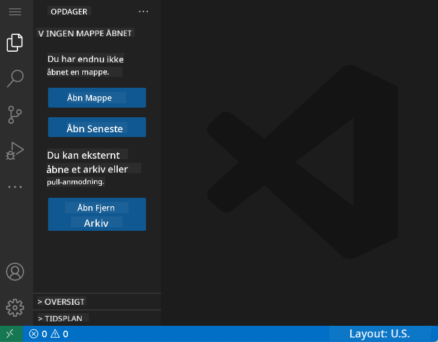
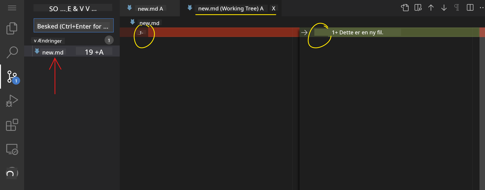
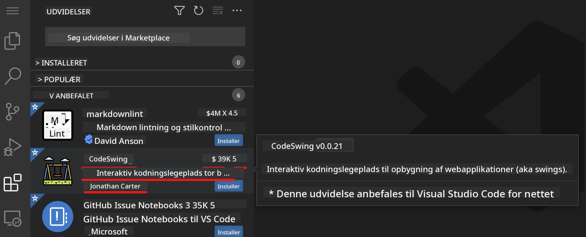
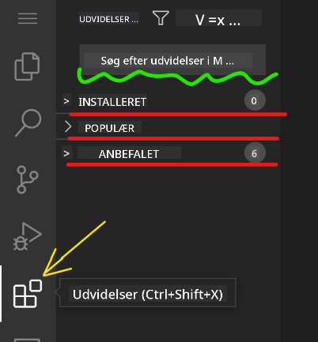

<!--
CO_OP_TRANSLATOR_METADATA:
{
  "original_hash": "7aa6e4f270d38d9cb17f2b5bd86b863d",
  "translation_date": "2025-08-26T22:27:26+00:00",
  "source_file": "8-code-editor/1-using-a-code-editor/README.md",
  "language_code": "da"
}
-->
# Brug af en kodeeditor

Denne lektion dækker det grundlæggende i at bruge [VSCode.dev](https://vscode.dev), en webbaseret kodeeditor, så du kan foretage ændringer i din kode og bidrage til et projekt uden at installere noget på din computer.

## Læringsmål

I denne lektion vil du lære at:

- Bruge en kodeeditor i et kodeprojekt
- Holde styr på ændringer med versionskontrol
- Tilpasse editoren til udvikling

### Forudsætninger

Før du begynder, skal du oprette en konto hos [GitHub](https://github.com). Gå til [GitHub](https://github.com/) og opret en konto, hvis du ikke allerede har en.

### Introduktion

En kodeeditor er et essentielt værktøj til at skrive programmer og samarbejde om eksisterende kodeprojekter. Når du forstår det grundlæggende i en editor og hvordan du udnytter dens funktioner, kan du anvende dem, når du skriver kode.

## Kom godt i gang med VSCode.dev

[VSCode.dev](https://vscode.dev) er en kodeeditor på nettet. Du behøver ikke installere noget for at bruge den, det er ligesom at åbne en hvilken som helst anden hjemmeside. For at komme i gang med editoren skal du åbne følgende link: [https://vscode.dev](https://vscode.dev). Hvis du ikke er logget ind på [GitHub](https://github.com/), skal du følge anvisningerne for at logge ind eller oprette en ny konto og derefter logge ind.

Når editoren er indlæst, bør den se nogenlunde sådan ud:



Der er tre hovedsektioner, fra venstre mod højre:

1. _Aktivitetsbjælken_, som inkluderer nogle ikoner, som forstørrelsesglasset 🔎, tandhjulet ⚙️ og et par andre.
2. Den udvidede aktivitetsbjælke, som som standard viser _Explorer_, kaldet _sidebjælken_.
3. Og til sidst kodeområdet til højre.

Klik på hvert af ikonerne for at vise en anden menu. Når du er færdig, skal du klikke på _Explorer_, så du er tilbage, hvor du startede.

Når du begynder at oprette kode eller ændre eksisterende kode, vil det ske i det største område til højre. Du vil også bruge dette område til at visualisere eksisterende kode, hvilket du vil gøre næste gang.

## Åbn et GitHub-repository

Det første, du skal gøre, er at åbne et GitHub-repository. Der er flere måder at åbne et repository på. I denne sektion vil du se to forskellige måder, du kan åbne et repository på, så du kan begynde at arbejde med ændringer.

### 1. Med editoren

Brug selve editoren til at åbne et fjernrepository. Hvis du går til [VSCode.dev](https://vscode.dev), vil du se en knap med teksten _"Open Remote Repository"_:


Du kan også bruge kommandopaletten. Kommandopaletten er en inputboks, hvor du kan skrive et ord, der er en del af en kommando eller handling, for at finde den rigtige kommando at udføre. Brug menuen øverst til venstre, vælg derefter _View_, og vælg _Command Palette_, eller brug følgende tastaturgenvej: Ctrl-Shift-P (på MacOS er det Command-Shift-P).


Når menuen åbnes, skal du skrive _open remote repository_ og derefter vælge den første mulighed. Flere repositories, som du er en del af eller har åbnet for nylig, vil blive vist. Du kan også bruge en fuld GitHub-URL til at vælge et. Brug følgende URL og indsæt den i boksen:

```
https://github.com/microsoft/Web-Dev-For-Beginners
```

✅ Hvis det lykkes, vil du se alle filer for dette repository indlæst i teksteditoren.

### 2. Brug af URL'en

Du kan også bruge en URL direkte til at indlæse et repository. For eksempel er den fulde URL for det aktuelle repository [https://github.com/microsoft/Web-Dev-For-Beginners](https://github.com/microsoft/Web-Dev-For-Beginners), men du kan bytte GitHub-domænet med `VSCode.dev/github` og indlæse repositoryet direkte. Den resulterende URL ville være [https://vscode.dev/github/microsoft/Web-Dev-For-Beginners](https://vscode.dev/github/microsoft/Web-Dev-For-Beginners).

## Rediger filer

Når du har åbnet repositoryet i browseren/vscode.dev, er det næste skridt at foretage opdateringer eller ændringer i projektet.

### 1. Opret en ny fil

Du kan enten oprette en fil inde i en eksisterende mappe eller oprette den i rodkataloget/mappen. For at oprette en ny fil skal du åbne en placering/mappe, hvor du vil gemme filen, og vælge ikonet _'New file ...'_ på aktivitetsbjælken _(venstre)_, give den et navn og trykke på enter.


### 2. Rediger og gem en fil i repositoryet

Brug af vscode.dev er nyttigt, når du vil foretage hurtige opdateringer af dit projekt uden at skulle indlæse software lokalt.  
For at opdatere din kode skal du klikke på 'Explorer'-ikonet, som også er placeret på aktivitetsbjælken, for at se filer og mapper i repositoryet.  
Vælg en fil for at åbne den i kodeområdet, foretag dine ændringer og gem.


Når du er færdig med at opdatere dit projekt, skal du vælge ikonet _`source control`_, som indeholder alle de nye ændringer, du har foretaget i dit repository.

For at se de ændringer, du har foretaget i dit projekt, skal du vælge filerne i mappen `Changes` i den udvidede aktivitetsbjælke. Dette vil åbne et 'Working Tree', hvor du visuelt kan se de ændringer, du har foretaget i filen. Rød viser en udeladelse i projektet, mens grøn angiver en tilføjelse.



Hvis du er tilfreds med de ændringer, du har foretaget, skal du holde musen over mappen `Changes` og klikke på `+`-knappen for at stage ændringerne. At stage betyder simpelthen at forberede dine ændringer til at blive committet til GitHub.

Hvis du derimod ikke er tilfreds med nogle ændringer og vil kassere dem, skal du holde musen over mappen `Changes` og vælge ikonet `undo`.

Derefter skal du skrive en `commit message` _(En beskrivelse af den ændring, du har foretaget i projektet)_, klikke på ikonet `check` for at committe og pushe dine ændringer.

Når du er færdig med at arbejde på dit projekt, skal du vælge ikonet `hamburger menu` øverst til venstre for at vende tilbage til repositoryet på github.com.


## Brug af udvidelser

Installation af udvidelser i VSCode giver dig mulighed for at tilføje nye funktioner og tilpasse udviklingsmiljøet i din editor for at forbedre din udviklingsworkflow. Disse udvidelser hjælper dig også med at tilføje understøttelse af flere programmeringssprog og er ofte enten generiske udvidelser eller sprog-specifikke udvidelser.

For at gennemse listen over alle tilgængelige udvidelser skal du klikke på ikonet _`Extensions`_ på aktivitetsbjælken og begynde at skrive navnet på udvidelsen i tekstfeltet mærket _'Search Extensions in Marketplace'_.  
Du vil se en liste over udvidelser, hver med **udvidelsens navn, udgiverens navn, en kort beskrivelse, antal downloads** og **en stjernebedømmelse**.



Du kan også se alle tidligere installerede udvidelser ved at udvide mappen _`Installed`_, populære udvidelser brugt af de fleste udviklere i mappen _`Popular`_ og anbefalede udvidelser til dig enten af brugere i samme arbejdsområde eller baseret på dine nyligt åbnede filer i mappen _`Recommended`_.



### 1. Installer udvidelser

For at installere en udvidelse skal du skrive udvidelsens navn i søgefeltet og klikke på den for at se yderligere oplysninger om udvidelsen i kodeområdet, når den vises i den udvidede aktivitetsbjælke.

Du kan enten klikke på den _blå install-knap_ i den udvidede aktivitetsbjælke for at installere eller bruge install-knappen, der vises i kodeområdet, når du vælger udvidelsen for at indlæse yderligere oplysninger.


### 2. Tilpas udvidelser

Efter installation af udvidelsen kan du have behov for at ændre dens adfærd og tilpasse den baseret på dine præferencer. For at gøre dette skal du vælge ikonet Extensions, og denne gang vil din udvidelse vises i mappen _Installed_, klikke på _**Gear-ikonet**_ og navigere til _Extensions Setting_.


### 3. Administrer udvidelser

Efter installation og brug af din udvidelse tilbyder vscode.dev muligheder for at administrere din udvidelse baseret på forskellige behov. For eksempel kan du vælge at:

- **Deaktivere:** _(Du deaktiverer midlertidigt en udvidelse, når du ikke længere har brug for den, men ikke vil afinstallere den helt)_

    Vælg den installerede udvidelse i den udvidede aktivitetsbjælke > klik på Gear-ikonet > vælg 'Disable' eller 'Disable (Workspace)' **ELLER** Åbn udvidelsen i kodeområdet og klik på den blå Disable-knap.

- **Afinstallere:** Vælg den installerede udvidelse i den udvidede aktivitetsbjælke > klik på Gear-ikonet > vælg 'Uninstall' **ELLER** Åbn udvidelsen i kodeområdet og klik på den blå Uninstall-knap.

---

## Opgave

[Opret en CV-hjemmeside ved hjælp af vscode.dev](https://github.com/microsoft/Web-Dev-For-Beginners/blob/main/8-code-editor/1-using-a-code-editor/assignment.md)

## Gennemgang & Selvstudie

Læs mere om [VSCode.dev](https://code.visualstudio.com/docs/editor/vscode-web?WT.mc_id=academic-0000-alfredodeza) og nogle af dens andre funktioner.

---

**Ansvarsfraskrivelse**:  
Dette dokument er blevet oversat ved hjælp af AI-oversættelsestjenesten [Co-op Translator](https://github.com/Azure/co-op-translator). Selvom vi bestræber os på at sikre nøjagtighed, skal du være opmærksom på, at automatiserede oversættelser kan indeholde fejl eller unøjagtigheder. Det originale dokument på dets oprindelige sprog bør betragtes som den autoritative kilde. For kritisk information anbefales professionel menneskelig oversættelse. Vi påtager os ikke ansvar for eventuelle misforståelser eller fejltolkninger, der måtte opstå som følge af brugen af denne oversættelse.