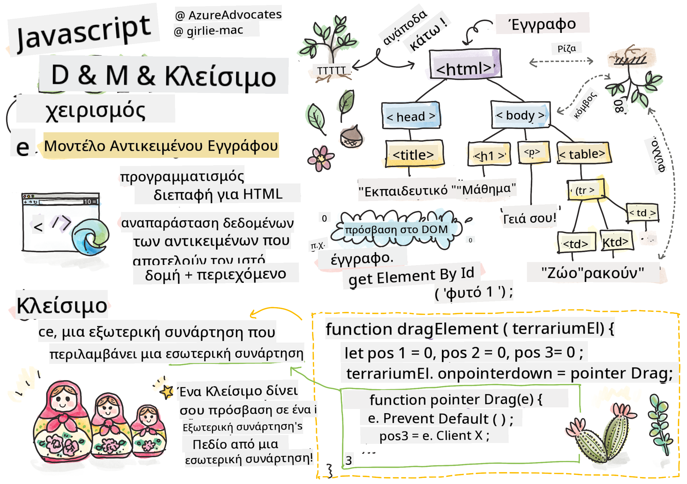
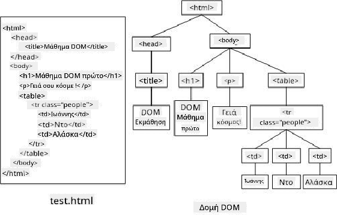
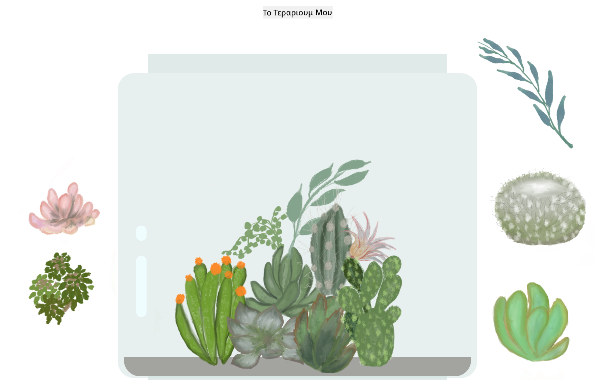

<!--
CO_OP_TRANSLATOR_METADATA:
{
  "original_hash": "30f8903a1f290e3d438dc2c70fe60259",
  "translation_date": "2025-08-26T21:31:59+00:00",
  "source_file": "3-terrarium/3-intro-to-DOM-and-closures/README.md",
  "language_code": "el"
}
-->
# Έργο Terrarium Μέρος 3: Χειρισμός DOM και Κλείσιμο


> Σκίτσο από την [Tomomi Imura](https://twitter.com/girlie_mac)

## Κουίζ Πριν το Μάθημα

[Κουίζ πριν το μάθημα](https://ashy-river-0debb7803.1.azurestaticapps.net/quiz/19)

### Εισαγωγή

Ο χειρισμός του DOM, ή "Document Object Model", είναι μια βασική πτυχή της ανάπτυξης ιστοσελίδων. Σύμφωνα με το [MDN](https://developer.mozilla.org/docs/Web/API/Document_Object_Model/Introduction), "Το Document Object Model (DOM) είναι η αναπαράσταση δεδομένων των αντικειμένων που αποτελούν τη δομή και το περιεχόμενο ενός εγγράφου στον ιστό." Οι προκλήσεις γύρω από τον χειρισμό του DOM στον ιστό συχνά αποτέλεσαν την αιτία για τη χρήση JavaScript frameworks αντί για απλή JavaScript για τη διαχείριση του DOM, αλλά εμείς θα τα καταφέρουμε μόνοι μας!

Επιπλέον, αυτό το μάθημα θα εισαγάγει την ιδέα ενός [κλεισίματος JavaScript](https://developer.mozilla.org/docs/Web/JavaScript/Closures), το οποίο μπορείτε να σκεφτείτε ως μια συνάρτηση που περικλείεται από μια άλλη συνάρτηση, ώστε η εσωτερική συνάρτηση να έχει πρόσβαση στο πεδίο της εξωτερικής συνάρτησης.

> Τα κλεισίματα JavaScript είναι ένα εκτενές και περίπλοκο θέμα. Αυτό το μάθημα αγγίζει την πιο βασική ιδέα ότι στον κώδικα αυτού του terrarium, θα βρείτε ένα κλείσιμο: μια εσωτερική συνάρτηση και μια εξωτερική συνάρτηση που έχουν κατασκευαστεί με τρόπο ώστε να επιτρέπουν στην εσωτερική συνάρτηση πρόσβαση στο πεδίο της εξωτερικής συνάρτησης. Για περισσότερες πληροφορίες σχετικά με το πώς λειτουργεί αυτό, επισκεφθείτε την [εκτενή τεκμηρίωση](https://developer.mozilla.org/docs/Web/JavaScript/Closures).

Θα χρησιμοποιήσουμε ένα κλείσιμο για να χειριστούμε το DOM.

Σκεφτείτε το DOM ως ένα δέντρο, που αναπαριστά όλους τους τρόπους με τους οποίους μπορεί να χειριστεί ένα έγγραφο ιστοσελίδας. Διάφορα APIs (Διεπαφές Προγραμματισμού Εφαρμογών) έχουν γραφτεί ώστε οι προγραμματιστές, χρησιμοποιώντας τη γλώσσα προγραμματισμού της επιλογής τους, να μπορούν να έχουν πρόσβαση στο DOM και να το επεξεργάζονται, να το αλλάζουν, να το αναδιατάσσουν και να το διαχειρίζονται με άλλους τρόπους.



> Μια αναπαράσταση του DOM και της HTML σήμανσης που το αναφέρεται. Από την [Olfa Nasraoui](https://www.researchgate.net/publication/221417012_Profile-Based_Focused_Crawler_for_Social_Media-Sharing_Websites)

Σε αυτό το μάθημα, θα ολοκληρώσουμε το διαδραστικό έργο terrarium δημιουργώντας τη JavaScript που θα επιτρέπει σε έναν χρήστη να χειρίζεται τα φυτά στη σελίδα.

### Προαπαιτούμενα

Θα πρέπει να έχετε δημιουργήσει το HTML και το CSS για το terrarium σας. Μέχρι το τέλος αυτού του μαθήματος, θα μπορείτε να μετακινείτε τα φυτά μέσα και έξω από το terrarium σύροντάς τα.

### Εργασία

Στον φάκελο του terrarium σας, δημιουργήστε ένα νέο αρχείο με όνομα `script.js`. Εισάγετε αυτό το αρχείο στην ενότητα `<head>`:

```html
	<script src="./script.js" defer></script>
```

> Σημείωση: χρησιμοποιήστε το `defer` κατά την εισαγωγή ενός εξωτερικού αρχείου JavaScript στο αρχείο HTML, ώστε να επιτρέψετε στη JavaScript να εκτελεστεί μόνο αφού το αρχείο HTML έχει φορτωθεί πλήρως. Μπορείτε επίσης να χρησιμοποιήσετε το χαρακτηριστικό `async`, το οποίο επιτρέπει στο script να εκτελείται ενώ το αρχείο HTML αναλύεται, αλλά στη δική μας περίπτωση, είναι σημαντικό να είναι πλήρως διαθέσιμα τα στοιχεία HTML για σύρσιμο πριν επιτρέψουμε την εκτέλεση του script σύρσης.
---

## Τα στοιχεία του DOM

Το πρώτο πράγμα που πρέπει να κάνετε είναι να δημιουργήσετε αναφορές στα στοιχεία που θέλετε να χειριστείτε στο DOM. Στην περίπτωσή μας, είναι τα 14 φυτά που περιμένουν στις πλαϊνές μπάρες.

### Εργασία

```html
dragElement(document.getElementById('plant1'));
dragElement(document.getElementById('plant2'));
dragElement(document.getElementById('plant3'));
dragElement(document.getElementById('plant4'));
dragElement(document.getElementById('plant5'));
dragElement(document.getElementById('plant6'));
dragElement(document.getElementById('plant7'));
dragElement(document.getElementById('plant8'));
dragElement(document.getElementById('plant9'));
dragElement(document.getElementById('plant10'));
dragElement(document.getElementById('plant11'));
dragElement(document.getElementById('plant12'));
dragElement(document.getElementById('plant13'));
dragElement(document.getElementById('plant14'));
```

Τι συμβαίνει εδώ; Αναφέρεστε στο έγγραφο και ψάχνετε μέσα στο DOM του για να βρείτε ένα στοιχείο με συγκεκριμένο Id. Θυμάστε στο πρώτο μάθημα για το HTML που δώσατε μοναδικά Ids σε κάθε εικόνα φυτού (`id="plant1"`); Τώρα θα αξιοποιήσετε αυτή την προσπάθεια. Αφού εντοπίσετε κάθε στοιχείο, το περνάτε σε μια συνάρτηση που ονομάζεται `dragElement`, την οποία θα δημιουργήσετε σε λίγο. Έτσι, το στοιχείο στο HTML είναι πλέον έτοιμο για σύρσιμο ή θα είναι σύντομα.

✅ Γιατί αναφερόμαστε σε στοιχεία με Id; Γιατί όχι με την CSS κλάση τους; Μπορείτε να ανατρέξετε στο προηγούμενο μάθημα για το CSS για να απαντήσετε σε αυτή την ερώτηση.

---

## Το Κλείσιμο

Τώρα είστε έτοιμοι να δημιουργήσετε το κλείσιμο `dragElement`, το οποίο είναι μια εξωτερική συνάρτηση που περικλείει μια ή περισσότερες εσωτερικές συναρτήσεις (στην περίπτωσή μας, θα έχουμε τρεις).

Τα κλεισίματα είναι χρήσιμα όταν μία ή περισσότερες συναρτήσεις χρειάζονται πρόσβαση στο πεδίο της εξωτερικής συνάρτησης. Δείτε ένα παράδειγμα:

```javascript
function displayCandy(){
	let candy = ['jellybeans'];
	function addCandy(candyType) {
		candy.push(candyType)
	}
	addCandy('gumdrops');
}
displayCandy();
console.log(candy)
```

Σε αυτό το παράδειγμα, η συνάρτηση `displayCandy` περικλείει μια συνάρτηση που προσθέτει έναν νέο τύπο καραμέλας σε έναν πίνακα που ήδη υπάρχει στη συνάρτηση. Αν εκτελούσατε αυτόν τον κώδικα, ο πίνακας `candy` θα ήταν απροσδιόριστος, καθώς είναι μια τοπική μεταβλητή (τοπική στο κλείσιμο).

✅ Πώς μπορείτε να κάνετε τον πίνακα `candy` προσβάσιμο; Δοκιμάστε να τον μετακινήσετε έξω από το κλείσιμο. Με αυτόν τον τρόπο, ο πίνακας γίνεται καθολικός, αντί να παραμένει διαθέσιμος μόνο στο τοπικό πεδίο του κλεισίματος.

### Εργασία

Κάτω από τις δηλώσεις στοιχείων στο `script.js`, δημιουργήστε μια συνάρτηση:

```javascript
function dragElement(terrariumElement) {
	//set 4 positions for positioning on the screen
	let pos1 = 0,
		pos2 = 0,
		pos3 = 0,
		pos4 = 0;
	terrariumElement.onpointerdown = pointerDrag;
}
```

Η `dragElement` λαμβάνει το αντικείμενο `terrariumElement` από τις δηλώσεις στην κορυφή του script. Στη συνέχεια, ορίζετε κάποιες τοπικές θέσεις στο `0` για το αντικείμενο που περνάτε στη συνάρτηση. Αυτές είναι οι τοπικές μεταβλητές που θα χειριστείτε για κάθε στοιχείο καθώς προσθέτετε λειτουργικότητα σύρσης και απόθεσης μέσα στο κλείσιμο για κάθε στοιχείο. Το terrarium θα γεμίσει με αυτά τα στοιχεία που σύρονται, οπότε η εφαρμογή πρέπει να παρακολουθεί πού τοποθετούνται.

Επιπλέον, το `terrariumElement` που περνάτε σε αυτή τη συνάρτηση ανατίθεται σε ένα γεγονός `pointerdown`, το οποίο είναι μέρος των [web APIs](https://developer.mozilla.org/docs/Web/API) που έχουν σχεδιαστεί για να βοηθούν στη διαχείριση του DOM. Το `onpointerdown` ενεργοποιείται όταν πατηθεί ένα κουμπί ή, στην περίπτωσή μας, όταν αγγιχτεί ένα στοιχείο που μπορεί να συρθεί. Αυτός ο χειριστής γεγονότων λειτουργεί τόσο σε [φυλλομετρητές ιστού όσο και σε κινητά](https://caniuse.com/?search=onpointerdown), με λίγες εξαιρέσεις.

✅ Ο [χειριστής γεγονότων `onclick`](https://developer.mozilla.org/docs/Web/API/GlobalEventHandlers/onclick) έχει πολύ μεγαλύτερη υποστήριξη μεταξύ φυλλομετρητών. Γιατί να μην τον χρησιμοποιήσετε εδώ; Σκεφτείτε τον ακριβή τύπο αλληλεπίδρασης που προσπαθείτε να δημιουργήσετε εδώ.

---

## Η συνάρτηση Pointerdrag

Το `terrariumElement` είναι έτοιμο να συρθεί. Όταν ενεργοποιηθεί το γεγονός `onpointerdown`, καλείται η συνάρτηση `pointerDrag`. Προσθέστε αυτή τη συνάρτηση ακριβώς κάτω από αυτή τη γραμμή: `terrariumElement.onpointerdown = pointerDrag;`:

### Εργασία 

```javascript
function pointerDrag(e) {
	e.preventDefault();
	console.log(e);
	pos3 = e.clientX;
	pos4 = e.clientY;
}
```

Συμβαίνουν αρκετά πράγματα. Πρώτα, αποτρέπετε τα προεπιλεγμένα γεγονότα που κανονικά συμβαίνουν στο pointerdown χρησιμοποιώντας `e.preventDefault();`. Με αυτόν τον τρόπο έχετε περισσότερο έλεγχο στη συμπεριφορά της διεπαφής.

> Επιστρέψτε σε αυτή τη γραμμή όταν έχετε ολοκληρώσει το αρχείο script και δοκιμάστε το χωρίς το `e.preventDefault()` - τι συμβαίνει;

Δεύτερον, ανοίξτε το `index.html` σε ένα παράθυρο φυλλομετρητή και επιθεωρήστε τη διεπαφή. Όταν κάνετε κλικ σε ένα φυτό, μπορείτε να δείτε πώς το γεγονός 'e' καταγράφεται. Εξετάστε το γεγονός για να δείτε πόσες πληροφορίες συλλέγονται από ένα γεγονός pointer down!

Στη συνέχεια, σημειώστε πώς οι τοπικές μεταβλητές `pos3` και `pos4` ορίζονται στο e.clientX. Μπορείτε να βρείτε τις τιμές `e` στο παράθυρο επιθεώρησης. Αυτές οι τιμές καταγράφουν τις συντεταγμένες x και y του φυτού τη στιγμή που κάνετε κλικ ή το αγγίζετε. Θα χρειαστείτε λεπτομερή έλεγχο της συμπεριφοράς των φυτών καθώς τα κάνετε κλικ και τα σύρετε, οπότε παρακολουθείτε τις συντεταγμένες τους.

✅ Γίνεται πιο ξεκάθαρο γιατί ολόκληρη η εφαρμογή είναι χτισμένη με ένα μεγάλο κλείσιμο; Αν δεν ήταν, πώς θα διατηρούσατε το πεδίο για καθένα από τα 14 φυτά που μπορούν να συρθούν;

Ολοκληρώστε την αρχική συνάρτηση προσθέτοντας δύο ακόμη χειρισμούς γεγονότων pointer κάτω από το `pos4 = e.clientY`:

```html
document.onpointermove = elementDrag;
document.onpointerup = stopElementDrag;
```
Τώρα υποδεικνύετε ότι θέλετε το φυτό να σύρεται μαζί με τον δείκτη καθώς το μετακινείτε, και η χειρονομία σύρσης να σταματά όταν αποεπιλέγετε το φυτό. Τα `onpointermove` και `onpointerup` είναι όλα μέρη του ίδιου API με το `onpointerdown`. Η διεπαφή θα εμφανίσει σφάλματα τώρα, καθώς δεν έχετε ακόμη ορίσει τις συναρτήσεις `elementDrag` και `stopElementDrag`, οπότε δημιουργήστε τις στη συνέχεια.

## Οι συναρτήσεις elementDrag και stopElementDrag

Θα ολοκληρώσετε το κλείσιμό σας προσθέτοντας δύο ακόμη εσωτερικές συναρτήσεις που θα χειρίζονται τι συμβαίνει όταν σύρετε ένα φυτό και όταν σταματάτε να το σύρετε. Η συμπεριφορά που θέλετε είναι να μπορείτε να σύρετε οποιοδήποτε φυτό ανά πάσα στιγμή και να το τοποθετείτε οπουδήποτε στην οθόνη. Αυτή η διεπαφή είναι αρκετά ευέλικτη (δεν υπάρχει ζώνη απόθεσης, για παράδειγμα) ώστε να σας επιτρέπει να σχεδιάσετε το terrarium σας όπως ακριβώς θέλετε, προσθέτοντας, αφαιρώντας και επανατοποθετώντας φυτά.

### Εργασία

Προσθέστε τη συνάρτηση `elementDrag` ακριβώς μετά την κλείσιμο της αγκύλης του `pointerDrag`:

```javascript
function elementDrag(e) {
	pos1 = pos3 - e.clientX;
	pos2 = pos4 - e.clientY;
	pos3 = e.clientX;
	pos4 = e.clientY;
	console.log(pos1, pos2, pos3, pos4);
	terrariumElement.style.top = terrariumElement.offsetTop - pos2 + 'px';
	terrariumElement.style.left = terrariumElement.offsetLeft - pos1 + 'px';
}
```
Σε αυτή τη συνάρτηση, κάνετε πολλές επεξεργασίες των αρχικών θέσεων 1-4 που ορίσατε ως τοπικές μεταβλητές στην εξωτερική συνάρτηση. Τι συμβαίνει εδώ;

Καθώς σύρετε, επαναπροσδιορίζετε το `pos1` κάνοντάς το ίσο με το `pos3` (το οποίο ορίσατε νωρίτερα ως `e.clientX`) μείον την τρέχουσα τιμή `e.clientX`. Κάνετε μια παρόμοια λειτουργία για το `pos2`. Στη συνέχεια, επαναφέρετε τα `pos3` και `pos4` στις νέες συντεταγμένες X και Y του στοιχείου. Μπορείτε να παρακολουθήσετε αυτές τις αλλαγές στην κονσόλα καθώς σύρετε. Στη συνέχεια, χειρίζεστε το στυλ css του φυτού για να ορίσετε τη νέα του θέση με βάση τις νέες θέσεις των `pos1` και `pos2`, υπολογίζοντας τις συντεταγμένες X και Y του φυτού με βάση τη σύγκριση της μετατόπισής του με αυτές τις νέες θέσεις.

> Τα `offsetTop` και `offsetLeft` είναι ιδιότητες CSS που ορίζουν τη θέση ενός στοιχείου με βάση αυτή του γονέα του. Ο γονέας του μπορεί να είναι οποιοδήποτε στοιχείο που δεν έχει θέση `static`.

Όλη αυτή η επαναϋπολογισμός θέσεων σας επιτρέπει να ρυθμίσετε με ακρίβεια τη συμπεριφορά του terrarium και των φυτών του.

### Εργασία 

Η τελική εργασία για την ολοκλήρωση της διεπαφής είναι να προσθέσετε τη συνάρτηση `stopElementDrag` μετά την κλείσιμο της αγκύλης του `elementDrag`:

```javascript
function stopElementDrag() {
	document.onpointerup = null;
	document.onpointermove = null;
}
```

Αυτή η μικρή συνάρτηση επαναφέρει τα γεγονότα `onpointerup` και `onpointermove`, ώστε να μπορείτε είτε να ξεκινήσετε ξανά την πρόοδο του φυτού σας ξεκινώντας να το σύρετε ξανά, είτε να αρχίσετε να σύρετε ένα νέο φυτό.

✅ Τι συμβαίνει αν δεν ορίσετε αυτά τα γεγονότα σε null;

Τώρα έχετε ολοκληρώσει το έργο σας!

🥇Συγχαρητήρια! Ολοκληρώσατε το όμορφο terrarium σας. 

---

## 🚀Πρόκληση

Προσθέστε έναν νέο χειριστή γεγονότων στο κλείσιμό σας για να κάνετε κάτι επιπλέον στα φυτά. Για παράδειγμα, κάντε διπλό κλικ σε ένα φυτό για να το φέρετε μπροστά. Γίνετε δημιουργικοί!

## Κουίζ Μετά το Μάθημα

[Κουίζ μετά το μάθημα](https://ashy-river-0debb7803.1.azurestaticapps.net/quiz/20)

## Ανασκόπηση & Αυτομελέτη

Ενώ το να σύρετε στοιχεία γύρω από την οθόνη φαίνεται απλό, υπάρχουν πολλοί τρόποι να το κάνετε και πολλές παγίδες, ανάλογα με το αποτέλεσμα που επιδιώκετε. Στην πραγματικότητα, υπάρχει ένα ολόκληρο [drag and drop API](https://developer.mozilla.org/docs/Web/API/HTML_Drag_and_Drop_API) που μπορείτε να δοκιμάσετε. Δεν το χρησιμοποιήσαμε σε αυτή τη μονάδα επειδή το αποτέλεσμα που θέλαμε ήταν κάπως διαφορετικό, αλλά δοκιμάστε αυτό το API στο δικό σας έργο και δείτε τι μπορείτε να πετύχετε.

Βρείτε περισσότερες πληροφορίες για τα pointer events στα [έγγραφα W3C](https://www.w3.org/TR/pointerevents1/) και στα [έγγραφα MDN](https://developer.mozilla.org/docs/Web/API/Pointer_events).

Πάντα να ελέγχετε τις δυνατότητες των φυλλομετρητών χρησιμοποιώντας το [CanIUse.com](https://caniuse.com/).

## Ανάθεση

[Δουλέψτε λίγο περισσότερο με το DOM](assignment.md)

---

**Αποποίηση ευθύνης**:  
Αυτό το έγγραφο έχει μεταφραστεί χρησιμοποιώντας την υπηρεσία αυτόματης μετάφρασης [Co-op Translator](https://github.com/Azure/co-op-translator). Παρόλο που καταβάλλουμε προσπάθειες για ακρίβεια, παρακαλούμε να έχετε υπόψη ότι οι αυτοματοποιημένες μεταφράσεις ενδέχεται να περιέχουν λάθη ή ανακρίβειες. Το πρωτότυπο έγγραφο στη μητρική του γλώσσα θα πρέπει να θεωρείται η αυθεντική πηγή. Για κρίσιμες πληροφορίες, συνιστάται επαγγελματική ανθρώπινη μετάφραση. Δεν φέρουμε ευθύνη για τυχόν παρεξηγήσεις ή εσφαλμένες ερμηνείες που προκύπτουν από τη χρήση αυτής της μετάφρασης.