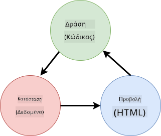
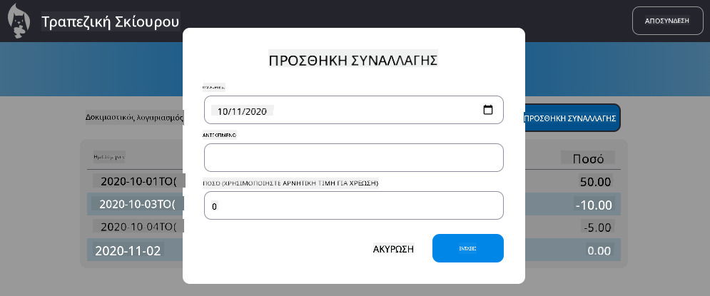

<!--
CO_OP_TRANSLATOR_METADATA:
{
  "original_hash": "4fa20c513e367e9cdd401bf49ae16e33",
  "translation_date": "2025-08-26T23:08:56+00:00",
  "source_file": "7-bank-project/4-state-management/README.md",
  "language_code": "el"
}
-->
# Δημιουργία Εφαρμογής Τραπεζικής Μέρος 4: Έννοιες Διαχείρισης Κατάστασης

## Ερωτηματολόγιο Πριν το Μάθημα

[Ερωτηματολόγιο πριν το μάθημα](https://ff-quizzes.netlify.app/web/quiz/47)

### Εισαγωγή

Καθώς μια διαδικτυακή εφαρμογή μεγαλώνει, γίνεται πρόκληση να παρακολουθείς όλες τις ροές δεδομένων. Ποιος κώδικας λαμβάνει τα δεδομένα, ποια σελίδα τα καταναλώνει, πού και πότε πρέπει να ενημερωθούν... είναι εύκολο να καταλήξεις με ακατάστατο κώδικα που είναι δύσκολο να συντηρηθεί. Αυτό ισχύει ιδιαίτερα όταν χρειάζεται να μοιραστείς δεδομένα μεταξύ διαφορετικών σελίδων της εφαρμογής σου, όπως δεδομένα χρήστη. Η έννοια της *διαχείρισης κατάστασης* υπήρχε πάντα σε κάθε είδους προγράμματα, αλλά καθώς οι διαδικτυακές εφαρμογές συνεχίζουν να αυξάνονται σε πολυπλοκότητα, τώρα είναι ένα βασικό σημείο που πρέπει να σκεφτείς κατά την ανάπτυξη.

Σε αυτό το τελευταίο μέρος, θα εξετάσουμε την εφαρμογή που δημιουργήσαμε για να επανεξετάσουμε πώς διαχειρίζεται η κατάσταση, επιτρέποντας την υποστήριξη ανανέωσης του προγράμματος περιήγησης οποιαδήποτε στιγμή και τη διατήρηση δεδομένων μεταξύ των συνεδριών χρήστη.

### Προαπαιτούμενα

Πρέπει να έχεις ολοκληρώσει το μέρος [ανάκτησης δεδομένων](../3-data/README.md) της διαδικτυακής εφαρμογής για αυτό το μάθημα. Πρέπει επίσης να εγκαταστήσεις το [Node.js](https://nodejs.org) και να [εκτελέσεις το API του διακομιστή](../api/README.md) τοπικά ώστε να μπορείς να διαχειριστείς δεδομένα λογαριασμού.

Μπορείς να δοκιμάσεις ότι ο διακομιστής λειτουργεί σωστά εκτελώντας αυτήν την εντολή σε ένα τερματικό:

```sh
curl http://localhost:5000/api
# -> should return "Bank API v1.0.0" as a result
```

---

## Επανεξέταση της διαχείρισης κατάστασης

Στο [προηγούμενο μάθημα](../3-data/README.md), εισαγάγαμε μια βασική έννοια κατάστασης στην εφαρμογή μας με τη χρήση της παγκόσμιας μεταβλητής `account`, η οποία περιέχει τα τραπεζικά δεδομένα του χρήστη που είναι συνδεδεμένος. Ωστόσο, η τρέχουσα υλοποίησή μας έχει κάποια προβλήματα. Δοκίμασε να ανανεώσεις τη σελίδα όταν βρίσκεσαι στον πίνακα ελέγχου. Τι συμβαίνει;

Υπάρχουν 3 προβλήματα με τον τρέχοντα κώδικα:

- Η κατάσταση δεν διατηρείται, καθώς η ανανέωση του προγράμματος περιήγησης σε επιστρέφει στη σελίδα σύνδεσης.
- Υπάρχουν πολλές συναρτήσεις που τροποποιούν την κατάσταση. Καθώς η εφαρμογή μεγαλώνει, μπορεί να γίνει δύσκολο να παρακολουθήσεις τις αλλαγές και είναι εύκολο να ξεχάσεις να ενημερώσεις μία.
- Η κατάσταση δεν καθαρίζεται, οπότε όταν κάνεις κλικ στο *Αποσύνδεση*, τα δεδομένα του λογαριασμού παραμένουν εκεί, παρόλο που βρίσκεσαι στη σελίδα σύνδεσης.

Θα μπορούσαμε να ενημερώσουμε τον κώδικα μας για να αντιμετωπίσουμε αυτά τα προβλήματα ένα προς ένα, αλλά αυτό θα δημιουργούσε περισσότερη επανάληψη κώδικα και θα έκανε την εφαρμογή πιο περίπλοκη και δύσκολη στη συντήρηση. Ή θα μπορούσαμε να σταματήσουμε για λίγα λεπτά και να επανεξετάσουμε τη στρατηγική μας.

> Ποια προβλήματα προσπαθούμε πραγματικά να λύσουμε εδώ;

Η [διαχείριση κατάστασης](https://en.wikipedia.org/wiki/State_management) αφορά την εύρεση μιας καλής προσέγγισης για την επίλυση αυτών των δύο συγκεκριμένων προβλημάτων:

- Πώς να διατηρήσουμε τις ροές δεδομένων σε μια εφαρμογή κατανοητές;
- Πώς να διατηρήσουμε τα δεδομένα κατάστασης πάντα συγχρονισμένα με τη διεπαφή χρήστη (και αντίστροφα);

Μόλις φροντίσεις αυτά, οποιαδήποτε άλλα προβλήματα μπορεί να έχεις είτε θα έχουν ήδη λυθεί είτε θα έχουν γίνει ευκολότερα να λυθούν. Υπάρχουν πολλές πιθανές προσεγγίσεις για την επίλυση αυτών των προβλημάτων, αλλά θα ακολουθήσουμε μια κοινή λύση που συνίσταται στο **να κεντροποιήσουμε τα δεδομένα και τους τρόπους αλλαγής τους**. Οι ροές δεδομένων θα λειτουργούν ως εξής:



> Δεν θα καλύψουμε εδώ το μέρος όπου τα δεδομένα ενεργοποιούν αυτόματα την ενημέρωση της προβολής, καθώς αυτό συνδέεται με πιο προχωρημένες έννοιες του [Αντιδραστικού Προγραμματισμού](https://en.wikipedia.org/wiki/Reactive_programming). Είναι ένα καλό θέμα για περαιτέρω εμβάθυνση αν είσαι έτοιμος για μια βαθύτερη μελέτη.

✅ Υπάρχουν πολλές βιβλιοθήκες εκεί έξω με διαφορετικές προσεγγίσεις στη διαχείριση κατάστασης, με το [Redux](https://redux.js.org) να είναι μια δημοφιλής επιλογή. Ρίξε μια ματιά στις έννοιες και τα πρότυπα που χρησιμοποιούνται, καθώς συχνά είναι ένας καλός τρόπος να μάθεις ποια πιθανά προβλήματα μπορεί να αντιμετωπίσεις σε μεγάλες διαδικτυακές εφαρμογές και πώς μπορούν να λυθούν.

### Εργασία

Θα ξεκινήσουμε με λίγη αναδιάρθρωση. Αντικατάστησε τη δήλωση `account`:

```js
let account = null;
```

Με:

```js
let state = {
  account: null
};
```

Η ιδέα είναι να *κεντροποιήσουμε* όλα τα δεδομένα της εφαρμογής μας σε ένα μόνο αντικείμενο κατάστασης. Προς το παρόν έχουμε μόνο το `account` στην κατάσταση, οπότε δεν αλλάζει πολύ, αλλά δημιουργεί μια βάση για μελλοντικές εξελίξεις.

Πρέπει επίσης να ενημερώσουμε τις συναρτήσεις που το χρησιμοποιούν. Στις συναρτήσεις `register()` και `login()`, αντικατάστησε το `account = ...` με `state.account = ...`;

Στην αρχή της συνάρτησης `updateDashboard()`, πρόσθεσε αυτή τη γραμμή:

```js
const account = state.account;
```

Αυτή η αναδιάρθρωση από μόνη της δεν έφερε πολλές βελτιώσεις, αλλά η ιδέα ήταν να θέσουμε τα θεμέλια για τις επόμενες αλλαγές.

## Παρακολούθηση αλλαγών δεδομένων

Τώρα που έχουμε θέσει το αντικείμενο `state` για την αποθήκευση των δεδομένων μας, το επόμενο βήμα είναι να κεντροποιήσουμε τις ενημερώσεις. Στόχος είναι να γίνει ευκολότερη η παρακολούθηση οποιωνδήποτε αλλαγών και πότε συμβαίνουν.

Για να αποφύγουμε την πραγματοποίηση αλλαγών στο αντικείμενο `state`, είναι επίσης καλή πρακτική να το θεωρούμε [*αμετάβλητο*](https://en.wikipedia.org/wiki/Immutable_object), που σημαίνει ότι δεν μπορεί να τροποποιηθεί καθόλου. Αυτό σημαίνει επίσης ότι πρέπει να δημιουργήσεις ένα νέο αντικείμενο κατάστασης αν θέλεις να αλλάξεις κάτι σε αυτό. Με αυτόν τον τρόπο, δημιουργείς προστασία από πιθανές ανεπιθύμητες [παρενέργειες](https://en.wikipedia.org/wiki/Side_effect_(computer_science)) και ανοίγεις δυνατότητες για νέες λειτουργίες στην εφαρμογή σου, όπως η υλοποίηση αναίρεσης/επανάληψης, ενώ ταυτόχρονα διευκολύνεις την αποσφαλμάτωση. Για παράδειγμα, θα μπορούσες να καταγράψεις κάθε αλλαγή που γίνεται στην κατάσταση και να διατηρήσεις ένα ιστορικό των αλλαγών για να κατανοήσεις την πηγή ενός σφάλματος.

Στην JavaScript, μπορείς να χρησιμοποιήσεις το [`Object.freeze()`](https://developer.mozilla.org/docs/Web/JavaScript/Reference/Global_Objects/Object/freeze) για να δημιουργήσεις μια αμετάβλητη έκδοση ενός αντικειμένου. Αν προσπαθήσεις να κάνεις αλλαγές σε ένα αμετάβλητο αντικείμενο, θα προκληθεί εξαίρεση.

✅ Γνωρίζεις τη διαφορά μεταξύ ενός *ρηχού* και ενός *βαθιού* αμετάβλητου αντικειμένου; Μπορείς να διαβάσεις σχετικά [εδώ](https://developer.mozilla.org/docs/Web/JavaScript/Reference/Global_Objects/Object/freeze#What_is_shallow_freeze).

### Εργασία

Ας δημιουργήσουμε μια νέα συνάρτηση `updateState()`:

```js
function updateState(property, newData) {
  state = Object.freeze({
    ...state,
    [property]: newData
  });
}
```

Σε αυτή τη συνάρτηση, δημιουργούμε ένα νέο αντικείμενο κατάστασης και αντιγράφουμε δεδομένα από την προηγούμενη κατάσταση χρησιμοποιώντας τον [*τελεστή διάδοσης (`...`)*](https://developer.mozilla.org/docs/Web/JavaScript/Reference/Operators/Spread_syntax#Spread_in_object_literals). Στη συνέχεια, αντικαθιστούμε μια συγκεκριμένη ιδιότητα του αντικειμένου κατάστασης με τα νέα δεδομένα χρησιμοποιώντας τη [σημειογραφία αγκύλης](https://developer.mozilla.org/docs/Web/JavaScript/Guide/Working_with_Objects#Objects_and_properties) `[property]` για την ανάθεση. Τέλος, κλειδώνουμε το αντικείμενο για να αποτρέψουμε τροποποιήσεις χρησιμοποιώντας το `Object.freeze()`. Προς το παρόν, έχουμε μόνο την ιδιότητα `account` αποθηκευμένη στην κατάσταση, αλλά με αυτήν την προσέγγιση μπορείς να προσθέσεις όσες ιδιότητες χρειάζεσαι στην κατάσταση.

Θα ενημερώσουμε επίσης την αρχικοποίηση της `state` για να βεβαιωθούμε ότι η αρχική κατάσταση είναι επίσης κλειδωμένη:

```js
let state = Object.freeze({
  account: null
});
```

Μετά από αυτό, ενημέρωσε τη συνάρτηση `register` αντικαθιστώντας την ανάθεση `state.account = result;` με:

```js
updateState('account', result);
```

Κάνε το ίδιο με τη συνάρτηση `login`, αντικαθιστώντας το `state.account = data;` με:

```js
updateState('account', data);
```

Τώρα θα εκμεταλλευτούμε την ευκαιρία να διορθώσουμε το πρόβλημα των δεδομένων λογαριασμού που δεν καθαρίζονται όταν ο χρήστης κάνει κλικ στο *Αποσύνδεση*.

Δημιούργησε μια νέα συνάρτηση `logout()`:

```js
function logout() {
  updateState('account', null);
  navigate('/login');
}
```

Στην `updateDashboard()`, αντικατάστησε την ανακατεύθυνση `return navigate('/login');` με `return logout();`

Δοκίμασε να εγγραφείς σε έναν νέο λογαριασμό, να αποσυνδεθείς και να συνδεθείς ξανά για να ελέγξεις ότι όλα λειτουργούν σωστά.

> Συμβουλή: μπορείς να δεις όλες τις αλλαγές κατάστασης προσθέτοντας `console.log(state)` στο τέλος της `updateState()` και ανοίγοντας την κονσόλα στα εργαλεία ανάπτυξης του προγράμματος περιήγησης.

## Διατήρηση της κατάστασης

Οι περισσότερες διαδικτυακές εφαρμογές χρειάζονται να διατηρούν δεδομένα για να λειτουργούν σωστά. Όλα τα κρίσιμα δεδομένα συνήθως αποθηκεύονται σε μια βάση δεδομένων και προσπελάζονται μέσω ενός API διακομιστή, όπως τα δεδομένα λογαριασμού χρήστη στην περίπτωσή μας. Αλλά μερικές φορές, είναι επίσης ενδιαφέρον να διατηρείς κάποια δεδομένα στην εφαρμογή πελάτη που εκτελείται στο πρόγραμμα περιήγησης, για καλύτερη εμπειρία χρήστη ή για βελτίωση της απόδοσης φόρτωσης.

Όταν θέλεις να διατηρήσεις δεδομένα στο πρόγραμμα περιήγησης, υπάρχουν μερικές σημαντικές ερωτήσεις που πρέπει να κάνεις στον εαυτό σου:

- *Είναι τα δεδομένα ευαίσθητα;* Πρέπει να αποφεύγεις την αποθήκευση οποιωνδήποτε ευαίσθητων δεδομένων στον πελάτη, όπως κωδικούς πρόσβασης χρηστών.
- *Για πόσο καιρό χρειάζεσαι να διατηρήσεις αυτά τα δεδομένα;* Σκοπεύεις να προσπελάσεις αυτά τα δεδομένα μόνο για την τρέχουσα συνεδρία ή θέλεις να αποθηκευτούν για πάντα;

Υπάρχουν πολλοί τρόποι αποθήκευσης πληροφοριών μέσα σε μια διαδικτυακή εφαρμογή, ανάλογα με το τι θέλεις να επιτύχεις. Για παράδειγμα, μπορείς να χρησιμοποιήσεις τις διευθύνσεις URL για να αποθηκεύσεις ένα ερώτημα αναζήτησης και να το κάνεις κοινόχρηστο μεταξύ χρηστών. Μπορείς επίσης να χρησιμοποιήσεις [HTTP cookies](https://developer.mozilla.org/docs/Web/HTTP/Cookies) αν τα δεδομένα χρειάζεται να μοιραστούν με τον διακομιστή, όπως πληροφορίες [αυθεντικοποίησης](https://en.wikipedia.org/wiki/Authentication).

Μια άλλη επιλογή είναι να χρησιμοποιήσεις μία από τις πολλές APIs του προγράμματος περιήγησης για την αποθήκευση δεδομένων. Δύο από αυτές είναι ιδιαίτερα ενδιαφέρουσες:

- [`localStorage`](https://developer.mozilla.org/docs/Web/API/Window/localStorage): ένα [Κατάστημα Κλειδιού/Τιμής](https://en.wikipedia.org/wiki/Key%E2%80%93value_database) που επιτρέπει τη διατήρηση δεδομένων συγκεκριμένων για την τρέχουσα ιστοσελίδα μεταξύ διαφορετικών συνεδριών. Τα δεδομένα που αποθηκεύονται σε αυτό δεν λήγουν ποτέ.
- [`sessionStorage`](https://developer.mozilla.org/docs/Web/API/Window/sessionStorage): αυτό λειτουργεί το ίδιο με το `localStorage` εκτός από το ότι τα δεδομένα που αποθηκεύονται σε αυτό διαγράφονται όταν η συνεδρία τελειώσει (όταν κλείσει το πρόγραμμα περιήγησης).

Σημείωσε ότι και οι δύο αυτές APIs επιτρέπουν μόνο την αποθήκευση [συμβολοσειρών](https://developer.mozilla.org/docs/Web/JavaScript/Reference/Global_Objects/String). Αν θέλεις να αποθηκεύσεις σύνθετα αντικείμενα, θα χρειαστεί να τα σειριοποιήσεις στη μορφή [JSON](https://developer.mozilla.org/docs/Web/JavaScript/Reference/Global_Objects/JSON) χρησιμοποιώντας το [`JSON.stringify()`](https://developer.mozilla.org/docs/Web/JavaScript/Reference/Global_Objects/JSON/stringify).

✅ Αν θέλεις να δημιουργήσεις μια διαδικτυακή εφαρμογή που δεν λειτουργεί με διακομιστή, είναι επίσης δυνατό να δημιουργήσεις μια βάση δεδομένων στον πελάτη χρησιμοποιώντας το API [`IndexedDB`](https://developer.mozilla.org/docs/Web/API/IndexedDB_API). Αυτό προορίζεται για προχωρημένες περιπτώσεις χρήσης ή αν χρειάζεσαι να αποθηκεύσεις σημαντική ποσότητα δεδομένων, καθώς είναι πιο περίπλοκο στη χρήση.

### Εργασία

Θέλουμε οι χρήστες μας να παραμένουν συνδεδεμένοι μέχρι να κάνουν ρητά κλικ στο κουμπί *Αποσύνδεση*, οπότε θα χρησιμοποιήσουμε το `localStorage` για να αποθηκεύσουμε τα δεδομένα του λογαριασμού. Πρώτα, ας ορίσουμε ένα κλειδί που θα χρησιμοποιήσουμε για την αποθήκευση των δεδομένων μας.

```js
const storageKey = 'savedAccount';
```

Στη συνέχεια, πρόσθεσε αυτή τη γραμμή στο τέλος της συνάρτησης `updateState()`:

```js
localStorage.setItem(storageKey, JSON.stringify(state.account));
```

Με αυτό, τα δεδομένα του λογαριασμού χρήστη θα διατηρούνται και θα είναι πάντα ενημερωμένα καθώς κεντροποιήσαμε προηγουμένως όλες τις ενημερώσεις κατάστασης. Εδώ αρχίζουμε να επωφελούμαστε από όλες τις προηγούμενες αναδιαρθρώσεις μας 🙂.

Καθώς τα δεδομένα αποθηκεύονται, πρέπει επίσης να φροντίσουμε να τα επαναφέρουμε όταν φορτώνεται η εφαρμογή. Επειδή αρχίζουμε να έχουμε περισσότερο κώδικα αρχικοποίησης, μπορεί να είναι καλή ιδέα να δημιουργήσουμε μια νέα συνάρτηση `init`, που περιλαμβάνει επίσης τον προηγούμενο κώδικα στο κάτω μέρος του `app.js`:

```js
function init() {
  const savedAccount = localStorage.getItem(storageKey);
  if (savedAccount) {
    updateState('account', JSON.parse(savedAccount));
  }

  // Our previous initialization code
  window.onpopstate = () => updateRoute();
  updateRoute();
}

init();
```

Εδώ ανακτούμε τα αποθηκευμένα δεδομένα και, αν υπάρχουν, ενημερώνουμε την κατάσταση ανάλογα. Είναι σημαντικό να το κάνουμε *πριν* ενημερώσουμε τη διαδρομή, καθώς μπορεί να υπάρχει κώδικας που βασίζεται στην κατάσταση κατά την ενημέρωση της σελίδας.

Μπορούμε επίσης να κάνουμε τη σελίδα *Πίνακας Ελέγχου* την προεπιλεγμένη σελίδα της εφαρμογής μας, καθώς τώρα διατηρούμε τα δεδομένα του λογαριασμού. Αν δεν βρεθούν δεδομένα, ο πίνακας ελέγχου φροντίζει να ανακατευθύνει στη σελίδα *Σύνδεση* ούτως ή άλλως
[Κουίζ μετά τη διάλεξη](https://ff-quizzes.netlify.app/web/quiz/48)

## Εργασία

[Υλοποιήστε το διάλογο "Προσθήκη συναλλαγής"](assignment.md)

Ακολουθεί ένα παράδειγμα αποτελέσματος μετά την ολοκλήρωση της εργασίας:



---

**Αποποίηση ευθύνης**:  
Αυτό το έγγραφο έχει μεταφραστεί χρησιμοποιώντας την υπηρεσία αυτόματης μετάφρασης [Co-op Translator](https://github.com/Azure/co-op-translator). Παρόλο που καταβάλλουμε προσπάθειες για ακρίβεια, παρακαλούμε να έχετε υπόψη ότι οι αυτοματοποιημένες μεταφράσεις ενδέχεται να περιέχουν λάθη ή ανακρίβειες. Το πρωτότυπο έγγραφο στη μητρική του γλώσσα θα πρέπει να θεωρείται η αυθεντική πηγή. Για κρίσιμες πληροφορίες, συνιστάται επαγγελματική ανθρώπινη μετάφραση. Δεν φέρουμε ευθύνη για τυχόν παρεξηγήσεις ή εσφαλμένες ερμηνείες που προκύπτουν από τη χρήση αυτής της μετάφρασης.