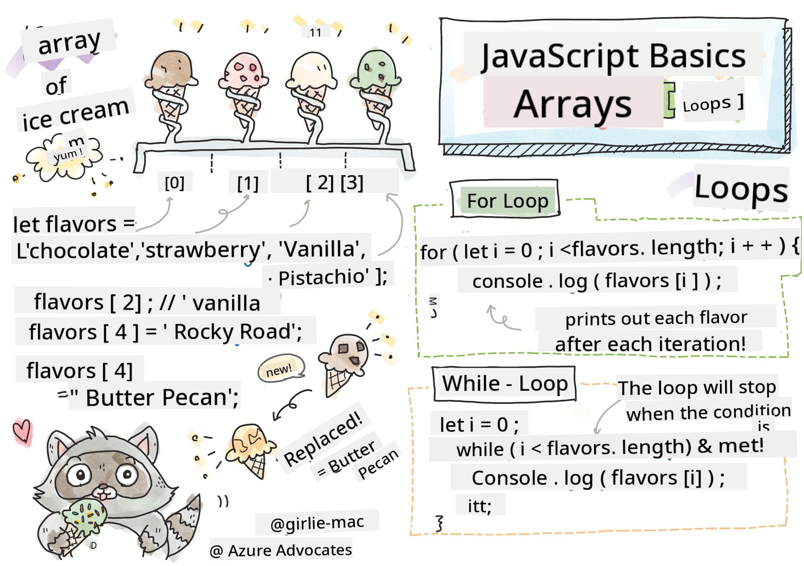

<!--
CO_OP_TRANSLATOR_METADATA:
{
  "original_hash": "3f7f87871312cf6cc12662da7d973182",
  "translation_date": "2025-08-28T11:46:35+00:00",
  "source_file": "2-js-basics/4-arrays-loops/README.md",
  "language_code": "en"
}
-->
# JavaScript Basics: Arrays and Loops


> Sketchnote by [Tomomi Imura](https://twitter.com/girlie_mac)

## Pre-Lecture Quiz
[Pre-lecture quiz](https://ashy-river-0debb7803.1.azurestaticapps.net/quiz/13)

This lesson introduces the fundamentals of JavaScript, the programming language that adds interactivity to websites. You'll learn about arrays and loops, which are essential for working with and manipulating data.

[](https://youtube.com/watch?v=1U4qTyq02Xw "Arrays")

[](https://www.youtube.com/watch?v=Eeh7pxtTZ3k "Loops")

> 🎥 Click the images above to watch videos about arrays and loops.

> You can explore this lesson on [Microsoft Learn](https://docs.microsoft.com/learn/modules/web-development-101-arrays/?WT.mc_id=academic-77807-sagibbon)!

## Arrays

Handling data is a common task in programming, and it becomes much easier when the data is organized in a structured format like arrays. Arrays store data in a list-like structure, and one of their key advantages is the ability to hold different types of data within a single array.

✅ Arrays are everywhere! Can you think of a real-world example of an array, like a solar panel array?

The syntax for creating an array involves square brackets.

```javascript
let myArray = [];
```

This is an empty array, but arrays can also be initialized with data already inside them. Multiple values in an array are separated by commas.

```javascript
let iceCreamFlavors = ["Chocolate", "Strawberry", "Vanilla", "Pistachio", "Rocky Road"];
```

Each value in an array is assigned a unique identifier called the **index**, which is a whole number based on its position in the array. For example, in the array above, the string "Chocolate" has an index of 0, while "Rocky Road" has an index of 4. You can use the index with square brackets to retrieve, modify, or add values to the array.

✅ Did you know that arrays start at index 0? In some programming languages, indexes begin at 1. There's an interesting history behind this, which you can [read about on Wikipedia](https://en.wikipedia.org/wiki/Zero-based_numbering).

```javascript
let iceCreamFlavors = ["Chocolate", "Strawberry", "Vanilla", "Pistachio", "Rocky Road"];
iceCreamFlavors[2]; //"Vanilla"
```

You can use the index to update a value like this:

```javascript
iceCreamFlavors[4] = "Butter Pecan"; //Changed "Rocky Road" to "Butter Pecan"
```

And you can add a new value at a specific index like this:

```javascript
iceCreamFlavors[5] = "Cookie Dough"; //Added "Cookie Dough"
```

✅ A more common way to add values to an array is by using array methods like `array.push()`.

To find out how many items are in an array, use the `length` property.

```javascript
let iceCreamFlavors = ["Chocolate", "Strawberry", "Vanilla", "Pistachio", "Rocky Road"];
iceCreamFlavors.length; //5
```

✅ Try it out! Open your browser's console and create an array of your own. Experiment with adding, modifying, and retrieving values.

## Loops

Loops allow us to perform repetitive tasks, saving time and reducing the amount of code we need to write. Each iteration of a loop can involve different variables, values, or conditions. JavaScript offers several types of loops, each with slight differences, but all designed to repeat actions over data.

### For Loop

A `for` loop requires three components to work:
- `counter`: A variable, usually initialized with a number, that tracks the number of iterations.
- `condition`: An expression that uses comparison operators to stop the loop when it evaluates to `false`.
- `iteration-expression`: Executes at the end of each iteration, often used to update the counter.

```javascript
// Counting up to 10
for (let i = 0; i < 10; i++) {
  console.log(i);
}
```

✅ Run this code in your browser's console. What happens if you tweak the counter, condition, or iteration expression? Can you make the loop count backward, like a countdown?

### While Loop

Unlike the `for` loop, a `while` loop only requires a condition to stop the loop when it evaluates to `false`. Conditions in loops often depend on other values, like counters, which need to be managed during the loop. Counters must be initialized outside the loop, and any updates to meet the condition must happen inside the loop.

```javascript
//Counting up to 10
let i = 0;
while (i < 10) {
 console.log(i);
 i++;
}
```

✅ Why would you choose a `for` loop over a `while` loop? This question has intrigued 17K viewers on StackOverflow, and you might find their [opinions interesting](https://stackoverflow.com/questions/39969145/while-loops-vs-for-loops-in-javascript).

## Loops and Arrays

Loops are frequently used with arrays because the loop's condition often depends on the array's length, and the index can serve as the counter.

```javascript
let iceCreamFlavors = ["Chocolate", "Strawberry", "Vanilla", "Pistachio", "Rocky Road"];

for (let i = 0; i < iceCreamFlavors.length; i++) {
  console.log(iceCreamFlavors[i]);
} //Ends when all flavors are printed
```

✅ Try looping over an array of your own creation in your browser's console.

---

## 🚀 Challenge

There are other ways to loop over arrays besides `for` and `while` loops. Explore [forEach](https://developer.mozilla.org/docs/Web/JavaScript/Reference/Global_Objects/Array/forEach), [for-of](https://developer.mozilla.org/docs/Web/JavaScript/Reference/Statements/for...of), and [map](https://developer.mozilla.org/docs/Web/JavaScript/Reference/Global_Objects/Array/map). Rewrite your array loop using one of these methods.

## Post-Lecture Quiz
[Post-lecture quiz](https://ashy-river-0debb7803.1.azurestaticapps.net/quiz/14)

## Review & Self Study

JavaScript arrays come with many built-in methods that are incredibly useful for manipulating data. [Learn more about these methods](https://developer.mozilla.org/docs/Web/JavaScript/Reference/Global_Objects/Array) and try experimenting with some of them, like `push`, `pop`, `slice`, and `splice`, on an array you create.

## Assignment

[Loop an Array](assignment.md)

---

**Disclaimer**:  
This document has been translated using the AI translation service [Co-op Translator](https://github.com/Azure/co-op-translator). While we aim for accuracy, please note that automated translations may include errors or inaccuracies. The original document in its native language should be regarded as the authoritative source. For critical information, professional human translation is advised. We are not responsible for any misunderstandings or misinterpretations resulting from the use of this translation.