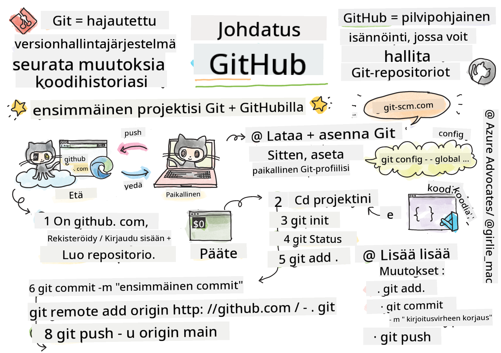
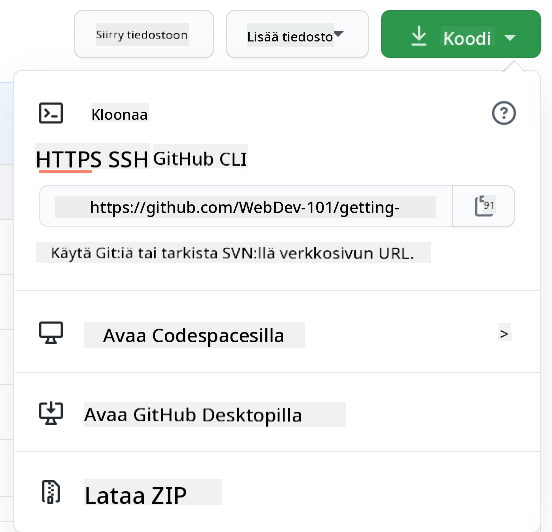

<!--
CO_OP_TRANSLATOR_METADATA:
{
  "original_hash": "05666cecb8983a72cf0ce1d18932b5b7",
  "translation_date": "2025-08-27T20:31:24+00:00",
  "source_file": "1-getting-started-lessons/2-github-basics/README.md",
  "language_code": "fi"
}
-->
# Johdanto GitHubiin

Tässä oppitunnissa käsitellään GitHubin perusteita, joka on alusta koodin isännöintiin ja muutosten hallintaan.


> Sketchnote: [Tomomi Imura](https://twitter.com/girlie_mac)

## Ennakkokysely
[Ennakkokysely](https://ff-quizzes.netlify.app/web/quiz/3)

## Johdanto

Tässä oppitunnissa käsitellään:

- työn seuraamista omalla koneellasi
- projektien tekemistä yhdessä muiden kanssa
- avoimen lähdekoodin ohjelmistojen kehittämistä

### Esivaatimukset

Ennen kuin aloitat, tarkista, onko Git asennettu. Kirjoita terminaaliin:  
`git --version`

Jos Git ei ole asennettu, [lataa Git](https://git-scm.com/downloads). Sen jälkeen määritä paikallinen Git-profiilisi terminaalissa:
* `git config --global user.name "your-name"`
* `git config --global user.email "your-email"`

Voit tarkistaa, onko Git jo määritetty, kirjoittamalla:  
`git config --list`

Tarvitset myös GitHub-tilin, koodieditorin (esim. Visual Studio Code) ja pääsyn terminaaliin (tai komentokehotteeseen).

Siirry osoitteeseen [github.com](https://github.com/) ja luo tili, jos sinulla ei vielä ole sellaista, tai kirjaudu sisään ja täytä profiilisi.

✅ GitHub ei ole ainoa koodivarasto maailmassa; niitä on muitakin, mutta GitHub on tunnetuin.

### Valmistelut

Tarvitset sekä koodiprojektin sisältävän kansion paikallisella koneellasi (kannettava tai PC) että julkisen GitHub-repositorion, joka toimii esimerkkinä siitä, miten voit osallistua muiden projekteihin.

---

## Koodin hallinta

Oletetaan, että sinulla on paikallinen kansio, jossa on koodiprojekti, ja haluat alkaa seurata edistymistäsi käyttämällä git-versiohallintajärjestelmää. Jotkut vertaavat gitin käyttöä rakkauskirjeen kirjoittamiseen tulevaisuuden itsellesi. Kun luet commit-viestejäsi päivien, viikkojen tai kuukausien kuluttua, pystyt muistamaan, miksi teit tietyn päätöksen, tai "perumaan" muutoksen – kunhan kirjoitat hyviä commit-viestejä.

### Tehtävä: Luo repository ja commitoi koodi  

> Katso video  
> 
> [](https://www.youtube.com/watch?v=9R31OUPpxU4)

1. **Luo repository GitHubissa**. GitHub.com-sivustolla, repositories-välilehdellä tai oikean yläkulman navigointipalkista, etsi **new repo** -painike.

   1. Anna repositoryllesi (kansiollesi) nimi.
   1. Valitse **create repository**.

1. **Siirry työskentelykansioon**. Terminaalissa siirry kansioon (tunnetaan myös hakemistona), jota haluat alkaa seurata. Kirjoita:

   ```bash
   cd [name of your folder]
   ```

1. **Alusta git-repository**. Projektissasi kirjoita:

   ```bash
   git init
   ```

1. **Tarkista tila**. Tarkista repositoryn tila kirjoittamalla:

   ```bash
   git status
   ```

   Tuloste voi näyttää tältä:

   ```output
   Changes not staged for commit:
   (use "git add <file>..." to update what will be committed)
   (use "git checkout -- <file>..." to discard changes in working directory)

        modified:   file.txt
        modified:   file2.txt
   ```

   Tyypillisesti `git status` -komento kertoo esimerkiksi, mitkä tiedostot ovat valmiita _tallennettavaksi_ repositoryyn tai sisältävät muutoksia, jotka haluat säilyttää.

1. **Lisää kaikki tiedostot seurattavaksi**  
   Tätä kutsutaan myös tiedostojen "stagingiksi" tai lisäämiseksi staging-alueelle.

   ```bash
   git add .
   ```

   `git add` ja `.` -argumentti tarkoittavat, että kaikki tiedostosi ja muutoksesi lisätään seurattavaksi.

1. **Lisää valitut tiedostot seurattavaksi**

   ```bash
   git add [file or folder name]
   ```

   Tämä auttaa lisäämään vain valitut tiedostot staging-alueelle, kun et halua commitata kaikkia tiedostoja kerralla.

1. **Poista kaikkien tiedostojen staging**

   ```bash
   git reset
   ```

   Tämä komento auttaa poistamaan kaikkien tiedostojen stagingin kerralla.

1. **Poista tietyn tiedoston staging**

   ```bash
   git reset [file or folder name]
   ```

   Tämä komento auttaa poistamaan vain tietyn tiedoston stagingin, jota et halua sisällyttää seuraavaan commit-viestiin.

1. **Työn tallentaminen**. Tässä vaiheessa olet lisännyt tiedostot niin sanotulle _staging-alueelle_. Paikka, jossa Git seuraa tiedostojasi. Muutoksen tekemiseksi pysyväksi sinun täytyy _commitata_ tiedostot. Luo _commit_ käyttämällä `git commit` -komentoa. _Commit_ edustaa tallennuspistettä repositoryn historiassa. Kirjoita seuraava komento luodaksesi _commit_:

   ```bash
   git commit -m "first commit"
   ```

   Tämä commitoi kaikki tiedostosi ja lisää viestin "first commit". Tulevaisuudessa commit-viestien tulisi olla kuvaavampia, jotta ne välittävät, millaisia muutoksia olet tehnyt.

1. **Yhdistä paikallinen Git-repository GitHubiin**. Git-repository on hyödyllinen koneellasi, mutta jossain vaiheessa haluat varmuuskopioida tiedostosi ja kutsua muita ihmisiä työskentelemään kanssasi repositoryssäsi. Yksi loistava paikka tehdä tämä on GitHub. Muista, että olemme jo luoneet repositoryn GitHubissa, joten meidän tarvitsee vain yhdistää paikallinen Git-repository GitHubiin. Komento `git remote add` tekee juuri tämän. Kirjoita seuraava komento:

   > Huomaa, ennen kuin kirjoitat komennon, siirry GitHub-repositoryn sivulle löytääksesi repositoryn URL-osoitteen. Käytä sitä alla olevassa komennossa. Korvaa ```https://github.com/username/repository_name.git``` GitHub-URL-osoitteellasi.

   ```bash
   git remote add origin https://github.com/username/repository_name.git
   ```

   Tämä luo _remote_-yhteyden nimeltä "origin", joka osoittaa aiemmin luomaasi GitHub-repositoryyn.

1. **Lähetä paikalliset tiedostot GitHubiin**. Tähän mennessä olet luonut _yhteyden_ paikallisen repositoryn ja GitHub-repositoryn välille. Lähetä nämä tiedostot GitHubiin seuraavalla komennolla `git push`, kuten näin:

   > Huomaa, haaran nimi voi olla oletuksena eri kuin ```main```.

   ```bash
   git push -u origin main
   ```

   Tämä lähettää commitisi "main"-haaraan GitHubissa.

2. **Lisää lisää muutoksia**. Jos haluat jatkaa muutosten tekemistä ja lähettää niitä GitHubiin, sinun tarvitsee vain käyttää seuraavia kolmea komentoa:

   ```bash
   git add .
   git commit -m "type your commit message here"
   git push
   ```

   > Vinkki: Saatat haluta käyttää `.gitignore`-tiedostoa estääksesi tiedostojen, joita et halua seurata, näkymisen GitHubissa – kuten muistiinpanotiedosto, jota säilytät samassa kansiossa, mutta jolla ei ole paikkaa julkisessa repositoryssä. Löydät `.gitignore`-tiedostojen malleja osoitteesta [.gitignore templates](https://github.com/github/gitignore).

#### Commit-viestit

Hyvä Git commit -aiherivi täydentää seuraavan lauseen:  
Jos tämä commit toteutetaan, se <aiherivisi tähän>

Aiherivissä käytä käskymuotoa ja nykyhetkeä: "muuta" eikä "muutettu" eikä "muuttaa".  
Kuten aiherivissä, myös rungossa (valinnainen) käytä käskymuotoa ja nykyhetkeä. Rungon tulisi sisältää muutoksen motivaatio ja verrata sitä aiempaan käyttäytymiseen. Selität `miksi`, et `miten`.

✅ Käytä muutama minuutti GitHubissa surffaamiseen. Löydätkö todella hyvän commit-viestin? Löydätkö todella minimaalisen? Mitä tietoa mielestäsi on tärkeintä ja hyödyllisintä välittää commit-viestissä?

### Tehtävä: Tee yhteistyötä

GitHubiin tiedostojen laittamisen pääsyy oli mahdollistaa yhteistyö muiden kehittäjien kanssa.

## Työskentely projekteissa muiden kanssa

> Katso video  
>
> [](https://www.youtube.com/watch?v=bFCM-PC3cu8)

Repositoryssäsi siirry kohtaan `Insights > Community` nähdäksesi, miten projektisi vertautuu suositeltuihin yhteisön standardeihin.

   Tässä on joitain asioita, jotka voivat parantaa GitHub-repositoryäsi:
   - **Kuvaus**. Lisäsitkö projektillesi kuvauksen?
   - **README**. Lisäsitkö README-tiedoston? GitHub tarjoaa ohjeita [README-tiedoston kirjoittamiseen](https://docs.github.com/articles/about-readmes/?WT.mc_id=academic-77807-sagibbon).
   - **Ohjeet osallistumiseen**. Onko projektissasi [ohjeet osallistumiseen](https://docs.github.com/articles/setting-guidelines-for-repository-contributors/?WT.mc_id=academic-77807-sagibbon)?
   - **Toimintaohjeet**. Onko projektissasi [toimintaohjeet](https://docs.github.com/articles/adding-a-code-of-conduct-to-your-project/)?
   - **Lisenssi**. Ehkä tärkeimpänä, onko projektissasi [lisenssi](https://docs.github.com/articles/adding-a-license-to-a-repository/)?

Kaikki nämä resurssit hyödyttävät uusien tiimin jäsenten perehdyttämistä. Ja nämä ovat tyypillisesti asioita, joita uudet osallistujat tarkastelevat ennen kuin edes katsovat koodiasi, selvittääkseen, onko projektisi oikea paikka heidän ajankäytölleen.

✅ README-tiedostot, vaikka niiden valmistelu vie aikaa, jäävät usein kiireisten ylläpitäjien huomiotta. Löydätkö esimerkin erityisen kuvaavasta README-tiedostosta? Huomaa: on olemassa joitain [työkaluja hyvien README-tiedostojen luomiseen](https://www.makeareadme.com/), joita saatat haluta kokeilla.

### Tehtävä: Yhdistä koodia

Osallistumisohjeet auttavat ihmisiä osallistumaan projektiin. Ne selittävät, millaisia osallistumisia etsit ja miten prosessi toimii. Osallistujien täytyy käydä läpi sarja vaiheita voidakseen osallistua repositoryysi GitHubissa:

1. **Forkkaa repositorysi**. Haluat todennäköisesti ihmisten _forkkaavan_ projektisi. Forkkaaminen tarkoittaa repositoryn kopion luomista heidän GitHub-profiiliinsa.
1. **Kloonaa**. Tämän jälkeen he kloonaavat projektin paikalliselle koneelleen.
1. **Luo haara**. Pyydä heitä luomaan _haara_ työlleen.
1. **Keskity yhteen alueeseen**. Pyydä osallistujia keskittymään yhteen asiaan kerrallaan – näin mahdollisuudet, että voit _yhdistää_ heidän työnsä, ovat suuremmat. Kuvittele, että he korjaavat virheen, lisäävät uuden ominaisuuden ja päivittävät useita testejä – entä jos haluat tai voit toteuttaa vain 2/3 tai 1/3 muutoksista?

✅ Kuvittele tilanne, jossa haarat ovat erityisen kriittisiä hyvän koodin kirjoittamisessa ja julkaisemisessa. Mitä käyttötapauksia voit keksiä?

> Huomaa, ole muutos, jonka haluat nähdä maailmassa, ja luo haaroja myös omalle työllesi. Kaikki commitit, jotka teet, tehdään haarassa, jossa olet tällä hetkellä "checkoutattuna". Käytä `git status` nähdäksesi, missä haarassa olet.

Käydään läpi osallistujan työnkulku. Oletetaan, että osallistuja on jo _forkannut_ ja _kloonannut_ repositoryn, joten heillä on Git-repository valmiina työstettäväksi paikallisella koneellaan:

1. **Luo haara**. Käytä komentoa `git branch` luodaksesi haaran, joka sisältää muutokset, joita he aikovat kontribuoida:

   ```bash
   git branch [branch-name]
   ```

1. **Vaihda työhaaraan**. Vaihda määritettyyn haaraan ja päivitä työhakemisto `git switch` -komennolla:

   ```bash
   git switch [branch-name]
   ```

1. **Tee työtä**. Tässä vaiheessa haluat lisätä muutoksesi. Älä unohda kertoa Gitille niistä seuraavilla komennoilla:

   ```bash
   git add .
   git commit -m "my changes"
   ```

   Varmista, että annat commitille hyvän nimen, omaksi hyödyksesi sekä repositoryn ylläpitäjän hyödyksi, jota autat.

1. **Yhdistä työsi `main`-haaraan**. Jossain vaiheessa olet valmis työskentelemään ja haluat yhdistää työsi `main`-haaraan. `Main`-haara on saattanut muuttua sillä välin, joten varmista, että päivität sen ensin uusimpaan versioon seuraavilla komennoilla:

   ```bash
   git switch main
   git pull
   ```

   Tässä vaiheessa haluat varmistaa, että mahdolliset _konfliktit_, tilanteet, joissa Git ei voi helposti _yhdistää_ muutoksia, tapahtuvat työhaarassasi. Siksi suorita seuraavat komennot:

   ```bash
   git switch [branch_name]
   git merge main
   ```

   Tämä tuo kaikki muutokset `main`-haarasta haaraasi, ja toivottavasti voit jatkaa. Jos et voi, VS Code kertoo, missä Git on _epävarma_, ja muokkaat kyseisiä tiedostoja ilmoittaaksesi, mikä sisältö on tarkin.

1. **Lähetä työsi GitHubiin**. Työsi lähettäminen GitHubiin tarkoittaa kahta asiaa: haaran työntämistä repositoryysi ja PR:n (Pull Request) avaamista.

   ```bash
   git push --set-upstream origin [branch-name]
   ```

   Yllä oleva komento luo haaran forkatussa repositoryssäsi.

1. **Avaa PR**. Seuraavaksi haluat avata PR:n. Siirry forkattuun repositoryyn GitHubissa. Näet GitHubissa ilmoituksen, jossa kysytään, haluatko luoda uuden PR:n. Klikkaa sitä, ja sinut ohjataan käyttöliittymään, jossa voit muuttaa commit-viestin otsikkoa ja antaa sille sopivamman kuvauksen. Nyt repositoryn ylläpitäjä, jonka forkkasit, näkee tämän PR:n ja _sormet ristissä_ arvostaa ja _yhdistää_ PR:si. Olet nyt kontribuoija, jee :)

1. **Siivoa**. On hyvä tapa _siivota_ onnistuneen PR:n yhdistämisen jälkeen. Haluat siivota sekä paikallisen haaran että haaran, jonka työnsit GitHubiin. Poista se ensin paikallisesti seuraavalla komennolla:

   ```bash
   git branch -d [branch-name]
   ```
Varmista, että siirryt forkattuun reposi GitHub-sivulle ja poistat etähaaran, jonka juuri työnsit sinne.

`Pull request` voi kuulostaa hassulta termiltä, koska oikeastaan haluat työntää muutoksesi projektiin. Mutta ylläpitäjän (projektin omistajan) tai ydintiimin täytyy harkita muutoksiasi ennen kuin ne yhdistetään projektin "päähaaraan", joten oikeastaan pyydät ylläpitäjältä päätöstä muutoksesta.

Pull request on paikka, jossa voidaan vertailla ja keskustella haaran tuomista eroista arvostelujen, kommenttien, integroituja testien ja muiden työkalujen avulla. Hyvä pull request noudattaa suurin piirtein samoja sääntöjä kuin commit-viesti. Voit lisätä viittauksen ongelmaan issue trackerissa, esimerkiksi kun työsi korjaa jonkin ongelman. Tämä tehdään käyttämällä `#`-merkkiä ja ongelman numeroa. Esimerkiksi `#97`.

🤞Toivotaan, että kaikki tarkistukset menevät läpi ja projektin omistaja(t) yhdistävät muutoksesi projektiin🤞

Päivitä nykyinen paikallinen työhaara kaikilla uusilla commit-viesteillä vastaavasta etähaarasta GitHubissa:

`git pull`

## Kuinka osallistua avoimen lähdekoodin projekteihin

Aloitetaan etsimällä GitHubista sinua kiinnostava repository (tai **repo**), johon haluaisit tehdä muutoksen. Haluat kopioida sen sisällön koneellesi.

✅ Hyvä tapa löytää 'aloittelijaystävällisiä' repoja on [etsiä tagilla 'good-first-issue'](https://github.blog/2020-01-22-browse-good-first-issues-to-start-contributing-to-open-source/).



Koodin kopioimiseen on useita tapoja. Yksi tapa on "klonata" repositoryn sisältö HTTPS:n, SSH:n tai GitHub CLI:n (Command Line Interface) avulla.

Avaa terminaali ja kloonaa repository näin:
`git clone https://github.com/ProjectURL`

Työskentelyä varten siirry oikeaan kansioon:
`cd ProjectURL`

Voit myös avata koko projektin käyttämällä [Codespacesia](https://github.com/features/codespaces), GitHubin sisäänrakennettua koodieditoria/pilvikehitysympäristöä, tai [GitHub Desktopia](https://desktop.github.com/).

Lopuksi voit ladata koodin zipattuna kansiona.

### Muutama mielenkiintoinen asia GitHubista

Voit tähdittää, seurata ja/tai "forkata" minkä tahansa julkisen repositoryn GitHubissa. Löydät tähdittämäsi repositoryt oikean yläkulman pudotusvalikosta. Se on kuin kirjanmerkin lisääminen, mutta koodille.

Projekteilla on issue tracker, yleensä GitHubissa "Issues"-välilehdellä, ellei toisin mainita, jossa ihmiset keskustelevat projektiin liittyvistä ongelmista. Pull Requests -välilehdellä ihmiset keskustelevat ja arvioivat meneillään olevia muutoksia.

Projekteilla voi myös olla keskusteluja foorumeilla, postituslistoilla tai keskustelukanavilla, kuten Slack, Discord tai IRC.

✅ Tutustu uuteen GitHub-repoosi ja kokeile muutamia asioita, kuten asetusten muokkaamista, tiedon lisäämistä repoosi ja projektin luomista (esim. Kanban-taulu). GitHubissa on paljon mahdollisuuksia!

---

## 🚀 Haaste

Työskentele yhdessä ystävän kanssa toistenne koodin parissa. Luo projekti yhteistyössä, forkkaa koodi, luo haaroja ja yhdistä muutoksia.

## Luentojälkeinen kysely
[Luentojälkeinen kysely](https://ff-quizzes.netlify.app/web/quiz/4)

## Kertaus ja itseopiskelu

Lue lisää [avoimen lähdekoodin projekteihin osallistumisesta](https://opensource.guide/how-to-contribute/#how-to-submit-a-contribution).

[Git-pikaopas](https://training.github.com/downloads/github-git-cheat-sheet/).

Harjoittele, harjoittele, harjoittele. GitHubilla on loistavia oppimispolkuja saatavilla osoitteessa [skills.github.com](https://skills.github.com):

- [Ensimmäinen viikko GitHubissa](https://skills.github.com/#first-week-on-github)

Löydät myös edistyneempiä kursseja.

## Tehtävä

Suorita [Ensimmäinen viikko GitHubissa -kurssi](https://skills.github.com/#first-week-on-github)

---

**Vastuuvapauslauseke**:  
Tämä asiakirja on käännetty käyttämällä tekoälypohjaista käännöspalvelua [Co-op Translator](https://github.com/Azure/co-op-translator). Vaikka pyrimme tarkkuuteen, huomioithan, että automaattiset käännökset voivat sisältää virheitä tai epätarkkuuksia. Alkuperäinen asiakirja sen alkuperäisellä kielellä tulisi pitää ensisijaisena lähteenä. Kriittisen tiedon osalta suositellaan ammattimaista ihmiskäännöstä. Emme ole vastuussa väärinkäsityksistä tai virhetulkinnoista, jotka johtuvat tämän käännöksen käytöstä.