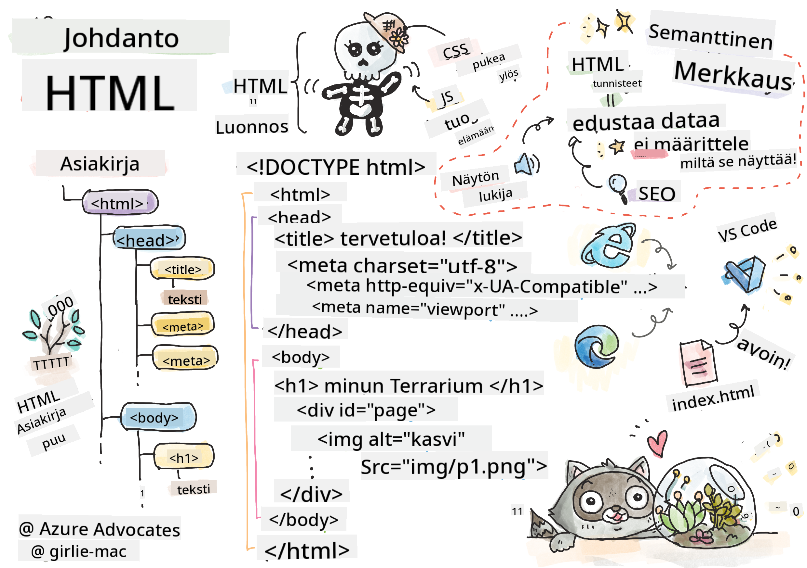
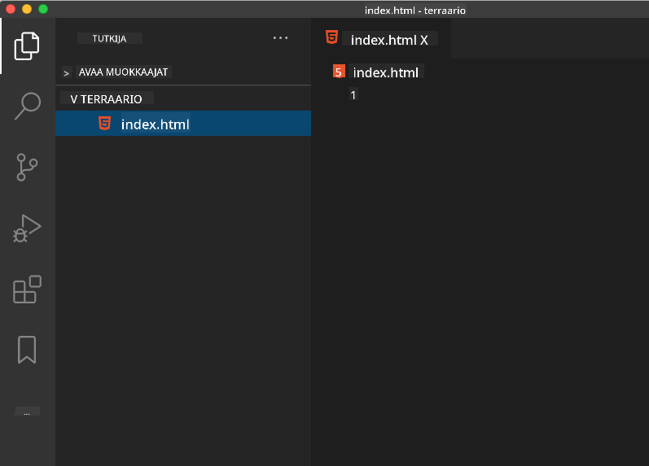

<!--
CO_OP_TRANSLATOR_METADATA:
{
  "original_hash": "46a0639e719b9cf1dfd062aa24cad639",
  "translation_date": "2025-08-27T20:05:09+00:00",
  "source_file": "3-terrarium/1-intro-to-html/README.md",
  "language_code": "fi"
}
-->
# Terrarium-projekti Osa 1: Johdatus HTML:ään

  
> Sketchnote: [Tomomi Imura](https://twitter.com/girlie_mac)

## Ennakkokysely

[Ennakkokysely](https://ashy-river-0debb7803.1.azurestaticapps.net/quiz/15)

> Katso video

> 
> [](https://www.youtube.com/watch?v=1TvxJKBzhyQ)

### Johdanto

HTML eli HyperText Markup Language on verkkosivujen "luuranko". Jos CSS "pukee" HTML:n ja JavaScript tuo sen eloon, HTML on verkkosovelluksesi runko. HTML:n syntaksi heijastaa tätä ajatusta, sillä se sisältää "head"-, "body"- ja "footer"-tagit.

Tässä oppitunnissa käytämme HTML:ää rakentaaksemme virtuaalisen terraariomme käyttöliittymän "luurangon". Siinä on otsikko ja kolme saraketta: oikea ja vasen sarake, joissa siirrettävät kasvit sijaitsevat, sekä keskialue, joka toimii lasimaisena terraariona. Tämän oppitunnin lopussa näet kasvit sarakkeissa, mutta käyttöliittymä näyttää hieman oudolta; älä huoli, seuraavassa osiossa lisäät CSS-tyylejä, jotta käyttöliittymä näyttää paremmalta.

### Tehtävä

Luo tietokoneellesi kansio nimeltä 'terrarium' ja sen sisälle tiedosto nimeltä 'index.html'. Voit tehdä tämän Visual Studio Codessa avaamalla uuden VS Code -ikkunan, klikkaamalla 'open folder' ja navigoimalla uuteen kansioosi. Klikkaa pientä 'file'-painiketta Explorer-paneelissa ja luo uusi tiedosto:



Tai

Käytä näitä komentoja git bashissa:  
* `mkdir terrarium`  
* `cd terrarium`  
* `touch index.html`  
* `code index.html` tai `nano index.html`

> index.html-tiedostot kertovat selaimelle, että kyseessä on kansion oletustiedosto; URL-osoitteet, kuten `https://anysite.com/test`, voivat perustua kansiorakenteeseen, jossa on kansio nimeltä `test` ja sen sisällä `index.html`; `index.html` ei välttämättä näy URL-osoitteessa.

---

## DocType ja html-tagit

HTML-tiedoston ensimmäinen rivi on sen doctype. On hieman yllättävää, että tämä rivi täytyy olla aivan tiedoston yläosassa, mutta se kertoo vanhemmille selaimille, että sivu täytyy renderöidä standarditilassa nykyisen HTML-spesifikaation mukaisesti.

> Vinkki: VS Codessa voit viedä hiiren tagin päälle ja saada tietoa sen käytöstä MDN Reference -oppaista.

Toinen rivi on `<html>`-tagin avaus, jota seuraa sen sulkeva tagi `</html>`. Nämä tagit ovat käyttöliittymäsi juurielementit.

### Tehtävä

Lisää nämä rivit `index.html`-tiedostosi alkuun:

```HTML
<!DOCTYPE html>
<html></html>
```

✅ On olemassa muutamia eri tiloja, jotka voidaan määrittää asettamalla DocType kyselymerkkijonolla: [Quirks Mode ja Standards Mode](https://developer.mozilla.org/docs/Web/HTML/Quirks_Mode_and_Standards_Mode). Näitä tiloja käytettiin tukemaan todella vanhoja selaimia, joita ei nykyään juuri käytetä (kuten Netscape Navigator 4 ja Internet Explorer 5). Voit pysyä standardin doctype-määrittelyn käytössä.

---

## Dokumentin 'head'

HTML-dokumentin 'head'-alue sisältää tärkeitä tietoja verkkosivustasi, joita kutsutaan myös [metatiedoiksi](https://developer.mozilla.org/docs/Web/HTML/Element/meta). Meidän tapauksessamme kerromme verkkopalvelimelle, jolle tämä sivu lähetetään renderöitäväksi, nämä neljä asiaa:

-   sivun otsikko  
-   sivun metatiedot, mukaan lukien:  
    -   'merkistö', joka kertoo, mitä merkistökoodausta sivulla käytetään  
    -   selaintiedot, mukaan lukien `x-ua-compatible`, joka osoittaa, että IE=edge-selain on tuettu  
    -   tietoa siitä, miten näkymäportin tulisi käyttäytyä, kun se ladataan. Näkymäportin asettaminen alkuperäiseen mittakaavaan 1 hallitsee zoomaustasoa, kun sivu ladataan ensimmäisen kerran.

### Tehtävä

Lisää 'head'-lohko dokumenttiisi `<html>`-tagien väliin.

```html
<head>
	<title>Welcome to my Virtual Terrarium</title>
	<meta charset="utf-8" />
	<meta http-equiv="X-UA-Compatible" content="IE=edge" />
	<meta name="viewport" content="width=device-width, initial-scale=1" />
</head>
```

✅ Mitä tapahtuisi, jos asettaisit näkymäportin meta-tagin näin: `<meta name="viewport" content="width=600">`? Lue lisää [näkymäportista](https://developer.mozilla.org/docs/Web/HTML/Viewport_meta_tag).

---

## Dokumentin `body`

### HTML-tagit

HTML:ssä lisäät tageja .html-tiedostoosi luodaksesi verkkosivun elementtejä. Jokaisella tagilla on yleensä avaus- ja sulkutagi, kuten tämä: `<p>hello</p>` kappaleen merkitsemiseksi. Luo käyttöliittymäsi runko lisäämällä `<body>`-tagit `<html>`-tagiparin sisään; merkintäsi näyttää nyt tältä:

### Tehtävä

```html
<!DOCTYPE html>
<html>
	<head>
		<title>Welcome to my Virtual Terrarium</title>
		<meta charset="utf-8" />
		<meta http-equiv="X-UA-Compatible" content="IE=edge" />
		<meta name="viewport" content="width=device-width, initial-scale=1" />
	</head>
	<body></body>
</html>
```

Nyt voit alkaa rakentaa sivuasi. Yleensä käytät `<div>`-tageja luodaksesi erillisiä elementtejä sivulle. Luomme sarjan `<div>`-elementtejä, jotka sisältävät kuvia.

### Kuvat

Yksi HTML-tagi, joka ei tarvitse sulkutagia, on ``-tagi, koska sillä on `src`-elementti, joka sisältää kaiken tarvittavan tiedon kohteen renderöimiseksi.

Luo sovellukseesi kansio nimeltä `images` ja lisää siihen kaikki kuvat [lähdekoodikansiosta](../../../../3-terrarium/solution/images); (siellä on 14 kasvikuvan tiedostoa).

### Tehtävä

Lisää nämä kasvikuvat kahteen sarakkeeseen `<body></body>`-tagien väliin:

```html
<div id="page">
	<div id="left-container" class="container">
		<div class="plant-holder">
			
		</div>
		<div class="plant-holder">
			
		</div>
		<div class="plant-holder">
			
		</div>
		<div class="plant-holder">
			
		</div>
		<div class="plant-holder">
			
		</div>
		<div class="plant-holder">
			
		</div>
		<div class="plant-holder">
			
		</div>
	</div>
	<div id="right-container" class="container">
		<div class="plant-holder">
			
		</div>
		<div class="plant-holder">
			
		</div>
		<div class="plant-holder">
			
		</div>
		<div class="plant-holder">
			
		</div>
		<div class="plant-holder">
			
		</div>
		<div class="plant-holder">
			
		</div>
		<div class="plant-holder">
			
		</div>
	</div>
</div>
```

> Huom: Spanit vs. Divit. Divit ovat 'block'-elementtejä, ja Spanit ovat 'inline'-elementtejä. Mitä tapahtuisi, jos muuttaisit nämä divit spaneiksi?

Näillä merkinnöillä kasvit näkyvät nyt ruudulla. Ne näyttävät melko huonoilta, koska niitä ei ole vielä tyylitelty CSS:llä, mutta teemme sen seuraavassa oppitunnissa.

Jokaisella kuvalla on alt-teksti, joka näkyy, vaikka et voisi nähdä tai renderöidä kuvaa. Tämä on tärkeä ominaisuus saavutettavuuden kannalta. Opit lisää saavutettavuudesta tulevissa oppitunneissa; toistaiseksi muista, että alt-attribuutti tarjoaa vaihtoehtoista tietoa kuvalle, jos käyttäjä ei jostain syystä voi nähdä sitä (hitaan yhteyden, src-attribuutin virheen tai ruudunlukijan käytön vuoksi).

✅ Huomasitko, että jokaisella kuvalla on sama alt-tagi? Onko tämä hyvä käytäntö? Miksi tai miksi ei? Voitko parantaa tätä koodia?

---

## Semanttinen merkintä

Yleisesti ottaen on suositeltavaa käyttää merkityksellistä 'semantiikkaa', kun kirjoitat HTML:ää. Mitä tämä tarkoittaa? Se tarkoittaa, että käytät HTML-tageja edustamaan sitä tietotyyppiä tai vuorovaikutusta, johon ne on suunniteltu. Esimerkiksi sivun pääotsikkotekstin tulisi käyttää `<h1>`-tagia.

Lisää seuraava rivi heti avaus-`<body>`-tagisi alle:

```html
<h1>My Terrarium</h1>
```

Semanttisen merkinnän käyttäminen, kuten otsikoiden merkitseminen `<h1>`-tageilla ja järjestämättömien listojen merkitseminen `<ul>`-tageilla, auttaa ruudunlukijoita navigoimaan sivulla. Yleisesti ottaen painikkeet tulisi kirjoittaa `<button>`-tageina ja listat `<li>`-tageina. Vaikka on _mahdollista_ käyttää erityisesti tyyliteltyjä `<span>`-elementtejä klikkaustoimintojen kanssa painikkeiden jäljittelemiseksi, on parempi, että vammaiset käyttäjät voivat käyttää teknologioita määrittämään, missä painike sijaitsee sivulla ja vuorovaikuttamaan sen kanssa, jos elementti näkyy painikkeena. Tästä syystä yritä käyttää semanttista merkintää mahdollisimman paljon.

✅ Katso ruudunlukijaa ja [miten se vuorovaikuttaa verkkosivun kanssa](https://www.youtube.com/watch?v=OUDV1gqs9GA). Näetkö, miksi epäsemanttinen merkintä saattaisi turhauttaa käyttäjää?

## Terraario

Käyttöliittymän viimeinen osa sisältää merkinnän, joka tyylitellään terraarioksi.

### Tehtävä:

Lisää tämä merkintä viimeisen `</div>`-tagin yläpuolelle:

```html
<div id="terrarium">
	<div class="jar-top"></div>
	<div class="jar-walls">
		<div class="jar-glossy-long"></div>
		<div class="jar-glossy-short"></div>
	</div>
	<div class="dirt"></div>
	<div class="jar-bottom"></div>
</div>
```

✅ Vaikka lisäsit tämän merkinnän ruudulle, et näe mitään renderöityvän. Miksi?

---

## 🚀Haaste

HTML:ssä on joitakin vanhoja "villikortti"-tageja, joita on edelleen hauska kokeilla, vaikka sinun ei pitäisi käyttää vanhentuneita tageja, kuten [näitä tageja](https://developer.mozilla.org/docs/Web/HTML/Element#Obsolete_and_deprecated_elements) merkinnöissäsi. Voitko käyttää vanhaa `<marquee>`-tagia saadaksesi h1-otsikon vierimään vaakasuunnassa? (jos teet sen, muista poistaa se myöhemmin)

## Jälkikysely

[Jälkikysely](https://ashy-river-0debb7803.1.azurestaticapps.net/quiz/16)

## Kertaus ja itseopiskelu

HTML on "koeteltu ja hyväksi havaittu" rakennusjärjestelmä, joka on auttanut rakentamaan verkon sellaiseksi kuin se on tänään. Opi hieman sen historiasta tutkimalla vanhoja ja uusia tageja. Voitko selvittää, miksi jotkut tagit vanhentuivat ja toiset lisättiin? Mitä tageja voisi tulla tulevaisuudessa?

Lisätietoja verkkosivustojen ja mobiililaitteille suunnattujen sivustojen rakentamisesta löydät [Microsoft Learnista](https://docs.microsoft.com/learn/modules/build-simple-website/?WT.mc_id=academic-77807-sagibbon).

## Tehtävä

[Harjoittele HTML:ää: Rakenna blogin mallipohja](assignment.md)

---

**Vastuuvapauslauseke**:  
Tämä asiakirja on käännetty käyttämällä tekoälypohjaista käännöspalvelua [Co-op Translator](https://github.com/Azure/co-op-translator). Vaikka pyrimme tarkkuuteen, huomioithan, että automaattiset käännökset voivat sisältää virheitä tai epätarkkuuksia. Alkuperäistä asiakirjaa sen alkuperäisellä kielellä tulisi pitää ensisijaisena lähteenä. Kriittisen tiedon osalta suositellaan ammattimaista ihmiskäännöstä. Emme ole vastuussa tämän käännöksen käytöstä johtuvista väärinkäsityksistä tai virhetulkinnoista.