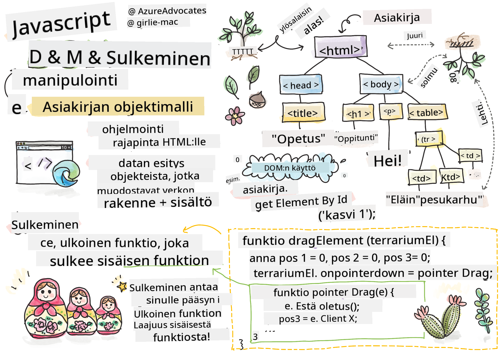
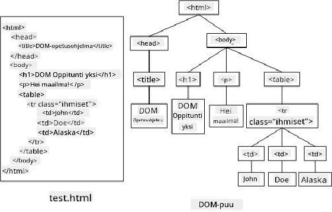

<!--
CO_OP_TRANSLATOR_METADATA:
{
  "original_hash": "30f8903a1f290e3d438dc2c70fe60259",
  "translation_date": "2025-08-27T20:07:02+00:00",
  "source_file": "3-terrarium/3-intro-to-DOM-and-closures/README.md",
  "language_code": "fi"
}
-->
# Terrarium-projekti Osa 3: DOM-manipulointi ja sulkeuma


> Sketchnote: [Tomomi Imura](https://twitter.com/girlie_mac)

## Ennakkokysely

[Ennakkokysely](https://ashy-river-0debb7803.1.azurestaticapps.net/quiz/19)

### Johdanto

DOM-manipulointi eli "Document Object Modelin" käsittely on keskeinen osa verkkokehitystä. [MDN:n](https://developer.mozilla.org/docs/Web/API/Document_Object_Model/Introduction) mukaan "Document Object Model (DOM) on verkkosivun rakenteen ja sisällön muodostavien objektien tietoesitys." DOM-manipuloinnin haasteet ovat usein johtaneet siihen, että JavaScript-kehyksiä käytetään sen hallintaan sen sijaan, että käytettäisiin pelkkää JavaScriptiä. Tässä projektissa pärjäämme kuitenkin ilman kehyksiä!

Lisäksi tässä oppitunnissa esitellään [JavaScript-sulkeuma](https://developer.mozilla.org/docs/Web/JavaScript/Closures), jonka voi ajatella olevan funktio, joka on suljettu toisen funktion sisään, jolloin sisempi funktio pääsee käsiksi ulomman funktion laajuuteen.

> JavaScript-sulkeumat ovat laaja ja monimutkainen aihe. Tässä oppitunnissa käsitellään perusidea, jossa terrariumin koodissa on sulkeuma: sisempi funktio ja ulompi funktio on rakennettu siten, että sisempi funktio pääsee käsiksi ulomman funktion laajuuteen. Lisätietoja aiheesta löytyy [laajasta dokumentaatiosta](https://developer.mozilla.org/docs/Web/JavaScript/Closures).

Käytämme sulkeumaa DOM-manipulointiin.

Ajattele DOM:ia puuna, joka edustaa kaikkia tapoja, joilla verkkosivun dokumenttia voidaan manipuloida. Erilaisia API:ja (Application Program Interfaces) on kirjoitettu, jotta ohjelmoijat voivat käyttää DOM:ia ja muokata, järjestellä ja hallita sitä haluamallaan tavalla.



> DOM:n ja siihen viittaavan HTML-merkinnän esitys. Lähde: [Olfa Nasraoui](https://www.researchgate.net/publication/221417012_Profile-Based_Focused_Crawler_for_Social_Media-Sharing_Websites)

Tässä oppitunnissa viimeistelemme interaktiivisen terrarium-projektimme luomalla JavaScriptin, joka mahdollistaa kasvien siirtämisen sivulla.

### Esitietovaatimukset

Sinulla tulisi olla terrariumin HTML ja CSS valmiina. Oppitunnin lopussa pystyt siirtämään kasveja terrariumiin ja sieltä pois vetämällä niitä.

### Tehtävä

Luo terrarium-kansioon uusi tiedosto nimeltä `script.js`. Tuo tämä tiedosto `<head>`-osioon:

```html
	<script src="./script.js" defer></script>
```

> Huomio: käytä `defer`-attribuuttia tuodessasi ulkoista JavaScript-tiedostoa HTML-tiedostoon, jotta JavaScript suoritetaan vasta, kun HTML-tiedosto on täysin ladattu. Voisit myös käyttää `async`-attribuuttia, joka sallii skriptin suorittamisen HTML-tiedoston jäsentämisen aikana, mutta tässä tapauksessa on tärkeää, että HTML-elementit ovat täysin saatavilla ennen kuin vetämistoiminto suoritetaan.
---

## DOM-elementit

Ensimmäinen tehtäväsi on luoda viittaukset DOM:n elementteihin, joita haluat manipuloida. Meidän tapauksessamme nämä ovat 14 kasvia, jotka odottavat sivupalkissa.

### Tehtävä

```html
dragElement(document.getElementById('plant1'));
dragElement(document.getElementById('plant2'));
dragElement(document.getElementById('plant3'));
dragElement(document.getElementById('plant4'));
dragElement(document.getElementById('plant5'));
dragElement(document.getElementById('plant6'));
dragElement(document.getElementById('plant7'));
dragElement(document.getElementById('plant8'));
dragElement(document.getElementById('plant9'));
dragElement(document.getElementById('plant10'));
dragElement(document.getElementById('plant11'));
dragElement(document.getElementById('plant12'));
dragElement(document.getElementById('plant13'));
dragElement(document.getElementById('plant14'));
```

Mitä tässä tapahtuu? Viittaat dokumenttiin ja etsit sen DOM:ista elementin, jolla on tietty Id. Muista, että ensimmäisessä HTML-oppitunnissa annoit yksilölliset Id:t jokaiselle kasvikuvalle (`id="plant1"`). Nyt hyödynnät tätä työtä. Kun olet tunnistanut jokaisen elementin, välität sen funktiolle nimeltä `dragElement`, jonka rakennat hetken kuluttua. Näin HTML-elementti on nyt vedettävissä, tai tulee olemaan pian.

✅ Miksi viittaamme elementteihin Id:n avulla? Miksi emme CSS-luokan avulla? Voit palata edelliseen CSS-oppituntiin vastataksesi tähän kysymykseen.

---

## Sulkeuma

Nyt olet valmis luomaan `dragElement`-sulkeuman, joka on ulompi funktio, joka sulkee sisemmän funktion tai funktiot (meidän tapauksessamme kolme).

Sulkeumat ovat hyödyllisiä, kun yksi tai useampi funktio tarvitsee pääsyn ulomman funktion laajuuteen. Tässä esimerkki:

```javascript
function displayCandy(){
	let candy = ['jellybeans'];
	function addCandy(candyType) {
		candy.push(candyType)
	}
	addCandy('gumdrops');
}
displayCandy();
console.log(candy)
```

Tässä esimerkissä `displayCandy`-funktio ympäröi funktion, joka lisää uuden karkkityypin jo olemassa olevaan taulukkoon. Jos suorittaisit tämän koodin, `candy`-taulukko olisi määrittelemätön, koska se on paikallinen muuttuja (paikallinen sulkeumalle).

✅ Kuinka voit tehdä `candy`-taulukosta saavutettavan? Kokeile siirtää se sulkeuman ulkopuolelle. Näin taulukosta tulee globaali, eikä se jää vain sulkeuman paikalliseen laajuuteen.

### Tehtävä

Luo `script.js`-tiedostoon funktio elementtien määrittelyjen alle:

```javascript
function dragElement(terrariumElement) {
	//set 4 positions for positioning on the screen
	let pos1 = 0,
		pos2 = 0,
		pos3 = 0,
		pos4 = 0;
	terrariumElement.onpointerdown = pointerDrag;
}
```

`dragElement` saa `terrariumElement`-objektinsa skriptin yläosassa tehdyistä määrittelyistä. Sitten asetat joitakin paikallisia sijainteja `0`:ksi funktiolle välitetylle objektille. Nämä ovat paikallisia muuttujia, joita manipuloidaan jokaiselle elementille, kun lisäät vetämis- ja pudotustoiminnallisuutta sulkeuman sisällä. Terrarium täytetään näillä vedettävillä elementeillä, joten sovelluksen täytyy pitää kirjaa siitä, mihin ne sijoitetaan.

Lisäksi funktiolle välitetty `terrariumElement`-objekti saa `pointerdown`-tapahtuman, joka on osa [web API:ja](https://developer.mozilla.org/docs/Web/API), jotka on suunniteltu auttamaan DOM:n hallinnassa. `onpointerdown` aktivoituu, kun painiketta painetaan, tai meidän tapauksessamme, kun vedettävää elementtiä kosketetaan. Tämä tapahtumankäsittelijä toimii sekä [web- että mobiiliselaimissa](https://caniuse.com/?search=onpointerdown), muutamia poikkeuksia lukuun ottamatta.

✅ [Tapahtumankäsittelijä `onclick`](https://developer.mozilla.org/docs/Web/API/GlobalEventHandlers/onclick) on paljon laajemmin tuettu eri selaimissa; miksi et käyttäisi sitä tässä? Mieti tarkasti, millaista ruutukosketusta yrität luoda tässä.

---

## Pointerdrag-funktio

`terrariumElement` on valmis vedettäväksi; kun `onpointerdown`-tapahtuma aktivoituu, funktio `pointerDrag` kutsutaan. Lisää tämä funktio heti tämän rivin alle: `terrariumElement.onpointerdown = pointerDrag;`:

### Tehtävä 

```javascript
function pointerDrag(e) {
	e.preventDefault();
	console.log(e);
	pos3 = e.clientX;
	pos4 = e.clientY;
}
```

Useita asioita tapahtuu. Ensinnäkin estät oletustapahtumat, jotka normaalisti tapahtuvat pointerdown-tapahtumassa, käyttämällä `e.preventDefault();`. Näin sinulla on enemmän hallintaa käyttöliittymän käyttäytymisestä.

> Palaa tähän riviin, kun olet rakentanut skriptitiedoston kokonaan, ja kokeile ilman `e.preventDefault()` - mitä tapahtuu?

Toiseksi, avaa `index.html` selaimessa ja tarkastele käyttöliittymää. Kun napsautat kasvia, näet kuinka 'e'-tapahtuma tallennetaan. Tutki tapahtumaa nähdäksesi, kuinka paljon tietoa kerätään yhdestä pointerdown-tapahtumasta!  

Seuraavaksi huomaa, kuinka paikalliset muuttujat `pos3` ja `pos4` asetetaan arvoon e.clientX. Voit löytää `e`-arvot tarkastelupaneelista. Nämä arvot tallentavat kasvin x- ja y-koordinaatit sillä hetkellä, kun napsautat tai kosketat sitä. Tarvitset tarkkaa hallintaa kasvien käyttäytymisestä, kun napsautat ja vedät niitä, joten pidät kirjaa niiden koordinaateista.

✅ Alkaako olla selvempää, miksi koko sovellus rakennetaan yhdellä suurella sulkeumalla? Jos ei olisi, kuinka ylläpitäisit laajuutta jokaiselle 14 vedettävälle kasville?

Täydennä alkuperäinen funktio lisäämällä kaksi muuta pointer-tapahtumien käsittelyä `pos4 = e.clientY`-rivin alle:

```html
document.onpointermove = elementDrag;
document.onpointerup = stopElementDrag;
```
Nyt ilmoitat, että haluat kasvin liikkuvan osoittimen mukana, kun siirrät sitä, ja että vetämisliike pysähtyy, kun lopetat kasvin valinnan. `onpointermove` ja `onpointerup` ovat kaikki osa samaa API:ta kuin `onpointerdown`. Käyttöliittymä heittää nyt virheitä, koska et ole vielä määritellyt `elementDrag`- ja `stopElementDrag`-funktioita, joten rakenna ne seuraavaksi.

## elementDrag- ja stopElementDrag-funktiot

Täydennät sulkeumasi lisäämällä kaksi sisäistä funktiota, jotka käsittelevät, mitä tapahtuu, kun vedät kasvia ja lopetat sen vetämisen. Haluttu käyttäytyminen on, että voit vetää mitä tahansa kasvia milloin tahansa ja sijoittaa sen mihin tahansa ruudulla. Tämä käyttöliittymä on melko joustava (esimerkiksi pudotusaluetta ei ole), jotta voit suunnitella terrariumin juuri haluamallasi tavalla lisäämällä, poistamalla ja siirtämällä kasveja.

### Tehtävä

Lisää `elementDrag`-funktio heti `pointerDrag`-funktion sulkevan aaltosulkeen jälkeen:

```javascript
function elementDrag(e) {
	pos1 = pos3 - e.clientX;
	pos2 = pos4 - e.clientY;
	pos3 = e.clientX;
	pos4 = e.clientY;
	console.log(pos1, pos2, pos3, pos4);
	terrariumElement.style.top = terrariumElement.offsetTop - pos2 + 'px';
	terrariumElement.style.left = terrariumElement.offsetLeft - pos1 + 'px';
}
```
Tässä funktiossa teet paljon muokkauksia alkuperäisiin sijainteihin 1-4, jotka asetit paikallisiksi muuttujiksi ulommassa funktiossa. Mitä tässä tapahtuu?

Kun vedät, määrität uudelleen `pos1`:n tekemällä siitä yhtä kuin `pos3` (jonka asetit aiemmin arvoksi `e.clientX`) miinus nykyinen `e.clientX`-arvo. Teet samanlaisen operaation `pos2`:lle. Sitten asetat `pos3`:n ja `pos4`:n uudelleen elementin uusiin X- ja Y-koordinaatteihin. Voit seurata näitä muutoksia konsolissa vetämisen aikana. Sitten muokkaat kasvin CSS-tyyliä asettaaksesi sen uuden sijainnin perustuen uusiin `pos1`- ja `pos2`-sijainteihin, laskemalla kasvin ylä- ja vasemman X- ja Y-koordinaatit vertaamalla sen offset-arvoa näihin uusiin sijainteihin.

> `offsetTop` ja `offsetLeft` ovat CSS-ominaisuuksia, jotka asettavat elementin sijainnin sen vanhemman elementin perusteella; vanhempi elementti voi olla mikä tahansa, joka ei ole asetettu `static`-sijaintiin. 

Kaikki tämä sijainnin uudelleenlaskenta mahdollistaa terrariumin ja sen kasvien käyttäytymisen hienosäädön.

### Tehtävä 

Viimeinen tehtävä käyttöliittymän täydentämiseksi on lisätä `stopElementDrag`-funktio `elementDrag`-funktion sulkevan aaltosulkeen jälkeen:

```javascript
function stopElementDrag() {
	document.onpointerup = null;
	document.onpointermove = null;
}
```

Tämä pieni funktio nollaa `onpointerup`- ja `onpointermove`-tapahtumat, jotta voit joko aloittaa kasvin siirtämisen uudelleen tai aloittaa uuden kasvin vetämisen.

✅ Mitä tapahtuu, jos et aseta näitä tapahtumia nulliksi?

Nyt olet valmis projektisi kanssa!

🥇Onnittelut! Olet viimeistellyt kauniin terrariumisi. 

---

## 🚀Haaste

Lisää uusi tapahtumankäsittelijä sulkeumaasi tekemään jotain muuta kasveille; esimerkiksi kaksoisnapsauta kasvia tuodaksesi sen etualalle. Ole luova!

## Jälkikysely

[Jälkikysely](https://ashy-river-0debb7803.1.azurestaticapps.net/quiz/20)

## Kertaus ja itseopiskelu

Vaikka elementtien vetäminen ruudulla vaikuttaa yksinkertaiselta, on monia tapoja tehdä tämä ja monia sudenkuoppia riippuen halutusta vaikutuksesta. Itse asiassa on olemassa kokonainen [drag and drop API](https://developer.mozilla.org/docs/Web/API/HTML_Drag_and_Drop_API), jota voit kokeilla. Emme käyttäneet sitä tässä moduulissa, koska haluamamme vaikutus oli hieman erilainen, mutta kokeile tätä API:a omassa projektissasi ja katso, mitä voit saavuttaa.

Lisätietoja pointer-tapahtumista löytyy [W3C-dokumentaatiosta](https://www.w3.org/TR/pointerevents1/) ja [MDN-web-dokumentaatiosta](https://developer.mozilla.org/docs/Web/API/Pointer_events).

Tarkista aina selainten yhteensopivuus [CanIUse.com](https://caniuse.com/)-sivustolla.

## Tehtävä

[Työskentele hieman lisää DOM:n kanssa](assignment.md)

---

**Vastuuvapauslauseke**:  
Tämä asiakirja on käännetty käyttämällä tekoälypohjaista käännöspalvelua [Co-op Translator](https://github.com/Azure/co-op-translator). Vaikka pyrimme tarkkuuteen, huomioithan, että automaattiset käännökset voivat sisältää virheitä tai epätarkkuuksia. Alkuperäistä asiakirjaa sen alkuperäisellä kielellä tulisi pitää ensisijaisena lähteenä. Kriittisen tiedon osalta suositellaan ammattimaista ihmiskäännöstä. Emme ole vastuussa väärinkäsityksistä tai virhetulkinnoista, jotka johtuvat tämän käännöksen käytöstä.