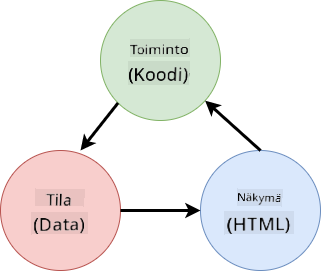
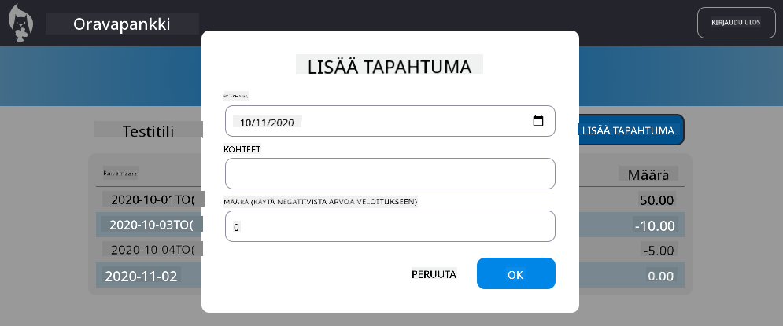

<!--
CO_OP_TRANSLATOR_METADATA:
{
  "original_hash": "4fa20c513e367e9cdd401bf49ae16e33",
  "translation_date": "2025-08-27T21:04:05+00:00",
  "source_file": "7-bank-project/4-state-management/README.md",
  "language_code": "fi"
}
-->
# Rakenna pankkisovellus Osa 4: Tilanhallinnan periaatteet

## Ennakkokysely

[Ennakkokysely](https://ashy-river-0debb7803.1.azurestaticapps.net/quiz/47)

### Johdanto

Kun verkkosovellus kasvaa, datavirtojen hallinta muuttuu haastavaksi. Mikä koodi hakee tiedot, mikä sivu käyttää niitä, missä ja milloin niitä pitää päivittää... on helppo päätyä sekavaan koodiin, jota on vaikea ylläpitää. Tämä on erityisen totta, kun sinun täytyy jakaa tietoja sovelluksen eri sivujen välillä, esimerkiksi käyttäjätietoja. *Tilanhallinnan* käsite on aina ollut olemassa kaikenlaisissa ohjelmissa, mutta verkkosovellusten monimutkaisuuden kasvaessa siitä on tullut keskeinen kehityksen osa-alue.

Tässä viimeisessä osassa tarkastelemme rakentamaamme sovellusta uudelleen ja mietimme, miten tila hallitaan, jotta voimme tukea selaimen päivityksiä milloin tahansa ja säilyttää tiedot käyttäjäistuntojen välillä.

### Esitiedot

Sinun tulee olla suorittanut verkkosovelluksen [datan haku](../3-data/README.md) -osio ennen tämän oppitunnin aloittamista. Sinun tulee myös asentaa [Node.js](https://nodejs.org) ja [ajaa palvelin-API](../api/README.md) paikallisesti, jotta voit hallita tilitietoja.

Voit testata, että palvelin toimii oikein suorittamalla tämän komennon terminaalissa:

```sh
curl http://localhost:5000/api
# -> should return "Bank API v1.0.0" as a result
```

---

## Mietitään tilanhallintaa uudelleen

[Edellisessä oppitunnissa](../3-data/README.md) esittelimme sovelluksessamme tilan peruskäsitteen globaalin `account`-muuttujan avulla, joka sisältää kirjautuneen käyttäjän pankkitiedot. Nykyisessä toteutuksessamme on kuitenkin joitakin puutteita. Kokeile päivittää sivu, kun olet hallintapaneelissa. Mitä tapahtuu?

Nykyisessä koodissa on kolme ongelmaa:

- Tila ei säily, sillä selaimen päivitys vie sinut takaisin kirjautumissivulle.
- Useat funktiot muuttavat tilaa. Sovelluksen kasvaessa tämä voi tehdä muutosten seuraamisesta vaikeaa, ja on helppo unohtaa päivittää jokin osa.
- Tila ei tyhjene, joten kun napsautat *Kirjaudu ulos*, tilitiedot ovat yhä olemassa, vaikka olet kirjautumissivulla.

Voisimme päivittää koodiamme ratkaistaksemme nämä ongelmat yksi kerrallaan, mutta se lisäisi koodin toistoa ja tekisi sovelluksesta monimutkaisemman ja vaikeamman ylläpitää. Tai voisimme pysähtyä hetkeksi ja miettiä strategiaamme uudelleen.

> Mitä ongelmia yritämme oikeastaan ratkaista?

[Tilanhallinta](https://en.wikipedia.org/wiki/State_management) tarkoittaa hyvän lähestymistavan löytämistä näiden kahden erityisen ongelman ratkaisemiseksi:

- Miten pitää sovelluksen datavirrat ymmärrettävinä?
- Miten varmistaa, että tila ja käyttöliittymä ovat aina synkronissa (ja päinvastoin)?

Kun nämä asiat on hoidettu, muut mahdolliset ongelmat saattavat joko ratketa itsestään tai niiden ratkaiseminen helpottuu. Näiden ongelmien ratkaisemiseksi on monia mahdollisia lähestymistapoja, mutta valitsemme yleisen ratkaisun, joka koostuu **datan ja sen muuttamistapojen keskittämisestä**. Datavirrat kulkisivat seuraavasti:



> Emme käsittele tässä osassa sitä, miten data automaattisesti päivittää näkymän, sillä se liittyy edistyneempiin [Reaktiivisen ohjelmoinnin](https://en.wikipedia.org/wiki/Reactive_programming) käsitteisiin. Tämä on hyvä jatkoaihe, jos haluat syventyä aiheeseen.

✅ Markkinoilla on paljon kirjastoja, joilla on erilaisia lähestymistapoja tilanhallintaan, joista [Redux](https://redux.js.org) on suosittu vaihtoehto. Tutustu sen käsitteisiin ja malleihin, sillä ne tarjoavat usein hyvän tavan oppia, millaisia ongelmia saatat kohdata suurissa verkkosovelluksissa ja miten ne voidaan ratkaista.

### Tehtävä

Aloitamme pienellä refaktoroinnilla. Korvaa `account`-määrittely:

```js
let account = null;
```

Seuraavalla:

```js
let state = {
  account: null
};
```

Ajatuksena on *keskittää* kaikki sovelluksen data yhteen tilan objektiin. Tällä hetkellä meillä on tilassa vain `account`, joten muutos ei ole suuri, mutta se luo pohjan tuleville kehityksille.

Meidän täytyy myös päivittää sitä käyttävät funktiot. `register()`- ja `login()`-funktioissa korvaa `account = ...` seuraavalla: `state.account = ...`;

Lisää `updateDashboard()`-funktion alkuun tämä rivi:

```js
const account = state.account;
```

Tämä refaktorointi ei itsessään tuonut suuria parannuksia, mutta sen tarkoituksena oli luoda perusta seuraaville muutoksille.

## Seuraa datamuutoksia

Nyt kun olemme ottaneet käyttöön `state`-objektin datan tallentamiseen, seuraava askel on keskittää päivitykset. Tavoitteena on helpottaa muutosten ja niiden ajankohdan seuraamista.

Jotta `state`-objektiin ei tehtäisi suoria muutoksia, on myös hyvä käytäntö pitää se [*muuttumattomana*](https://en.wikipedia.org/wiki/Immutable_object), mikä tarkoittaa, että sitä ei voi muokata lainkaan. Tämä tarkoittaa myös, että sinun täytyy luoda uusi tilaobjekti, jos haluat muuttaa jotain siinä. Näin suojaudut mahdollisilta ei-toivotuilta [sivuvaikutuksilta](https://en.wikipedia.org/wiki/Side_effect_(computer_science)) ja avaat mahdollisuuksia uusille ominaisuuksille, kuten kumoa/tee uudelleen -toiminnon toteuttamiselle, samalla kun virheiden jäljittäminen helpottuu. Esimerkiksi voit kirjata kaikki tilaan tehdyt muutokset ja pitää niistä historian ymmärtääksesi virheen lähteen.

JavaScriptissä voit käyttää [`Object.freeze()`](https://developer.mozilla.org/docs/Web/JavaScript/Reference/Global_Objects/Object/freeze) luodaksesi muuttumattoman version objektista. Jos yrität tehdä muutoksia muuttumattomaan objektiin, syntyy poikkeus.

✅ Tiedätkö eron *pintapuolisen* ja *syvän* muuttumattoman objektin välillä? Voit lukea siitä [täältä](https://developer.mozilla.org/docs/Web/JavaScript/Reference/Global_Objects/Object/freeze#What_is_shallow_freeze).

### Tehtävä

Luodaan uusi `updateState()`-funktio:

```js
function updateState(property, newData) {
  state = Object.freeze({
    ...state,
    [property]: newData
  });
}
```

Tässä funktiossa luomme uuden tilaobjektin ja kopioimme tiedot edellisestä tilasta käyttämällä [*spread (`...`) -operaattoria*](https://developer.mozilla.org/docs/Web/JavaScript/Reference/Operators/Spread_syntax#Spread_in_object_literals). Sitten ylikirjoitamme tietyn ominaisuuden tilaobjektista uudella datalla käyttämällä [hakasuljenotaatioita](https://developer.mozilla.org/docs/Web/JavaScript/Guide/Working_with_Objects#Objects_and_properties) `[property]` määrittelyyn. Lopuksi lukitsemme objektin estääksemme muutokset käyttämällä `Object.freeze()`. Tällä hetkellä tilassa on vain `account`-ominaisuus, mutta tällä lähestymistavalla voit lisätä niin monta ominaisuutta kuin tarvitset.

Päivitetään myös `state`-alustus varmistamaan, että alkuperäinen tila on myös jäädytetty:

```js
let state = Object.freeze({
  account: null
});
```

Tämän jälkeen päivitä `register`-funktio korvaamalla `state.account = result;` seuraavalla:

```js
updateState('account', result);
```

Tee sama `login`-funktiolle korvaamalla `state.account = data;` seuraavalla:

```js
updateState('account', data);
```

Korjataan samalla ongelma, jossa tilitietoja ei tyhjennetä, kun käyttäjä napsauttaa *Kirjaudu ulos*.

Luo uusi funktio `logout()`:

```js
function logout() {
  updateState('account', null);
  navigate('/login');
}
```

`updateDashboard()`-funktiossa korvaa uudelleenohjaus `return navigate('/login');` seuraavalla: `return logout();`

Kokeile rekisteröidä uusi tili, kirjautua ulos ja takaisin sisään varmistaaksesi, että kaikki toimii oikein.

> Vinkki: voit tarkastella kaikkia tilamuutoksia lisäämällä `console.log(state)` `updateState()`-funktion loppuun ja avaamalla selaimen kehitystyökalujen konsolin.

## Tilan säilyttäminen

Useimmat verkkosovellukset tarvitsevat datan säilyttämistä toimiakseen oikein. Kaikki kriittiset tiedot tallennetaan yleensä tietokantaan ja haetaan palvelin-API:n kautta, kuten käyttäjätilitiedot meidän tapauksessamme. Mutta joskus on myös hyödyllistä säilyttää joitakin tietoja selaimessa toimivassa asiakassovelluksessa paremman käyttökokemuksen tai latausnopeuden parantamiseksi.

Kun haluat säilyttää tietoja selaimessa, on muutama tärkeä kysymys, jotka sinun tulisi kysyä itseltäsi:

- *Ovatko tiedot arkaluonteisia?* Vältä arkaluonteisten tietojen, kuten käyttäjien salasanojen, tallentamista asiakaspuolelle.
- *Kuinka kauan tarvitset näitä tietoja?* Aiotko käyttää tietoja vain nykyisen istunnon aikana vai haluatko tallentaa ne pysyvästi?

Tietojen tallentamiseen verkkosovelluksessa on useita tapoja sen mukaan, mitä haluat saavuttaa. Esimerkiksi voit käyttää URL-osoitteita tallentaaksesi hakukyselyn ja tehdäksesi siitä jaettavan käyttäjien kesken. Voit myös käyttää [HTTP-evästeitä](https://developer.mozilla.org/docs/Web/HTTP/Cookies), jos tiedot täytyy jakaa palvelimen kanssa, kuten [autentikointitiedot](https://en.wikipedia.org/wiki/Authentication).

Toinen vaihtoehto on käyttää jotakin selaimen monista API:sta tietojen tallentamiseen. Kaksi niistä on erityisen mielenkiintoisia:

- [`localStorage`](https://developer.mozilla.org/docs/Web/API/Window/localStorage): [Avain/Arvo-tietokanta](https://en.wikipedia.org/wiki/Key%E2%80%93value_database), joka mahdollistaa tietojen säilyttämisen tietylle verkkosivustolle eri istuntojen välillä. Tallennetut tiedot eivät koskaan vanhene.
- [`sessionStorage`](https://developer.mozilla.org/docs/Web/API/Window/sessionStorage): Tämä toimii samalla tavalla kuin `localStorage`, paitsi että siihen tallennetut tiedot poistetaan, kun istunto päättyy (kun selain suljetaan).

Huomaa, että molemmat näistä API:sta sallivat vain [merkkijonojen](https://developer.mozilla.org/docs/Web/JavaScript/Reference/Global_Objects/String) tallentamisen. Jos haluat tallentaa monimutkaisia objekteja, sinun täytyy sarjoittaa ne [JSON](https://developer.mozilla.org/docs/Web/JavaScript/Reference/Global_Objects/JSON)-muotoon käyttämällä [`JSON.stringify()`](https://developer.mozilla.org/docs/Web/JavaScript/Reference/Global_Objects/JSON/stringify).

✅ Jos haluat luoda verkkosovelluksen, joka ei toimi palvelimen kanssa, on myös mahdollista luoda tietokanta asiakaspuolelle käyttämällä [`IndexedDB` API:a](https://developer.mozilla.org/docs/Web/API/IndexedDB_API). Tämä on varattu edistyneisiin käyttötapauksiin tai jos sinun täytyy tallentaa merkittävä määrä tietoa, sillä sen käyttö on monimutkaisempaa.

### Tehtävä

Haluamme, että käyttäjät pysyvät kirjautuneina, kunnes he nimenomaisesti napsauttavat *Kirjaudu ulos* -painiketta, joten käytämme `localStoragea` tilitietojen tallentamiseen. Määritellään ensin avain, jota käytämme tietojen tallentamiseen.

```js
const storageKey = 'savedAccount';
```

Lisää sitten tämä rivi `updateState()`-funktion loppuun:

```js
localStorage.setItem(storageKey, JSON.stringify(state.account));
```

Tämän avulla käyttäjän tilitiedot säilyvät ja pysyvät ajan tasalla, koska olemme aiemmin keskittäneet kaikki tilapäivitykset. Tässä kohtaa alamme hyötyä kaikista aiemmista refaktoroinneistamme 🙂.

Koska tiedot tallennetaan, meidän täytyy myös huolehtia niiden palauttamisesta, kun sovellus ladataan. Koska alamme saada enemmän alustuskoodia, voi olla hyvä idea luoda uusi `init`-funktio, joka sisältää myös aiemman koodimme `app.js`-tiedoston lopussa:

```js
function init() {
  const savedAccount = localStorage.getItem(storageKey);
  if (savedAccount) {
    updateState('account', JSON.parse(savedAccount));
  }

  // Our previous initialization code
  window.onpopstate = () => updateRoute();
  updateRoute();
}

init();
```

Tässä haemme tallennetut tiedot, ja jos niitä on, päivitämme tilan vastaavasti. On tärkeää tehdä tämä *ennen* reitin päivitystä, sillä sivun päivityksen aikana voi olla koodia, joka riippuu tilasta.

Voimme myös tehdä *Hallintapaneeli*-sivusta sovelluksemme oletussivun, koska nyt säilytämme tilitiedot. Jos tietoja ei löydy, hallintapaneeli huolehtii uudelleenohjauksesta *Kirjautumissivulle*. `updateRoute()`-funktiossa korvaa oletus `return navigate('/login');` seuraavalla: `return navigate('/dashboard');`.

Kirjaudu nyt sovellukseen ja kokeile päivittää sivu. Sinun pitäisi pysyä hallintapaneelissa. Tällä päivityksellä olemme ratkaisseet kaikki alkuperäiset ongelmamme...

## Datan päivittäminen

...Mutta saatamme myös olla luoneet uuden ongelman. Oho!

Siirry hallintapaneeliin käyttäen `test`-tiliä, ja suorita sitten tämä komento terminaalissa luodaksesi uuden tapahtuman:

```sh
curl --request POST \
     --header "Content-Type: application/json" \
     --data "{ \"date\": \"2020-07-24\", \"object\": \"Bought book\", \"amount\": -20 }" \
     http://localhost:5000/api/accounts/test/transactions
```

Kokeile päivittää hallintapaneelin sivu selaimessa nyt. Mitä tapahtuu? Näetkö uuden tapahtuman?

Tila säilyy loputtomasti `localStorage`-ominaisuuden ansiosta, mutta se tarkoittaa myös, että sitä ei koskaan päivitetä, ennen kuin kirjaudut ulos sovelluksesta ja takaisin sisään!

Yksi mahdollinen strategia tämän korjaamiseksi on ladata tilitiedot uudelleen aina, kun hallintapaneeli ladataan, jotta vältetään vanhentuneet tiedot.

### Tehtävä

Luo uusi funktio `updateAccountData`:

```js
async function updateAccountData() {
  const account = state.account;
  if (!account) {
    return logout();
  }

  const data = await getAccount(account.user);
  if (data.error) {
    return logout();
  }

  updateState('account', data);
}
```

Tämä metodi tarkistaa, että olet kirjautuneena sisään, ja lataa sitten tilitiedot palvelimelta uudelleen.

Luo toinen funktio nimeltä `refresh`:

```js
async function refresh() {
  await updateAccountData();
  updateDashboard();
}
```

Tämä funktio päivittää tilitiedot ja huolehtii sitten hallintapaneelin HTML:n päivittämisestä. Tätä meidän täytyy kutsua, kun hallintapaneelin reitti ladataan. Päivitä reittimäärittely seuraavalla:

```js
const routes = {
  '/login': { templateId: 'login' },
  '/dashboard': { templateId: 'dashboard', init: refresh }
};
```

Kokeile päivittää hallintapaneeli nyt, sen pitäisi näyttää päivitetyt tilitiedot.

---

## 🚀 Haaste

Nyt kun lataamme tilitiedot uudelleen aina, kun hallintapaneeli ladataan, luuletko, että meidän täytyy yhä säilyttää *kaikki tilitiedot*?

Yrittäkää yhdessä muuttaa, mitä tallennetaan ja ladataan `localStoragesta`, niin että mukana on vain se, mikä on ehdottoman välttämätöntä sovelluksen toiminnan kannalta.

## Jälkikysely
[Luennon jälkeinen kysely](https://ashy-river-0debb7803.1.azurestaticapps.net/quiz/48)

## Tehtävä

[Toteuta "Lisää tapahtuma" -valintaikkuna](assignment.md)

Tässä on esimerkkitulos tehtävän suorittamisen jälkeen:



---

**Vastuuvapauslauseke**:  
Tämä asiakirja on käännetty käyttämällä tekoälypohjaista käännöspalvelua [Co-op Translator](https://github.com/Azure/co-op-translator). Vaikka pyrimme tarkkuuteen, huomioithan, että automaattiset käännökset voivat sisältää virheitä tai epätarkkuuksia. Alkuperäistä asiakirjaa sen alkuperäisellä kielellä tulisi pitää ensisijaisena lähteenä. Kriittisen tiedon osalta suositellaan ammattimaista ihmiskäännöstä. Emme ole vastuussa tämän käännöksen käytöstä johtuvista väärinkäsityksistä tai virhetulkinnoista.