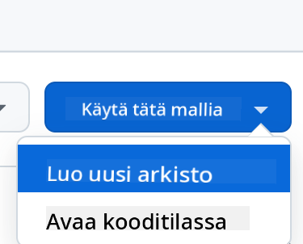
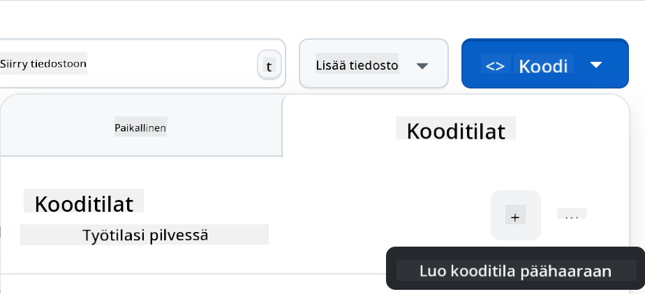

<!--
CO_OP_TRANSLATOR_METADATA:
{
  "original_hash": "cf15ff7770c5a484349383bb27d1131f",
  "translation_date": "2025-08-29T01:26:43+00:00",
  "source_file": "9-chat-project/README.md",
  "language_code": "fi"
}
-->
# Chat-projekti

Tämä chat-projekti näyttää, kuinka rakentaa Chat-avustaja käyttämällä GitHub-malleja.

Tältä valmis projekti näyttää:

<div>
  
</div>

Hieman taustaa: Chat-avustajien rakentaminen generatiivisen tekoälyn avulla on loistava tapa aloittaa tekoälyn opiskelu. Tässä oppitunnissa opit integroimaan generatiivisen tekoälyn verkkosovellukseen. Aloitetaan!

## Yhteys generatiiviseen tekoälyyn

Taustajärjestelmässä käytämme GitHub-malleja. Se on erinomainen palvelu, joka mahdollistaa tekoälyn käytön ilmaiseksi. Mene sen kokeiluympäristöön ja kopioi koodi, joka vastaa valitsemaasi taustajärjestelmän kieltä. Tältä se näyttää: [GitHub Models Playground](https://github.com/marketplace/models/azure-openai/gpt-4o-mini/playground)

<div>
  
</div>

Kuten mainittiin, valitse "Code"-välilehti ja haluamasi ajonaikainen ympäristö.

<div>
  
</div>

Tässä tapauksessa valitsemme Pythonin, mikä tarkoittaa, että valitsemme tämän koodin:

```python
"""Run this model in Python

> pip install openai
"""
import os
from openai import OpenAI

# To authenticate with the model you will need to generate a personal access token (PAT) in your GitHub settings. 
# Create your PAT token by following instructions here: https://docs.github.com/en/authentication/keeping-your-account-and-data-secure/managing-your-personal-access-tokens
client = OpenAI(
    base_url="https://models.github.ai/inference",
    api_key=os.environ["GITHUB_TOKEN"],
)

response = client.chat.completions.create(
    messages=[
        {
            "role": "system",
            "content": "",
        },
        {
            "role": "user",
            "content": "What is the capital of France?",
        }
    ],
    model="openai/gpt-4o-mini",
    temperature=1,
    max_tokens=4096,
    top_p=1
)

print(response.choices[0].message.content)
```

Siistitään koodia hieman, jotta se on uudelleenkäytettävä:

```python
def call_llm(prompt: str, system_message: str):
    response = client.chat.completions.create(
        messages=[
            {
                "role": "system",
                "content": system_message,
            },
            {
                "role": "user",
                "content": prompt,
            }
        ],
        model="openai/gpt-4o-mini",
        temperature=1,
        max_tokens=4096,
        top_p=1
    )

    return response.choices[0].message.content
```

Tällä `call_llm`-funktiolla voimme nyt ottaa kehotteen ja järjestelmäkehotteen, ja funktio palauttaa tuloksen.

### Mukauta AI-avustajaa

Jos haluat mukauttaa AI-avustajaa, voit määrittää, miten haluat sen käyttäytyvän täyttämällä järjestelmäkehotteen seuraavasti:

```python
call_llm("Tell me about you", "You're Albert Einstein, you only know of things in the time you were alive")
```

## Julkaise se Web API:n kautta

Hienoa, tekoälyosa on valmis. Katsotaan, kuinka voimme integroida sen Web API:iin. Web API:lle valitsemme Flaskin, mutta mikä tahansa verkkokehys käy. Tässä koodi:

```python
# api.py
from flask import Flask, request, jsonify
from llm import call_llm
from flask_cors import CORS

app = Flask(__name__)
CORS(app)   # *   example.com

@app.route("/", methods=["GET"])
def index():
    return "Welcome to this API. Call POST /hello with 'message': 'my message' as JSON payload"


@app.route("/hello", methods=["POST"])
def hello():
    # get message from request body  { "message": "do this taks for me" }
    data = request.get_json()
    message = data.get("message", "")

    response = call_llm(message, "You are a helpful assistant.")
    return jsonify({
        "response": response
    })

if __name__ == "__main__":
    app.run(host="0.0.0.0", port=5000)
```

Tässä luomme Flask-API:n ja määrittelemme oletusreitin "/" ja "/chat". Jälkimmäistä käytetään frontendissä kysymysten välittämiseen.

Integrointi *llm.py*-tiedostoon vaatii seuraavat toimenpiteet:

- Tuo `call_llm`-funktio:

   ```python
   from llm import call_llm
   from flask import Flask, request
   ```

- Kutsu sitä "/chat"-reitiltä:

   ```python
   @app.route("/hello", methods=["POST"])
   def hello():
      # get message from request body  { "message": "do this taks for me" }
      data = request.get_json()
      message = data.get("message", "")

      response = call_llm(message, "You are a helpful assistant.")
      return jsonify({
         "response": response
      })
   ```

   Tässä jäsennämme saapuvan pyynnön saadaksemme `message`-ominaisuuden JSON-runko-osasta. Sen jälkeen kutsumme LLM:ää tällä tavalla:

   ```python
   response = call_llm(message, "You are a helpful assistant")

   # return the response as JSON
   return jsonify({
      "response": response 
   })
   ```

Hienoa, nyt olemme tehneet tarvittavat toimenpiteet.

### Määritä Cors

On tärkeää huomioida, että asetamme jotain kuten CORS (cross-origin resource sharing). Tämä tarkoittaa, että koska taustajärjestelmä ja käyttöliittymä toimivat eri porteilla, meidän täytyy sallia käyttöliittymän kutsut taustajärjestelmään. *api.py*-tiedostossa on koodinpätkä, joka asettaa tämän:

```python
from flask_cors import CORS

app = Flask(__name__)
CORS(app)   # *   example.com
```

Tällä hetkellä se on asetettu sallimaan "*", eli kaikki alkuperät, mikä on hieman turvatonta. Tämä tulisi rajoittaa, kun siirrytään tuotantoon.

## Käynnistä projektisi

Ok, meillä on *llm.py* ja *api.py*. Kuinka voimme saada tämän toimimaan taustajärjestelmän kanssa? Tarvitsemme kaksi asiaa:

- Asenna riippuvuudet:

   ```sh
   cd backend
   python -m venv venv
   source ./venv/bin/activate

   pip install openai flask flask-cors openai
   ```

- Käynnistä API:

   ```sh
   python api.py
   ```

   Jos käytät Codespacesia, sinun täytyy mennä editorin alaosassa Ports-osioon, napsauttaa sitä hiiren oikealla ja valita "Port Visibility" ja valita "Public".

### Työskentele käyttöliittymän parissa

Nyt kun meillä on API käynnissä, luodaan käyttöliittymä. Aloitetaan yksinkertaisimmalla käyttöliittymällä, jota parannamme vaiheittain. Luo *frontend*-kansioon seuraavat:

```text
backend/
frontend/
index.html
app.js
styles.css
```

Aloitetaan **index.html**-tiedostosta:

```html
<html>
    <head>
        <link rel="stylesheet" href="styles.css">
    </head>
    <body>
      <form>
        <textarea id="messages"></textarea>
        <input id="input" type="text" />
        <button type="submit" id="sendBtn">Send</button>  
      </form>  
      <script src="app.js" />
    </body>
</html>    
```

Tämä on ehdoton minimivaatimus chat-ikkunan tukemiseksi, sillä se sisältää tekstialueen, jossa viestit näytetään, syöttökentän viestin kirjoittamista varten ja painikkeen viestin lähettämiseksi taustajärjestelmään. Katsotaan seuraavaksi JavaScript-koodia *app.js*-tiedostossa.

**app.js**

```js
// app.js

(function(){
  // 1. set up elements  
  const messages = document.getElementById("messages");
  const form = document.getElementById("form");
  const input = document.getElementById("input");

  const BASE_URL = "change this";
  const API_ENDPOINT = `${BASE_URL}/hello`;

  // 2. create a function that talks to our backend
  async function callApi(text) {
    const response = await fetch(API_ENDPOINT, {
      method: "POST",
      headers: { "Content-Type": "application/json" },
      body: JSON.stringify({ message: text })
    });
    let json = await response.json();
    return json.response;
  }

  // 3. add response to our textarea
  function appendMessage(text, role) {
    const el = document.createElement("div");
    el.className = `message ${role}`;
    el.innerHTML = text;
    messages.appendChild(el);
  }

  // 4. listen to submit events
  form.addEventListener("submit", async(e) => {
    e.preventDefault();
   // someone clicked the button in the form
   
   // get input
   const text = input.value.trim();

   appendMessage(text, "user")

   // reset it
   input.value = '';

   const reply = await callApi(text);

   // add to messages
   appendMessage(reply, "assistant");

  })
})();
```

Käydään koodi läpi osittain:

- 1) Tässä haetaan viittaukset kaikkiin elementteihin, joita käytetään myöhemmin koodissa.
- 2) Tässä osiossa luodaan funktio, joka käyttää sisäänrakennettua `fetch`-metodia taustajärjestelmän kutsumiseen.
- 3) `appendMessage` auttaa lisäämään vastaukset sekä käyttäjän kirjoittamat viestit.
- 4) Tässä kuunnellaan submit-tapahtumaa, luetaan syöttökenttä, lisätään käyttäjän viesti tekstialueeseen, kutsutaan API:ta ja näytetään vastaus tekstialueessa.

Katsotaan seuraavaksi tyylit. Tässä voit olla luova ja tehdä ulkoasusta haluamasi, mutta tässä muutamia ehdotuksia:

**styles.css**

```
.message {
    background: #222;
    box-shadow: 0 0 0 10px orange;
    padding: 10px:
    margin: 5px;
}

.message.user {
    background: blue;
}

.message.assistant {
    background: grey;
} 
```

Näillä kolmella luokalla voit tyylitellä viestit eri tavalla riippuen siitä, tulevatko ne avustajalta vai käyttäjältä. Jos haluat inspiraatiota, katso `solution/frontend/styles.css`-kansio.

### Muuta Base Url

Yksi asia, jota emme vielä asettaneet, on `BASE_URL`. Tämä ei ole tiedossa ennen kuin taustajärjestelmä käynnistetään. Aseta se seuraavasti:

- Jos API toimii paikallisesti, sen pitäisi olla jotain kuten `http://localhost:5000`.
- Jos käytät Codespacesia, sen pitäisi näyttää jotain kuten "[name]app.github.dev".

## Tehtävä

Luo oma kansio *project*, jonka sisältö on seuraava:

```text
project/
  frontend/
    index.html
    app.js
    styles.css
  backend/
    api.py
    llm.py
```

Kopioi sisältö yllä olevista ohjeista, mutta voit mukauttaa sitä haluamallasi tavalla.

## Ratkaisu

[Ratkaisu](./solution/README.md)

## Bonus

Kokeile muuttaa AI-avustajan persoonallisuutta. Kun kutsut `call_llm`-funktiota *api.py*-tiedostossa, voit muuttaa toista argumenttia haluamaksesi, esimerkiksi:

```python
call_llm(message, "You are Captain Picard")
```

Muuta myös CSS ja teksti haluamallasi tavalla, eli tee muutoksia *index.html*- ja *styles.css*-tiedostoihin.

## Yhteenveto

Hienoa, olet oppinut alusta alkaen, kuinka luoda henkilökohtainen avustaja tekoälyn avulla. Teimme sen käyttämällä GitHub-malleja, taustajärjestelmää Pythonilla ja käyttöliittymää HTML:llä, CSS:llä ja JavaScriptillä.

## Asennus Codespacesilla

- Siirry: [Web Dev For Beginners repo](https://github.com/microsoft/Web-Dev-For-Beginners)
- Luo mallista (varmista, että olet kirjautunut GitHubiin) oikeassa yläkulmassa:

    

- Kun olet omassa repossasi, luo Codespace:

    

    Tämä käynnistää ympäristön, jossa voit nyt työskennellä.

---

**Vastuuvapauslauseke**:  
Tämä asiakirja on käännetty käyttämällä tekoälypohjaista käännöspalvelua [Co-op Translator](https://github.com/Azure/co-op-translator). Pyrimme tarkkuuteen, mutta huomioithan, että automaattiset käännökset voivat sisältää virheitä tai epätarkkuuksia. Alkuperäistä asiakirjaa sen alkuperäisellä kielellä tulee pitää ensisijaisena lähteenä. Kriittisen tiedon osalta suositellaan ammattimaista ihmiskääntämistä. Emme ole vastuussa tämän käännöksen käytöstä aiheutuvista väärinkäsityksistä tai virhetulkinnoista.