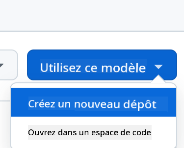
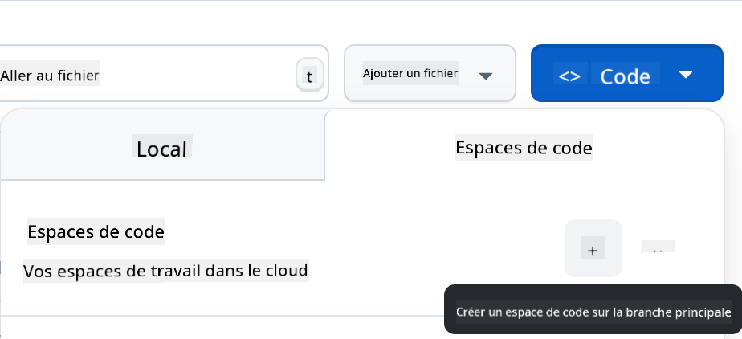

<!--
CO_OP_TRANSLATOR_METADATA:
{
  "original_hash": "cf15ff7770c5a484349383bb27d1131f",
  "translation_date": "2025-08-29T17:02:56+00:00",
  "source_file": "9-chat-project/README.md",
  "language_code": "fr"
}
-->
# Projet de Chat

Ce projet de chat montre comment créer un assistant conversationnel en utilisant les modèles GitHub.

Voici à quoi ressemble le projet final :

<div>
  
</div>

Pour donner un peu de contexte, créer des assistants conversationnels avec l'IA générative est une excellente manière de commencer à apprendre sur l'IA. Ce que vous allez apprendre ici, c'est comment intégrer l'IA générative dans une application web tout au long de cette leçon. Commençons.

## Connexion à l'IA générative

Pour le backend, nous utilisons les modèles GitHub. C'est un excellent service qui vous permet d'utiliser l'IA gratuitement. Rendez-vous sur son espace de test et récupérez le code correspondant au langage backend de votre choix. Voici à quoi cela ressemble sur [GitHub Models Playground](https://github.com/marketplace/models/azure-openai/gpt-4o-mini/playground)

<div>
  
</div>

Comme mentionné, sélectionnez l'onglet "Code" et votre environnement d'exécution préféré.

<div>
  
</div>

Dans ce cas, nous choisissons Python, ce qui signifie que nous utilisons ce code :

```python
"""Run this model in Python

> pip install openai
"""
import os
from openai import OpenAI

# To authenticate with the model you will need to generate a personal access token (PAT) in your GitHub settings. 
# Create your PAT token by following instructions here: https://docs.github.com/en/authentication/keeping-your-account-and-data-secure/managing-your-personal-access-tokens
client = OpenAI(
    base_url="https://models.github.ai/inference",
    api_key=os.environ["GITHUB_TOKEN"],
)

response = client.chat.completions.create(
    messages=[
        {
            "role": "system",
            "content": "",
        },
        {
            "role": "user",
            "content": "What is the capital of France?",
        }
    ],
    model="openai/gpt-4o-mini",
    temperature=1,
    max_tokens=4096,
    top_p=1
)

print(response.choices[0].message.content)
```

Nettoyons un peu ce code pour le rendre réutilisable :

```python
def call_llm(prompt: str, system_message: str):
    response = client.chat.completions.create(
        messages=[
            {
                "role": "system",
                "content": system_message,
            },
            {
                "role": "user",
                "content": prompt,
            }
        ],
        model="openai/gpt-4o-mini",
        temperature=1,
        max_tokens=4096,
        top_p=1
    )

    return response.choices[0].message.content
```

Avec cette fonction `call_llm`, nous pouvons maintenant prendre un prompt et un prompt système, et la fonction renvoie le résultat.

### Personnaliser l'assistant IA

Si vous souhaitez personnaliser l'assistant IA, vous pouvez spécifier son comportement en remplissant le prompt système comme ceci :

```python
call_llm("Tell me about you", "You're Albert Einstein, you only know of things in the time you were alive")
```

## Exposer via une API Web

Super, nous avons terminé la partie IA, voyons maintenant comment l'intégrer dans une API Web. Pour l'API Web, nous avons choisi Flask, mais tout framework web devrait convenir. Voici le code :

```python
# api.py
from flask import Flask, request, jsonify
from llm import call_llm
from flask_cors import CORS

app = Flask(__name__)
CORS(app)   # *   example.com

@app.route("/", methods=["GET"])
def index():
    return "Welcome to this API. Call POST /hello with 'message': 'my message' as JSON payload"


@app.route("/hello", methods=["POST"])
def hello():
    # get message from request body  { "message": "do this taks for me" }
    data = request.get_json()
    message = data.get("message", "")

    response = call_llm(message, "You are a helpful assistant.")
    return jsonify({
        "response": response
    })

if __name__ == "__main__":
    app.run(host="0.0.0.0", port=5000)
```

Ici, nous créons une API Flask et définissons une route par défaut "/" et "/chat". Cette dernière est destinée à être utilisée par notre frontend pour lui transmettre des questions.

Pour intégrer *llm.py*, voici ce que nous devons faire :

- Importer la fonction `call_llm` :

   ```python
   from llm import call_llm
   from flask import Flask, request
   ```

- L'appeler depuis la route "/chat" :

   ```python
   @app.route("/hello", methods=["POST"])
   def hello():
      # get message from request body  { "message": "do this taks for me" }
      data = request.get_json()
      message = data.get("message", "")

      response = call_llm(message, "You are a helpful assistant.")
      return jsonify({
         "response": response
      })
   ```

   Ici, nous analysons la requête entrante pour récupérer la propriété `message` du corps JSON. Ensuite, nous appelons le LLM avec cet appel :

   ```python
   response = call_llm(message, "You are a helpful assistant")

   # return the response as JSON
   return jsonify({
      "response": response 
   })
   ```

Super, nous avons fait ce qu'il fallait.

### Configurer Cors

Nous devons mentionner que nous avons configuré quelque chose comme CORS, le partage des ressources entre origines. Cela signifie que, puisque notre backend et notre frontend fonctionneront sur des ports différents, nous devons autoriser le frontend à appeler le backend. Voici un extrait de code dans *api.py* qui configure cela :

```python
from flask_cors import CORS

app = Flask(__name__)
CORS(app)   # *   example.com
```

Actuellement, il est configuré pour autoriser "*" (toutes les origines), ce qui est un peu risqué. Nous devrions le restreindre une fois en production.

## Exécuter votre projet

Ok, nous avons *llm.py* et *api.py*, comment pouvons-nous faire fonctionner cela avec un backend ? Eh bien, il y a deux choses à faire :

- Installer les dépendances :

   ```sh
   cd backend
   python -m venv venv
   source ./venv/bin/activate

   pip install openai flask flask-cors openai
   ```

- Démarrer l'API :

   ```sh
   python api.py
   ```

   Si vous êtes dans Codespaces, vous devez aller dans Ports en bas de l'éditeur, faire un clic droit dessus, cliquer sur "Port Visibility" et sélectionner "Public".

### Travailler sur un frontend

Maintenant que nous avons une API opérationnelle, créons un frontend pour cela. Un frontend minimal que nous améliorerons progressivement. Dans un dossier *frontend*, créez ce qui suit :

```text
backend/
frontend/
index.html
app.js
styles.css
```

Commençons par **index.html** :

```html
<html>
    <head>
        <link rel="stylesheet" href="styles.css">
    </head>
    <body>
      <form>
        <textarea id="messages"></textarea>
        <input id="input" type="text" />
        <button type="submit" id="sendBtn">Send</button>  
      </form>  
      <script src="app.js" />
    </body>
</html>    
```

Ce qui précède est le strict minimum nécessaire pour prendre en charge une fenêtre de chat, car il se compose d'une zone de texte où les messages seront affichés, d'un champ de saisie pour taper le message et d'un bouton pour envoyer votre message au backend. Passons au JavaScript dans *app.js*.

**app.js**

```js
// app.js

(function(){
  // 1. set up elements  
  const messages = document.getElementById("messages");
  const form = document.getElementById("form");
  const input = document.getElementById("input");

  const BASE_URL = "change this";
  const API_ENDPOINT = `${BASE_URL}/hello`;

  // 2. create a function that talks to our backend
  async function callApi(text) {
    const response = await fetch(API_ENDPOINT, {
      method: "POST",
      headers: { "Content-Type": "application/json" },
      body: JSON.stringify({ message: text })
    });
    let json = await response.json();
    return json.response;
  }

  // 3. add response to our textarea
  function appendMessage(text, role) {
    const el = document.createElement("div");
    el.className = `message ${role}`;
    el.innerHTML = text;
    messages.appendChild(el);
  }

  // 4. listen to submit events
  form.addEventListener("submit", async(e) => {
    e.preventDefault();
   // someone clicked the button in the form
   
   // get input
   const text = input.value.trim();

   appendMessage(text, "user")

   // reset it
   input.value = '';

   const reply = await callApi(text);

   // add to messages
   appendMessage(reply, "assistant");

  })
})();
```

Analysons le code section par section :

- 1) Ici, nous obtenons une référence à tous nos éléments que nous utiliserons plus tard dans le code.
- 2) Dans cette section, nous créons une fonction qui utilise la méthode intégrée `fetch` pour appeler notre backend.
- 3) `appendMessage` aide à ajouter les réponses ainsi que ce que vous tapez en tant qu'utilisateur.
- 4) Ici, nous écoutons l'événement de soumission, lisons le champ de saisie, plaçons le message de l'utilisateur dans la zone de texte, appelons l'API et affichons la réponse dans la zone de texte.

Passons au style maintenant. Voici où vous pouvez vraiment vous amuser et personnaliser l'apparence, mais voici quelques suggestions :

**styles.css**

```
.message {
    background: #222;
    box-shadow: 0 0 0 10px orange;
    padding: 10px:
    margin: 5px;
}

.message.user {
    background: blue;
}

.message.assistant {
    background: grey;
} 
```

Avec ces trois classes, vous pouvez styliser les messages différemment selon qu'ils proviennent de l'assistant ou de vous en tant qu'utilisateur. Si vous voulez vous inspirer, consultez le dossier `solution/frontend/styles.css`.

### Modifier l'URL de base

Il y a une chose que nous n'avons pas configurée ici, c'est `BASE_URL`. Elle n'est pas connue tant que votre backend n'est pas démarré. Pour la configurer :

- Si vous exécutez l'API localement, elle devrait être configurée comme `http://localhost:5000`.
- Si vous l'exécutez dans Codespaces, elle devrait ressembler à quelque chose comme "[nom]app.github.dev".

## Exercice

Créez votre propre dossier *project* avec un contenu comme ceci :

```text
project/
  frontend/
    index.html
    app.js
    styles.css
  backend/
    api.py
    llm.py
```

Copiez le contenu des instructions ci-dessus, mais n'hésitez pas à le personnaliser selon vos préférences.

## Solution

[Solution](./solution/README.md)

## Bonus

Essayez de changer la personnalité de l'assistant IA. Lorsque vous appelez `call_llm` dans *api.py*, vous pouvez modifier le deuxième argument selon vos envies, par exemple :

```python
call_llm(message, "You are Captain Picard")
```

Modifiez également le CSS et le texte selon vos préférences, donc apportez des changements dans *index.html* et *styles.css*.

## Résumé

Super, vous avez appris à créer un assistant personnel en utilisant l'IA, depuis zéro. Nous l'avons fait en utilisant les modèles GitHub, un backend en Python et un frontend en HTML, CSS et JavaScript.

## Configuration avec Codespaces

- Accédez à : [Web Dev For Beginners repo](https://github.com/microsoft/Web-Dev-For-Beginners)
- Créez à partir d'un modèle (assurez-vous d'être connecté à GitHub) dans le coin supérieur droit :

    

- Une fois dans votre dépôt, créez un Codespace :

    

    Cela devrait démarrer un environnement avec lequel vous pouvez maintenant travailler.

---

**Avertissement** :  
Ce document a été traduit à l'aide du service de traduction automatique [Co-op Translator](https://github.com/Azure/co-op-translator). Bien que nous nous efforcions d'assurer l'exactitude, veuillez noter que les traductions automatisées peuvent contenir des erreurs ou des inexactitudes. Le document original dans sa langue d'origine doit être considéré comme la source faisant autorité. Pour des informations critiques, il est recommandé de recourir à une traduction professionnelle réalisée par un humain. Nous déclinons toute responsabilité en cas de malentendus ou d'interprétations erronées résultant de l'utilisation de cette traduction.