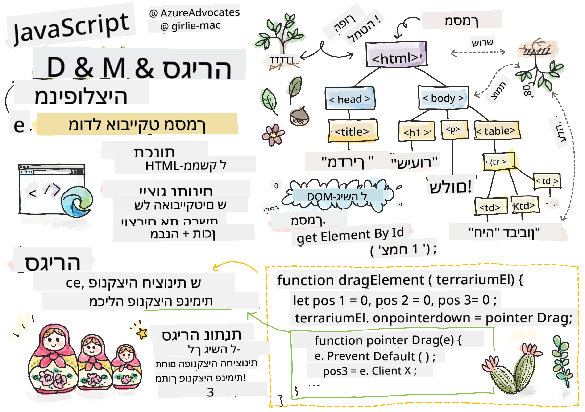
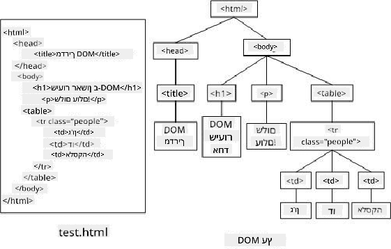

<!--
CO_OP_TRANSLATOR_METADATA:
{
  "original_hash": "30f8903a1f290e3d438dc2c70fe60259",
  "translation_date": "2025-08-27T20:08:59+00:00",
  "source_file": "3-terrarium/3-intro-to-DOM-and-closures/README.md",
  "language_code": "he"
}
-->
# פרויקט הטרריום חלק 3: מניפולציה על ה-DOM וסגירה

  
> איור מאת [Tomomi Imura](https://twitter.com/girlie_mac)

## חידון לפני השיעור

[חידון לפני השיעור](https://ff-quizzes.netlify.app/web/quiz/19)

### מבוא

מניפולציה על ה-DOM, או "מודל אובייקט המסמך", היא היבט מרכזי בפיתוח אתרים. לפי [MDN](https://developer.mozilla.org/docs/Web/API/Document_Object_Model/Introduction), "מודל אובייקט המסמך (DOM) הוא ייצוג נתונים של האובייקטים שמרכיבים את המבנה והתוכן של מסמך באינטרנט." האתגרים סביב מניפולציה על ה-DOM באינטרנט היו לעיתים קרובות המניע לשימוש בפריימוורקים של JavaScript במקום JavaScript רגיל לניהול ה-DOM, אבל אנחנו נסתדר בעצמנו!

בנוסף, שיעור זה יכיר את הרעיון של [סגירה ב-JavaScript](https://developer.mozilla.org/docs/Web/JavaScript/Closures), שאפשר לחשוב עליה כפונקציה שמכילה פונקציה אחרת כך שהפונקציה הפנימית יכולה לגשת לטווח של הפונקציה החיצונית.

> סגירות ב-JavaScript הן נושא רחב ומורכב. שיעור זה נוגע ברעיון הבסיסי ביותר שבקוד של הטרריום תמצאו סגירה: פונקציה פנימית ופונקציה חיצונית שנבנו כך שהפונקציה הפנימית יכולה לגשת לטווח של הפונקציה החיצונית. למידע נוסף על איך זה עובד, בקרו ב-[תיעוד המפורט](https://developer.mozilla.org/docs/Web/JavaScript/Closures).

נשתמש בסגירה כדי לבצע מניפולציה על ה-DOM.

חשבו על ה-DOM כעץ, שמייצג את כל הדרכים שבהן ניתן לבצע מניפולציה על מסמך דף אינטרנט. נכתבו ממשקי API (ממשקי תכנות יישומים) שונים כך שמפתחים, באמצעות שפת התכנות שלהם, יוכלו לגשת ל-DOM ולערוך, לשנות, לסדר מחדש ולנהל אותו.



> ייצוג של ה-DOM והקוד HTML שמפנה אליו. מתוך [Olfa Nasraoui](https://www.researchgate.net/publication/221417012_Profile-Based_Focused_Crawler_for_Social_Media-Sharing_Websites)

בשיעור זה נשלים את פרויקט הטרריום האינטראקטיבי שלנו על ידי יצירת JavaScript שיאפשר למשתמש לבצע מניפולציה על הצמחים בדף.

### דרישות מוקדמות

עליכם לבנות את ה-HTML וה-CSS של הטרריום שלכם. בסוף השיעור תוכלו להזיז את הצמחים פנימה והחוצה מהטרריום על ידי גרירתם.

### משימה

בתיקיית הטרריום שלכם, צרו קובץ חדש בשם `script.js`. ייבאו את הקובץ הזה בתוך החלק `<head>`:

```html
	<script src="./script.js" defer></script>
```

> הערה: השתמשו ב-`defer` כאשר אתם מייבאים קובץ JavaScript חיצוני לקובץ ה-HTML כדי לאפשר ל-JavaScript להתבצע רק לאחר שקובץ ה-HTML נטען במלואו. ניתן גם להשתמש במאפיין `async`, שמאפשר לסקריפט להתבצע בזמן שקובץ ה-HTML נטען, אבל במקרה שלנו חשוב שכל האלמנטים ב-HTML יהיו זמינים לגרירה לפני שנאפשר לסקריפט הגרירה להתבצע.

---

## אלמנטי ה-DOM

הדבר הראשון שעליכם לעשות הוא ליצור הפניות לאלמנטים שברצונכם לבצע עליהם מניפולציה ב-DOM. במקרה שלנו, אלו הם 14 הצמחים שממתינים כרגע בצדי הדף.

### משימה

```html
dragElement(document.getElementById('plant1'));
dragElement(document.getElementById('plant2'));
dragElement(document.getElementById('plant3'));
dragElement(document.getElementById('plant4'));
dragElement(document.getElementById('plant5'));
dragElement(document.getElementById('plant6'));
dragElement(document.getElementById('plant7'));
dragElement(document.getElementById('plant8'));
dragElement(document.getElementById('plant9'));
dragElement(document.getElementById('plant10'));
dragElement(document.getElementById('plant11'));
dragElement(document.getElementById('plant12'));
dragElement(document.getElementById('plant13'));
dragElement(document.getElementById('plant14'));
```

מה קורה כאן? אתם מתייחסים למסמך ומחפשים ב-DOM שלו אלמנט עם מזהה מסוים. זוכרים שבשיעור הראשון על HTML נתתם מזהים ייחודיים לכל תמונת צמח (`id="plant1"`)? עכשיו תשתמשו במאמץ הזה. לאחר זיהוי כל אלמנט, אתם מעבירים את הפריט הזה לפונקציה בשם `dragElement` שתבנו בעוד רגע. כך האלמנט ב-HTML הופך לגריר, או יהפוך לגריר בקרוב.

✅ מדוע אנו מתייחסים לאלמנטים לפי מזהה? מדוע לא לפי מחלקת ה-CSS שלהם? ייתכן שתפנו לשיעור הקודם על CSS כדי לענות על שאלה זו.

---

## הסגירה

עכשיו אתם מוכנים ליצור את סגירת `dragElement`, שהיא פונקציה חיצונית שמכילה פונקציה או פונקציות פנימיות (במקרה שלנו יהיו שלוש).

סגירות שימושיות כאשר פונקציה אחת או יותר צריכות לגשת לטווח של פונקציה חיצונית. הנה דוגמה:

```javascript
function displayCandy(){
	let candy = ['jellybeans'];
	function addCandy(candyType) {
		candy.push(candyType)
	}
	addCandy('gumdrops');
}
displayCandy();
console.log(candy)
```

בדוגמה זו, הפונקציה `displayCandy` עוטפת פונקציה שמוסיפה סוג ממתק חדש למערך שכבר קיים בפונקציה. אם תריצו את הקוד הזה, המערך `candy` יהיה לא מוגדר, מכיוון שהוא משתנה מקומי (מקומי לסגירה).

✅ איך תוכלו להפוך את המערך `candy` לנגיש? נסו להזיז אותו מחוץ לסגירה. כך המערך יהפוך לגלובלי, במקום להישאר זמין רק לטווח המקומי של הסגירה.

### משימה

מתחת להצהרות האלמנטים ב-`script.js`, צרו פונקציה:

```javascript
function dragElement(terrariumElement) {
	//set 4 positions for positioning on the screen
	let pos1 = 0,
		pos2 = 0,
		pos3 = 0,
		pos4 = 0;
	terrariumElement.onpointerdown = pointerDrag;
}
```

`dragElement` מקבל את האובייקט `terrariumElement` מההצהרות שבתחילת הסקריפט. לאחר מכן, אתם מגדירים כמה מיקומים מקומיים כ-`0` עבור האובייקט שמועבר לפונקציה. אלו הם המשתנים המקומיים שיתבצעו עליהם מניפולציות עבור כל אלמנט כאשר תוסיפו פונקציונליות גרירה ושחרור בתוך הסגירה לכל אלמנט. הטרריום יתמלא על ידי האלמנטים הנגררים הללו, ולכן האפליקציה צריכה לעקוב אחר מיקומם.

בנוסף, האלמנט `terrariumElement` שמועבר לפונקציה מוקצה לאירוע `pointerdown`, שהוא חלק מ-[web APIs](https://developer.mozilla.org/docs/Web/API) שנועדו לעזור בניהול ה-DOM. `onpointerdown` מופעל כאשר לוחצים על כפתור, או במקרה שלנו, נוגעים באלמנט שניתן לגרור. מנהל האירועים הזה עובד גם בדפדפני אינטרנט וגם בדפדפנים ניידים, עם כמה יוצאים מן הכלל.

✅ ל-[מנהל האירועים `onclick`](https://developer.mozilla.org/docs/Web/API/GlobalEventHandlers/onclick) יש תמיכה רחבה יותר בין דפדפנים; מדוע לא להשתמש בו כאן? חשבו על סוג האינטראקציה המדויק שאתם מנסים ליצור כאן.

---

## פונקציית Pointerdrag

האלמנט `terrariumElement` מוכן להיגרר; כאשר אירוע `onpointerdown` מופעל, הפונקציה `pointerDrag` מופעלת. הוסיפו את הפונקציה הזו מיד מתחת לשורה: `terrariumElement.onpointerdown = pointerDrag;`:

### משימה

```javascript
function pointerDrag(e) {
	e.preventDefault();
	console.log(e);
	pos3 = e.clientX;
	pos4 = e.clientY;
}
```

כמה דברים קורים כאן. ראשית, אתם מונעים את האירועים הדיפולטיביים שמתרחשים בדרך כלל ב-pointerdown על ידי שימוש ב-`e.preventDefault();`. כך יש לכם יותר שליטה על התנהגות הממשק.

> חזרו לשורה הזו לאחר שבניתם את קובץ הסקריפט במלואו ונסו להריץ אותו בלי `e.preventDefault()` - מה קורה?

שנית, פתחו את `index.html` בחלון דפדפן ובדקו את הממשק. כשאתם לוחצים על צמח, תוכלו לראות כיצד אירוע ה-'e' נתפס. חקרו את האירוע כדי לראות כמה מידע נאסף על ידי אירוע pointerdown אחד!

לאחר מכן, שימו לב כיצד המשתנים המקומיים `pos3` ו-`pos4` מוגדרים ל-e.clientX. תוכלו למצוא את ערכי `e` בחלון הבדיקה. ערכים אלו לוכדים את הקואורדינטות X ו-Y של הצמח ברגע שאתם לוחצים עליו או נוגעים בו. תצטרכו שליטה מדויקת על התנהגות הצמחים כשאתם לוחצים וגוררים אותם, ולכן אתם עוקבים אחר הקואורדינטות שלהם.

✅ האם זה מתחיל להיות ברור יותר מדוע כל האפליקציה הזו בנויה עם סגירה אחת גדולה? אם לא, איך הייתם שומרים על הטווח עבור כל אחד מ-14 הצמחים הנגררים?

השלימו את הפונקציה הראשונית על ידי הוספת שתי מניפולציות נוספות לאירועי pointer מתחת ל-`pos4 = e.clientY`:

```html
document.onpointermove = elementDrag;
document.onpointerup = stopElementDrag;
```

עכשיו אתם מציינים שאתם רוצים שהצמח ייגרר יחד עם הסמן כשאתם מזיזים אותו, ושמחוות הגרירה תיפסק כאשר תפסיקו לבחור את הצמח. `onpointermove` ו-`onpointerup` הם חלקים מאותו API כמו `onpointerdown`. הממשק יזרוק שגיאות עכשיו מכיוון שעדיין לא הגדרתם את הפונקציות `elementDrag` ו-`stopElementDrag`, אז בנו אותן בהמשך.

---

## פונקציות elementDrag ו-stopElementDrag

תשלימו את הסגירה שלכם על ידי הוספת שתי פונקציות פנימיות נוספות שיטפלו במה שקורה כשאתם גוררים צמח ומפסיקים לגרור אותו. ההתנהגות שאתם רוצים היא שתוכלו לגרור כל צמח בכל זמן ולמקם אותו בכל מקום על המסך. הממשק הזה די פתוח (אין אזור שחרור למשל) כדי לאפשר לכם לעצב את הטרריום שלכם בדיוק כפי שאתם רוצים על ידי הוספה, הסרה ומיקום מחדש של צמחים.

### משימה

הוסיפו את הפונקציה `elementDrag` מיד לאחר הסוגר המסיים של `pointerDrag`:

```javascript
function elementDrag(e) {
	pos1 = pos3 - e.clientX;
	pos2 = pos4 - e.clientY;
	pos3 = e.clientX;
	pos4 = e.clientY;
	console.log(pos1, pos2, pos3, pos4);
	terrariumElement.style.top = terrariumElement.offsetTop - pos2 + 'px';
	terrariumElement.style.left = terrariumElement.offsetLeft - pos1 + 'px';
}
```

בפונקציה הזו, אתם מבצעים הרבה עריכות למיקומים הראשוניים 1-4 שהגדרתם כמשתנים מקומיים בפונקציה החיצונית. מה קורה כאן?

כשאתם גוררים, אתם מגדירים מחדש את `pos1` על ידי כך שהוא שווה ל-`pos3` (שהגדרתם קודם כ-e.clientX) פחות הערך הנוכחי של `e.clientX`. אתם מבצעים פעולה דומה על `pos2`. לאחר מכן, אתם מגדירים מחדש את `pos3` ו-`pos4` לקואורדינטות X ו-Y החדשות של האלמנט. תוכלו לצפות בשינויים הללו בקונסול כשאתם גוררים. לאחר מכן, אתם מבצעים מניפולציה על סגנון ה-CSS של הצמח כדי להגדיר את מיקומו החדש בהתבסס על המיקומים החדשים של `pos1` ו-`pos2`, תוך חישוב הקואורדינטות העליונות והשמאליות של הצמח בהתבסס על השוואת ההיסט שלו עם המיקומים החדשים הללו.

> `offsetTop` ו-`offsetLeft` הם מאפייני CSS שמגדירים את מיקום האלמנט בהתבסס על זה של ההורה שלו; ההורה יכול להיות כל אלמנט שאינו ממוקם כ-`static`.

כל החישוב מחדש הזה של המיקום מאפשר לכם לכוונן את התנהגות הטרריום והצמחים שבו.

### משימה

המשימה האחרונה להשלמת הממשק היא להוסיף את הפונקציה `stopElementDrag` לאחר הסוגר המסיים של `elementDrag`:

```javascript
function stopElementDrag() {
	document.onpointerup = null;
	document.onpointermove = null;
}
```

הפונקציה הקטנה הזו מאפסת את האירועים `onpointerup` ו-`onpointermove` כך שתוכלו להתחיל מחדש את התקדמות הצמח על ידי התחלת גרירתו שוב, או להתחיל לגרור צמח חדש.

✅ מה קורה אם לא תגדירו את האירועים הללו כ-null?

עכשיו השלמתם את הפרויקט שלכם!

🥇ברכות! סיימתם את הטרריום היפה שלכם. 

---

## 🚀אתגר

הוסיפו מנהל אירועים חדש לסגירה שלכם כדי לעשות משהו נוסף לצמחים; לדוגמה, לחיצה כפולה על צמח כדי להביא אותו לקדמת המסך. היו יצירתיים!

## חידון לאחר השיעור

[חידון לאחר השיעור](https://ff-quizzes.netlify.app/web/quiz/20)

## סקירה ולימוד עצמי

למרות שגרירת אלמנטים על המסך נראית טריוויאלית, ישנן דרכים רבות לעשות זאת והרבה מכשולים, תלוי באפקט שאתם מחפשים. למעשה, ישנו [API לגרירה ושחרור](https://developer.mozilla.org/docs/Web/API/HTML_Drag_and_Drop_API) שלם שתוכלו לנסות. לא השתמשנו בו במודול הזה מכיוון שהאפקט שרצינו היה שונה במקצת, אבל נסו את ה-API הזה בפרויקט משלכם וראו מה תוכלו להשיג.

מצאו מידע נוסף על אירועי pointer ב-[מסמכי W3C](https://www.w3.org/TR/pointerevents1/) וב-[מסמכי MDN](https://developer.mozilla.org/docs/Web/API/Pointer_events).

תמיד בדקו את יכולות הדפדפן באמצעות [CanIUse.com](https://caniuse.com/).

## משימה

[עבדו עוד קצת עם ה-DOM](assignment.md)

---

**כתב ויתור**:  
מסמך זה תורגם באמצעות שירות תרגום מבוסס בינה מלאכותית [Co-op Translator](https://github.com/Azure/co-op-translator). למרות שאנו שואפים לדיוק, יש להיות מודעים לכך שתרגומים אוטומטיים עשויים להכיל שגיאות או אי דיוקים. המסמך המקורי בשפתו המקורית צריך להיחשב כמקור סמכותי. עבור מידע קריטי, מומלץ להשתמש בתרגום מקצועי על ידי אדם. איננו נושאים באחריות לאי הבנות או לפרשנויות שגויות הנובעות משימוש בתרגום זה.