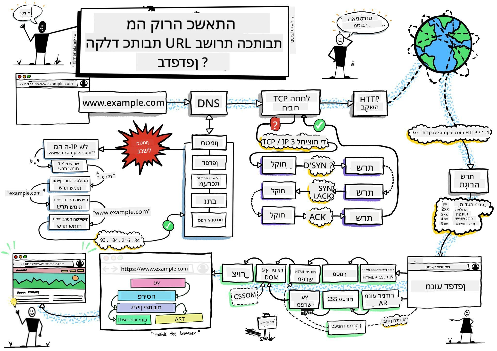
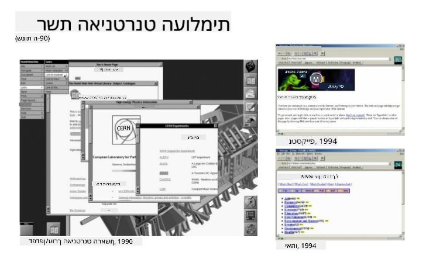
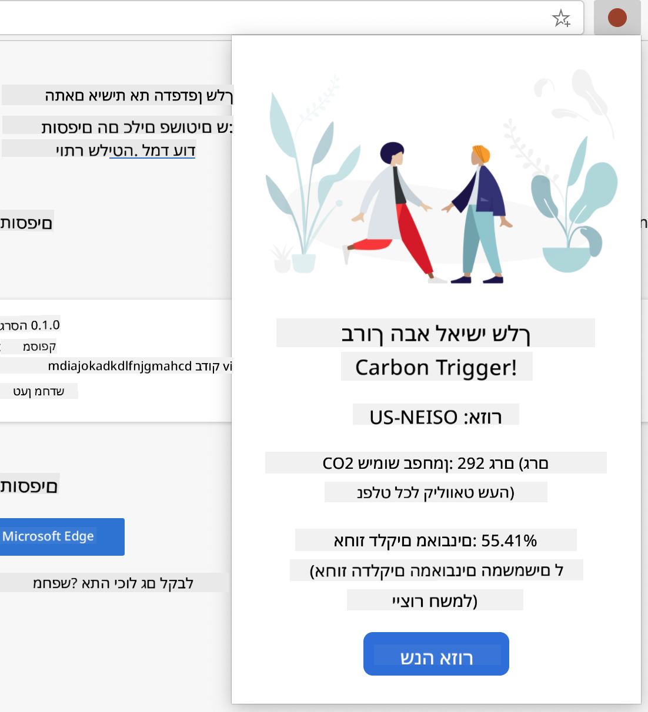

<!--
CO_OP_TRANSLATOR_METADATA:
{
  "original_hash": "0bb55e0b98600afab801eea115228873",
  "translation_date": "2025-08-27T20:47:35+00:00",
  "source_file": "5-browser-extension/1-about-browsers/README.md",
  "language_code": "he"
}
-->
# פרויקט הרחבת דפדפן חלק 1: הכל על דפדפנים


> סקיצה מאת [Wassim Chegham](https://dev.to/wassimchegham/ever-wondered-what-happens-when-you-type-in-a-url-in-an-address-bar-in-a-browser-3dob)

## שאלון לפני השיעור

[שאלון לפני השיעור](https://ff-quizzes.netlify.app/web/quiz/23)

### הקדמה

הרחבות לדפדפן מוסיפות פונקציונליות נוספת לדפדפן. אבל לפני שתבנו אחת, כדאי ללמוד קצת על איך דפדפנים עובדים.

### על הדפדפן

בסדרת השיעורים הזו, תלמדו איך לבנות הרחבת דפדפן שתעבוד על דפדפנים כמו Chrome, Firefox ו-Edge. בחלק הזה, תגלו איך דפדפנים עובדים ותבנו את הבסיס להרחבת הדפדפן.

אבל מהו דפדפן בעצם? זו תוכנה שמאפשרת למשתמש לגשת לתוכן משרת ולהציג אותו בדפי אינטרנט.

✅ קצת היסטוריה: הדפדפן הראשון נקרא 'WorldWideWeb' ונוצר על ידי סר טימותי ברנרס-לי בשנת 1990.


> כמה דפדפנים מוקדמים, דרך [Karen McGrane](https://www.slideshare.net/KMcGrane/week-4-ixd-history-personal-computing)

כאשר משתמש מתחבר לאינטרנט באמצעות כתובת URL (Uniform Resource Locator), בדרך כלל באמצעות פרוטוקול Hypertext Transfer Protocol דרך כתובת `http` או `https`, הדפדפן מתקשר עם שרת אינטרנט ומביא דף אינטרנט.

בשלב הזה, מנוע הרינדור של הדפדפן מציג את הדף על מכשיר המשתמש, שיכול להיות טלפון נייד, מחשב שולחני או מחשב נייד.

לדפדפנים יש גם יכולת לשמור תוכן במטמון כדי שלא יהיה צורך להביא אותו מהשרת בכל פעם. הם יכולים לתעד את היסטוריית הגלישה של המשתמש, לשמור 'עוגיות', שהן נתונים קטנים המכילים מידע על פעילות המשתמש, ועוד.

דבר חשוב מאוד לזכור לגבי דפדפנים הוא שהם לא כולם זהים! לכל דפדפן יש יתרונות וחסרונות, ומפתחי אתרים מקצועיים צריכים להבין איך לגרום לדפי אינטרנט לעבוד היטב בכל הדפדפנים. זה כולל טיפול בתצוגות קטנות כמו של טלפון נייד, וגם במשתמשים שאינם מחוברים לאינטרנט.

אתר מאוד שימושי שכדאי לכם לשמור במועדפים בדפדפן שאתם מעדיפים הוא [caniuse.com](https://www.caniuse.com). כשאתם בונים דפי אינטרנט, מאוד מועיל להשתמש ברשימות הטכנולוגיות הנתמכות של caniuse כדי לתמוך בצורה הטובה ביותר במשתמשים שלכם.

✅ איך אפשר לדעת אילו דפדפנים הכי פופולריים בקרב משתמשי האתר שלכם? בדקו את האנליטיקות שלכם - אפשר להתקין חבילות אנליטיקה שונות כחלק מתהליך פיתוח האתר, והן יספרו לכם אילו דפדפנים הכי בשימוש.

## הרחבות לדפדפן

למה שתרצו לבנות הרחבת דפדפן? זו דרך נוחה להוסיף לדפדפן גישה מהירה למשימות שאתם נוטים לחזור עליהן. לדוגמה, אם אתם צריכים לבדוק צבעים בדפי אינטרנט שונים שאתם עובדים איתם, תוכלו להתקין הרחבת דפדפן לבחירת צבעים. אם אתם מתקשים לזכור סיסמאות, תוכלו להשתמש בהרחבת דפדפן לניהול סיסמאות.

הרחבות לדפדפן גם כיף לפתח. הן נוטות לנהל מספר מוגבל של משימות שהן מבצעות היטב.

✅ מהן הרחבות הדפדפן האהובות עליכם? אילו משימות הן מבצעות?

### התקנת הרחבות

לפני שתתחילו לבנות, הסתכלו על תהליך הבנייה והפריסה של הרחבת דפדפן. למרות שכל דפדפן שונה מעט בניהול המשימה הזו, התהליך דומה ב-Chrome וב-Firefox לדוגמה הזו ב-Edge:


> הערה: ודאו שאתם מפעילים מצב מפתחים ומאפשרים הרחבות מחנויות אחרות.

במהות, התהליך יהיה:

- בנו את ההרחבה שלכם באמצעות `npm run build`  
- נווטו בדפדפן ללשונית ההרחבות באמצעות כפתור "הגדרות ועוד" (סמל `...`) בפינה הימנית העליונה  
- אם זו התקנה חדשה, בחרו `load unpacked` כדי להעלות הרחבה חדשה מתיקיית הבנייה שלה (במקרה שלנו זו `/dist`)  
- או, לחצו על `reload` אם אתם טוענים מחדש את ההרחבה שכבר הותקנה  

✅ ההוראות הללו מתייחסות להרחבות שאתם בונים בעצמכם; כדי להתקין הרחבות ששוחררו לחנות ההרחבות של הדפדפן, עליכם לנווט לחנויות [האלו](https://microsoftedge.microsoft.com/addons/Microsoft-Edge-Extensions-Home) ולהתקין את ההרחבה שבחרתם.

### התחילו

אתם הולכים לבנות הרחבת דפדפן שמציגה את טביעת הרגל הפחמנית של האזור שלכם, כולל צריכת האנרגיה של האזור ומקור האנרגיה. ההרחבה תכלול טופס שיאסוף מפתח API כדי שתוכלו לגשת ל-API של CO2 Signal.

**מה תצטרכו:**

- [מפתח API](https://www.co2signal.com/); הכניסו את כתובת האימייל שלכם בתיבה בעמוד הזה ומפתח יישלח אליכם  
- [קוד לאזור שלכם](http://api.electricitymap.org/v3/zones) התואם ל-[Electricity Map](https://www.electricitymap.org/map) (בבוסטון, לדוגמה, אני משתמש ב-'US-NEISO')  
- [קוד התחלתי](../../../../5-browser-extension/start). הורידו את תיקיית `start`; תשלימו את הקוד בתיקייה הזו  
- [NPM](https://www.npmjs.com) - NPM הוא כלי לניהול חבילות; התקינו אותו מקומית והחבילות המפורטות בקובץ `package.json` שלכם יותקנו לשימוש בנכס האינטרנט שלכם  

✅ למדו עוד על ניהול חבילות במודול [מעולה](https://docs.microsoft.com/learn/modules/create-nodejs-project-dependencies/?WT.mc_id=academic-77807-sagibbon) הזה.

קחו רגע לעבור על בסיס הקוד:

dist  
    -|manifest.json (הגדרות ברירת מחדל כאן)  
    -|index.html (סימון HTML של החזית כאן)  
    -|background.js (JS רקע כאן)  
    -|main.js (JS בנוי)  
src  
    -|index.js (הקוד JS שלכם כאן)  

✅ ברגע שיש לכם את מפתח ה-API וקוד האזור, שמרו אותם איפשהו כהערה לשימוש עתידי.

### בניית ה-HTML להרחבה

להרחבה הזו יש שני תצוגות. אחת לאיסוף מפתח ה-API וקוד האזור:


והשנייה להצגת צריכת הפחמן של האזור:



נתחיל בבניית ה-HTML לטופס ולעיצובו עם CSS.

בתיקיית `/dist`, תבנו טופס ואזור תוצאות. בקובץ `index.html`, מלאו את אזור הטופס המוגדר:

```HTML
<form class="form-data" autocomplete="on">
	<div>
		<h2>New? Add your Information</h2>
	</div>
	<div>
		<label for="region">Region Name</label>
		<input type="text" id="region" required class="region-name" />
	</div>
	<div>
		<label for="api">Your API Key from tmrow</label>
		<input type="text" id="api" required class="api-key" />
	</div>
	<button class="search-btn">Submit</button>
</form>	
```  
זהו הטופס שבו המידע השמור שלכם יוזן ויישמר באחסון המקומי.

לאחר מכן, צרו את אזור התוצאות; מתחת לתג הטופס האחרון, הוסיפו כמה divים:

```HTML
<div class="result">
	<div class="loading">loading...</div>
	<div class="errors"></div>
	<div class="data"></div>
	<div class="result-container">
		<p><strong>Region: </strong><span class="my-region"></span></p>
		<p><strong>Carbon Usage: </strong><span class="carbon-usage"></span></p>
		<p><strong>Fossil Fuel Percentage: </strong><span class="fossil-fuel"></span></p>
	</div>
	<button class="clear-btn">Change region</button>
</div>
```  
בשלב הזה, תוכלו לנסות בנייה. ודאו שאתם מתקינים את תלותי החבילות של ההרחבה הזו:

```
npm install
```  

הפקודה הזו תשתמש ב-npm, מנהל החבילות של Node, כדי להתקין את webpack לתהליך הבנייה של ההרחבה שלכם. תוכלו לראות את תוצאת התהליך הזה על ידי הסתכלות ב-`/dist/main.js` - תראו שהקוד נארז.

לעת עתה, ההרחבה אמורה להיבנות ואם תפרסו אותה ב-Edge כהרחבה, תראו טופס מוצג בצורה מסודרת.

מזל טוב, עשיתם את הצעדים הראשונים לקראת בניית הרחבת דפדפן. בשיעורים הבאים, תהפכו אותה ליותר פונקציונלית ושימושית.

---

## 🚀 אתגר

הסתכלו על חנות הרחבות לדפדפן והתקינו אחת לדפדפן שלכם. תוכלו לבדוק את הקבצים שלה בדרכים מעניינות. מה גיליתם?

## שאלון אחרי השיעור

[שאלון אחרי השיעור](https://ff-quizzes.netlify.app/web/quiz/24)

## סקירה ולימוד עצמי

בשיעור הזה למדתם קצת על ההיסטוריה של דפדפנים; נצלו את ההזדמנות ללמוד על איך ממציאי ה-World Wide Web דמיינו את השימוש בו על ידי קריאה נוספת על ההיסטוריה שלו. כמה אתרים שימושיים כוללים:

[ההיסטוריה של דפדפני אינטרנט](https://www.mozilla.org/firefox/browsers/browser-history/)

[היסטוריה של הרשת](https://webfoundation.org/about/vision/history-of-the-web/)

[ראיון עם טים ברנרס-לי](https://www.theguardian.com/technology/2019/mar/12/tim-berners-lee-on-30-years-of-the-web-if-we-dream-a-little-we-can-get-the-web-we-want)

## משימה

[עצבו מחדש את ההרחבה שלכם](assignment.md)

---

**כתב ויתור**:  
מסמך זה תורגם באמצעות שירות תרגום מבוסס בינה מלאכותית [Co-op Translator](https://github.com/Azure/co-op-translator). למרות שאנו שואפים לדיוק, יש לקחת בחשבון שתרגומים אוטומטיים עשויים להכיל שגיאות או אי דיוקים. המסמך המקורי בשפתו המקורית צריך להיחשב כמקור סמכותי. עבור מידע קריטי, מומלץ להשתמש בתרגום מקצועי על ידי אדם. איננו נושאים באחריות לאי הבנות או לפרשנויות שגויות הנובעות משימוש בתרגום זה.