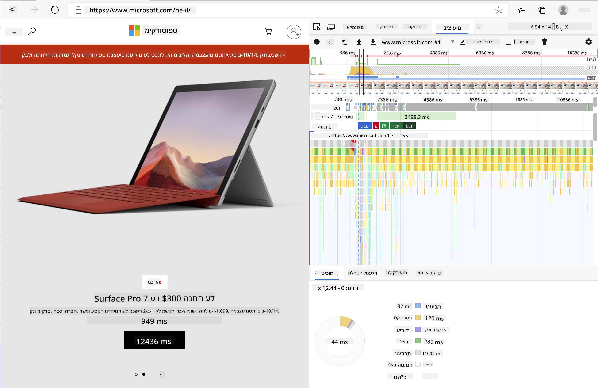
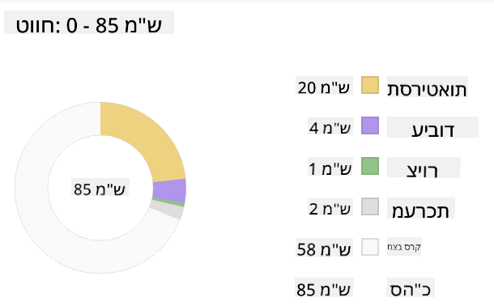

<!--
CO_OP_TRANSLATOR_METADATA:
{
  "original_hash": "f198c6b817b4b2a99749f4662e7cae98",
  "translation_date": "2025-08-27T20:50:44+00:00",
  "source_file": "5-browser-extension/3-background-tasks-and-performance/README.md",
  "language_code": "he"
}
-->
# פרויקט הרחבת דפדפן חלק 3: למדו על משימות רקע וביצועים

## שאלון לפני השיעור

[שאלון לפני השיעור](https://ashy-river-0debb7803.1.azurestaticapps.net/quiz/27)

### הקדמה

בשני השיעורים האחרונים של מודול זה, למדתם כיצד לבנות טופס ואזור תצוגה עבור נתונים שנמשכו מ-API. זהו דרך סטנדרטית מאוד ליצירת נוכחות ברשת. אפילו למדתם כיצד להתמודד עם משיכת נתונים באופן אסינכרוני. הרחבת הדפדפן שלכם כמעט מוכנה.

נותר לנהל כמה משימות רקע, כולל רענון הצבע של אייקון ההרחבה, ולכן זהו זמן מצוין לדבר על איך הדפדפן מנהל סוג כזה של משימות. בואו נחשוב על משימות הדפדפן בהקשר של ביצועי הנכסים שלכם ברשת בזמן שאתם בונים אותם.

## יסודות ביצועי רשת

> "ביצועי אתר עוסקים בשני דברים: כמה מהר הדף נטען, וכמה מהר הקוד עליו פועל." -- [זאק גרוסברט](https://www.smashingmagazine.com/2012/06/javascript-profiling-chrome-developer-tools/)

הנושא של איך להפוך את האתרים שלכם למהירים במיוחד על כל סוגי המכשירים, עבור כל סוגי המשתמשים, בכל סוגי המצבים, הוא באופן לא מפתיע רחב מאוד. הנה כמה נקודות שכדאי לזכור בזמן שאתם בונים פרויקט רשת סטנדרטי או הרחבת דפדפן.

הדבר הראשון שאתם צריכים לעשות כדי להבטיח שהאתר שלכם פועל בצורה יעילה הוא לאסוף נתונים על ביצועיו. המקום הראשון לעשות זאת הוא בכלי המפתחים של הדפדפן שלכם. ב-Edge, תוכלו לבחור את כפתור "הגדרות ועוד" (אייקון של שלוש נקודות בפינה הימנית העליונה של הדפדפן), ואז לנווט ל"עוד כלים" > "כלי מפתחים" ולפתוח את לשונית הביצועים. תוכלו גם להשתמש בקיצורי המקלדת `Ctrl` + `Shift` + `I` ב-Windows או `Option` + `Command` + `I` ב-Mac כדי לפתוח את כלי המפתחים.

לשונית הביצועים מכילה כלי פרופילינג. פתחו אתר (נסו, למשל, [https://www.microsoft.com](https://www.microsoft.com/?WT.mc_id=academic-77807-sagibbon)) ולחצו על כפתור 'Record', ואז רעננו את האתר. עצרו את ההקלטה בכל זמן, ותוכלו לראות את השגרות שנוצרות כדי 'לסקריפט', 'לרנדר' ולצייר את האתר:



✅ בקרו ב-[תיעוד של Microsoft](https://docs.microsoft.com/microsoft-edge/devtools-guide/performance/?WT.mc_id=academic-77807-sagibbon) על לשונית הביצועים ב-Edge

> טיפ: כדי לקבל קריאה מדויקת של זמן ההפעלה של האתר שלכם, נקו את מטמון הדפדפן שלכם

בחרו אלמנטים מציר הזמן של הפרופיל כדי להתמקד באירועים שמתרחשים בזמן טעינת הדף שלכם.

קבלו תמונת מצב של ביצועי הדף שלכם על ידי בחירת חלק מציר הזמן של הפרופיל והסתכלות על חלונית הסיכום:



בדקו את חלונית יומן האירועים כדי לראות אם יש אירוע שלקח יותר מ-15 מילישניות:


✅ הכירו את הפרופילר שלכם! פתחו את כלי המפתחים באתר זה ובדקו אם יש צווארי בקבוק. מהו הנכס שנטען הכי לאט? הכי מהר?

## בדיקות פרופילינג

באופן כללי, ישנם כמה "אזורים בעייתיים" שכל מפתח רשת צריך לשים לב אליהם בזמן בניית אתר כדי להימנע מהפתעות לא נעימות בזמן ההפצה לייצור.

**גדלי נכסים**: הרשת הפכה ל'כבדה' יותר, ולכן איטית יותר, בשנים האחרונות. חלק מהמשקל הזה קשור לשימוש בתמונות.

✅ הסתכלו דרך [ארכיון האינטרנט](https://httparchive.org/reports/page-weight) לתצוגה היסטורית של משקל דפים ועוד.

פרקטיקה טובה היא להבטיח שהתמונות שלכם מותאמות ומסופקות בגודל וברזולוציה הנכונים עבור המשתמשים שלכם.

**מעברים ב-DOM**: הדפדפן צריך לבנות את מודל האובייקטים של המסמך (DOM) על בסיס הקוד שאתם כותבים, ולכן זהו אינטרס של ביצועי דף טובים לשמור על התגים שלכם מינימליים, תוך שימוש ועיצוב רק מה שהדף צריך. בהקשר זה, CSS מיותר הקשור לדף יכול להיות מותאם; סגנונות שצריכים להיות בשימוש רק בדף אחד לא צריכים להיכלל בגיליון הסגנונות הראשי, למשל.

**JavaScript**: כל מפתח JavaScript צריך לשים לב לסקריפטים שחוסמים רנדרינג ושחייבים להיטען לפני שה-DOM יכול להיות מנווט ומצויר לדפדפן. שקלו להשתמש ב-`defer` עם הסקריפטים המוטמעים שלכם (כפי שנעשה במודול הטרריום).

✅ נסו כמה אתרים באתר [בדיקת מהירות אתרים](https://www.webpagetest.org/) כדי ללמוד עוד על הבדיקות הנפוצות שנעשות כדי לקבוע ביצועי אתר.

עכשיו כשיש לכם מושג איך הדפדפן מרנדר את הנכסים שאתם שולחים אליו, בואו נסתכל על הדברים האחרונים שאתם צריכים לעשות כדי להשלים את ההרחבה שלכם:

### יצירת פונקציה לחישוב צבע

עבדו ב-`/src/index.js`, הוסיפו פונקציה בשם `calculateColor()` אחרי סדרת משתני ה-`const` שהגדרתם כדי לקבל גישה ל-DOM:

```JavaScript
function calculateColor(value) {
	let co2Scale = [0, 150, 600, 750, 800];
	let colors = ['#2AA364', '#F5EB4D', '#9E4229', '#381D02', '#381D02'];

	let closestNum = co2Scale.sort((a, b) => {
		return Math.abs(a - value) - Math.abs(b - value);
	})[0];
	console.log(value + ' is closest to ' + closestNum);
	let num = (element) => element > closestNum;
	let scaleIndex = co2Scale.findIndex(num);

	let closestColor = colors[scaleIndex];
	console.log(scaleIndex, closestColor);

	chrome.runtime.sendMessage({ action: 'updateIcon', value: { color: closestColor } });
}
```

מה קורה כאן? אתם מעבירים ערך (עוצמת הפחמן) מהקריאה ל-API שהשלמתם בשיעור האחרון, ואז מחשבים כמה קרוב הערך שלו למדד המוצג במערך הצבעים. לאחר מכן אתם שולחים את ערך הצבע הקרוב ביותר ל-runtime של Chrome.

ל-runtime של Chrome יש [API](https://developer.chrome.com/extensions/runtime) שמטפל בכל מיני משימות רקע, וההרחבה שלכם מנצלת אותו:

> "השתמשו ב-API של chrome.runtime כדי לאחזר את דף הרקע, להחזיר פרטים על המניפסט, ולהאזין ולהגיב לאירועים במחזור החיים של האפליקציה או ההרחבה. תוכלו גם להשתמש ב-API הזה כדי להמיר את הנתיב היחסי של כתובות URL לכתובות URL מוסמכות לחלוטין."

✅ אם אתם מפתחים את הרחבת הדפדפן הזו עבור Edge, זה עשוי להפתיע אתכם שאתם משתמשים ב-API של Chrome. גרסאות הדפדפן החדשות של Edge פועלות על מנוע הדפדפן Chromium, כך שתוכלו לנצל את הכלים הללו.

> שימו לב, אם אתם רוצים לבצע פרופילינג להרחבת דפדפן, פתחו את כלי המפתחים מתוך ההרחבה עצמה, שכן היא מופעלת כדפדפן נפרד.

### הגדרת צבע אייקון ברירת מחדל

עכשיו, בפונקציה `init()`, הגדירו את האייקון להיות ירוק כללי בהתחלה על ידי קריאה לפעולת `updateIcon` של Chrome:

```JavaScript
chrome.runtime.sendMessage({
	action: 'updateIcon',
		value: {
			color: 'green',
		},
});
```

### קריאה לפונקציה, ביצוע הקריאה

לאחר מכן, קראו לפונקציה שיצרתם על ידי הוספתה להבטחה המוחזרת על ידי ה-API של C02Signal:

```JavaScript
//let CO2...
calculateColor(CO2);
```

ולבסוף, ב-`/dist/background.js`, הוסיפו מאזין לקריאות פעולות הרקע הללו:

```JavaScript
chrome.runtime.onMessage.addListener(function (msg, sender, sendResponse) {
	if (msg.action === 'updateIcon') {
		chrome.browserAction.setIcon({ imageData: drawIcon(msg.value) });
	}
});
//borrowed from energy lollipop extension, nice feature!
function drawIcon(value) {
	let canvas = document.createElement('canvas');
	let context = canvas.getContext('2d');

	context.beginPath();
	context.fillStyle = value.color;
	context.arc(100, 100, 50, 0, 2 * Math.PI);
	context.fill();

	return context.getImageData(50, 50, 100, 100);
}
```

בקוד הזה, אתם מוסיפים מאזין לכל הודעה שמגיעה למנהל משימות הרקע. אם היא נקראת 'updateIcon', אז הקוד הבא מופעל כדי לצייר אייקון בצבע המתאים באמצעות Canvas API.

✅ תלמדו עוד על Canvas API בשיעורי [משחק החלל](../../6-space-game/2-drawing-to-canvas/README.md).

עכשיו, בנו מחדש את ההרחבה שלכם (`npm run build`), רעננו והפעילו את ההרחבה שלכם, וצפו בשינוי הצבע. האם זה זמן טוב לצאת לסידורים או לשטוף כלים? עכשיו אתם יודעים!

מזל טוב, בניתם הרחבת דפדפן שימושית ולמדתם יותר על איך הדפדפן עובד ואיך לבצע פרופילינג לביצועיו.

---

## 🚀 אתגר

חקור כמה אתרים בקוד פתוח שהיו קיימים זמן רב, ועל בסיס ההיסטוריה שלהם ב-GitHub, נסה לקבוע כיצד הם אופטימיזצו לאורך השנים לביצועים, אם בכלל. מהו נקודת הכאב הנפוצה ביותר?

## שאלון אחרי השיעור

[שאלון אחרי השיעור](https://ashy-river-0debb7803.1.azurestaticapps.net/quiz/28)

## סקירה ולימוד עצמי

שקול להירשם ל-[ניוזלטר ביצועים](https://perf.email/)

חקור כמה מהדרכים שבהן דפדפנים מודדים ביצועי רשת על ידי הסתכלות בלשוניות הביצועים בכלי הרשת שלהם. האם מצאת הבדלים משמעותיים?

## משימה

[נתח אתר לביצועים](assignment.md)

---

**כתב ויתור**:  
מסמך זה תורגם באמצעות שירות תרגום מבוסס בינה מלאכותית [Co-op Translator](https://github.com/Azure/co-op-translator). בעוד שאנו שואפים לדיוק, יש להיות מודעים לכך שתרגומים אוטומטיים עשויים להכיל שגיאות או אי דיוקים. המסמך המקורי בשפתו המקורית צריך להיחשב כמקור הסמכותי. עבור מידע קריטי, מומלץ להשתמש בתרגום מקצועי על ידי אדם. איננו נושאים באחריות לאי הבנות או לפרשנויות שגויות הנובעות משימוש בתרגום זה.