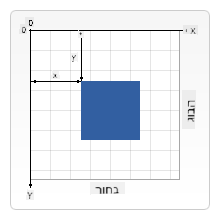

<!--
CO_OP_TRANSLATOR_METADATA:
{
  "original_hash": "41be8d35e7f30aa9dad10773c35e89c4",
  "translation_date": "2025-08-27T20:25:19+00:00",
  "source_file": "6-space-game/2-drawing-to-canvas/README.md",
  "language_code": "he"
}
-->
# בנה משחק חלל חלק 2: צייר גיבור ומפלצות על הקנבס

## חידון לפני ההרצאה

[חידון לפני ההרצאה](https://ashy-river-0debb7803.1.azurestaticapps.net/quiz/31)

## הקנבס

הקנבס הוא אלמנט HTML שלברירת מחדל אין לו תוכן; הוא לוח ריק. עליך להוסיף לו תוכן על ידי ציור עליו.

✅ קרא [עוד על Canvas API](https://developer.mozilla.org/docs/Web/API/Canvas_API) ב-MDN.

כך הוא בדרך כלל מוגדר כחלק מגוף הדף:

```html
<canvas id="myCanvas" width="200" height="100"></canvas>
```

למעלה אנו מגדירים את `id`, `width` ו-`height`.

- `id`: הגדר זאת כדי שתוכל לקבל הפניה כאשר תצטרך לתקשר איתו.
- `width`: זהו הרוחב של האלמנט.
- `height`: זהו הגובה של האלמנט.

## ציור גיאומטריה פשוטה

הקנבס משתמש במערכת קואורדינטות קרטזית לציור. לכן הוא משתמש בציר x וציר y כדי לבטא היכן משהו ממוקם. המיקום `0,0` הוא הפינה השמאלית העליונה, והפינה הימנית התחתונה היא מה שהגדרת כרוחב וגובה הקנבס.


> תמונה מ-[MDN](https://developer.mozilla.org/docs/Web/API/Canvas_API/Tutorial/Drawing_shapes)

כדי לצייר על אלמנט הקנבס תצטרך לעבור את השלבים הבאים:

1. **קבל הפניה** לאלמנט הקנבס.
2. **קבל הפניה** לאלמנט ההקשר שיושב על אלמנט הקנבס.
3. **בצע פעולת ציור** באמצעות אלמנט ההקשר.

הקוד לשלבים הנ"ל בדרך כלל נראה כך:

```javascript
// draws a red rectangle
//1. get the canvas reference
canvas = document.getElementById("myCanvas");

//2. set the context to 2D to draw basic shapes
ctx = canvas.getContext("2d");

//3. fill it with the color red
ctx.fillStyle = 'red';

//4. and draw a rectangle with these parameters, setting location and size
ctx.fillRect(0,0, 200, 200) // x,y,width, height
```

✅ Canvas API מתמקד בעיקר בצורות דו-ממדיות, אך ניתן גם לצייר אלמנטים תלת-ממדיים לאתר אינטרנט; לשם כך תוכל להשתמש ב-[WebGL API](https://developer.mozilla.org/docs/Web/API/WebGL_API).

ניתן לצייר כל מיני דברים עם Canvas API כמו:

- **צורות גיאומטריות**, כבר הראינו איך לצייר מלבן, אבל יש עוד הרבה מה לצייר.
- **טקסט**, ניתן לצייר טקסט בכל גופן וצבע שתרצה.
- **תמונות**, ניתן לצייר תמונה המבוססת על נכס תמונה כמו .jpg או .png למשל.

✅ נסה זאת! אתה יודע איך לצייר מלבן, האם תוכל לצייר עיגול על הדף? תסתכל על כמה ציורים מעניינים של Canvas ב-CodePen. הנה [דוגמה מרשימה במיוחד](https://codepen.io/dissimulate/pen/KrAwx).

## טען וצייר נכס תמונה

ניתן לטעון נכס תמונה על ידי יצירת אובייקט `Image` והגדרת המאפיין `src` שלו. לאחר מכן, האזן לאירוע `load` כדי לדעת מתי הוא מוכן לשימוש. הקוד נראה כך:

### טעינת נכס

```javascript
const img = new Image();
img.src = 'path/to/my/image.png';
img.onload = () => {
  // image loaded and ready to be used
}
```

### תבנית טעינת נכס

מומלץ לעטוף את הקוד הנ"ל במבנה כמו זה, כך שיהיה קל יותר לשימוש ותנסה לתפעל אותו רק כשהוא נטען במלואו:

```javascript
function loadAsset(path) {
  return new Promise((resolve) => {
    const img = new Image();
    img.src = path;
    img.onload = () => {
      // image loaded and ready to be used
      resolve(img);
    }
  })
}

// use like so

async function run() {
  const heroImg = await loadAsset('hero.png')
  const monsterImg = await loadAsset('monster.png')
}

```

כדי לצייר נכסי משחק על המסך, הקוד שלך ייראה כך:

```javascript
async function run() {
  const heroImg = await loadAsset('hero.png')
  const monsterImg = await loadAsset('monster.png')

  canvas = document.getElementById("myCanvas");
  ctx = canvas.getContext("2d");
  ctx.drawImage(heroImg, canvas.width/2,canvas.height/2);
  ctx.drawImage(monsterImg, 0,0);
}
```

## עכשיו הזמן להתחיל לבנות את המשחק שלך

### מה לבנות

תבנה דף אינטרנט עם אלמנט קנבס. עליו להציג מסך שחור בגודל `1024*768`. סיפקנו לך שתי תמונות:

- ספינת גיבור

   

- 5*5 מפלצות

   

### שלבים מומלצים להתחלת הפיתוח

אתר את הקבצים שנוצרו עבורך בתיקיית המשנה `your-work`. היא אמורה להכיל את הדברים הבאים:

```bash
-| assets
  -| enemyShip.png
  -| player.png
-| index.html
-| app.js
-| package.json
```

פתח עותק של תיקייה זו ב-Visual Studio Code. עליך להגדיר סביבת פיתוח מקומית, רצוי עם Visual Studio Code עם NPM ו-Node מותקנים. אם אין לך `npm` מותקן במחשב, [כך תעשה זאת](https://www.npmjs.com/get-npm).

התחל את הפרויקט שלך על ידי ניווט לתיקיית `your_work`:

```bash
cd your-work
npm start
```

הקוד לעיל יפעיל שרת HTTP בכתובת `http://localhost:5000`. פתח דפדפן והזן את הכתובת הזו. כרגע זהו דף ריק, אבל זה ישתנה.

> הערה: כדי לראות שינויים על המסך, רענן את הדפדפן.

### הוסף קוד

הוסף את הקוד הדרוש ל-`your-work/app.js` כדי לפתור את המשימות הבאות:

1. **צייר** קנבס עם רקע שחור  
   > טיפ: הוסף שתי שורות תחת ה-TODO המתאים ב-`/app.js`, הגדר את האלמנט `ctx` לשחור ואת הקואורדינטות העליונות/שמאליות ל-0,0 ואת הגובה והרוחב לשווים לאלו של הקנבס.
2. **טען** טקסטורות  
   > טיפ: טען את תמונות השחקן והאויב באמצעות `await loadTexture` והעבר את נתיב התמונה. עדיין לא תראה אותן על המסך!
3. **צייר** את הגיבור במרכז המסך בחצי התחתון  
   > טיפ: השתמש ב-API `drawImage` כדי לצייר את `heroImg` על המסך, הגדר את `canvas.width / 2 - 45` ואת `canvas.height - canvas.height / 4)`.
4. **צייר** 5*5 מפלצות  
   > טיפ: כעת תוכל לבטל את ההערה על הקוד לציור אויבים על המסך. לאחר מכן, עבור לפונקציה `createEnemies` ובנה אותה.

   ראשית, הגדר כמה קבועים:

    ```javascript
    const MONSTER_TOTAL = 5;
    const MONSTER_WIDTH = MONSTER_TOTAL * 98;
    const START_X = (canvas.width - MONSTER_WIDTH) / 2;
    const STOP_X = START_X + MONSTER_WIDTH;
    ```

   לאחר מכן, צור לולאה לציור מערך המפלצות על המסך:

    ```javascript
    for (let x = START_X; x < STOP_X; x += 98) {
        for (let y = 0; y < 50 * 5; y += 50) {
          ctx.drawImage(enemyImg, x, y);
        }
      }
    ```

## תוצאה

התוצאה הסופית אמורה להיראות כך:


## פתרון

נסה לפתור זאת בעצמך קודם, אך אם תיתקע, עיין ב-[פתרון](../../../../6-space-game/2-drawing-to-canvas/solution/app.js).

---

## 🚀 אתגר

למדת על ציור עם Canvas API הממוקד בדו-ממד; עיין ב-[WebGL API](https://developer.mozilla.org/docs/Web/API/WebGL_API), ונסה לצייר אובייקט תלת-ממדי.

## חידון לאחר ההרצאה

[חידון לאחר ההרצאה](https://ashy-river-0debb7803.1.azurestaticapps.net/quiz/32)

## סקירה ולמידה עצמית

למד עוד על Canvas API על ידי [קריאה עליו](https://developer.mozilla.org/docs/Web/API/Canvas_API).

## משימה

[שחק עם Canvas API](assignment.md)

---

**כתב ויתור**:  
מסמך זה תורגם באמצעות שירות תרגום מבוסס בינה מלאכותית [Co-op Translator](https://github.com/Azure/co-op-translator). בעוד שאנו שואפים לדיוק, יש להיות מודעים לכך שתרגומים אוטומטיים עשויים להכיל שגיאות או אי דיוקים. המסמך המקורי בשפתו המקורית צריך להיחשב כמקור סמכותי. עבור מידע קריטי, מומלץ להשתמש בתרגום מקצועי על ידי אדם. איננו נושאים באחריות לאי הבנות או לפרשנויות שגויות הנובעות משימוש בתרגום זה.