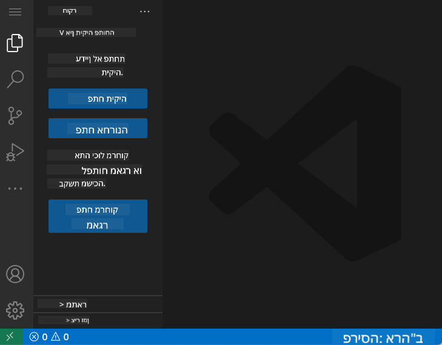
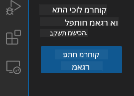
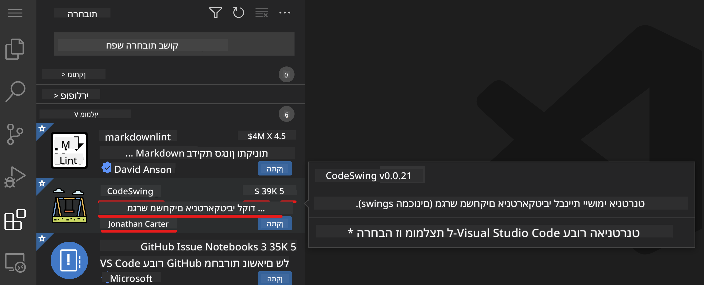
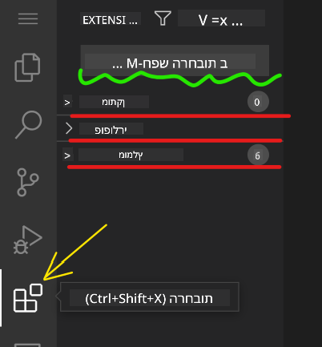

<!--
CO_OP_TRANSLATOR_METADATA:
{
  "original_hash": "7aa6e4f270d38d9cb17f2b5bd86b863d",
  "translation_date": "2025-08-27T20:40:47+00:00",
  "source_file": "8-code-editor/1-using-a-code-editor/README.md",
  "language_code": "he"
}
-->
# שימוש בעורך קוד

השיעור הזה מכסה את הבסיס לשימוש ב-[VSCode.dev](https://vscode.dev), עורך קוד מבוסס אינטרנט, כך שתוכלו לבצע שינויים בקוד שלכם ולתרום לפרויקט מבלי להתקין שום דבר על המחשב שלכם.

## מטרות למידה

בשיעור הזה תלמדו כיצד:

- להשתמש בעורך קוד בפרויקט קוד
- לעקוב אחר שינויים באמצעות בקרת גרסאות
- להתאים את העורך לצרכי הפיתוח שלכם

### דרישות מקדימות

לפני שתתחילו, תצטרכו ליצור חשבון ב-[GitHub](https://github.com). גשו ל-[GitHub](https://github.com/) וצרו חשבון אם עדיין אין לכם אחד.

### הקדמה

עורך קוד הוא כלי חיוני לכתיבת תוכניות ולשיתוף פעולה בפרויקטים קיימים. ברגע שתבינו את הבסיס של עורך קוד וכיצד להשתמש בתכונותיו, תוכלו ליישם זאת בעת כתיבת קוד.

## התחלת עבודה עם VSCode.dev

[VSCode.dev](https://vscode.dev) הוא עורך קוד מבוסס אינטרנט. אין צורך להתקין שום דבר כדי להשתמש בו, בדיוק כמו פתיחת כל אתר אחר. כדי להתחיל לעבוד עם העורך, פתחו את הקישור הבא: [https://vscode.dev](https://vscode.dev). אם אינכם מחוברים ל-[GitHub](https://github.com/), עקבו אחר ההנחיות להתחבר או ליצור חשבון חדש ואז התחברו.

לאחר טעינת העורך, הוא אמור להיראות דומה לתמונה הזו:



ישנם שלושה חלקים עיקריים, מהשמאל לימין:

1. **סרגל הפעילות** הכולל כמה אייקונים, כמו זכוכית מגדלת 🔎, גלגל שיניים ⚙️, ועוד כמה.
2. **סרגל הצד** שמתרחב כברירת מחדל ל-**Explorer**.
3. **אזור הקוד** בצד ימין.

לחצו על כל אחד מהאייקונים כדי להציג תפריט שונה. לאחר מכן, לחצו על **Explorer** כדי לחזור לנקודת ההתחלה.

כאשר תתחילו ליצור קוד או לשנות קוד קיים, זה יקרה באזור הגדול בצד ימין. תשתמשו באזור הזה גם כדי לצפות בקוד קיים, כפי שתעשו בהמשך.

## פתיחת מאגר GitHub

הדבר הראשון שתצטרכו לעשות הוא לפתוח מאגר GitHub. ישנן דרכים שונות לפתוח מאגר. בחלק הזה תראו שתי דרכים שונות לפתוח מאגר כדי שתוכלו להתחיל לעבוד על שינויים.

### 1. באמצעות העורך

השתמשו בעורך עצמו כדי לפתוח מאגר מרוחק. אם תלכו ל-[VSCode.dev](https://vscode.dev), תראו כפתור **"Open Remote Repository"**:



ניתן גם להשתמש ב-Command Palette. ה-Command Palette הוא תיבת קלט שבה ניתן להקליד כל מילה שהיא חלק מפעולה או פקודה כדי למצוא את הפקודה המתאימה לביצוע. השתמשו בתפריט בפינה השמאלית העליונה, בחרו **View**, ואז בחרו **Command Palette**, או השתמשו בקיצור המקלדת: Ctrl-Shift-P (ב-MacOS זה יהיה Command-Shift-P).


לאחר פתיחת התפריט, הקלידו **open remote repository**, ואז בחרו באפשרות הראשונה. מאגרים רבים שאתם חלק מהם או שפתחתם לאחרונה יופיעו. ניתן גם להשתמש בכתובת URL מלאה של GitHub כדי לבחור אחד. השתמשו בכתובת הבאה והדביקו אותה בתיבה:

```
https://github.com/microsoft/Web-Dev-For-Beginners
```

✅ אם הצלחתם, כל הקבצים של המאגר הזה ייטענו בעורך הטקסט.

### 2. באמצעות כתובת URL

ניתן גם להשתמש בכתובת URL ישירות כדי לטעון מאגר. לדוגמה, הכתובת המלאה של המאגר הנוכחי היא [https://github.com/microsoft/Web-Dev-For-Beginners](https://github.com/microsoft/Web-Dev-For-Beginners), אך ניתן להחליף את הדומיין של GitHub ב-`VSCode.dev/github` ולטעון את המאגר ישירות. הכתובת שתתקבל תהיה [https://vscode.dev/github/microsoft/Web-Dev-For-Beginners](https://vscode.dev/github/microsoft/Web-Dev-For-Beginners).

## עריכת קבצים

לאחר שפתחתם את המאגר בדפדפן/VSCode.dev, השלב הבא יהיה לבצע עדכונים או שינויים בפרויקט.

### 1. יצירת קובץ חדש

ניתן ליצור קובץ בתוך תיקייה קיימת או בתיקיית השורש. כדי ליצור קובץ חדש, פתחו מיקום/תיקייה שבה תרצו לשמור את הקובץ ובחרו באייקון **'New file ...'** בסרגל הפעילות _(שמאל)_, תנו לו שם ולחצו Enter.


### 2. עריכה ושמירת קובץ במאגר

שימוש ב-VSCode.dev הוא מועיל כאשר רוצים לבצע עדכונים מהירים לפרויקט מבלי לטעון תוכנה מקומית.  
כדי לעדכן את הקוד שלכם, לחצו על אייקון **Explorer**, שנמצא גם הוא בסרגל הפעילות, כדי לצפות בקבצים ובתיקיות במאגר.  
בחרו קובץ כדי לפתוח אותו באזור הקוד, בצעו את השינויים ושמרו.


לאחר שסיימתם לעדכן את הפרויקט, בחרו באייקון **`source control`**, שמכיל את כל השינויים החדשים שביצעתם במאגר.

כדי לצפות בשינויים שביצעתם בפרויקט, בחרו בקובץ/ים בתיקיית `Changes` בסרגל הצד המורחב. זה יפתח **'Working Tree'** שבו תוכלו לראות באופן חזותי את השינויים שביצעתם בקובץ. אדום מציין הסרה מהפרויקט, בעוד ירוק מציין תוספת.


אם אתם מרוצים מהשינויים שביצעתם, רחפו מעל תיקיית `Changes` ולחצו על כפתור `+` כדי לשלב את השינויים. שילוב פירושו הכנת השינויים שלכם להתחייבות ל-GitHub.

אם אינכם מרוצים מחלק מהשינויים ורוצים לבטל אותם, רחפו מעל תיקיית `Changes` ובחרו באייקון `undo`.

לאחר מכן, הקלידו **הודעת התחייבות** _(תיאור של השינוי שביצעתם בפרויקט)_, לחצו על אייקון ה-`check` כדי להתחייב ולדחוף את השינויים.

לאחר שסיימתם לעבוד על הפרויקט, בחרו באייקון **תפריט ההמבורגר** בפינה השמאלית העליונה כדי לחזור למאגר ב-github.com.


## שימוש בתוספים

התקנת תוספים ב-VSCode מאפשרת לכם להוסיף תכונות חדשות ואפשרויות התאמה אישית לסביבת הפיתוח שלכם בעורך, כדי לשפר את זרימת העבודה שלכם. תוספים אלו גם עוזרים להוסיף תמיכה בשפות תכנות שונות ולעיתים הם תוספים כלליים או מבוססי שפה.

כדי לעיין ברשימת כל התוספים הזמינים, לחצו על אייקון **`Extensions`** בסרגל הפעילות והתחילו להקליד את שם התוסף בשדה הטקסט המסומן **'Search Extensions in Marketplace'**.  
תראו רשימה של תוספים, שכל אחד מהם מכיל **שם התוסף, שם המפרסם, תיאור קצר, מספר הורדות** ו-**דירוג כוכבים**.



ניתן גם לצפות בכל התוספים שהותקנו בעבר על ידי הרחבת תיקיית **`Installed`**, תוספים פופולריים שמשתמשים בהם רוב המפתחים בתיקיית **`Popular`**, ותוספים מומלצים עבורכם על סמך משתמשים באותו סביבת עבודה או קבצים שפתחתם לאחרונה בתיקיית **`Recommended`**.



### 1. התקנת תוספים

כדי להתקין תוסף, הקלידו את שם התוסף בשדה החיפוש ולחצו עליו כדי לצפות במידע נוסף על התוסף באזור הקוד לאחר שהוא מופיע בסרגל הצד המורחב.

ניתן ללחוץ על **כפתור ההתקנה הכחול** בסרגל הצד המורחב כדי להתקין או להשתמש בכפתור ההתקנה שמופיע באזור הקוד לאחר שבחרתם בתוסף לצפייה במידע נוסף.


### 2. התאמת תוספים

לאחר התקנת התוסף, ייתכן שתצטרכו לשנות את ההתנהגות שלו ולהתאים אותו להעדפותיכם.  
לשם כך, בחרו באייקון **Extensions**, והפעם התוסף שלכם יופיע בתיקיית **Installed**, לחצו על **אייקון הגלגל** ועברו ל-**Extensions Setting**.


### 3. ניהול תוספים

לאחר התקנה ושימוש בתוסף, VSCode.dev מציע אפשרויות לניהול התוסף בהתאם לצרכים שונים. לדוגמה, תוכלו לבחור:

- **השבתה:** _(ניתן להשבית תוסף באופן זמני כאשר אינכם זקוקים לו אך אינכם רוצים להסיר אותו לחלוטין)_

    בחרו בתוסף המותקן בסרגל הצד המורחב > לחצו על אייקון הגלגל > בחרו 'Disable' או 'Disable (Workspace)' **או** פתחו את התוסף באזור הקוד ולחצו על כפתור ההשבתה הכחול.

- **הסרה:** בחרו בתוסף המותקן בסרגל הצד המורחב > לחצו על אייקון הגלגל > בחרו 'Uninstall' **או** פתחו את התוסף באזור הקוד ולחצו על כפתור ההסרה הכחול.

---

## משימה

[צרו אתר קורות חיים באמצעות vscode.dev](https://github.com/microsoft/Web-Dev-For-Beginners/blob/main/8-code-editor/1-using-a-code-editor/assignment.md)

## סקירה ולימוד עצמי

קראו עוד על [VSCode.dev](https://code.visualstudio.com/docs/editor/vscode-web?WT.mc_id=academic-0000-alfredodeza) ותכונות נוספות שלו.

---

**כתב ויתור**:  
מסמך זה תורגם באמצעות שירות תרגום מבוסס בינה מלאכותית [Co-op Translator](https://github.com/Azure/co-op-translator). למרות שאנו שואפים לדיוק, יש להיות מודעים לכך שתרגומים אוטומטיים עשויים להכיל שגיאות או אי דיוקים. המסמך המקורי בשפתו המקורית צריך להיחשב כמקור סמכותי. עבור מידע קריטי, מומלץ להשתמש בתרגום מקצועי על ידי אדם. איננו נושאים באחריות לאי הבנות או לפרשנויות שגויות הנובעות משימוש בתרגום זה.