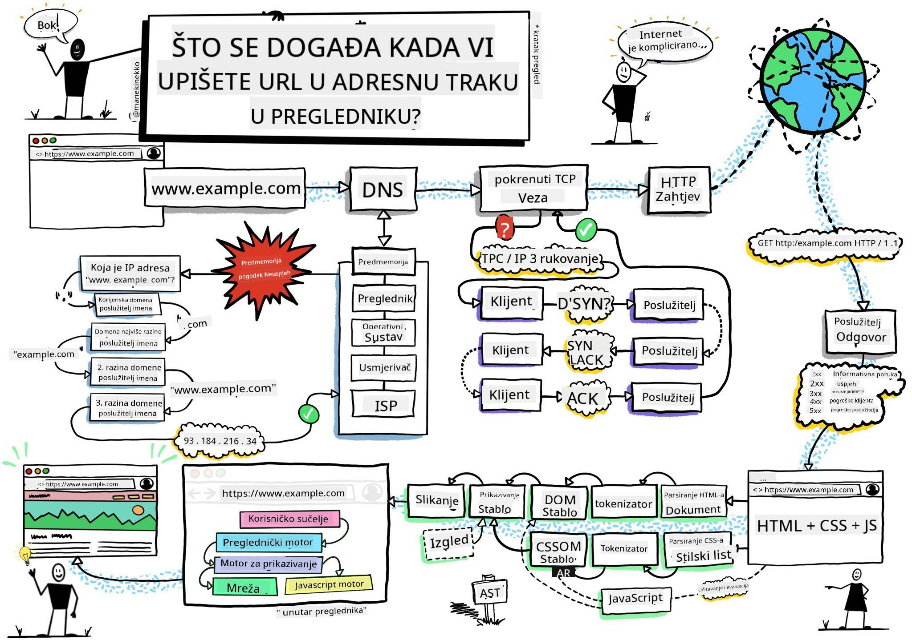
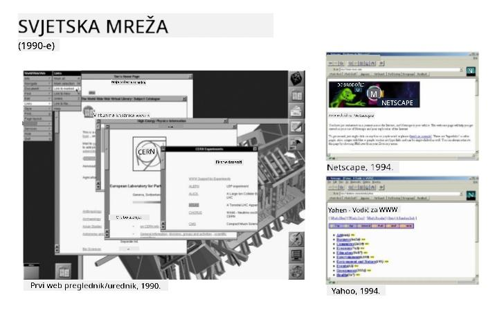
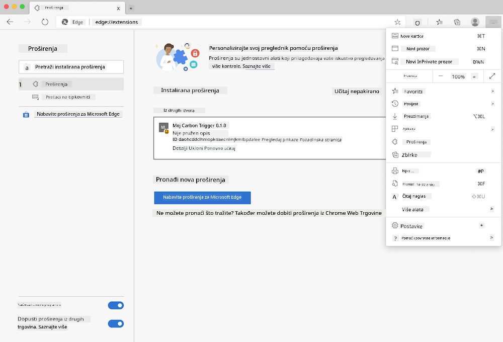
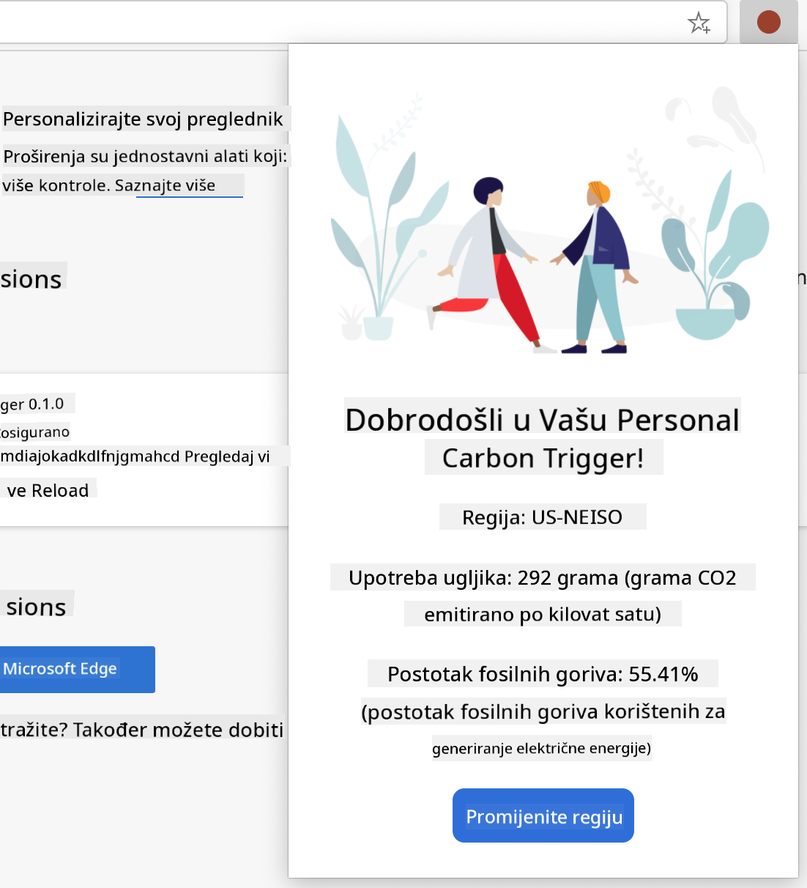

<!--
CO_OP_TRANSLATOR_METADATA:
{
  "original_hash": "0bb55e0b98600afab801eea115228873",
  "translation_date": "2025-08-27T22:13:20+00:00",
  "source_file": "5-browser-extension/1-about-browsers/README.md",
  "language_code": "hr"
}
-->
# Projekt proširenja preglednika, 1. dio: Sve o preglednicima


> Sketchnote autor [Wassim Chegham](https://dev.to/wassimchegham/ever-wondered-what-happens-when-you-type-in-a-url-in-an-address-bar-in-a-browser-3dob)

## Kviz prije predavanja

[Kviz prije predavanja](https://ff-quizzes.netlify.app/web/quiz/23)

### Uvod

Proširenja preglednika dodaju dodatnu funkcionalnost pregledniku. No, prije nego što izradite jedno, trebali biste naučiti malo o tome kako preglednici obavljaju svoj posao.

### O pregledniku

U ovom nizu lekcija naučit ćete kako izraditi proširenje preglednika koje će raditi na preglednicima Chrome, Firefox i Edge. U ovom dijelu otkrit ćete kako preglednici funkcioniraju i postaviti osnovne elemente proširenja preglednika.

Ali što je zapravo preglednik? To je softverska aplikacija koja omogućuje krajnjem korisniku pristup sadržaju s poslužitelja i prikazuje ga na web stranicama.

✅ Malo povijesti: prvi preglednik zvao se 'WorldWideWeb' i stvorio ga je Sir Timothy Berners-Lee 1990. godine.


> Neki od ranih preglednika, via [Karen McGrane](https://www.slideshare.net/KMcGrane/week-4-ixd-history-personal-computing)

Kada se korisnik poveže na internet koristeći URL (Uniform Resource Locator) adresu, obično putem Hypertext Transfer Protocol-a putem `http` ili `https` adrese, preglednik komunicira s web poslužiteljem i dohvaća web stranicu.

U tom trenutku, render engine preglednika prikazuje stranicu na korisnikovom uređaju, koji može biti mobilni telefon, stolno računalo ili prijenosno računalo.

Preglednici također imaju mogućnost predmemoriranja sadržaja kako ga ne bi morali dohvaćati s poslužitelja svaki put. Mogu zabilježiti povijest korisnikovih aktivnosti pregledavanja, pohraniti 'kolačiće', male dijelove podataka koji sadrže informacije o korisnikovim aktivnostima, i još mnogo toga.

Važno je zapamtiti da svi preglednici nisu isti! Svaki preglednik ima svoje prednosti i nedostatke, a profesionalni web programer mora razumjeti kako učiniti da web stranice dobro funkcioniraju na različitim preglednicima. To uključuje prilagodbu malim zaslonima, poput onih na mobilnim telefonima, kao i korisnicima koji su offline.

Vrlo koristan web alat koji biste trebali označiti u svom omiljenom pregledniku je [caniuse.com](https://www.caniuse.com). Kada izrađujete web stranice, vrlo je korisno koristiti popise podržanih tehnologija na caniuse kako biste najbolje podržali svoje korisnike.

✅ Kako možete saznati koji su preglednici najpopularniji među korisnicima vaše web stranice? Provjerite analitiku - možete instalirati razne analitičke pakete kao dio procesa razvoja web stranice, koji će vam reći koji preglednici se najviše koriste.

## Proširenja preglednika

Zašto biste željeli izraditi proširenje preglednika? To je zgodan dodatak pregledniku kada trebate brz pristup zadacima koje često ponavljate. Na primjer, ako često trebate provjeravati boje na raznim web stranicama koje koristite, možete instalirati proširenje za odabir boja. Ako imate problema s pamćenjem lozinki, možete koristiti proširenje za upravljanje lozinkama.

Proširenja preglednika također su zabavna za razvoj. Obično upravljaju ograničenim brojem zadataka koje obavljaju vrlo dobro.

✅ Koja su vaša omiljena proširenja preglednika? Koje zadatke obavljaju?

### Instaliranje proširenja

Prije nego što počnete izrađivati, pogledajte proces izrade i implementacije proširenja preglednika. Iako se svaki preglednik malo razlikuje u načinu upravljanja ovim zadatkom, proces je sličan na Chromeu i Firefoxu kao u ovom primjeru na Edgeu:



> Napomena: Obavezno uključite način rada za razvojne programere i dopustite proširenja iz drugih trgovina.

U suštini, proces će biti:

- izradite svoje proširenje koristeći `npm run build` 
- u pregledniku idite na stranicu proširenja koristeći gumb "Postavke i više" (ikona `...`) u gornjem desnom kutu
- ako je to nova instalacija, odaberite `load unpacked` za učitavanje svježeg proširenja iz njegove mape za izgradnju (u našem slučaju to je `/dist`) 
- ili kliknite `reload` ako ponovno učitavate već instalirano proširenje

✅ Ove upute odnose se na proširenja koja sami izradite; za instalaciju proširenja koja su objavljena u trgovini proširenja preglednika, trebali biste otići na te [trgovine](https://microsoftedge.microsoft.com/addons/Microsoft-Edge-Extensions-Home) i instalirati proširenje po vašem izboru.

### Početak

Izradit ćete proširenje preglednika koje prikazuje ugljični otisak vaše regije, prikazujući potrošnju energije vaše regije i izvor energije. Proširenje će imati obrazac koji prikuplja API ključ kako biste mogli pristupiti API-ju CO2 Signal.

**Trebat će vam:**

- [API ključ](https://www.co2signal.com/); unesite svoju e-poštu u okvir na ovoj stranici i bit će vam poslan
- [kod za vašu regiju](http://api.electricitymap.org/v3/zones) koji odgovara [Electricity Map](https://www.electricitymap.org/map) (u Bostonu, na primjer, koristim 'US-NEISO').
- [početni kod](../../../../5-browser-extension/start). Preuzmite mapu `start`; dovršit ćete kod u ovoj mapi.
- [NPM](https://www.npmjs.com) - NPM je alat za upravljanje paketima; instalirajte ga lokalno i paketi navedeni u vašoj datoteci `package.json` bit će instalirani za korištenje u vašim web resursima

✅ Saznajte više o upravljanju paketima u ovom [odličnom modulu za učenje](https://docs.microsoft.com/learn/modules/create-nodejs-project-dependencies/?WT.mc_id=academic-77807-sagibbon)

Odvojite trenutak da pregledate bazu koda:

dist
    -|manifest.json (zadane postavke ovdje)
    -|index.html (HTML markup za front-end ovdje)
    -|background.js (pozadinski JS ovdje)
    -|main.js (izgrađeni JS)
src
    -|index.js (vaš JS kod ide ovdje)

✅ Kada imate svoj API ključ i kod regije, spremite ih negdje u bilješku za buduću upotrebu.

### Izrada HTML-a za proširenje

Ovo proširenje ima dva prikaza. Jedan za prikupljanje API ključa i koda regije:


I drugi za prikaz potrošnje ugljika u regiji:



Počnimo s izradom HTML-a za obrazac i stiliziranjem pomoću CSS-a.

U mapi `/dist` izradit ćete obrazac i područje za rezultate. U datoteci `index.html`, popunite označeno područje obrasca:

```HTML
<form class="form-data" autocomplete="on">
	<div>
		<h2>New? Add your Information</h2>
	</div>
	<div>
		<label for="region">Region Name</label>
		<input type="text" id="region" required class="region-name" />
	</div>
	<div>
		<label for="api">Your API Key from tmrow</label>
		<input type="text" id="api" required class="api-key" />
	</div>
	<button class="search-btn">Submit</button>
</form>	
```
Ovo je obrazac gdje će se vaši spremljeni podaci unositi i spremati u lokalnu pohranu.

Zatim, izradite područje za rezultate; ispod završne oznake obrasca dodajte nekoliko divova:

```HTML
<div class="result">
	<div class="loading">loading...</div>
	<div class="errors"></div>
	<div class="data"></div>
	<div class="result-container">
		<p><strong>Region: </strong><span class="my-region"></span></p>
		<p><strong>Carbon Usage: </strong><span class="carbon-usage"></span></p>
		<p><strong>Fossil Fuel Percentage: </strong><span class="fossil-fuel"></span></p>
	</div>
	<button class="clear-btn">Change region</button>
</div>
```
U ovom trenutku možete pokušati izgradnju. Obavezno instalirajte ovisnosti paketa ovog proširenja:

```
npm install
```

Ova naredba će koristiti npm, Node Package Manager, za instalaciju webpacka za proces izgradnje vašeg proširenja. Možete vidjeti izlaz ovog procesa gledajući u `/dist/main.js` - vidjet ćete da je kod spakiran.

Za sada, proširenje bi se trebalo izgraditi i, ako ga implementirate u Edge kao proširenje, vidjet ćete uredno prikazan obrazac.

Čestitamo, napravili ste prve korake prema izradi proširenja preglednika. U sljedećim lekcijama učinit ćete ga funkcionalnijim i korisnijim.

---

## 🚀 Izazov

Pogledajte trgovinu proširenja preglednika i instalirajte jedno u svoj preglednik. Možete pregledati njegove datoteke na zanimljive načine. Što otkrivate?

## Kviz nakon predavanja

[Kviz nakon predavanja](https://ff-quizzes.netlify.app/web/quiz/24)

## Pregled i samostalno učenje

U ovoj lekciji naučili ste malo o povijesti web preglednika; iskoristite ovu priliku da saznate više o tome kako su izumitelji World Wide Weba zamislili njegovu upotrebu čitajući više o njegovoj povijesti. Neki korisni izvori uključuju:

[Povijest web preglednika](https://www.mozilla.org/firefox/browsers/browser-history/)

[Povijest weba](https://webfoundation.org/about/vision/history-of-the-web/)

[Intervju s Timom Berners-Leejem](https://www.theguardian.com/technology/2019/mar/12/tim-berners-lee-on-30-years-of-the-web-if-we-dream-a-little-we-can-get-the-web-we-want)

## Zadatak 

[Preoblikujte svoje proširenje](assignment.md)

---

**Odricanje od odgovornosti**:  
Ovaj dokument je preveden pomoću AI usluge za prevođenje [Co-op Translator](https://github.com/Azure/co-op-translator). Iako nastojimo osigurati točnost, imajte na umu da automatski prijevodi mogu sadržavati pogreške ili netočnosti. Izvorni dokument na izvornom jeziku treba smatrati autoritativnim izvorom. Za ključne informacije preporučuje se profesionalni prijevod od strane čovjeka. Ne preuzimamo odgovornost za bilo kakva nesporazuma ili pogrešna tumačenja koja proizlaze iz korištenja ovog prijevoda.