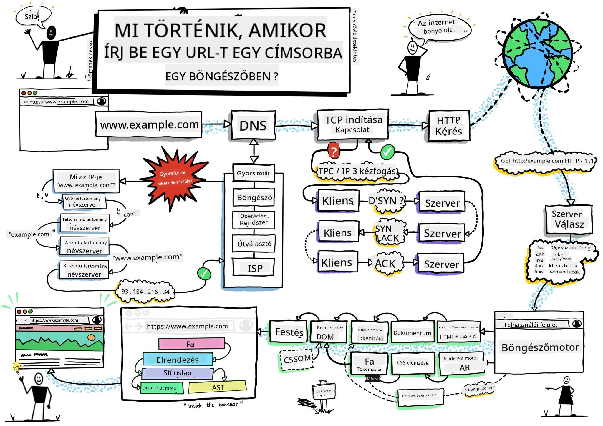
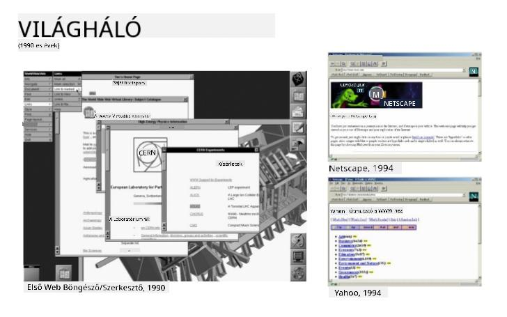
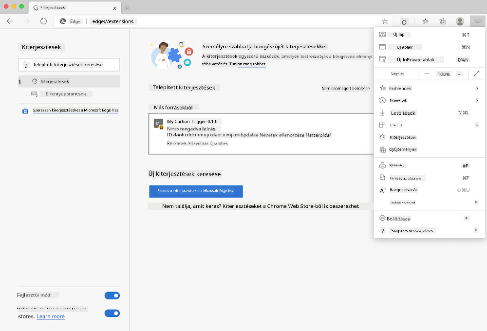
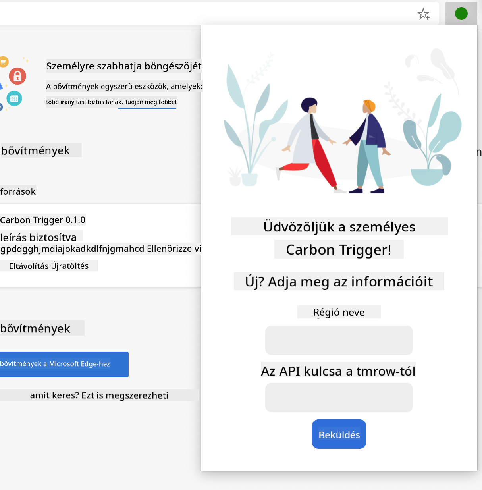
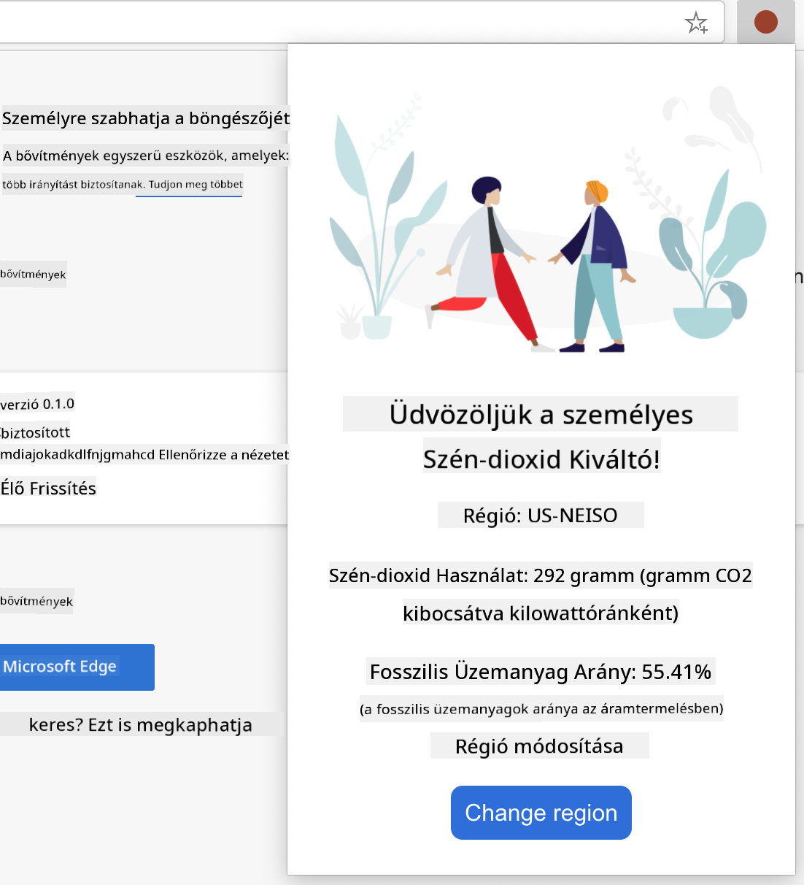

<!--
CO_OP_TRANSLATOR_METADATA:
{
  "original_hash": "0bb55e0b98600afab801eea115228873",
  "translation_date": "2025-08-28T03:39:37+00:00",
  "source_file": "5-browser-extension/1-about-browsers/README.md",
  "language_code": "hu"
}
-->
# Böngészőbővítmény Projekt 1. rész: Minden a böngészőkről


> Sketchnote készítette: [Wassim Chegham](https://dev.to/wassimchegham/ever-wondered-what-happens-when-you-type-in-a-url-in-an-address-bar-in-a-browser-3dob)

## Előadás előtti kvíz

[Előadás előtti kvíz](https://ff-quizzes.netlify.app/web/quiz/23)

### Bevezetés

A böngészőbővítmények további funkciókat adnak a böngészőhöz. Mielőtt elkezdenéd egyet készíteni, érdemes egy kicsit megismerni, hogyan működnek a böngészők.

### A böngészőről

Ebben a leckesorozatban megtanulhatod, hogyan készíts böngészőbővítményt, amely működik Chrome, Firefox és Edge böngészőkben. Ebben a részben felfedezheted, hogyan működnek a böngészők, és felépítheted a böngészőbővítmény elemeit.

De mi is pontosan a böngésző? Ez egy szoftveralkalmazás, amely lehetővé teszi a végfelhasználó számára, hogy hozzáférjen egy szerver tartalmához, és megjelenítse azt weboldalakon.

✅ Egy kis történelem: az első böngészőt 'WorldWideWeb'-nek hívták, és Sir Timothy Berners-Lee készítette 1990-ben.


> Néhány korai böngésző, via [Karen McGrane](https://www.slideshare.net/KMcGrane/week-4-ixd-history-personal-computing)

Amikor a felhasználó csatlakozik az internethez egy URL (Uniform Resource Locator) cím használatával, általában Hypertext Transfer Protocol segítségével, `http` vagy `https` címen keresztül, a böngésző kommunikál egy webszerverrel, és lekéri a weboldalt.

Ezen a ponton a böngésző renderelő motorja megjeleníti azt a felhasználó eszközén, amely lehet mobiltelefon, asztali számítógép vagy laptop.

A böngészők képesek a tartalom gyorsítótárazására is, így nem kell minden alkalommal a szerverről lekérni. Rögzíthetik a felhasználó böngészési tevékenységének előzményeit, tárolhatnak 'cookie'-kat, amelyek kis adatdarabok, és információkat tartalmaznak a felhasználó tevékenységének tárolására, és még sok másra.

Fontos megjegyezni, hogy a böngészők nem egyformák! Mindegyik böngészőnek megvannak az erősségei és gyengeségei, és egy profi webfejlesztőnek értenie kell, hogyan lehet a weboldalakat jól működtetni különböző böngészőkben. Ez magában foglalja a kis nézetablakok, például mobiltelefonok kezelését, valamint az offline felhasználók kiszolgálását.

Egy igazán hasznos weboldal, amelyet érdemes könyvjelzőzni a kedvenc böngésződben, a [caniuse.com](https://www.caniuse.com). Amikor weboldalakat készítesz, nagyon hasznos a caniuse által támogatott technológiák listáit használni, hogy a lehető legjobban támogathasd a felhasználóidat.

✅ Hogyan tudhatod meg, mely böngészők a legnépszerűbbek a weboldalad felhasználói körében? Ellenőrizd az analitikát - különböző analitikai csomagokat telepíthetsz a webfejlesztési folyamat részeként, amelyek megmutatják, mely böngészőket használják leggyakrabban.

## Böngészőbővítmények

Miért érdemes böngészőbővítményt készíteni? Ez egy praktikus eszköz, amelyet a böngészőhöz csatolhatsz, ha gyors hozzáférésre van szükséged olyan feladatokhoz, amelyeket gyakran ismételsz. Például, ha gyakran kell ellenőrizned a színeket a különböző weboldalakon, amelyeket használsz, telepíthetsz egy színválasztó böngészőbővítményt. Ha nehezen emlékszel jelszavakra, használhatsz egy jelszókezelő böngészőbővítményt.

A böngészőbővítmények fejlesztése szórakoztató is. Általában egy meghatározott számú feladatot kezelnek, amelyeket jól elvégeznek.

✅ Melyek a kedvenc böngészőbővítményeid? Milyen feladatokat látnak el?

### Bővítmények telepítése

Mielőtt elkezdenéd a fejlesztést, nézd meg a böngészőbővítmény készítésének és telepítésének folyamatát. Bár minden böngésző kicsit eltérően kezeli ezt a feladatot, a folyamat hasonló Chrome és Firefox esetében az Edge példájához:



> Megjegyzés: Győződj meg róla, hogy bekapcsoltad a fejlesztői módot, és engedélyezted a bővítmények telepítését más áruházakból.

Lényegében a folyamat így néz ki:

- készítsd el a bővítményt `npm run build` használatával
- navigálj a böngészőben a bővítmények panelre a "Beállítások és továbbiak" gomb (a `...` ikon) segítségével a jobb felső sarokban
- ha új telepítésről van szó, válaszd a `load unpacked` opciót, hogy feltölts egy új bővítményt a build mappájából (esetünkben ez a `/dist`)
- vagy kattints a `reload` gombra, ha már telepített bővítményt frissítesz

✅ Ezek az utasítások az általad készített bővítményekre vonatkoznak; ha olyan bővítményeket szeretnél telepíteni, amelyeket a böngésző bővítményáruházában tettek közzé, navigálj ezekre az [áruházakra](https://microsoftedge.microsoft.com/addons/Microsoft-Edge-Extensions-Home), és telepítsd a választott bővítményt.

### Kezdj neki

Egy olyan böngészőbővítményt fogsz készíteni, amely megjeleníti a régiód szénlábnyomát, bemutatva az energiafelhasználást és az energiaforrást. A bővítmény tartalmazni fog egy űrlapot, amely API kulcsot gyűjt, hogy hozzáférhess a CO2 Signal API-jához.

**Amire szükséged lesz:**

- [egy API kulcs](https://www.co2signal.com/); add meg az e-mail címedet az oldalon, és küldenek neked egyet
- a [régiód kódja](http://api.electricitymap.org/v3/zones), amely megfelel az [Electricity Map](https://www.electricitymap.org/map) térképének (például Bostonban 'US-NEISO'-t használok)
- a [kezdő kód](../../../../5-browser-extension/start). Töltsd le a `start` mappát; ebben a mappában fogod kiegészíteni a kódot.
- [NPM](https://www.npmjs.com) - Az NPM egy csomagkezelő eszköz; telepítsd helyileg, és a `package.json` fájlban felsorolt csomagok telepítve lesznek a webes eszközöd számára

✅ Tudj meg többet a csomagkezelésről ebben a [kiváló Learn modulban](https://docs.microsoft.com/learn/modules/create-nodejs-project-dependencies/?WT.mc_id=academic-77807-sagibbon)

Szánj egy percet a kódbázis átnézésére:

dist
    -|manifest.json (alapértelmezések itt)
    -|index.html (front-end HTML markup itt)
    -|background.js (háttér JS itt)
    -|main.js (összeállított JS)
src
    -|index.js (a JS kódod ide kerül)

✅ Miután megvan az API kulcsod és a régiókódod, tárold ezeket valahol jegyzetként későbbi használatra.

### Készítsd el a bővítmény HTML-jét

Ez a bővítmény két nézetet tartalmaz. Az egyik az API kulcs és a régiókód begyűjtésére szolgál:



A másik pedig a régió szénfelhasználását jeleníti meg:



Kezdjük azzal, hogy elkészítjük az űrlap HTML-jét, és CSS-sel formázzuk.

A `/dist` mappában készíts egy űrlapot és egy eredményterületet. Az `index.html` fájlban töltsd ki az űrlap területét:

```HTML
<form class="form-data" autocomplete="on">
	<div>
		<h2>New? Add your Information</h2>
	</div>
	<div>
		<label for="region">Region Name</label>
		<input type="text" id="region" required class="region-name" />
	</div>
	<div>
		<label for="api">Your API Key from tmrow</label>
		<input type="text" id="api" required class="api-key" />
	</div>
	<button class="search-btn">Submit</button>
</form>	
```
Ez az az űrlap, ahol a mentett információkat be lehet vinni és helyi tárolóba menteni.

Ezután készítsd el az eredményterületet; az utolsó űrlap címke alatt adj hozzá néhány div-et:

```HTML
<div class="result">
	<div class="loading">loading...</div>
	<div class="errors"></div>
	<div class="data"></div>
	<div class="result-container">
		<p><strong>Region: </strong><span class="my-region"></span></p>
		<p><strong>Carbon Usage: </strong><span class="carbon-usage"></span></p>
		<p><strong>Fossil Fuel Percentage: </strong><span class="fossil-fuel"></span></p>
	</div>
	<button class="clear-btn">Change region</button>
</div>
```
Ezen a ponton megpróbálhatod a buildet. Győződj meg róla, hogy telepítetted a bővítmény csomagfüggőségeit:

```
npm install
```

Ez a parancs az npm-et, a Node Package Manager-t használja, hogy telepítse a webpack-et a bővítmény build folyamatához. A folyamat kimenetét a `/dist/main.js` fájlban láthatod - itt látható, hogy a kód össze lett csomagolva.

Egyelőre a bővítménynek épülnie kell, és ha Edge-be telepíted bővítményként, egy szépen megjelenített űrlapot fogsz látni.

Gratulálok, megtetted az első lépéseket egy böngészőbővítmény készítése felé. A következő leckékben funkcionálisabbá és hasznosabbá teszed.

---

## 🚀 Kihívás

Nézz körül egy böngészőbővítmény áruházban, és telepíts egyet a böngésződbe. Érdekes módon megvizsgálhatod a fájljait. Mit fedezel fel?

## Előadás utáni kvíz

[Előadás utáni kvíz](https://ff-quizzes.netlify.app/web/quiz/24)

## Áttekintés és önálló tanulás

Ebben a leckében egy kicsit megismerkedtél a web böngésző történetével; használd ki ezt az alkalmat, hogy többet megtudj a World Wide Web feltalálóinak elképzeléseiről, és olvass többet a történetéről. Néhány hasznos oldal:

[A web böngészők története](https://www.mozilla.org/firefox/browsers/browser-history/)

[A web története](https://webfoundation.org/about/vision/history-of-the-web/)

[Interjú Tim Berners-Lee-vel](https://www.theguardian.com/technology/2019/mar/12/tim-berners-lee-on-30-years-of-the-web-if-we-dream-a-little-we-can-get-the-web-we-want)

## Feladat 

[Stílusozd újra a bővítményedet](assignment.md)

---

**Felelősség kizárása**:  
Ez a dokumentum az AI fordítási szolgáltatás [Co-op Translator](https://github.com/Azure/co-op-translator) segítségével lett lefordítva. Bár törekszünk a pontosságra, kérjük, vegye figyelembe, hogy az automatikus fordítások hibákat vagy pontatlanságokat tartalmazhatnak. Az eredeti dokumentum az eredeti nyelvén tekintendő hiteles forrásnak. Kritikus információk esetén javasolt professzionális emberi fordítást igénybe venni. Nem vállalunk felelősséget semmilyen félreértésért vagy téves értelmezésért, amely a fordítás használatából eredhet.