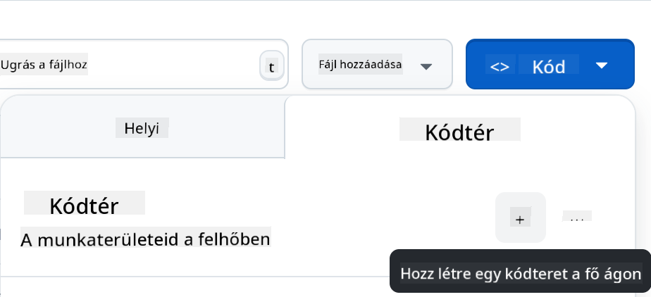

<!--
CO_OP_TRANSLATOR_METADATA:
{
  "original_hash": "cf15ff7770c5a484349383bb27d1131f",
  "translation_date": "2025-08-29T13:00:57+00:00",
  "source_file": "9-chat-project/README.md",
  "language_code": "hu"
}
-->
# Chat projekt

Ez a chat projekt bemutatja, hogyan lehet egy Chat Asszisztenst létrehozni GitHub Modellek segítségével.

Így néz ki a kész projekt:

<div>
  
</div>

Egy kis háttérinformáció: generatív AI használatával chat asszisztensek építése remek módja annak, hogy elkezdjünk ismerkedni a mesterséges intelligenciával. Ebben a leckében megtanulhatod, hogyan integrálj generatív AI-t egy webalkalmazásba. Kezdjük is el!

## Kapcsolódás a generatív AI-hoz

A backendhez a GitHub Modelleket használjuk. Ez egy nagyszerű szolgáltatás, amely lehetővé teszi, hogy ingyenesen használj AI-t. Látogass el a playground oldalára, és szerezd meg a kódot, amely megfelel a választott backend nyelvednek. Így néz ki a [GitHub Models Playground](https://github.com/marketplace/models/azure-openai/gpt-4o-mini/playground).

<div>
  
</div>

Ahogy említettük, válaszd ki a "Code" fület és a preferált futtatási környezetet.

<div>
  
</div>

Ebben az esetben a Python-t választjuk, ami azt jelenti, hogy ezt a kódot használjuk:

```python
"""Run this model in Python

> pip install openai
"""
import os
from openai import OpenAI

# To authenticate with the model you will need to generate a personal access token (PAT) in your GitHub settings. 
# Create your PAT token by following instructions here: https://docs.github.com/en/authentication/keeping-your-account-and-data-secure/managing-your-personal-access-tokens
client = OpenAI(
    base_url="https://models.github.ai/inference",
    api_key=os.environ["GITHUB_TOKEN"],
)

response = client.chat.completions.create(
    messages=[
        {
            "role": "system",
            "content": "",
        },
        {
            "role": "user",
            "content": "What is the capital of France?",
        }
    ],
    model="openai/gpt-4o-mini",
    temperature=1,
    max_tokens=4096,
    top_p=1
)

print(response.choices[0].message.content)
```

Tisztítsuk meg egy kicsit ezt a kódot, hogy újrahasznosítható legyen:

```python
def call_llm(prompt: str, system_message: str):
    response = client.chat.completions.create(
        messages=[
            {
                "role": "system",
                "content": system_message,
            },
            {
                "role": "user",
                "content": prompt,
            }
        ],
        model="openai/gpt-4o-mini",
        temperature=1,
        max_tokens=4096,
        top_p=1
    )

    return response.choices[0].message.content
```

Ezzel a `call_llm` függvénnyel most már megadhatunk egy promptot és egy rendszerpromptot, és a függvény visszaadja az eredményt.

### AI Asszisztens testreszabása

Ha testre szeretnéd szabni az AI asszisztenst, megadhatod, hogyan viselkedjen, a rendszerprompt kitöltésével, például így:

```python
call_llm("Tell me about you", "You're Albert Einstein, you only know of things in the time you were alive")
```

## Web API-n keresztüli elérés

Szuper, az AI rész készen van, nézzük meg, hogyan integrálhatjuk ezt egy Web API-ba. A Web API-hoz a Flask-et választjuk, de bármelyik webes keretrendszer megfelelő lehet. Íme a kód:

```python
# api.py
from flask import Flask, request, jsonify
from llm import call_llm
from flask_cors import CORS

app = Flask(__name__)
CORS(app)   # *   example.com

@app.route("/", methods=["GET"])
def index():
    return "Welcome to this API. Call POST /hello with 'message': 'my message' as JSON payload"


@app.route("/hello", methods=["POST"])
def hello():
    # get message from request body  { "message": "do this taks for me" }
    data = request.get_json()
    message = data.get("message", "")

    response = call_llm(message, "You are a helpful assistant.")
    return jsonify({
        "response": response
    })

if __name__ == "__main__":
    app.run(host="0.0.0.0", port=5000)
```

Itt létrehozunk egy Flask API-t, és definiálunk egy alapértelmezett útvonalat ("/") és egy "/chat" útvonalat. Az utóbbi arra szolgál, hogy a frontend kérdéseket küldjön a backendnek.

Az *llm.py* integrálásához a következőket kell tennünk:

- Importáljuk a `call_llm` függvényt:

   ```python
   from llm import call_llm
   from flask import Flask, request
   ```

- Meghívjuk a "/chat" útvonalról:

   ```python
   @app.route("/hello", methods=["POST"])
   def hello():
      # get message from request body  { "message": "do this taks for me" }
      data = request.get_json()
      message = data.get("message", "")

      response = call_llm(message, "You are a helpful assistant.")
      return jsonify({
         "response": response
      })
   ```

   Itt az érkező kérést elemezzük, hogy kinyerjük a JSON törzsből a `message` tulajdonságot. Ezután meghívjuk az LLM-et ezzel a hívással:

   ```python
   response = call_llm(message, "You are a helpful assistant")

   # return the response as JSON
   return jsonify({
      "response": response 
   })
   ```

Szuper, most már mindent elvégeztünk, amire szükség volt.

### Cors konfigurálása

Fontos megemlíteni, hogy beállítottunk valamit, amit CORS-nak (cross-origin resource sharing) hívnak. Ez azt jelenti, hogy mivel a backend és a frontend különböző portokon fog futni, engedélyeznünk kell, hogy a frontend hívásokat küldhessen a backendnek. Az *api.py*-ban van egy kódrészlet, amely ezt beállítja:

```python
from flask_cors import CORS

app = Flask(__name__)
CORS(app)   # *   example.com
```

Jelenleg úgy van beállítva, hogy minden eredetet ("*") engedélyezzen, ami nem túl biztonságos. Ezt szigorítani kell, amikor éles környezetbe kerül a projekt.

## A projekt futtatása

Rendben, tehát megvan az *llm.py* és az *api.py*. Hogyan működtethetjük ezt a backenden? Két dolgot kell tennünk:

- Függőségek telepítése:

   ```sh
   cd backend
   python -m venv venv
   source ./venv/bin/activate

   pip install openai flask flask-cors openai
   ```

- Az API indítása:

   ```sh
   python api.py
   ```

   Ha Codespaces-ben dolgozol, menj az alsó szerkesztői részben a Ports-ra, kattints jobb gombbal, válaszd a "Port Visibility"-t, majd állítsd "Public"-ra.

### Frontend fejlesztése

Most, hogy az API működik, hozzunk létre egy frontendet hozzá. Egy minimális frontenddel kezdünk, amit lépésről lépésre fejlesztünk tovább. A *frontend* mappában hozz létre a következőket:

```text
backend/
frontend/
index.html
app.js
styles.css
```

Kezdjük az **index.html**-lel:

```html
<html>
    <head>
        <link rel="stylesheet" href="styles.css">
    </head>
    <body>
      <form>
        <textarea id="messages"></textarea>
        <input id="input" type="text" />
        <button type="submit" id="sendBtn">Send</button>  
      </form>  
      <script src="app.js" />
    </body>
</html>    
```

A fenti a minimális szükséges kód egy chat ablak támogatásához. Tartalmaz egy textarea-t, ahol az üzenetek megjelennek, egy input mezőt az üzenetek beírásához, és egy gombot az üzenetek backendre küldéséhez. Nézzük meg a JavaScript kódot az *app.js*-ben.

**app.js**

```js
// app.js

(function(){
  // 1. set up elements  
  const messages = document.getElementById("messages");
  const form = document.getElementById("form");
  const input = document.getElementById("input");

  const BASE_URL = "change this";
  const API_ENDPOINT = `${BASE_URL}/hello`;

  // 2. create a function that talks to our backend
  async function callApi(text) {
    const response = await fetch(API_ENDPOINT, {
      method: "POST",
      headers: { "Content-Type": "application/json" },
      body: JSON.stringify({ message: text })
    });
    let json = await response.json();
    return json.response;
  }

  // 3. add response to our textarea
  function appendMessage(text, role) {
    const el = document.createElement("div");
    el.className = `message ${role}`;
    el.innerHTML = text;
    messages.appendChild(el);
  }

  // 4. listen to submit events
  form.addEventListener("submit", async(e) => {
    e.preventDefault();
   // someone clicked the button in the form
   
   // get input
   const text = input.value.trim();

   appendMessage(text, "user")

   // reset it
   input.value = '';

   const reply = await callApi(text);

   // add to messages
   appendMessage(reply, "assistant");

  })
})();
```

Nézzük át a kódot szakaszonként:

- 1) Itt hivatkozást szerzünk az összes elemre, amelyet később használni fogunk a kódban.
- 2) Ebben a szakaszban létrehozunk egy függvényt, amely a beépített `fetch` metódust használja a backend hívására.
- 3) Az `appendMessage` segít hozzáadni a válaszokat, valamint a felhasználó által beírt üzeneteket.
- 4) Itt figyeljük a submit eseményt, beolvassuk az input mezőt, elhelyezzük a felhasználó üzenetét a textarea-ban, meghívjuk az API-t, és megjelenítjük a választ a textarea-ban.

Nézzük meg a stílusokat, itt igazán kreatív lehetsz, de íme néhány javaslat:

**styles.css**

```
.message {
    background: #222;
    box-shadow: 0 0 0 10px orange;
    padding: 10px:
    margin: 5px;
}

.message.user {
    background: blue;
}

.message.assistant {
    background: grey;
} 
```

Ezzel a három osztállyal különbözőképpen formázhatod az üzeneteket attól függően, hogy az asszisztenstől vagy a felhasználótól származnak. Ha inspirációra van szükséged, nézd meg a `solution/frontend/styles.css` mappát.

### Alap URL módosítása

Van itt egy dolog, amit még nem állítottunk be, ez pedig a `BASE_URL`. Ez addig nem ismert, amíg a backend el nem indul. Az alap URL beállítása:

- Ha az API-t helyileg futtatod, valami ilyesminek kell lennie: `http://localhost:5000`.
- Ha Codespaces-ben futtatod, valami ilyesminek kell kinéznie: "[name]app.github.dev".

## Feladat

Hozz létre egy saját *project* mappát a következő tartalommal:

```text
project/
  frontend/
    index.html
    app.js
    styles.css
  backend/
    api.py
    llm.py
```

Másold be a fentiekben ismertetett tartalmat, de nyugodtan testreszabhatod az ízlésed szerint.

## Megoldás

[Megoldás](./solution/README.md)

## Bónusz

Próbáld megváltoztatni az AI asszisztens személyiségét. Amikor az *api.py*-ban meghívod a `call_llm` függvényt, megváltoztathatod a második argumentumot arra, amit szeretnél, például:

```python
call_llm(message, "You are Captain Picard")
```

Változtasd meg a CSS-t és a szöveget is az ízlésed szerint, tehát végezz módosításokat az *index.html*-ben és a *styles.css*-ben.

## Összefoglalás

Szuper, most már tudod, hogyan hozz létre egy személyes asszisztenst AI segítségével a semmiből. Ezt GitHub Modellek, egy Python backend, valamint HTML, CSS és JavaScript frontend használatával valósítottuk meg.

## Beállítás Codespaces-szel

- Navigálj ide: [Web Dev For Beginners repo](https://github.com/microsoft/Web-Dev-For-Beginners)
- Hozz létre egy sablonból (győződj meg róla, hogy be vagy jelentkezve a GitHub-ba) a jobb felső sarokban:

    

- Miután a saját repódba kerültél, hozz létre egy Codespace-et:

    

    Ez elindít egy környezetet, amelyben most már dolgozhatsz.

---

**Felelősségkizárás**:  
Ez a dokumentum az [Co-op Translator](https://github.com/Azure/co-op-translator) AI fordítási szolgáltatás segítségével készült. Bár törekszünk a pontosságra, kérjük, vegye figyelembe, hogy az automatikus fordítások hibákat vagy pontatlanságokat tartalmazhatnak. Az eredeti dokumentum az eredeti nyelvén tekintendő hiteles forrásnak. Kritikus információk esetén javasolt a professzionális, emberi fordítás igénybevétele. Nem vállalunk felelősséget a fordítás használatából eredő félreértésekért vagy téves értelmezésekért.