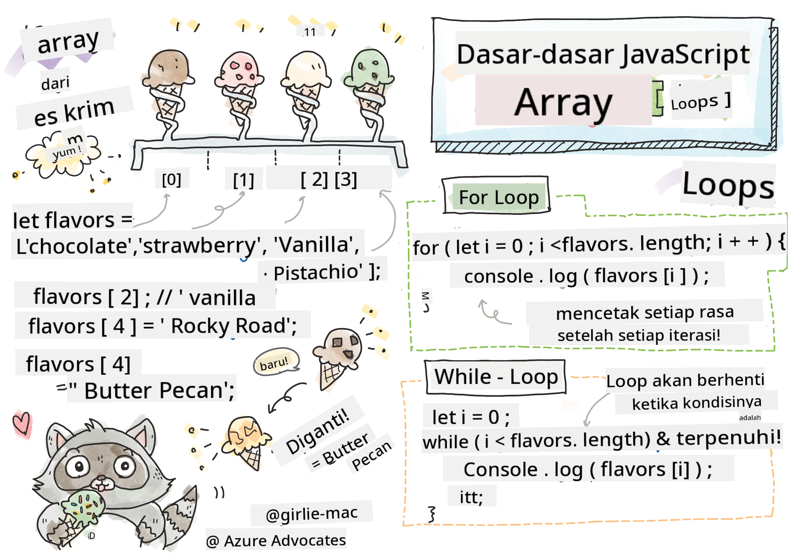

<!--
CO_OP_TRANSLATOR_METADATA:
{
  "original_hash": "3f7f87871312cf6cc12662da7d973182",
  "translation_date": "2025-08-27T22:52:20+00:00",
  "source_file": "2-js-basics/4-arrays-loops/README.md",
  "language_code": "id"
}
-->
# Dasar-Dasar JavaScript: Array dan Loop


> Sketchnote oleh [Tomomi Imura](https://twitter.com/girlie_mac)

## Kuis Pra-Pelajaran
[Kuis pra-pelajaran](https://ashy-river-0debb7803.1.azurestaticapps.net/quiz/13)

Pelajaran ini mencakup dasar-dasar JavaScript, bahasa yang memberikan interaktivitas pada web. Dalam pelajaran ini, Anda akan mempelajari tentang array dan loop, yang digunakan untuk memanipulasi data.

[](https://youtube.com/watch?v=1U4qTyq02Xw "Array")

[](https://www.youtube.com/watch?v=Eeh7pxtTZ3k "Loop")

> 🎥 Klik gambar di atas untuk menonton video tentang array dan loop.

> Anda dapat mengikuti pelajaran ini di [Microsoft Learn](https://docs.microsoft.com/learn/modules/web-development-101-arrays/?WT.mc_id=academic-77807-sagibbon)!

## Array

Bekerja dengan data adalah tugas umum dalam bahasa pemrograman, dan tugas ini menjadi jauh lebih mudah ketika data diorganisasi dalam format struktural seperti array. Dengan array, data disimpan dalam struktur yang mirip dengan daftar. Salah satu keuntungan utama dari array adalah Anda dapat menyimpan berbagai jenis data dalam satu array.

✅ Array ada di sekitar kita! Bisakah Anda memikirkan contoh nyata dari array, seperti susunan panel surya?

Sintaks untuk array adalah sepasang tanda kurung siku.

```javascript
let myArray = [];
```

Ini adalah array kosong, tetapi array dapat dideklarasikan dengan data yang sudah terisi. Nilai-nilai dalam array dipisahkan oleh koma.

```javascript
let iceCreamFlavors = ["Chocolate", "Strawberry", "Vanilla", "Pistachio", "Rocky Road"];
```

Nilai-nilai dalam array diberi nilai unik yang disebut **index**, yaitu angka bulat yang ditentukan berdasarkan jaraknya dari awal array. Dalam contoh di atas, nilai string "Chocolate" memiliki indeks 0, dan indeks "Rocky Road" adalah 4. Gunakan indeks dengan tanda kurung siku untuk mengambil, mengubah, atau menyisipkan nilai dalam array.

✅ Apakah Anda terkejut bahwa array dimulai dari indeks nol? Dalam beberapa bahasa pemrograman, indeks dimulai dari 1. Ada sejarah menarik tentang ini, yang dapat Anda [baca di Wikipedia](https://en.wikipedia.org/wiki/Zero-based_numbering).

```javascript
let iceCreamFlavors = ["Chocolate", "Strawberry", "Vanilla", "Pistachio", "Rocky Road"];
iceCreamFlavors[2]; //"Vanilla"
```

Anda dapat memanfaatkan indeks untuk mengubah nilai, seperti ini:

```javascript
iceCreamFlavors[4] = "Butter Pecan"; //Changed "Rocky Road" to "Butter Pecan"
```

Dan Anda dapat menyisipkan nilai baru pada indeks tertentu seperti ini:

```javascript
iceCreamFlavors[5] = "Cookie Dough"; //Added "Cookie Dough"
```

✅ Cara yang lebih umum untuk menambahkan nilai ke array adalah dengan menggunakan operator array seperti array.push()

Untuk mengetahui berapa banyak item yang ada dalam array, gunakan properti `length`.

```javascript
let iceCreamFlavors = ["Chocolate", "Strawberry", "Vanilla", "Pistachio", "Rocky Road"];
iceCreamFlavors.length; //5
```

✅ Cobalah sendiri! Gunakan konsol browser Anda untuk membuat dan memanipulasi array buatan Anda sendiri.

## Loop

Loop memungkinkan kita melakukan tugas berulang atau **iteratif**, dan dapat menghemat banyak waktu dan kode. Setiap iterasi dapat bervariasi dalam variabel, nilai, dan kondisinya. Ada berbagai jenis loop dalam JavaScript, dan semuanya memiliki perbedaan kecil, tetapi pada dasarnya melakukan hal yang sama: mengulang data.

### For Loop

`for` loop membutuhkan 3 bagian untuk melakukan iterasi:
- `counter` Variabel yang biasanya diinisialisasi dengan angka yang menghitung jumlah iterasi
- `condition` Ekspresi yang menggunakan operator perbandingan untuk menghentikan loop ketika bernilai `false`
- `iteration-expression` Dijalankan di akhir setiap iterasi, biasanya digunakan untuk mengubah nilai counter
  
```javascript
// Counting up to 10
for (let i = 0; i < 10; i++) {
  console.log(i);
}
```

✅ Jalankan kode ini di konsol browser. Apa yang terjadi ketika Anda membuat perubahan kecil pada counter, condition, atau iteration expression? Bisakah Anda membuatnya berjalan mundur, menciptakan hitungan mundur?

### While Loop

Berbeda dengan sintaks `for` loop, `while` loop hanya membutuhkan kondisi yang akan menghentikan loop ketika kondisinya menjadi `false`. Kondisi dalam loop biasanya bergantung pada nilai lain seperti counter, dan harus dikelola selama loop berlangsung. Nilai awal untuk counter harus dibuat di luar loop, dan ekspresi apa pun untuk memenuhi kondisi, termasuk mengubah counter, harus dipertahankan di dalam loop.

```javascript
//Counting up to 10
let i = 0;
while (i < 10) {
 console.log(i);
 i++;
}
```

✅ Mengapa Anda memilih for loop dibandingkan dengan while loop? 17 ribu pembaca memiliki pertanyaan yang sama di StackOverflow, dan beberapa pendapat [mungkin menarik bagi Anda](https://stackoverflow.com/questions/39969145/while-loops-vs-for-loops-in-javascript).

## Loop dan Array

Array sering digunakan dengan loop karena sebagian besar kondisi membutuhkan panjang array untuk menghentikan loop, dan indeks juga dapat menjadi nilai counter.

```javascript
let iceCreamFlavors = ["Chocolate", "Strawberry", "Vanilla", "Pistachio", "Rocky Road"];

for (let i = 0; i < iceCreamFlavors.length; i++) {
  console.log(iceCreamFlavors[i]);
} //Ends when all flavors are printed
```

✅ Bereksperimenlah dengan mengulang array buatan Anda sendiri di konsol browser. 

---

## 🚀 Tantangan

Ada cara lain untuk mengulang array selain menggunakan for dan while loop. Ada [forEach](https://developer.mozilla.org/docs/Web/JavaScript/Reference/Global_Objects/Array/forEach), [for-of](https://developer.mozilla.org/docs/Web/JavaScript/Reference/Statements/for...of), dan [map](https://developer.mozilla.org/docs/Web/JavaScript/Reference/Global_Objects/Array/map). Ulangi loop array Anda menggunakan salah satu teknik ini.

## Kuis Pasca-Pelajaran
[Kuis pasca-pelajaran](https://ashy-river-0debb7803.1.azurestaticapps.net/quiz/14)

## Tinjauan & Belajar Mandiri

Array dalam JavaScript memiliki banyak metode yang sangat berguna untuk manipulasi data. [Baca lebih lanjut tentang metode ini](https://developer.mozilla.org/docs/Web/JavaScript/Reference/Global_Objects/Array) dan coba beberapa di antaranya (seperti push, pop, slice, dan splice) pada array buatan Anda sendiri.

## Tugas

[Loop sebuah Array](assignment.md)

---

**Penafian**:  
Dokumen ini telah diterjemahkan menggunakan layanan penerjemahan AI [Co-op Translator](https://github.com/Azure/co-op-translator). Meskipun kami berusaha untuk memberikan hasil yang akurat, harap diingat bahwa terjemahan otomatis mungkin mengandung kesalahan atau ketidakakuratan. Dokumen asli dalam bahasa aslinya harus dianggap sebagai sumber yang otoritatif. Untuk informasi yang bersifat kritis, disarankan menggunakan jasa penerjemahan profesional oleh manusia. Kami tidak bertanggung jawab atas kesalahpahaman atau penafsiran yang keliru yang timbul dari penggunaan terjemahan ini.