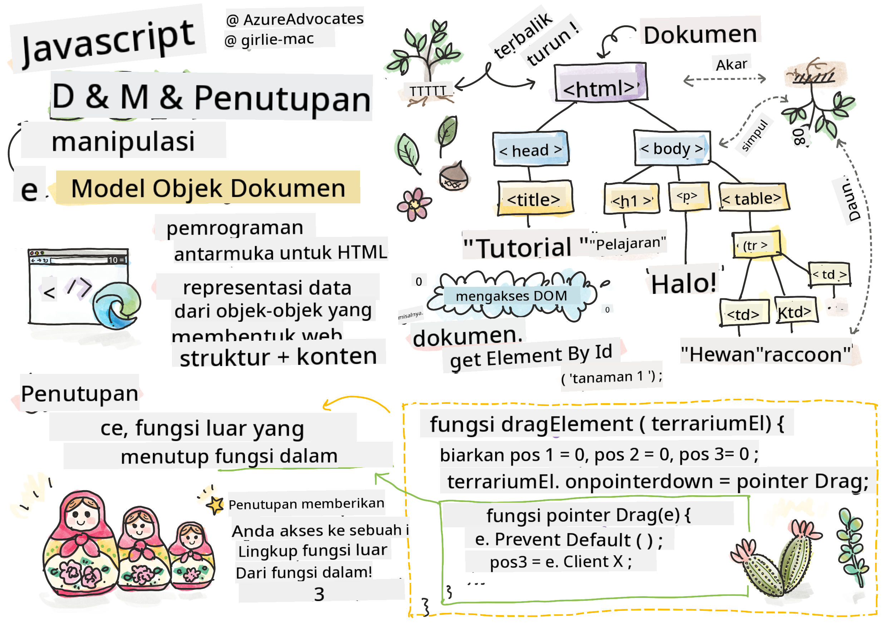
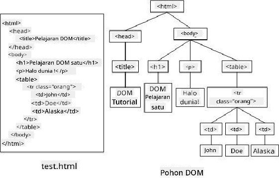

<!--
CO_OP_TRANSLATOR_METADATA:
{
  "original_hash": "30f8903a1f290e3d438dc2c70fe60259",
  "translation_date": "2025-08-27T23:01:46+00:00",
  "source_file": "3-terrarium/3-intro-to-DOM-and-closures/README.md",
  "language_code": "id"
}
-->
# Proyek Terrarium Bagian 3: Manipulasi DOM dan Closure


> Sketchnote oleh [Tomomi Imura](https://twitter.com/girlie_mac)

## Kuis Pra-Kuliah

[Kuis pra-kuliah](https://ashy-river-0debb7803.1.azurestaticapps.net/quiz/19)

### Pendahuluan

Manipulasi DOM, atau "Document Object Model", adalah aspek penting dalam pengembangan web. Menurut [MDN](https://developer.mozilla.org/docs/Web/API/Document_Object_Model/Introduction), "Document Object Model (DOM) adalah representasi data dari objek-objek yang membentuk struktur dan konten dokumen di web." Tantangan dalam manipulasi DOM di web sering kali menjadi alasan utama penggunaan framework JavaScript daripada JavaScript murni untuk mengelola DOM, tetapi kita akan mencoba melakukannya sendiri!

Selain itu, pelajaran ini akan memperkenalkan konsep [closure JavaScript](https://developer.mozilla.org/docs/Web/JavaScript/Closures), yang dapat Anda pikirkan sebagai fungsi yang dikelilingi oleh fungsi lain sehingga fungsi dalam memiliki akses ke lingkup fungsi luar.

> Closure JavaScript adalah topik yang luas dan kompleks. Pelajaran ini hanya menyentuh ide dasar bahwa dalam kode terrarium ini, Anda akan menemukan closure: fungsi dalam dan fungsi luar yang dibangun sedemikian rupa sehingga fungsi dalam memiliki akses ke lingkup fungsi luar. Untuk informasi lebih lanjut tentang cara kerjanya, silakan kunjungi [dokumentasi yang ekstensif](https://developer.mozilla.org/docs/Web/JavaScript/Closures).

Kita akan menggunakan closure untuk memanipulasi DOM.

Pikirkan DOM sebagai pohon, yang mewakili semua cara dokumen halaman web dapat dimanipulasi. Berbagai API (Application Program Interfaces) telah dibuat sehingga programmer, menggunakan bahasa pemrograman pilihan mereka, dapat mengakses DOM dan mengedit, mengubah, menyusun ulang, dan mengelolanya.



> Representasi DOM dan markup HTML yang merujuknya. Dari [Olfa Nasraoui](https://www.researchgate.net/publication/221417012_Profile-Based_Focused_Crawler_for_Social_Media-Sharing_Websites)

Dalam pelajaran ini, kita akan menyelesaikan proyek terrarium interaktif kita dengan membuat JavaScript yang memungkinkan pengguna memanipulasi tanaman di halaman.

### Prasyarat

Anda harus sudah memiliki HTML dan CSS untuk terrarium Anda. Pada akhir pelajaran ini, Anda akan dapat memindahkan tanaman masuk dan keluar dari terrarium dengan cara menyeretnya.

### Tugas

Di folder terrarium Anda, buat file baru bernama `script.js`. Impor file tersebut di bagian `<head>`:

```html
	<script src="./script.js" defer></script>
```

> Catatan: gunakan `defer` saat mengimpor file JavaScript eksternal ke dalam file HTML agar JavaScript hanya dijalankan setelah file HTML sepenuhnya dimuat. Anda juga dapat menggunakan atribut `async`, yang memungkinkan skrip dijalankan saat file HTML sedang diproses, tetapi dalam kasus kita, penting untuk memastikan elemen HTML sepenuhnya tersedia untuk diseret sebelum kita menjalankan skrip drag.
---

## Elemen DOM

Hal pertama yang perlu Anda lakukan adalah membuat referensi ke elemen-elemen yang ingin Anda manipulasi di DOM. Dalam kasus kita, elemen-elemen tersebut adalah 14 tanaman yang saat ini berada di bilah sisi.

### Tugas

```html
dragElement(document.getElementById('plant1'));
dragElement(document.getElementById('plant2'));
dragElement(document.getElementById('plant3'));
dragElement(document.getElementById('plant4'));
dragElement(document.getElementById('plant5'));
dragElement(document.getElementById('plant6'));
dragElement(document.getElementById('plant7'));
dragElement(document.getElementById('plant8'));
dragElement(document.getElementById('plant9'));
dragElement(document.getElementById('plant10'));
dragElement(document.getElementById('plant11'));
dragElement(document.getElementById('plant12'));
dragElement(document.getElementById('plant13'));
dragElement(document.getElementById('plant14'));
```

Apa yang terjadi di sini? Anda merujuk dokumen dan mencari melalui DOM-nya untuk menemukan elemen dengan Id tertentu. Ingat dalam pelajaran pertama tentang HTML bahwa Anda memberikan Id individual untuk setiap gambar tanaman (`id="plant1"`)? Sekarang Anda akan memanfaatkan upaya tersebut. Setelah mengidentifikasi setiap elemen, Anda meneruskan item tersebut ke fungsi bernama `dragElement` yang akan Anda buat sebentar lagi. Dengan demikian, elemen dalam HTML sekarang dapat diseret, atau akan segera bisa.

✅ Mengapa kita merujuk elemen berdasarkan Id? Mengapa tidak berdasarkan kelas CSS mereka? Anda mungkin ingin merujuk pelajaran sebelumnya tentang CSS untuk menjawab pertanyaan ini.

---

## Closure

Sekarang Anda siap membuat closure `dragElement`, yang merupakan fungsi luar yang mengelilingi fungsi dalam atau beberapa fungsi (dalam kasus kita, kita akan memiliki tiga).

Closure berguna ketika satu atau lebih fungsi perlu mengakses lingkup fungsi luar. Berikut adalah contohnya:

```javascript
function displayCandy(){
	let candy = ['jellybeans'];
	function addCandy(candyType) {
		candy.push(candyType)
	}
	addCandy('gumdrops');
}
displayCandy();
console.log(candy)
```

Dalam contoh ini, fungsi displayCandy mengelilingi fungsi yang menambahkan jenis permen baru ke dalam array yang sudah ada dalam fungsi. Jika Anda menjalankan kode ini, array `candy` akan tidak terdefinisi, karena itu adalah variabel lokal (lokal untuk closure).

✅ Bagaimana Anda dapat membuat array `candy` dapat diakses? Cobalah memindahkannya ke luar closure. Dengan cara ini, array menjadi global, daripada hanya tersedia di lingkup lokal closure.

### Tugas

Di bawah deklarasi elemen dalam `script.js`, buat fungsi:

```javascript
function dragElement(terrariumElement) {
	//set 4 positions for positioning on the screen
	let pos1 = 0,
		pos2 = 0,
		pos3 = 0,
		pos4 = 0;
	terrariumElement.onpointerdown = pointerDrag;
}
```

`dragElement` mendapatkan objek `terrariumElement` dari deklarasi di bagian atas skrip. Kemudian, Anda menetapkan beberapa posisi lokal pada `0` untuk objek yang diteruskan ke fungsi. Ini adalah variabel lokal yang akan dimanipulasi untuk setiap elemen saat Anda menambahkan fungsionalitas drag and drop dalam closure ke setiap elemen. Terrarium akan diisi oleh elemen-elemen yang diseret ini, sehingga aplikasi perlu melacak di mana mereka ditempatkan.

Selain itu, `terrariumElement` yang diteruskan ke fungsi ini diberikan event `pointerdown`, yang merupakan bagian dari [web APIs](https://developer.mozilla.org/docs/Web/API) yang dirancang untuk membantu pengelolaan DOM. `onpointerdown` dipicu saat tombol ditekan, atau dalam kasus kita, elemen yang dapat diseret disentuh. Event handler ini bekerja di [browser web dan mobile](https://caniuse.com/?search=onpointerdown), dengan beberapa pengecualian.

✅ [Event handler `onclick`](https://developer.mozilla.org/docs/Web/API/GlobalEventHandlers/onclick) memiliki dukungan lintas-browser yang lebih luas; mengapa Anda tidak menggunakannya di sini? Pikirkan tentang jenis interaksi layar yang ingin Anda buat di sini.

---

## Fungsi Pointerdrag

`terrariumElement` siap untuk diseret; ketika event `onpointerdown` dipicu, fungsi `pointerDrag` dipanggil. Tambahkan fungsi tersebut tepat di bawah baris ini: `terrariumElement.onpointerdown = pointerDrag;`:

### Tugas 

```javascript
function pointerDrag(e) {
	e.preventDefault();
	console.log(e);
	pos3 = e.clientX;
	pos4 = e.clientY;
}
```

Beberapa hal terjadi. Pertama, Anda mencegah event default yang biasanya terjadi pada pointerdown dengan menggunakan `e.preventDefault();`. Dengan cara ini Anda memiliki lebih banyak kontrol atas perilaku antarmuka.

> Kembali ke baris ini setelah Anda membangun file skrip sepenuhnya dan coba tanpa `e.preventDefault()` - apa yang terjadi?

Kedua, buka `index.html` di jendela browser, dan inspeksi antarmuka. Ketika Anda mengklik sebuah tanaman, Anda dapat melihat bagaimana event 'e' ditangkap. Telusuri event tersebut untuk melihat seberapa banyak informasi yang dikumpulkan oleh satu event pointer down!  

Selanjutnya, perhatikan bagaimana variabel lokal `pos3` dan `pos4` diatur ke e.clientX. Anda dapat menemukan nilai `e` di panel inspeksi. Nilai-nilai ini menangkap koordinat x dan y tanaman pada saat Anda mengklik atau menyentuhnya. Anda akan membutuhkan kontrol yang sangat rinci atas perilaku tanaman saat Anda mengklik dan menyeretnya, sehingga Anda melacak koordinatnya.

✅ Apakah semakin jelas mengapa seluruh aplikasi ini dibangun dengan satu closure besar? Jika tidak, bagaimana Anda akan mempertahankan lingkup untuk masing-masing dari 14 tanaman yang dapat diseret?

Selesaikan fungsi awal dengan menambahkan dua manipulasi event pointer lagi di bawah `pos4 = e.clientY`:

```html
document.onpointermove = elementDrag;
document.onpointerup = stopElementDrag;
```
Sekarang Anda menunjukkan bahwa Anda ingin tanaman diseret bersama pointer saat Anda memindahkannya, dan untuk gerakan menyeret berhenti saat Anda tidak lagi memilih tanaman. `onpointermove` dan `onpointerup` semuanya adalah bagian dari API yang sama seperti `onpointerdown`. Antarmuka akan melemparkan error sekarang karena Anda belum mendefinisikan fungsi `elementDrag` dan `stopElementDrag`, jadi buatlah fungsi tersebut selanjutnya.

## Fungsi elementDrag dan stopElementDrag

Anda akan menyelesaikan closure Anda dengan menambahkan dua fungsi internal lagi yang akan menangani apa yang terjadi saat Anda menyeret tanaman dan berhenti menyeretnya. Perilaku yang Anda inginkan adalah Anda dapat menyeret tanaman kapan saja dan meletakkannya di mana saja di layar. Antarmuka ini cukup fleksibel (tidak ada zona drop misalnya) untuk memungkinkan Anda merancang terrarium sesuai keinginan Anda dengan menambahkan, menghapus, dan memposisikan ulang tanaman.

### Tugas

Tambahkan fungsi `elementDrag` tepat setelah kurung kurawal penutup dari `pointerDrag`:

```javascript
function elementDrag(e) {
	pos1 = pos3 - e.clientX;
	pos2 = pos4 - e.clientY;
	pos3 = e.clientX;
	pos4 = e.clientY;
	console.log(pos1, pos2, pos3, pos4);
	terrariumElement.style.top = terrariumElement.offsetTop - pos2 + 'px';
	terrariumElement.style.left = terrariumElement.offsetLeft - pos1 + 'px';
}
```
Dalam fungsi ini, Anda melakukan banyak pengeditan pada posisi awal 1-4 yang Anda tetapkan sebagai variabel lokal dalam fungsi luar. Apa yang terjadi di sini?

Saat Anda menyeret, Anda menetapkan ulang `pos1` dengan membuatnya sama dengan `pos3` (yang Anda tetapkan sebelumnya sebagai `e.clientX`) dikurangi nilai `e.clientX` saat ini. Anda melakukan operasi serupa pada `pos2`. Kemudian, Anda menetapkan ulang `pos3` dan `pos4` ke koordinat X dan Y baru dari elemen tersebut. Anda dapat melihat perubahan ini di konsol saat Anda menyeret. Kemudian, Anda memanipulasi gaya CSS tanaman untuk menetapkan posisinya yang baru berdasarkan posisi baru `pos1` dan `pos2`, menghitung koordinat X dan Y atas dan kiri tanaman berdasarkan perbandingan offset-nya dengan posisi baru ini.

> `offsetTop` dan `offsetLeft` adalah properti CSS yang menetapkan posisi elemen berdasarkan posisi induknya; induknya bisa berupa elemen apa saja yang tidak diposisikan sebagai `static`. 

Semua perhitungan ulang posisi ini memungkinkan Anda untuk menyempurnakan perilaku terrarium dan tanamannya.

### Tugas 

Tugas terakhir untuk menyelesaikan antarmuka adalah menambahkan fungsi `stopElementDrag` setelah kurung kurawal penutup dari `elementDrag`:

```javascript
function stopElementDrag() {
	document.onpointerup = null;
	document.onpointermove = null;
}
```

Fungsi kecil ini menetapkan ulang event `onpointerup` dan `onpointermove` sehingga Anda dapat memulai kembali kemajuan tanaman Anda dengan mulai menyeretnya lagi, atau mulai menyeret tanaman baru.

✅ Apa yang terjadi jika Anda tidak menetapkan event ini ke null?

Sekarang Anda telah menyelesaikan proyek Anda!

🥇Selamat! Anda telah menyelesaikan terrarium yang indah. 

---

## 🚀Tantangan

Tambahkan event handler baru ke closure Anda untuk melakukan sesuatu yang lebih pada tanaman; misalnya, klik dua kali tanaman untuk membawanya ke depan. Jadilah kreatif!

## Kuis Pasca-Kuliah

[Kuis pasca-kuliah](https://ashy-river-0debb7803.1.azurestaticapps.net/quiz/20)

## Tinjauan & Studi Mandiri

Meskipun menyeret elemen di layar tampak sepele, ada banyak cara untuk melakukannya dan banyak jebakan, tergantung pada efek yang Anda cari. Faktanya, ada [API drag and drop](https://developer.mozilla.org/docs/Web/API/HTML_Drag_and_Drop_API) yang dapat Anda coba. Kami tidak menggunakannya dalam modul ini karena efek yang kami inginkan agak berbeda, tetapi coba API ini pada proyek Anda sendiri dan lihat apa yang dapat Anda capai.

Temukan lebih banyak informasi tentang event pointer di [dokumen W3C](https://www.w3.org/TR/pointerevents1/) dan di [dokumen web MDN](https://developer.mozilla.org/docs/Web/API/Pointer_events).

Selalu periksa kemampuan browser menggunakan [CanIUse.com](https://caniuse.com/).

## Tugas

[Bekerja lebih banyak dengan DOM](assignment.md)

---

**Penafian**:  
Dokumen ini telah diterjemahkan menggunakan layanan penerjemahan AI [Co-op Translator](https://github.com/Azure/co-op-translator). Meskipun kami berupaya untuk memberikan hasil yang akurat, harap diketahui bahwa terjemahan otomatis mungkin mengandung kesalahan atau ketidakakuratan. Dokumen asli dalam bahasa aslinya harus dianggap sebagai sumber yang otoritatif. Untuk informasi yang bersifat kritis, disarankan menggunakan jasa penerjemahan profesional oleh manusia. Kami tidak bertanggung jawab atas kesalahpahaman atau penafsiran yang keliru yang timbul dari penggunaan terjemahan ini.