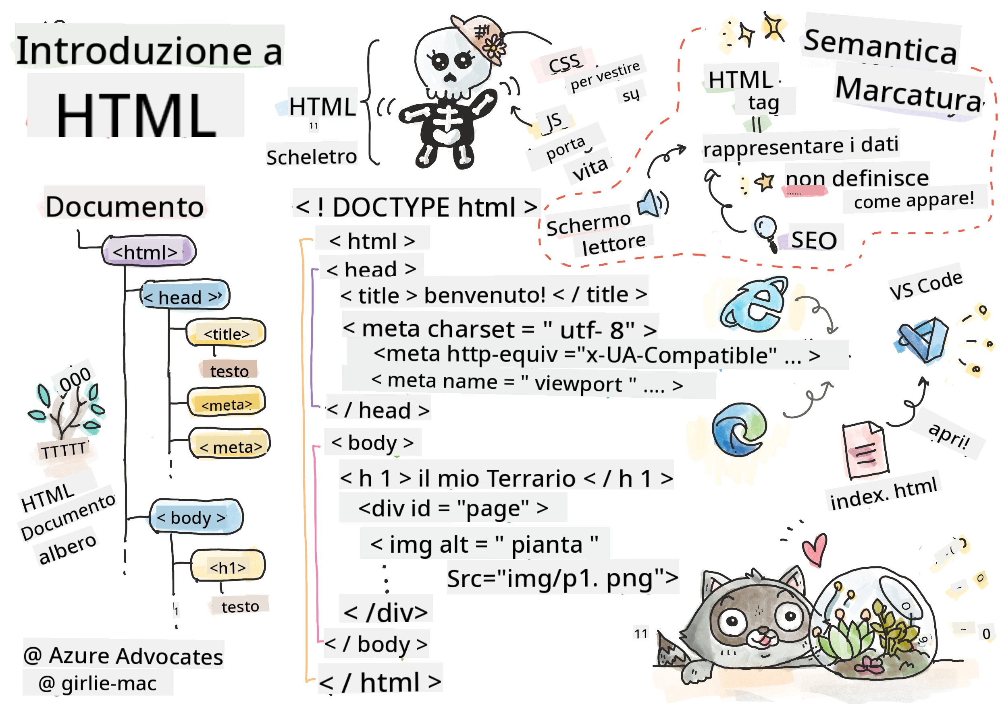
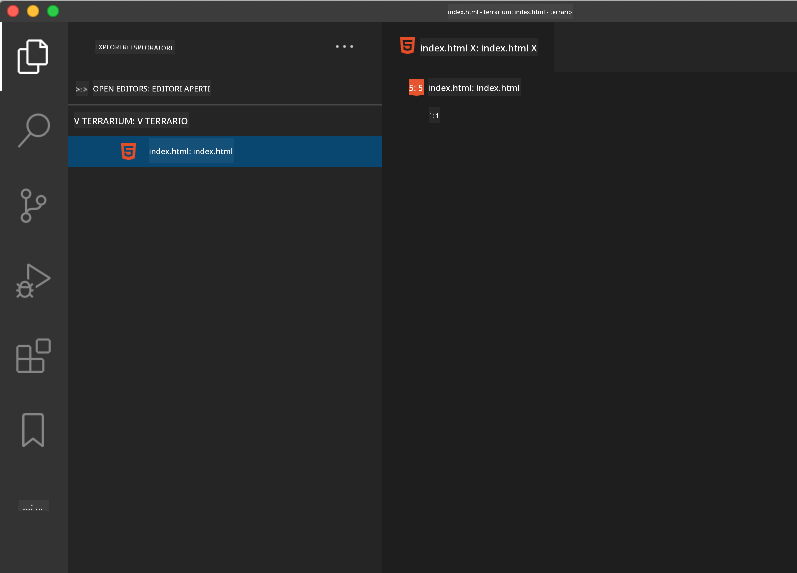

<!--
CO_OP_TRANSLATOR_METADATA:
{
  "original_hash": "46a0639e719b9cf1dfd062aa24cad639",
  "translation_date": "2025-08-25T21:10:19+00:00",
  "source_file": "3-terrarium/1-intro-to-html/README.md",
  "language_code": "it"
}
-->
# Progetto Terrarium Parte 1: Introduzione a HTML


> Sketchnote di [Tomomi Imura](https://twitter.com/girlie_mac)

## Quiz Pre-Lezione

[Quiz pre-lezione](https://ff-quizzes.netlify.app/web/quiz/15)


> Guarda il video

> 
> [](https://www.youtube.com/watch?v=1TvxJKBzhyQ)

### Introduzione

HTML, o HyperText Markup Language, è lo 'scheletro' del web. Se CSS 'veste' il tuo HTML e JavaScript gli dà vita, HTML è il corpo della tua applicazione web. La sintassi di HTML riflette proprio questa idea, includendo tag come "head", "body" e "footer".

In questa lezione, utilizzeremo HTML per strutturare lo 'scheletro' dell'interfaccia del nostro terrarium virtuale. Avrà un titolo e tre colonne: una colonna a destra e una a sinistra dove vivranno le piante trascinabili, e un'area centrale che sarà il terrarium vero e proprio con un aspetto di vetro. Alla fine di questa lezione, sarai in grado di vedere le piante nelle colonne, ma l'interfaccia sembrerà un po' strana; non preoccuparti, nella prossima sezione aggiungerai gli stili CSS per migliorare l'aspetto dell'interfaccia.

### Compito

Sul tuo computer, crea una cartella chiamata 'terrarium' e al suo interno un file chiamato 'index.html'. Puoi farlo in Visual Studio Code dopo aver creato la cartella terrarium aprendo una nuova finestra di VS Code, cliccando su 'apri cartella' e navigando verso la tua nuova cartella. Clicca sul piccolo pulsante 'file' nel pannello Esplora e crea il nuovo file:



Oppure

Usa questi comandi nel tuo git bash:
* `mkdir terrarium`
* `cd terrarium`
* `touch index.html`
* `code index.html` o `nano index.html`

> I file index.html indicano al browser che si tratta del file predefinito in una cartella; URL come `https://anysite.com/test` potrebbero essere costruiti utilizzando una struttura di cartelle che include una cartella chiamata `test` con `index.html` al suo interno; `index.html` non deve necessariamente apparire nell'URL.

---

## Il DocType e i tag html

La prima riga di un file HTML è il suo doctype. È un po' sorprendente che questa riga debba essere posizionata proprio all'inizio del file, ma serve a indicare ai browser più vecchi che la pagina deve essere renderizzata in modalità standard, seguendo le specifiche HTML attuali.

> Suggerimento: in VS Code, puoi passare il mouse sopra un tag per ottenere informazioni sul suo utilizzo dai riferimenti MDN.

La seconda riga dovrebbe essere il tag di apertura `<html>`, seguito subito dal suo tag di chiusura `</html>`. Questi tag sono gli elementi radice della tua interfaccia.

### Compito

Aggiungi queste righe all'inizio del tuo file `index.html`:

```HTML
<!DOCTYPE html>
<html></html>
```

✅ Esistono diverse modalità che possono essere determinate impostando il DocType con una stringa di query: [Modalità Quirks e Modalità Standard](https://developer.mozilla.org/docs/Web/HTML/Quirks_Mode_and_Standards_Mode). Queste modalità servivano a supportare browser molto vecchi che non vengono normalmente utilizzati oggi (Netscape Navigator 4 e Internet Explorer 5). Puoi attenerti alla dichiarazione standard del doctype.

---

## La 'head' del documento

L'area 'head' del documento HTML include informazioni cruciali sulla tua pagina web, conosciute anche come [metadata](https://developer.mozilla.org/docs/Web/HTML/Element/meta). Nel nostro caso, comunichiamo al server web, che renderizzerà questa pagina, queste quattro cose:

-   il titolo della pagina
-   i metadati della pagina, inclusi:
    -   il 'set di caratteri', che indica quale codifica dei caratteri viene utilizzata nella pagina
    -   informazioni sul browser, inclusa `x-ua-compatible` che indica che il browser IE=edge è supportato
    -   informazioni su come il viewport dovrebbe comportarsi quando viene caricato. Impostare il viewport con una scala iniziale di 1 controlla il livello di zoom quando la pagina viene caricata per la prima volta.

### Compito

Aggiungi un blocco 'head' al tuo documento tra i tag di apertura e chiusura `<html>`.

```html
<head>
	<title>Welcome to my Virtual Terrarium</title>
	<meta charset="utf-8" />
	<meta http-equiv="X-UA-Compatible" content="IE=edge" />
	<meta name="viewport" content="width=device-width, initial-scale=1" />
</head>
```

✅ Cosa accadrebbe se impostassi un tag meta viewport come questo: `<meta name="viewport" content="width=600">`? Leggi di più sul [viewport](https://developer.mozilla.org/docs/Web/HTML/Viewport_meta_tag).

---

## Il `body` del documento

### Tag HTML

In HTML, aggiungi tag al tuo file .html per creare elementi di una pagina web. Ogni tag di solito ha un tag di apertura e uno di chiusura, come questo: `<p>ciao</p>` per indicare un paragrafo. Crea il corpo della tua interfaccia aggiungendo un set di tag `<body>` all'interno della coppia di tag `<html>`; il tuo markup ora appare così:

### Compito

```html
<!DOCTYPE html>
<html>
	<head>
		<title>Welcome to my Virtual Terrarium</title>
		<meta charset="utf-8" />
		<meta http-equiv="X-UA-Compatible" content="IE=edge" />
		<meta name="viewport" content="width=device-width, initial-scale=1" />
	</head>
	<body></body>
</html>
```

Ora puoi iniziare a costruire la tua pagina. Normalmente, utilizzi i tag `<div>` per creare gli elementi separati in una pagina. Creeremo una serie di elementi `<div>` che conterranno immagini.

### Immagini

Un tag HTML che non necessita di un tag di chiusura è il tag ``, perché ha un elemento `src` che contiene tutte le informazioni necessarie alla pagina per renderizzare l'elemento.

Crea una cartella nella tua app chiamata `images` e al suo interno aggiungi tutte le immagini nella [cartella del codice sorgente](../../../../3-terrarium/solution/images); (ci sono 14 immagini di piante).

### Compito

Aggiungi quelle immagini di piante in due colonne tra i tag `<body></body>`:

```html
<div id="page">
	<div id="left-container" class="container">
		<div class="plant-holder">
			
		</div>
		<div class="plant-holder">
			
		</div>
		<div class="plant-holder">
			
		</div>
		<div class="plant-holder">
			
		</div>
		<div class="plant-holder">
			
		</div>
		<div class="plant-holder">
			
		</div>
		<div class="plant-holder">
			
		</div>
	</div>
	<div id="right-container" class="container">
		<div class="plant-holder">
			
		</div>
		<div class="plant-holder">
			
		</div>
		<div class="plant-holder">
			
		</div>
		<div class="plant-holder">
			
		</div>
		<div class="plant-holder">
			
		</div>
		<div class="plant-holder">
			
		</div>
		<div class="plant-holder">
			
		</div>
	</div>
</div>
```

> Nota: Spans vs. Divs. I Divs sono considerati elementi 'block', mentre gli Spans sono 'inline'. Cosa accadrebbe se trasformassi questi divs in spans?

Con questo markup, le piante ora appaiono sullo schermo. L'aspetto è piuttosto brutto, perché non sono ancora stilizzate con CSS, e lo faremo nella prossima lezione.

Ogni immagine ha un testo alternativo che apparirà anche se non puoi vedere o renderizzare un'immagine. Questo è un attributo importante da includere per l'accessibilità. Imparerai di più sull'accessibilità nelle lezioni future; per ora, ricorda che l'attributo alt fornisce informazioni alternative per un'immagine se un utente per qualche motivo non può visualizzarla (a causa di una connessione lenta, un errore nell'attributo src, o se l'utente utilizza un lettore di schermo).

✅ Hai notato che ogni immagine ha lo stesso tag alt? È una buona pratica? Perché o perché no? Puoi migliorare questo codice?

---

## Markup semantico

In generale, è preferibile utilizzare 'semantica' significativa quando si scrive HTML. Cosa significa? Significa che utilizzi i tag HTML per rappresentare il tipo di dati o interazione per cui sono stati progettati. Ad esempio, il testo principale di un titolo su una pagina dovrebbe utilizzare un tag `<h1>`.

Aggiungi la seguente riga subito sotto il tuo tag di apertura `<body>`:

```html
<h1>My Terrarium</h1>
```

Utilizzare markup semantico, come avere intestazioni `<h1>` e liste non ordinate renderizzate come `<ul>`, aiuta i lettori di schermo a navigare attraverso una pagina. In generale, i pulsanti dovrebbero essere scritti come `<button>` e le liste come `<li>`. Sebbene sia _possibile_ utilizzare elementi `<span>` appositamente stilizzati con gestori di clic per simulare pulsanti, è meglio per gli utenti disabili utilizzare tecnologie per determinare dove si trova un pulsante su una pagina e interagire con esso, se l'elemento appare come un pulsante. Per questo motivo, cerca di utilizzare il markup semantico il più possibile.

✅ Dai un'occhiata a un lettore di schermo e [come interagisce con una pagina web](https://www.youtube.com/watch?v=OUDV1gqs9GA). Riesci a capire perché un markup non semantico potrebbe frustrare l'utente?

## Il terrarium

L'ultima parte di questa interfaccia prevede la creazione di un markup che verrà stilizzato per creare un terrarium.

### Compito:

Aggiungi questo markup sopra l'ultimo tag `</div>`:

```html
<div id="terrarium">
	<div class="jar-top"></div>
	<div class="jar-walls">
		<div class="jar-glossy-long"></div>
		<div class="jar-glossy-short"></div>
	</div>
	<div class="dirt"></div>
	<div class="jar-bottom"></div>
</div>
```

✅ Anche se hai aggiunto questo markup allo schermo, non vedi assolutamente nulla renderizzato. Perché?

---

## 🚀Sfida

Ci sono alcuni tag 'vecchi' in HTML che sono ancora divertenti da usare, anche se non dovresti utilizzare tag deprecati come [questi tag](https://developer.mozilla.org/docs/Web/HTML/Element#Obsolete_and_deprecated_elements) nel tuo markup. Tuttavia, puoi utilizzare il vecchio tag `<marquee>` per far scorrere orizzontalmente il titolo h1? (se lo fai, non dimenticare di rimuoverlo successivamente)

## Quiz Post-Lezione

[Quiz post-lezione](https://ff-quizzes.netlify.app/web/quiz/16)

## Revisione & Studio Autonomo

HTML è il sistema di costruzione 'collaudato' che ha aiutato a costruire il web come lo conosciamo oggi. Scopri un po' della sua storia studiando alcuni tag vecchi e nuovi. Riesci a capire perché alcuni tag sono stati deprecati e altri aggiunti? Quali tag potrebbero essere introdotti in futuro?

Scopri di più sulla creazione di siti per il web e dispositivi mobili su [Microsoft Learn](https://docs.microsoft.com/learn/modules/build-simple-website/?WT.mc_id=academic-77807-sagibbon).


## Compito

[Pratica il tuo HTML: Crea un mockup di un blog](assignment.md)

**Disclaimer**:  
Questo documento è stato tradotto utilizzando il servizio di traduzione automatica [Co-op Translator](https://github.com/Azure/co-op-translator). Sebbene ci impegniamo per garantire l'accuratezza, si prega di notare che le traduzioni automatiche possono contenere errori o imprecisioni. Il documento originale nella sua lingua nativa dovrebbe essere considerato la fonte autorevole. Per informazioni critiche, si raccomanda una traduzione professionale effettuata da un traduttore umano. Non siamo responsabili per eventuali incomprensioni o interpretazioni errate derivanti dall'uso di questa traduzione.