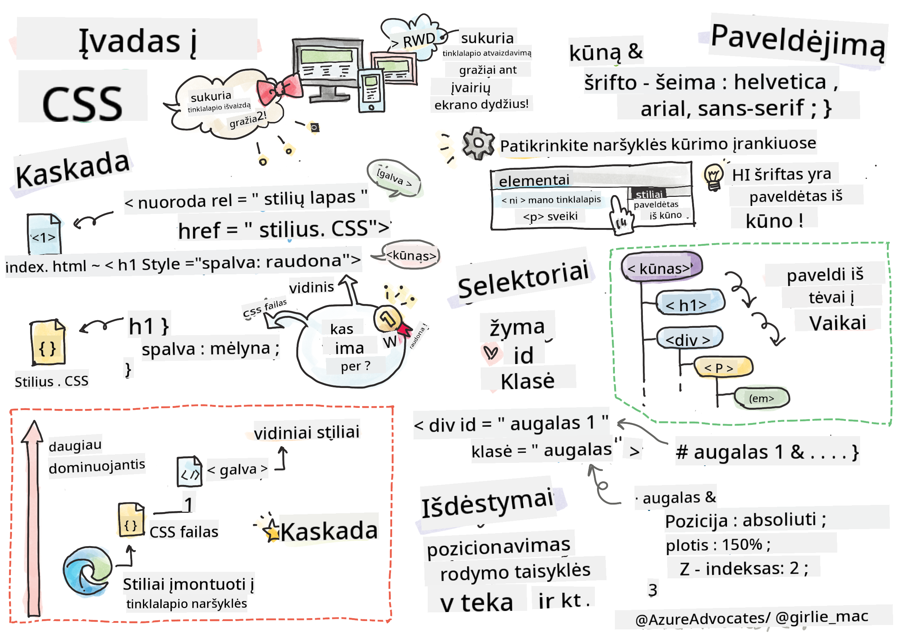
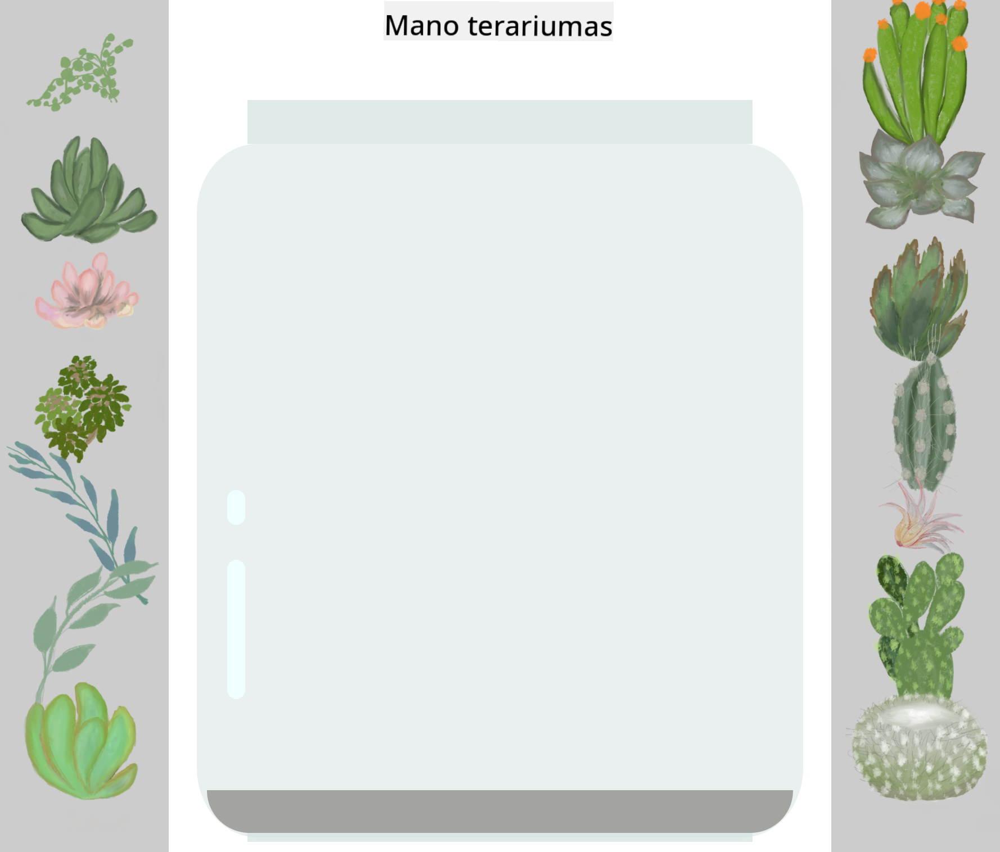

<!--
CO_OP_TRANSLATOR_METADATA:
{
  "original_hash": "e375c2aeb94e2407f2667633d39580bd",
  "translation_date": "2025-08-28T11:51:04+00:00",
  "source_file": "3-terrarium/2-intro-to-css/README.md",
  "language_code": "lt"
}
-->
# Terariumo projektas 2 dalis: Įvadas į CSS


> Sketchnote sukūrė [Tomomi Imura](https://twitter.com/girlie_mac)

## Klausimynas prieš paskaitą

[Klausimynas prieš paskaitą](https://ashy-river-0debb7803.1.azurestaticapps.net/quiz/17)

### Įvadas

CSS, arba Cascading Style Sheets, išsprendžia svarbią interneto svetainių kūrimo problemą: kaip padaryti, kad jūsų svetainė atrodytų gražiai. Programėlių stiliavimas padaro jas patogesnes naudoti ir vizualiai patrauklesnes; taip pat CSS leidžia kurti prisitaikantį dizainą (Responsive Web Design, RWD), kuris užtikrina, kad jūsų programėlės atrodys gerai nepriklausomai nuo ekrano dydžio. CSS nėra tik apie išvaizdą – specifikacijoje yra animacijos ir transformacijos, kurios leidžia kurti sudėtingas sąveikas jūsų programėlėse. CSS darbo grupė palaiko dabartines CSS specifikacijas; jų darbą galite sekti [World Wide Web Consortium svetainėje](https://www.w3.org/Style/CSS/members).

> Pastaba: CSS yra nuolat besivystanti kalba, kaip ir visa kita internete, ir ne visi naršyklės palaiko naujausias specifikacijos dalis. Visada patikrinkite savo įgyvendinimus naudodamiesi [CanIUse.com](https://caniuse.com).

Šioje pamokoje pridėsime stilių prie mūsų internetinio terariumo ir sužinosime daugiau apie kelias CSS sąvokas: kaskadą, paveldėjimą, selektorių naudojimą, pozicionavimą ir CSS naudojimą maketams kurti. Šio proceso metu išdėstysime terariumą ir sukursime patį terariumą.

### Reikalavimai

Jūsų terariumo HTML turėtų būti jau sukurtas ir paruoštas stiliavimui.

> Peržiūrėkite vaizdo įrašą

> 
> [](https://www.youtube.com/watch?v=6yIdOIV9p1I)

### Užduotis

Savo terariumo aplanke sukurkite naują failą pavadinimu `style.css`. Importuokite šį failą į `<head>` sekciją:

```html
<link rel="stylesheet" href="./style.css" />
```

---

## Kaskada

Cascading Style Sheets remiasi idėja, kad stiliai „kaskaduoja“, todėl stiliaus taikymas yra valdomas pagal jo prioritetą. Svetainės autoriaus nustatyti stiliai turi prioritetą prieš naršyklės nustatytus stilius. „Inline“ stiliai turi prioritetą prieš išoriniame stiliaus faile nustatytus stilius.

### Užduotis

Pridėkite „inline“ stilių „color: red“ prie savo `<h1>` žymos:

```HTML
<h1 style="color: red">My Terrarium</h1>
```

Tada pridėkite šį kodą į savo `style.css` failą:

```CSS
h1 {
 color: blue;
}
```

✅ Kokia spalva rodoma jūsų internetinėje programėlėje? Kodėl? Ar galite rasti būdą, kaip perrašyti stilius? Kada norėtumėte tai padaryti arba kodėl ne?

---

## Paveldėjimas

Stiliai yra paveldimi iš protėvio stiliaus į palikuonį, todėl įdėtieji elementai paveldi savo tėvų stilius.

### Užduotis

Nustatykite kūno (`body`) šriftą ir patikrinkite, ar įdėto elemento šriftas paveldėtas:

```CSS
body {
	font-family: helvetica, arial, sans-serif;
}
```

Atidarykite savo naršyklės konsolę „Elements“ skirtuke ir stebėkite H1 šriftą. Jis paveldi savo šriftą iš kūno, kaip nurodyta naršyklėje:


✅ Ar galite padaryti, kad įdėtasis stilius paveldėtų kitą savybę?

---

## CSS selektoriai

### Žymos

Iki šiol jūsų `style.css` faile buvo stiliuotos tik kelios žymos, todėl programėlė atrodo gana keistai:

```CSS
body {
	font-family: helvetica, arial, sans-serif;
}

h1 {
	color: #3a241d;
	text-align: center;
}
```

Šis žymos stiliavimo būdas leidžia jums valdyti unikalius elementus, tačiau jums reikia valdyti daugelio augalų stilius jūsų terariume. Tam reikia naudoti CSS selektorius.

### Id

Pridėkite šiek tiek stiliaus, kad išdėstytumėte kairįjį ir dešinįjį konteinerius. Kadangi yra tik vienas kairysis ir vienas dešinysis konteineris, jie žymimi id HTML žymose. Norėdami juos stiliuoti, naudokite `#`:

```CSS
#left-container {
	background-color: #eee;
	width: 15%;
	left: 0px;
	top: 0px;
	position: absolute;
	height: 100%;
	padding: 10px;
}

#right-container {
	background-color: #eee;
	width: 15%;
	right: 0px;
	top: 0px;
	position: absolute;
	height: 100%;
	padding: 10px;
}
```

Čia jūs išdėstėte šiuos konteinerius absoliučiai pozicijai ekrano kairėje ir dešinėje pusėse, o jų plotį nustatėte procentais, kad jie galėtų prisitaikyti prie mažų mobiliųjų ekranų.

✅ Šis kodas yra gana pasikartojantis, todėl neatitinka „DRY“ (Don't Repeat Yourself) principo; ar galite rasti geresnį būdą stiliuoti šiuos id, galbūt naudojant id ir klasę? Jums reikės pakeisti HTML žymas ir perrašyti CSS:

```html
<div id="left-container" class="container"></div>
```

### Klasės

Ankstesniame pavyzdyje jūs stiliavote du unikalius elementus ekrane. Jei norite, kad stiliai būtų taikomi daugeliui elementų ekrane, galite naudoti CSS klases. Taip išdėstykite augalus kairiajame ir dešiniajame konteineriuose.

Atkreipkite dėmesį, kad kiekvienas augalas HTML žymose turi id ir klasių derinį. Id čia naudojami JavaScript, kurį pridėsite vėliau, kad manipuliuotumėte terariumo augalų išdėstymu. Klasės, tačiau, suteikia visiems augalams tam tikrą stilių.

```html
<div class="plant-holder">
	
</div>
```

Pridėkite šį kodą į savo `style.css` failą:

```CSS
.plant-holder {
	position: relative;
	height: 13%;
	left: -10px;
}

.plant {
	position: absolute;
	max-width: 150%;
	max-height: 150%;
	z-index: 2;
}
```

Šiame fragmente pastebimas santykinio ir absoliutaus pozicionavimo derinys, kurį aptarsime kitame skyriuje. Atkreipkite dėmesį į aukščių valdymą procentais:

Jūs nustatėte augalų laikiklio aukštį 13%, kad visi augalai būtų rodomi kiekviename vertikaliame konteineryje be slinkimo.

Augalų laikiklis perkeliamas į kairę, kad augalai būtų labiau centruoti savo konteineryje. Vaizdai turi daug skaidraus fono, kad būtų lengviau juos perkelti, todėl reikia juos pastumti į kairę, kad geriau tilptų ekrane.

Tada pats augalas gauna maksimalų plotį 150%. Tai leidžia jam sumažėti, kai naršyklė sumažinama. Pabandykite keisti naršyklės dydį; augalai lieka savo konteineriuose, bet sumažėja, kad tilptų.

Taip pat pastebimas z-indekso naudojimas, kuris kontroliuoja elemento santykinį aukštį (kad augalai būtų virš konteinerio ir atrodytų, jog jie yra terariumo viduje).

✅ Kodėl jums reikia tiek augalų laikiklio, tiek augalo CSS selektoriaus?

## CSS pozicionavimas

Pozicijų savybių (yra statinė, santykinė, fiksuota, absoliuti ir lipni pozicijos) derinimas gali būti šiek tiek sudėtingas, tačiau tinkamai atlikus, jis suteikia gerą elementų kontrolę jūsų puslapiuose.

Absoliučiai pozicionuoti elementai yra pozicionuojami pagal artimiausią pozicionuotą protėvį, o jei tokio nėra, jie pozicionuojami pagal dokumento kūną.

Santykiniai pozicionuoti elementai yra pozicionuojami pagal CSS nurodymus, kaip juos perkelti nuo pradinės pozicijos.

Mūsų pavyzdyje `plant-holder` yra santykinės pozicijos elementas, kuris yra pozicionuojamas absoliučios pozicijos konteineryje. Rezultatas yra toks, kad šoniniai konteineriai yra pritvirtinti kairėje ir dešinėje, o `plant-holder` yra įdėtas, prisitaikydamas šoniniuose konteineriuose, suteikdamas vietos augalams išdėstyti vertikaliai.

> Pats `plant` taip pat turi absoliučią poziciją, kuri yra būtina, kad jis būtų perkeliamas, kaip sužinosite kitoje pamokoje.

✅ Eksperimentuokite, keisdami šoninių konteinerių ir `plant-holder` pozicijų tipus. Kas nutinka?

## CSS maketai

Dabar panaudosite tai, ką išmokote, kad sukurtumėte patį terariumą, naudodami tik CSS!

Pirmiausia stiliuokite `.terrarium` div vaikus kaip suapvalintą stačiakampį naudodami CSS:

```CSS
.jar-walls {
	height: 80%;
	width: 60%;
	background: #d1e1df;
	border-radius: 1rem;
	position: absolute;
	bottom: 0.5%;
	left: 20%;
	opacity: 0.5;
	z-index: 1;
}

.jar-top {
	width: 50%;
	height: 5%;
	background: #d1e1df;
	position: absolute;
	bottom: 80.5%;
	left: 25%;
	opacity: 0.7;
	z-index: 1;
}

.jar-bottom {
	width: 50%;
	height: 1%;
	background: #d1e1df;
	position: absolute;
	bottom: 0%;
	left: 25%;
	opacity: 0.7;
}

.dirt {
	width: 60%;
	height: 5%;
	background: #3a241d;
	position: absolute;
	border-radius: 0 0 1rem 1rem;
	bottom: 1%;
	left: 20%;
	opacity: 0.7;
	z-index: -1;
}
```

Atkreipkite dėmesį į procentų naudojimą čia. Jei sumažinsite naršyklės dydį, pamatysite, kaip stiklainis taip pat keičiasi. Taip pat atkreipkite dėmesį į stiklainio elementų pločio ir aukščio procentus bei tai, kaip kiekvienas elementas yra absoliučiai pozicionuojamas centre, pritvirtintas prie ekrano apačios.

Mes taip pat naudojame `rem` kraštų spinduliui, kuris yra šrifto dydžio santykinis ilgis. Daugiau apie šį santykinį matavimo tipą skaitykite [CSS specifikacijoje](https://www.w3.org/TR/css-values-3/#font-relative-lengths).

✅ Pabandykite pakeisti stiklainio spalvas ir skaidrumą, palyginti su žemės spalvomis. Kas nutinka? Kodėl?

---

## 🚀Iššūkis

Pridėkite „burbulo“ blizgesį stiklainio kairiajame apatiniame kampe, kad jis atrodytų labiau stiklinis. Jūs stiliuosite `.jar-glossy-long` ir `.jar-glossy-short`, kad jie atrodytų kaip atspindėtas blizgesys. Štai kaip tai turėtų atrodyti:



Norėdami užbaigti klausimyną po paskaitos, peržiūrėkite šį mokymosi modulį: [Stiliuokite savo HTML programėlę naudodami CSS](https://docs.microsoft.com/learn/modules/build-simple-website/4-css-basics/?WT.mc_id=academic-77807-sagibbon)

## Klausimynas po paskaitos

[Klausimynas po paskaitos](https://ashy-river-0debb7803.1.azurestaticapps.net/quiz/18)

## Apžvalga ir savarankiškas mokymasis

CSS atrodo apgaulingai paprasta, tačiau yra daug iššūkių, kai reikia tobulai stiliuoti programėlę visoms naršyklėms ir visiems ekrano dydžiams. CSS-Grid ir Flexbox yra įrankiai, sukurti tam, kad darbas būtų šiek tiek struktūriškesnis ir patikimesnis. Sužinokite apie šiuos įrankius žaisdami [Flexbox Froggy](https://flexboxfroggy.com/) ir [Grid Garden](https://codepip.com/games/grid-garden/).

## Užduotis

[CSS refaktorizavimas](assignment.md)

---

**Atsakomybės apribojimas**:  
Šis dokumentas buvo išverstas naudojant AI vertimo paslaugą [Co-op Translator](https://github.com/Azure/co-op-translator). Nors siekiame tikslumo, prašome atkreipti dėmesį, kad automatiniai vertimai gali turėti klaidų ar netikslumų. Originalus dokumentas jo gimtąja kalba turėtų būti laikomas autoritetingu šaltiniu. Kritinei informacijai rekomenduojama profesionali žmogaus vertimo paslauga. Mes neprisiimame atsakomybės už nesusipratimus ar klaidingus interpretavimus, atsiradusius naudojant šį vertimą.