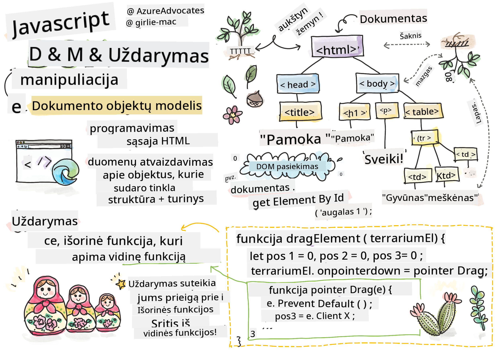
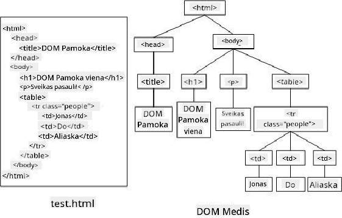

<!--
CO_OP_TRANSLATOR_METADATA:
{
  "original_hash": "30f8903a1f290e3d438dc2c70fe60259",
  "translation_date": "2025-08-28T11:52:59+00:00",
  "source_file": "3-terrarium/3-intro-to-DOM-and-closures/README.md",
  "language_code": "lt"
}
-->
# Terariumo projektas 3 dalis: DOM manipuliacija ir uždara funkcija


> Sketchnote sukūrė [Tomomi Imura](https://twitter.com/girlie_mac)

## Prieš paskaitą: testas

[Prieš paskaitą: testas](https://ff-quizzes.netlify.app/web/quiz/19)

### Įvadas

DOM manipuliacija, arba "Dokumento Objektų Modelis", yra pagrindinis interneto kūrimo aspektas. Pasak [MDN](https://developer.mozilla.org/docs/Web/API/Document_Object_Model/Introduction), "Dokumento Objektų Modelis (DOM) yra duomenų reprezentacija objektų, sudarančių dokumento struktūrą ir turinį internete." DOM manipuliacijos iššūkiai dažnai paskatino naudoti JavaScript karkasus vietoj gryno JavaScript, kad būtų lengviau valdyti DOM, tačiau mes susitvarkysime patys!

Be to, ši pamoka supažindins su [JavaScript uždara funkcija](https://developer.mozilla.org/docs/Web/JavaScript/Closures), kurią galite įsivaizduoti kaip funkciją, apgaubtą kita funkcija, kad vidinė funkcija turėtų prieigą prie išorinės funkcijos srities.

> JavaScript uždaros funkcijos yra plati ir sudėtinga tema. Ši pamoka paliečia pagrindinę idėją, kad šiame terariumo kode rasite uždarą funkciją: vidinę funkciją ir išorinę funkciją, sukonstruotas taip, kad vidinė funkcija galėtų pasiekti išorinės funkcijos sritį. Daugiau informacijos apie tai, kaip tai veikia, rasite [išsamioje dokumentacijoje](https://developer.mozilla.org/docs/Web/JavaScript/Closures).

Mes naudosime uždarą funkciją, kad manipuliuotume DOM.

Įsivaizduokite DOM kaip medį, kuris reprezentuoja visus būdus, kaip galima manipuliuoti interneto puslapio dokumentu. Buvo sukurti įvairūs API (Programų Sąsajos), kad programuotojai, naudodami savo pasirinktą programavimo kalbą, galėtų pasiekti DOM ir jį redaguoti, keisti, pertvarkyti bei kitaip valdyti.



> DOM ir HTML žymėjimo, kuris jį nurodo, reprezentacija. Sukūrė [Olfa Nasraoui](https://www.researchgate.net/publication/221417012_Profile-Based_Focused_Crawler_for_Social_Media-Sharing_Websites)

Šioje pamokoje užbaigsime interaktyvų terariumo projektą, sukurdami JavaScript kodą, kuris leis vartotojui manipuliuoti augalais puslapyje.

### Būtinos žinios

Jūs turėtumėte būti sukūrę HTML ir CSS savo terariumui. Pamokos pabaigoje galėsite perkelti augalus į terariumą ir iš jo, juos vilkdami.

### Užduotis

Savo terariumo aplanke sukurkite naują failą, pavadintą `script.js`. Importuokite šį failą į `<head>` sekciją:

```html
	<script src="./script.js" defer></script>
```

> Pastaba: naudokite `defer`, kai importuojate išorinį JavaScript failą į HTML failą, kad JavaScript būtų vykdomas tik po to, kai HTML failas bus visiškai įkeltas. Taip pat galite naudoti atributą `async`, kuris leidžia skriptui vykdyti, kol HTML failas yra analizuojamas, tačiau mūsų atveju svarbu, kad HTML elementai būtų visiškai prieinami vilkimui prieš leidžiant vykdyti vilkimo skriptą.
---

## DOM elementai

Pirmiausia turite sukurti nuorodas į elementus, kuriuos norite manipuliuoti DOM. Mūsų atveju tai yra 14 augalų, šiuo metu esančių šoninėse juostose.

### Užduotis

```html
dragElement(document.getElementById('plant1'));
dragElement(document.getElementById('plant2'));
dragElement(document.getElementById('plant3'));
dragElement(document.getElementById('plant4'));
dragElement(document.getElementById('plant5'));
dragElement(document.getElementById('plant6'));
dragElement(document.getElementById('plant7'));
dragElement(document.getElementById('plant8'));
dragElement(document.getElementById('plant9'));
dragElement(document.getElementById('plant10'));
dragElement(document.getElementById('plant11'));
dragElement(document.getElementById('plant12'));
dragElement(document.getElementById('plant13'));
dragElement(document.getElementById('plant14'));
```

Kas čia vyksta? Jūs nurodote dokumentą ir ieškote jo DOM elemento su konkrečiu Id. Prisiminkite, kad pirmoje HTML pamokoje kiekvienam augalo paveikslėliui priskyrėte individualius Id (`id="plant1"`)? Dabar pasinaudosite šiuo darbu. Identifikavę kiekvieną elementą, perduodate jį funkcijai `dragElement`, kurią netrukus sukursite. Taigi, HTML elementas dabar yra paruoštas vilkimui arba netrukus bus.

✅ Kodėl mes nurodome elementus pagal Id? Kodėl ne pagal jų CSS klasę? Galite grįžti prie ankstesnės pamokos apie CSS, kad atsakytumėte į šį klausimą.

---

## Uždara funkcija

Dabar esate pasiruošę sukurti `dragElement` uždarą funkciją, kuri yra išorinė funkcija, apgaubianti vidinę funkciją ar funkcijas (mūsų atveju turėsime tris).

Uždaros funkcijos yra naudingos, kai viena ar daugiau funkcijų turi prieigą prie išorinės funkcijos srities. Štai pavyzdys:

```javascript
function displayCandy(){
	let candy = ['jellybeans'];
	function addCandy(candyType) {
		candy.push(candyType)
	}
	addCandy('gumdrops');
}
displayCandy();
console.log(candy)
```

Šiame pavyzdyje funkcija `displayCandy` apgaubia funkciją, kuri įterpia naują saldainių tipą į masyvą, kuris jau egzistuoja funkcijoje. Jei paleistumėte šį kodą, masyvas `candy` būtų neapibrėžtas, nes jis yra vietinis kintamasis (vietinis uždarai funkcijai).

✅ Kaip galite padaryti, kad masyvas `candy` būtų prieinamas? Pabandykite perkelti jį už uždaros funkcijos ribų. Tokiu būdu masyvas taps globalus, o ne liks prieinamas tik uždaros funkcijos vietinei sričiai.

### Užduotis

Po elementų deklaracijų faile `script.js` sukurkite funkciją:

```javascript
function dragElement(terrariumElement) {
	//set 4 positions for positioning on the screen
	let pos1 = 0,
		pos2 = 0,
		pos3 = 0,
		pos4 = 0;
	terrariumElement.onpointerdown = pointerDrag;
}
```

`dragElement` gauna savo `terrariumElement` objektą iš deklaracijų skripto viršuje. Tada jūs nustatote keletą vietinių pozicijų kaip `0` objektui, perduotam funkcijai. Tai yra vietiniai kintamieji, kurie bus manipuliuojami kiekvienam elementui, kai pridėsite vilkimo ir numetimo funkcionalumą uždaroje funkcijoje. Terariumas bus užpildytas šiais vilktais elementais, todėl programa turi sekti, kur jie yra patalpinti.

Be to, `terrariumElement`, perduotas šiai funkcijai, priskiriamas `pointerdown` įvykis, kuris yra dalis [web API](https://developer.mozilla.org/docs/Web/API), sukurtų padėti valdyti DOM. `onpointerdown` įvykis įvyksta, kai paspaudžiamas mygtukas arba, mūsų atveju, paliečiamas vilkimo elementas. Šis įvykio tvarkytuvas veikia tiek [interneto, tiek mobiliuosiuose naršyklėse](https://caniuse.com/?search=onpointerdown), su keliomis išimtimis.

✅ [Įvykio tvarkytuvas `onclick`](https://developer.mozilla.org/docs/Web/API/GlobalEventHandlers/onclick) turi daug didesnį palaikymą įvairiose naršyklėse; kodėl jo nenaudotumėte čia? Pagalvokite apie tikslų ekrano sąveikos tipą, kurį bandote sukurti.

---

## Pointerdrag funkcija

`terrariumElement` yra pasiruošęs būti vilkamas; kai įvyksta `onpointerdown` įvykis, funkcija `pointerDrag` yra iškviečiama. Pridėkite šią funkciją tiesiai po šia eilute: `terrariumElement.onpointerdown = pointerDrag;`:

### Užduotis 

```javascript
function pointerDrag(e) {
	e.preventDefault();
	console.log(e);
	pos3 = e.clientX;
	pos4 = e.clientY;
}
```

Įvyksta keli dalykai. Pirma, jūs užkertate kelią numatytiesiems įvykiams, kurie paprastai įvyksta `pointerdown` metu, naudodami `e.preventDefault();`. Taip jūs turite daugiau kontrolės interfeiso elgesio atžvilgiu.

> Grįžkite prie šios eilutės, kai visiškai sukursite skripto failą, ir pabandykite be `e.preventDefault()` - kas nutinka?

Antra, atidarykite `index.html` naršyklės lange ir patikrinkite interfeisą. Kai spustelėsite augalą, galėsite pamatyti, kaip užfiksuojamas 'e' įvykis. Išanalizuokite įvykį, kad pamatytumėte, kiek informacijos surenkama vieno `pointerdown` įvykio metu!  

Toliau atkreipkite dėmesį, kaip vietiniai kintamieji `pos3` ir `pos4` nustatomi kaip `e.clientX`. Šias `e` reikšmes galite rasti inspektavimo lange. Šios reikšmės užfiksuoja augalo x ir y koordinates tuo momentu, kai jį spustelėjate arba paliečiate. Jums reikės detalaus valdymo augalų elgesiui, kai juos spustelėsite ir vilksite, todėl sekate jų koordinates.

✅ Ar tampa aiškiau, kodėl visa ši programa yra sukurta naudojant vieną didelę uždarą funkciją? Jei ne, kaip išlaikytumėte sritį kiekvienam iš 14 vilkimo augalų?

Užbaikite pradinę funkciją pridėdami dar du manipuliavimus pointer įvykiais po `pos4 = e.clientY`:

```html
document.onpointermove = elementDrag;
document.onpointerup = stopElementDrag;
```
Dabar jūs nurodote, kad norite, jog augalas būtų vilkamas kartu su pointer, kai jį judinate, ir kad vilkimo gestas sustotų, kai nustojate pasirinkti augalą. `onpointermove` ir `onpointerup` yra tos pačios API dalys kaip `onpointerdown`. Interfeisas dabar mes klaidas, nes dar neapibrėžėte funkcijų `elementDrag` ir `stopElementDrag`, todėl sukurkite jas toliau.

## Funkcijos elementDrag ir stopElementDrag

Užbaigsite savo uždarą funkciją pridėdami dar dvi vidines funkcijas, kurios tvarkys, kas nutinka, kai vilkote augalą ir nustojate jį vilkti. Norimas elgesys yra toks, kad bet kuriuo metu galėtumėte vilkti bet kurį augalą ir patalpinti jį bet kur ekrane. Šis interfeisas yra gana neapibrėžtas (pavyzdžiui, nėra numetimo zonos), kad galėtumėte sukurti savo terariumą taip, kaip norite, pridėdami, pašalindami ir perstatydami augalus.

### Užduotis

Pridėkite funkciją `elementDrag` tiesiai po `pointerDrag` uždarymo skliaustu:

```javascript
function elementDrag(e) {
	pos1 = pos3 - e.clientX;
	pos2 = pos4 - e.clientY;
	pos3 = e.clientX;
	pos4 = e.clientY;
	console.log(pos1, pos2, pos3, pos4);
	terrariumElement.style.top = terrariumElement.offsetTop - pos2 + 'px';
	terrariumElement.style.left = terrariumElement.offsetLeft - pos1 + 'px';
}
```
Šioje funkcijoje jūs daug redaguojate pradinės pozicijos 1-4, kurias nustatėte kaip vietinius kintamuosius išorinėje funkcijoje. Kas čia vyksta?

Kai vilkote, jūs iš naujo priskiriate `pos1`, padarydami ją lygią `pos3` (kurią anksčiau nustatėte kaip `e.clientX`) minus dabartinę `e.clientX` reikšmę. Panaši operacija atliekama su `pos2`. Tada jūs iš naujo nustatote `pos3` ir `pos4` į naujas elemento X ir Y koordinates. Šiuos pokyčius galite stebėti konsolėje, kai vilkote. Tada jūs manipuliuojate augalo CSS stiliumi, kad nustatytumėte jo naują poziciją, remdamiesi naujomis `pos1` ir `pos2` pozicijomis, apskaičiuodami augalo viršutinę ir kairę X ir Y koordinates, remdamiesi jo poslinkiu su šiomis naujomis pozicijomis.

> `offsetTop` ir `offsetLeft` yra CSS savybės, kurios nustato elemento poziciją, remiantis jo tėviniu elementu; tėvinis elementas gali būti bet kuris elementas, kuris nėra pozicionuotas kaip `static`. 

Visa ši pozicijų perskaičiavimo operacija leidžia jums tiksliai sureguliuoti terariumo ir jo augalų elgesį.

### Užduotis 

Paskutinė užduotis, kad užbaigtumėte interfeisą, yra pridėti funkciją `stopElementDrag` po `elementDrag` uždarymo skliaustu:

```javascript
function stopElementDrag() {
	document.onpointerup = null;
	document.onpointermove = null;
}
```

Ši maža funkcija iš naujo nustato `onpointerup` ir `onpointermove` įvykius, kad galėtumėte arba iš naujo pradėti augalo vilkimo procesą, pradėdami jį vilkti iš naujo, arba pradėti vilkti naują augalą.

✅ Kas nutinka, jei nenustatote šių įvykių kaip null?

Dabar jūs užbaigėte savo projektą!

🥇Sveikiname! Jūs užbaigėte savo gražų terariumą! 

---

## 🚀Iššūkis

Pridėkite naują įvykio tvarkytuvą savo uždaroje funkcijoje, kad augalai atliktų kažką daugiau; pavyzdžiui, dukart spustelėkite augalą, kad jis būtų perkeltas į priekį. Būkite kūrybingi!

## Po paskaitos: testas

[Po paskaitos: testas](https://ff-quizzes.netlify.app/web/quiz/20)

## Apžvalga ir savarankiškas mokymasis

Nors elementų vilkimas ekrane atrodo trivialus, yra daug būdų tai padaryti ir daug spąstų, priklausomai nuo norimo efekto. Iš tiesų, yra visa [vilkimo ir numetimo API](https://developer.mozilla.org/docs/Web/API/HTML_Drag_and_Drop_API), kurią galite išbandyti. Mes jos nenaudojome šiame modulyje, nes norimas efektas buvo šiek tiek kitoks, tačiau išbandykite šią API savo projekte ir pažiūrėkite, ką galite pasiekti.

Daugiau informacijos apie pointer įvykius rasite [W3C dokumentacijoje](https://www.w3.org/TR/pointerevents1/) ir [MDN web dokumentacijoje](https://developer.mozilla.org/docs/Web/API/Pointer_events).

Visada patikrinkite naršyklių galimybes naudodami [CanIUse.com](https://caniuse.com/).

## Užduotis

[Padirbėkite šiek tiek daugiau su DOM](assignment.md)

---

**Atsakomybės apribojimas**:  
Šis dokumentas buvo išverstas naudojant dirbtinio intelekto vertimo paslaugą [Co-op Translator](https://github.com/Azure/co-op-translator). Nors siekiame tikslumo, atkreipiame dėmesį, kad automatiniai vertimai gali turėti klaidų ar netikslumų. Originalus dokumentas jo gimtąja kalba turėtų būti laikomas autoritetingu šaltiniu. Kritinei informacijai rekomenduojama naudotis profesionalių vertėjų paslaugomis. Mes neprisiimame atsakomybės už nesusipratimus ar klaidingus aiškinimus, kylančius dėl šio vertimo naudojimo.