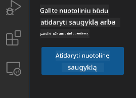
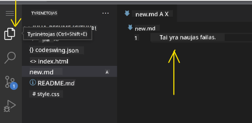
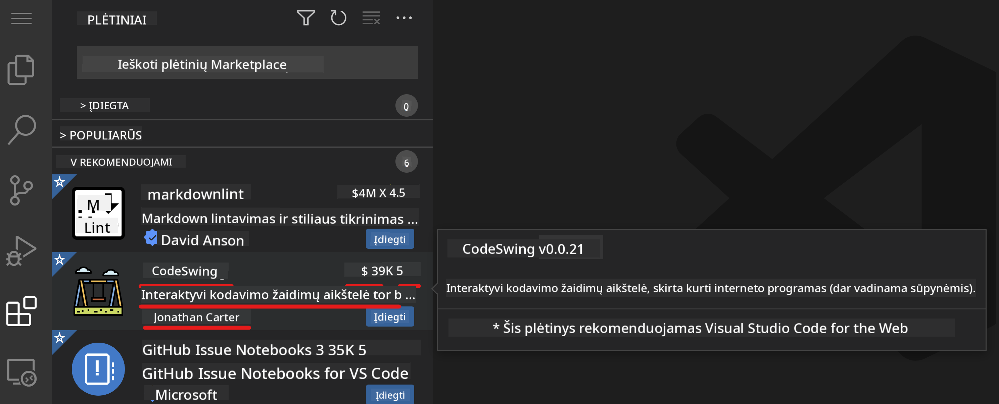
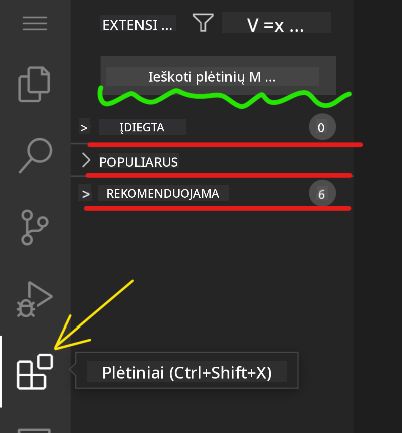
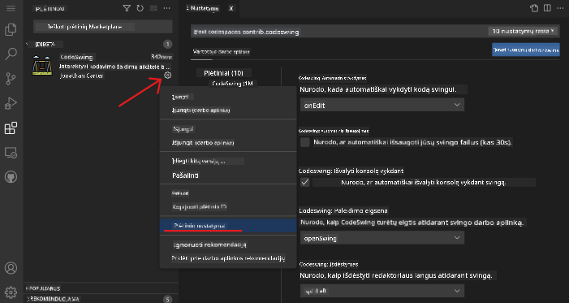

<!--
CO_OP_TRANSLATOR_METADATA:
{
  "original_hash": "7aa6e4f270d38d9cb17f2b5bd86b863d",
  "translation_date": "2025-08-28T11:54:49+00:00",
  "source_file": "8-code-editor/1-using-a-code-editor/README.md",
  "language_code": "lt"
}
-->
# Naudojimasis kodo redaktoriumi

Ši pamoka apima pagrindus, kaip naudotis [VSCode.dev](https://vscode.dev) – internetiniu kodo redaktoriumi, kad galėtumėte keisti savo kodą ir prisidėti prie projekto, nieko neįdiegdami savo kompiuteryje.

## Mokymosi tikslai

Šioje pamokoje išmoksite:

- Naudotis kodo redaktoriumi kodo projekte
- Sekti pakeitimus naudojant versijų kontrolę
- Pritaikyti redaktorių programavimui

### Reikalavimai

Prieš pradėdami, turite susikurti paskyrą [GitHub](https://github.com). Eikite į [GitHub](https://github.com/) ir susikurkite paskyrą, jei dar neturite.

### Įvadas

Kodo redaktorius yra esminis įrankis programoms rašyti ir bendradarbiauti su esamais kodavimo projektais. Kai suprasite redaktoriaus pagrindus ir kaip naudotis jo funkcijomis, galėsite jas pritaikyti rašydami kodą.

## Pradžia su VSCode.dev

[VSCode.dev](https://vscode.dev) yra internetinis kodo redaktorius. Jums nereikia nieko įdiegti, kad galėtumėte juo naudotis – tiesiog atidarykite jį kaip bet kurią kitą svetainę. Norėdami pradėti naudotis redaktoriumi, atidarykite šią nuorodą: [https://vscode.dev](https://vscode.dev). Jei nesate prisijungę prie [GitHub](https://github.com/), sekite nurodymus, kad prisijungtumėte arba susikurtumėte naują paskyrą, o tada prisijunkite.

Kai redaktorius užsikraus, jis turėtų atrodyti panašiai kaip šiame paveikslėlyje:


Yra trys pagrindinės sekcijos, pradedant nuo kairės ir judant į dešinę:

1. _Veiklos juosta_ su keliais piktogramomis, pvz., didinamuoju stiklu 🔎, krumpliaračiu ⚙️ ir kitomis.
2. Išplėsta veiklos juosta, kuri pagal numatymą yra _Naršyklė_, vadinama _šonine juosta_.
3. Ir galiausiai kodo sritis dešinėje.

Paspauskite ant kiekvienos piktogramos, kad pamatytumėte skirtingus meniu. Baigę, paspauskite _Naršyklę_, kad grįžtumėte į pradinę padėtį.

Kai pradėsite kurti kodą arba keisti esamą kodą, tai vyks didžiausioje srityje dešinėje. Šią sritį taip pat naudosite esamam kodui peržiūrėti, ką darysite toliau.

## Atidarykite GitHub saugyklą

Pirmiausia turite atidaryti GitHub saugyklą. Yra keli būdai, kaip atidaryti saugyklą. Šioje sekcijoje pamatysite du skirtingus būdus, kaip galite atidaryti saugyklą ir pradėti dirbti su pakeitimais.

### 1. Naudojant redaktorių

Naudokite patį redaktorių, kad atidarytumėte nuotolinę saugyklą. Jei eiksite į [VSCode.dev](https://vscode.dev), pamatysite mygtuką _"Open Remote Repository"_:



Taip pat galite naudoti komandų paletę. Komandų paletė yra įvesties laukelis, kuriame galite įvesti bet kokį žodį, susijusį su komanda ar veiksmu, kad rastumėte tinkamą komandą vykdymui. Naudokite meniu viršuje kairėje, tada pasirinkite _View_, o tada _Command Palette_, arba naudokite šį klavišų derinį: Ctrl-Shift-P (MacOS sistemoje tai būtų Command-Shift-P).


Kai meniu atsidarys, įveskite _open remote repository_, o tada pasirinkite pirmąją parinktį. Pasirodys kelios saugyklos, kurių dalimi esate arba kurias neseniai atidarėte. Taip pat galite naudoti pilną GitHub URL, kad pasirinktumėte vieną. Naudokite šį URL ir įklijuokite jį į laukelį:

```
https://github.com/microsoft/Web-Dev-For-Beginners
```

✅ Jei viskas pavyko, redaktoriuje bus įkelti visi šios saugyklos failai.

### 2. Naudojant URL

Taip pat galite naudoti URL tiesiogiai, kad įkeltumėte saugyklą. Pavyzdžiui, pilnas URL dabartinei saugyklai yra [https://github.com/microsoft/Web-Dev-For-Beginners](https://github.com/microsoft/Web-Dev-For-Beginners), tačiau galite pakeisti GitHub domeną į `VSCode.dev/github` ir tiesiogiai įkelti saugyklą. Rezultatas būtų [https://vscode.dev/github/microsoft/Web-Dev-For-Beginners](https://vscode.dev/github/microsoft/Web-Dev-For-Beginners).

## Redaguokite failus

Kai atidarėte saugyklą naršyklėje arba vscode.dev, kitas žingsnis būtų atnaujinti ar pakeisti projektą.

### 1. Sukurkite naują failą

Galite sukurti failą esamame aplanke arba pagrindiniame kataloge/aplanke. Norėdami sukurti naują failą, atidarykite vietą/katalogą, kur norite išsaugoti failą, ir pasirinkite _'New file ...'_ piktogramą veiklos juostoje _(kairėje)_, suteikite failui pavadinimą ir paspauskite Enter.


### 2. Redaguokite ir išsaugokite failą saugykloje

Naudojimasis vscode.dev yra naudingas, kai norite greitai atnaujinti savo projektą, neįkeldami jokios programinės įrangos lokaliai. Norėdami atnaujinti savo kodą, paspauskite 'Explorer' piktogramą, esančią veiklos juostoje, kad peržiūrėtumėte failus ir aplankus saugykloje. Pasirinkite failą, kad atidarytumėte jį kodo srityje, atlikite pakeitimus ir išsaugokite.



Kai baigsite atnaujinti projektą, pasirinkite _`source control`_ piktogramą, kurioje bus visi nauji pakeitimai, kuriuos atlikote savo saugykloje.

Norėdami peržiūrėti pakeitimus, kuriuos atlikote projekte, pasirinkite failą(-us) aplanke `Changes` išplėstoje veiklos juostoje. Tai atidarys 'Working Tree', kuriame vizualiai matysite pakeitimus, kuriuos atlikote faile. Raudona spalva rodo projekto pašalinimą, o žalia – pridėjimą.


Jei esate patenkinti atliktais pakeitimais, užveskite pelės žymeklį ant aplanko `Changes` ir paspauskite `+` mygtuką, kad paruoštumėte pakeitimus įrašymui. Paruošimas reiškia, kad ruošiate pakeitimus įrašymui į GitHub.

Jei vis dėlto nesate patenkinti kai kuriais pakeitimais ir norite juos atmesti, užveskite pelės žymeklį ant aplanko `Changes` ir pasirinkite `undo` piktogramą.

Tada įveskite `commit message` _(aprašymas apie pakeitimą, kurį atlikote projekte)_, paspauskite `check icon`, kad įrašytumėte ir išsiųstumėte pakeitimus.

Baigę darbą su projektu, pasirinkite `hamburger menu icon` viršuje kairėje, kad grįžtumėte į saugyklą github.com.


## Naudojimasis plėtiniais

Įdiegus plėtinius VSCode, galite pridėti naujų funkcijų ir pritaikyti redaktoriaus aplinką, kad pagerintumėte savo programavimo eigą. Šie plėtiniai taip pat padeda pridėti palaikymą kelioms programavimo kalboms ir dažniausiai yra bendrieji arba kalbos pagrindu sukurti plėtiniai.

Norėdami peržiūrėti visų galimų plėtinių sąrašą, paspauskite _`Extensions icon`_ veiklos juostoje ir pradėkite rašyti plėtinio pavadinimą teksto laukelyje, pažymėtame _'Search Extensions in Marketplace'_.
Pamatysite plėtinių sąrašą, kuriame bus **plėtinio pavadinimas, leidėjo vardas, vieno sakinio aprašymas, atsisiuntimų skaičius** ir **žvaigždučių įvertinimas**.



Taip pat galite peržiūrėti visus anksčiau įdiegtus plėtinius, išplėsdami aplanką _`Installed folder`_, populiarius plėtinius, kuriuos naudoja dauguma programuotojų, aplanke _`Popular folder`_ ir rekomenduojamus plėtinius jums, remiantis vartotojais toje pačioje darbo aplinkoje arba neseniai atidarytais failais aplanke _`recommended folder`_.



### 1. Įdiegti plėtinius

Norėdami įdiegti plėtinį, įveskite plėtinio pavadinimą paieškos laukelyje ir paspauskite ant jo, kad peržiūrėtumėte papildomą informaciją apie plėtinį kodo srityje, kai jis pasirodys išplėstoje veiklos juostoje.

Galite paspausti _mėlyną įdiegimo mygtuką_ išplėstoje veiklos juostoje arba naudoti įdiegimo mygtuką, kuris pasirodo kodo srityje, kai pasirinksite plėtinį, kad įkeltumėte papildomą informaciją.


### 2. Pritaikyti plėtinius

Įdiegus plėtinį, gali reikėti pakeisti jo veikimą ir pritaikyti jį pagal savo poreikius. Norėdami tai padaryti, pasirinkite Extensions piktogramą, ir šį kartą jūsų plėtinys pasirodys aplanke _Installed folder_, paspauskite _**Gear icon**_ ir eikite į _Extensions Setting_.



### 3. Valdyti plėtinius

Įdiegus ir naudojant plėtinį, vscode.dev siūlo galimybes valdyti plėtinį pagal skirtingus poreikius. Pavyzdžiui, galite pasirinkti:

- **Išjungti:** _(Laikinai išjungiate plėtinį, kai jo nebereikia, bet nenorite jo visiškai pašalinti)_

    Pasirinkite įdiegtą plėtinį išplėstoje veiklos juostoje > paspauskite Gear piktogramą > pasirinkite 'Disable' arba 'Disable (Workspace)' **ARBA** atidarykite plėtinį kodo srityje ir paspauskite mėlyną Disable mygtuką.

- **Pašalinti:** Pasirinkite įdiegtą plėtinį išplėstoje veiklos juostoje > paspauskite Gear piktogramą > pasirinkite 'Uninstall' **ARBA** atidarykite plėtinį kodo srityje ir paspauskite mėlyną Uninstall mygtuką.

---

## Užduotis

[Sukurkite gyvenimo aprašymo svetainę naudodami vscode.dev](https://github.com/microsoft/Web-Dev-For-Beginners/blob/main/8-code-editor/1-using-a-code-editor/assignment.md)

## Peržiūra ir savarankiškas mokymasis

Skaitykite daugiau apie [VSCode.dev](https://code.visualstudio.com/docs/editor/vscode-web?WT.mc_id=academic-0000-alfredodeza) ir kai kurias kitas jo funkcijas.

---

**Atsakomybės apribojimas**:  
Šis dokumentas buvo išverstas naudojant AI vertimo paslaugą [Co-op Translator](https://github.com/Azure/co-op-translator). Nors siekiame tikslumo, prašome atkreipti dėmesį, kad automatiniai vertimai gali turėti klaidų ar netikslumų. Originalus dokumentas jo gimtąja kalba turėtų būti laikomas autoritetingu šaltiniu. Kritinei informacijai rekomenduojama naudoti profesionalų žmogaus vertimą. Mes neprisiimame atsakomybės už nesusipratimus ar klaidingus interpretavimus, atsiradusius dėl šio vertimo naudojimo.