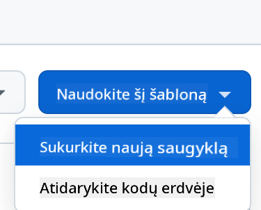
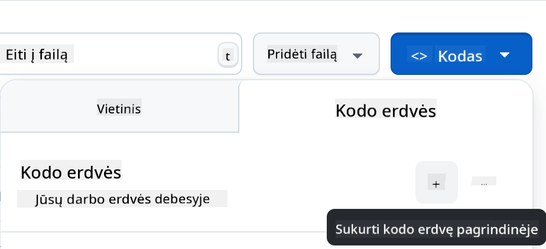

<!--
CO_OP_TRANSLATOR_METADATA:
{
  "original_hash": "cf15ff7770c5a484349383bb27d1131f",
  "translation_date": "2025-08-29T17:07:13+00:00",
  "source_file": "9-chat-project/README.md",
  "language_code": "lt"
}
-->
# Pokalbių projektas

Šis pokalbių projektas parodo, kaip sukurti Pokalbių Asistentą naudojant GitHub Models.

Štai kaip atrodo baigtas projektas:

<div>
  
</div>

Šiek tiek konteksto: kurti pokalbių asistentus naudojant generatyvinį AI yra puikus būdas pradėti mokytis apie dirbtinį intelektą. Šioje pamokoje išmoksite integruoti generatyvinį AI į internetinę programą. Pradėkime.

## Prisijungimas prie generatyvinio AI

Backend dalyje naudojame GitHub Models. Tai puiki paslauga, leidžianti nemokamai naudoti AI. Eikite į jos „playground“ ir paimkite kodą, atitinkantį jūsų pasirinktą backend kalbą. Štai kaip tai atrodo [GitHub Models Playground](https://github.com/marketplace/models/azure-openai/gpt-4o-mini/playground)

<div>
  
</div>

Kaip minėjome, pasirinkite „Code“ skirtuką ir savo pasirinktą vykdymo aplinką.

<div>
  
</div>

Šiuo atveju pasirenkame Python, tai reiškia, kad naudosime šį kodą:

```python
"""Run this model in Python

> pip install openai
"""
import os
from openai import OpenAI

# To authenticate with the model you will need to generate a personal access token (PAT) in your GitHub settings. 
# Create your PAT token by following instructions here: https://docs.github.com/en/authentication/keeping-your-account-and-data-secure/managing-your-personal-access-tokens
client = OpenAI(
    base_url="https://models.github.ai/inference",
    api_key=os.environ["GITHUB_TOKEN"],
)

response = client.chat.completions.create(
    messages=[
        {
            "role": "system",
            "content": "",
        },
        {
            "role": "user",
            "content": "What is the capital of France?",
        }
    ],
    model="openai/gpt-4o-mini",
    temperature=1,
    max_tokens=4096,
    top_p=1
)

print(response.choices[0].message.content)
```

Šiek tiek patvarkykime šį kodą, kad jis būtų patogesnis naudoti:

```python
def call_llm(prompt: str, system_message: str):
    response = client.chat.completions.create(
        messages=[
            {
                "role": "system",
                "content": system_message,
            },
            {
                "role": "user",
                "content": prompt,
            }
        ],
        model="openai/gpt-4o-mini",
        temperature=1,
        max_tokens=4096,
        top_p=1
    )

    return response.choices[0].message.content
```

Su šia funkcija `call_llm` dabar galime pateikti užklausą ir sistemos užklausą, o funkcija grąžins rezultatą.

### AI asistento pritaikymas

Jei norite pritaikyti AI asistentą, galite nurodyti, kaip jis turėtų elgtis, užpildydami sistemos užklausą, pavyzdžiui:

```python
call_llm("Tell me about you", "You're Albert Einstein, you only know of things in the time you were alive")
```

## API sukūrimas

Puiku, AI dalis baigta, pažiūrėkime, kaip ją integruoti į internetinę API. API daliai pasirinkome Flask, bet tinka bet kuris interneto karkasas. Štai kodas:

```python
# api.py
from flask import Flask, request, jsonify
from llm import call_llm
from flask_cors import CORS

app = Flask(__name__)
CORS(app)   # *   example.com

@app.route("/", methods=["GET"])
def index():
    return "Welcome to this API. Call POST /hello with 'message': 'my message' as JSON payload"


@app.route("/hello", methods=["POST"])
def hello():
    # get message from request body  { "message": "do this taks for me" }
    data = request.get_json()
    message = data.get("message", "")

    response = call_llm(message, "You are a helpful assistant.")
    return jsonify({
        "response": response
    })

if __name__ == "__main__":
    app.run(host="0.0.0.0", port=5000)
```

Čia sukuriame Flask API ir apibrėžiame numatytąjį maršrutą „/“ ir „/chat“. Pastarasis skirtas mūsų frontendui perduoti klausimus.

Norėdami integruoti *llm.py*, turime atlikti šiuos veiksmus:

- Importuoti funkciją `call_llm`:

   ```python
   from llm import call_llm
   from flask import Flask, request
   ```

- Iškviesti ją iš „/chat“ maršruto:

   ```python
   @app.route("/hello", methods=["POST"])
   def hello():
      # get message from request body  { "message": "do this taks for me" }
      data = request.get_json()
      message = data.get("message", "")

      response = call_llm(message, "You are a helpful assistant.")
      return jsonify({
         "response": response
      })
   ```

   Čia analizuojame gaunamą užklausą, kad gautume `message` savybę iš JSON kūno. Po to iškviečiame LLM su šiuo skambučiu:

   ```python
   response = call_llm(message, "You are a helpful assistant")

   # return the response as JSON
   return jsonify({
      "response": response 
   })
   ```

Puiku, dabar turime viską, ko reikia.

### Cors konfigūravimas

Reikėtų paminėti, kad nustatėme kažką panašaus į CORS (kryžminio kilmės išteklių dalijimąsi). Tai reiškia, kad kadangi mūsų backend ir frontend veiks skirtinguose portuose, turime leisti frontendui prisijungti prie backend. Štai kodas *api.py*, kuris tai nustato:

```python
from flask_cors import CORS

app = Flask(__name__)
CORS(app)   # *   example.com
```

Šiuo metu nustatyta leisti „*“, tai yra visoms kilmėms, ir tai nėra labai saugu. Turėtume tai apriboti, kai pereisime į gamybą.

## Projekto paleidimas

Gerai, turime *llm.py* ir *api.py*. Kaip tai paleisti su backend? Štai ką reikia padaryti:

- Įdiegti priklausomybes:

   ```sh
   cd backend
   python -m venv venv
   source ./venv/bin/activate

   pip install openai flask flask-cors openai
   ```

- Paleisti API:

   ```sh
   python api.py
   ```

   Jei naudojate Codespaces, turite eiti į „Ports“ redaktoriaus apačioje, dešiniuoju pelės mygtuku spustelėti ir pasirinkti „Port Visibility“ bei pasirinkti „Public“.

### Darbas su frontend

Dabar, kai API veikia, sukurkime frontend. Minimalus frontend, kurį tobulinsime palaipsniui. Kataloge *frontend* sukurkite šiuos failus:

```text
backend/
frontend/
index.html
app.js
styles.css
```

Pradėkime nuo **index.html**:

```html
<html>
    <head>
        <link rel="stylesheet" href="styles.css">
    </head>
    <body>
      <form>
        <textarea id="messages"></textarea>
        <input id="input" type="text" />
        <button type="submit" id="sendBtn">Send</button>  
      </form>  
      <script src="app.js" />
    </body>
</html>    
```

Tai yra absoliutus minimumas, kurio reikia pokalbių langui palaikyti, nes jis susideda iš teksto srities, kur bus rodomi pranešimai, įvesties lauko, kur rašysite pranešimą, ir mygtuko, kuris siunčia jūsų pranešimą į backend. Pažiūrėkime į JavaScript failą *app.js*.

**app.js**

```js
// app.js

(function(){
  // 1. set up elements  
  const messages = document.getElementById("messages");
  const form = document.getElementById("form");
  const input = document.getElementById("input");

  const BASE_URL = "change this";
  const API_ENDPOINT = `${BASE_URL}/hello`;

  // 2. create a function that talks to our backend
  async function callApi(text) {
    const response = await fetch(API_ENDPOINT, {
      method: "POST",
      headers: { "Content-Type": "application/json" },
      body: JSON.stringify({ message: text })
    });
    let json = await response.json();
    return json.response;
  }

  // 3. add response to our textarea
  function appendMessage(text, role) {
    const el = document.createElement("div");
    el.className = `message ${role}`;
    el.innerHTML = text;
    messages.appendChild(el);
  }

  // 4. listen to submit events
  form.addEventListener("submit", async(e) => {
    e.preventDefault();
   // someone clicked the button in the form
   
   // get input
   const text = input.value.trim();

   appendMessage(text, "user")

   // reset it
   input.value = '';

   const reply = await callApi(text);

   // add to messages
   appendMessage(reply, "assistant");

  })
})();
```

Paaiškinkime kodą pagal sekcijas:

- 1) Čia gauname nuorodą į visus elementus, kuriuos naudosime vėliau kode.
- 2) Šioje sekcijoje sukuriame funkciją, kuri naudoja įmontuotą `fetch` metodą, kad iškviestų mūsų backend.
- 3) `appendMessage` padeda pridėti atsakymus, taip pat tai, ką jūs kaip vartotojas įvedate.
- 4) Čia klausomės „submit“ įvykio, skaitome įvesties lauką, dedame vartotojo pranešimą į teksto sritį, iškviečiame API, ir rodome atsakymą teksto srityje.

Pažiūrėkime į stilių, čia galite būti kūrybingi ir sukurti tai, kas jums patinka, bet štai keletas pasiūlymų:

**styles.css**

```
.message {
    background: #222;
    box-shadow: 0 0 0 10px orange;
    padding: 10px:
    margin: 5px;
}

.message.user {
    background: blue;
}

.message.assistant {
    background: grey;
} 
```

Su šiomis trimis klasėmis galite skirtingai stilizuoti pranešimus, priklausomai nuo to, ar jie yra iš asistento, ar iš vartotojo. Jei norite įkvėpimo, pažiūrėkite į `solution/frontend/styles.css` katalogą.

### Pagrindinio URL pakeitimas

Yra vienas dalykas, kurio dar nenustatėme, tai `BASE_URL`. Jis nežinomas, kol backend nėra paleistas. Norėdami jį nustatyti:

- Jei API paleidžiate lokaliai, jis turėtų būti nustatytas kaip `http://localhost:5000`.
- Jei paleidžiate Codespaces, jis turėtų atrodyti maždaug taip: "[name]app.github.dev".

## Užduotis

Sukurkite savo katalogą *project* su turiniu, kaip nurodyta aukščiau:

```text
project/
  frontend/
    index.html
    app.js
    styles.css
  backend/
    api.py
    llm.py
```

Nukopijuokite turinį iš to, kas buvo nurodyta aukščiau, bet drąsiai pritaikykite pagal savo poreikius.

## Sprendimas

[Sprendimas](./solution/README.md)

## Papildoma

Pabandykite pakeisti AI asistento asmenybę. Kai iškviečiate `call_llm` *api.py*, galite pakeisti antrą argumentą į tai, ką norite, pavyzdžiui:

```python
call_llm(message, "You are Captain Picard")
```

Taip pat pakeiskite CSS ir tekstą pagal savo poreikius, atlikite pakeitimus *index.html* ir *styles.css*.

## Santrauka

Puiku, jūs išmokote nuo nulio sukurti asmeninį asistentą naudojant AI. Tai padarėme naudodami GitHub Models, backend su Python ir frontend su HTML, CSS ir JavaScript.

## Nustatymas su Codespaces

- Eikite į: [Web Dev For Beginners repo](https://github.com/microsoft/Web-Dev-For-Beginners)
- Sukurkite iš šablono (įsitikinkite, kad esate prisijungę prie GitHub) viršutiniame dešiniajame kampe:

    

- Kai būsite savo repozitorijoje, sukurkite Codespace:

    

    Tai turėtų paleisti aplinką, su kuria dabar galite dirbti.

---

**Atsakomybės apribojimas**:  
Šis dokumentas buvo išverstas naudojant AI vertimo paslaugą [Co-op Translator](https://github.com/Azure/co-op-translator). Nors siekiame tikslumo, prašome atkreipti dėmesį, kad automatiniai vertimai gali turėti klaidų ar netikslumų. Originalus dokumentas jo gimtąja kalba turėtų būti laikomas autoritetingu šaltiniu. Kritinei informacijai rekomenduojama profesionali žmogaus vertimo paslauga. Mes neprisiimame atsakomybės už nesusipratimus ar klaidingus interpretavimus, atsiradusius naudojant šį vertimą.