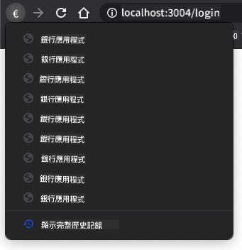

<!--
CO_OP_TRANSLATOR_METADATA:
{
  "original_hash": "8da1b5e2c63f749808858c53f37b8ce7",
  "translation_date": "2025-08-26T00:31:03+00:00",
  "source_file": "7-bank-project/1-template-route/README.md",
  "language_code": "mo"
}
-->
# 建立銀行應用程式第一部分：網頁應用中的 HTML 模板與路由

## 課前測驗

[課前測驗](https://ff-quizzes.netlify.app/web/quiz/41)

### 簡介

自從 JavaScript 在瀏覽器中出現以來，網站變得比以往更加互動且複雜。網頁技術現在常被用來建立直接在瀏覽器中運行的完整功能應用程式，我們稱之為[網頁應用程式](https://en.wikipedia.org/wiki/Web_application)。由於網頁應用程式高度互動，使用者不希望每次執行操作時都需要等待整個頁面重新載入。因此，JavaScript 被用來直接使用 DOM 更新 HTML，以提供更流暢的使用者體驗。

在本課程中，我們將建立銀行網頁應用的基礎，使用 HTML 模板來創建多個畫面，這些畫面可以顯示並更新，而無需重新載入整個 HTML 頁面。

### 先決條件

您需要一個本地網頁伺服器來測試我們在本課程中建立的網頁應用。如果您沒有，可以安裝 [Node.js](https://nodejs.org)，並在您的專案資料夾中使用指令 `npx lite-server`。它將建立一個本地網頁伺服器並在瀏覽器中開啟您的應用程式。

### 準備工作

在您的電腦上建立一個名為 `bank` 的資料夾，並在其中建立一個名為 `index.html` 的檔案。我們將從這個 HTML [樣板代碼](https://en.wikipedia.org/wiki/Boilerplate_code)開始：

```html
<!DOCTYPE html>
<html lang="en">
  <head>
    <meta charset="UTF-8">
    <meta name="viewport" content="width=device-width, initial-scale=1.0">
    <title>Bank App</title>
  </head>
  <body>
    <!-- This is where you'll work -->
  </body>
</html>
```

---

## HTML 模板

如果您想為網頁建立多個畫面，一種解決方案是為每個要顯示的畫面建立一個 HTML 檔案。然而，這種解決方案有一些不便之處：

- 切換畫面時需要重新載入整個 HTML，可能會很慢。
- 在不同畫面之間共享資料會變得困難。

另一種方法是僅使用一個 HTML 檔案，並使用 `<template>` 元素定義多個 [HTML 模板](https://developer.mozilla.org/docs/Web/HTML/Element/template)。模板是一個可重複使用的 HTML 區塊，瀏覽器不會顯示它，必須在運行時使用 JavaScript 實例化。

### 任務

我們將建立一個具有兩個畫面的銀行應用程式：登入頁面和儀表板。首先，讓我們在 HTML 主體中新增一個佔位元素，稍後我們將用它來實例化應用程式的不同畫面：

```html
<div id="app">Loading...</div>
```

我們給它一個 `id`，以便稍後使用 JavaScript 更容易找到它。

> 提示：由於此元素的內容將被替換，我們可以放置一個加載訊息或指示器，當應用程式加載時會顯示。

接下來，讓我們在 HTML 中新增登入頁面的模板。目前，我們只會在其中放置一個標題和一個包含導航連結的區段。

```html
<template id="login">
  <h1>Bank App</h1>
  <section>
    <a href="/dashboard">Login</a>
  </section>
</template>
```

然後，我們將新增另一個儀表板頁面的 HTML 模板。此頁面將包含不同的區段：

- 一個包含標題和登出連結的標頭
- 銀行帳戶的當前餘額
- 一個以表格顯示的交易列表

```html
<template id="dashboard">
  <header>
    <h1>Bank App</h1>
    <a href="/login">Logout</a>
  </header>
  <section>
    Balance: 100$
  </section>
  <section>
    <h2>Transactions</h2>
    <table>
      <thead>
        <tr>
          <th>Date</th>
          <th>Object</th>
          <th>Amount</th>
        </tr>
      </thead>
      <tbody></tbody>
    </table>
  </section>
</template>
```

> 提示：在建立 HTML 模板時，如果您想查看它的外觀，可以將 `<template>` 和 `</template>` 行用 `<!-- -->` 註解掉。

✅ 您認為我們為什麼要在模板上使用 `id` 屬性？我們是否可以使用其他方法，例如類別？

## 使用 JavaScript 顯示模板

如果您在瀏覽器中嘗試目前的 HTML 檔案，您會看到它停留在顯示 `Loading...`。這是因為我們需要新增一些 JavaScript 代碼來實例化並顯示 HTML 模板。

實例化模板通常分為三個步驟：

1. 在 DOM 中檢索模板元素，例如使用 [`document.getElementById`](https://developer.mozilla.org/docs/Web/API/Document/getElementById)。
2. 使用 [`cloneNode`](https://developer.mozilla.org/docs/Web/API/Node/cloneNode) 複製模板元素。
3. 將其附加到 DOM 中的可見元素，例如使用 [`appendChild`](https://developer.mozilla.org/docs/Web/API/Node/appendChild)。

✅ 為什麼我們需要在附加到 DOM 之前複製模板？如果跳過這一步，您認為會發生什麼？

### 任務

在您的專案資料夾中建立一個名為 `app.js` 的新檔案，並在 HTML 的 `<head>` 區段中匯入該檔案：

```html
<script src="app.js" defer></script>
```

現在在 `app.js` 中，我們將建立一個新函數 `updateRoute`：

```js
function updateRoute(templateId) {
  const template = document.getElementById(templateId);
  const view = template.content.cloneNode(true);
  const app = document.getElementById('app');
  app.innerHTML = '';
  app.appendChild(view);
}
```

我們在這裡執行的正是上述的三個步驟。我們使用 `templateId` 實例化模板，並將其複製的內容放入應用程式的佔位元素中。請注意，我們需要使用 `cloneNode(true)` 來複製模板的整個子樹。

現在使用其中一個模板呼叫此函數並查看結果。

```js
updateRoute('login');
```

✅ 這段代碼 `app.innerHTML = '';` 的目的是什麼？如果沒有它會發生什麼？

## 建立路由

在談論網頁應用程式時，我們稱 *路由* 為將 **URL** 映射到應顯示的特定畫面的意圖。在具有多個 HTML 檔案的網站中，這是自動完成的，因為檔案路徑會反映在 URL 上。例如，在您的專案資料夾中有以下檔案：

```
mywebsite/index.html
mywebsite/login.html
mywebsite/admin/index.html
```

如果您以 `mywebsite` 作為根目錄建立一個網頁伺服器，URL 映射將是：

```
https://site.com            --> mywebsite/index.html
https://site.com/login.html --> mywebsite/login.html
https://site.com/admin/     --> mywebsite/admin/index.html
```

然而，對於我們的網頁應用程式，我們使用的是包含所有畫面的單一 HTML 檔案，因此這種預設行為對我們沒有幫助。我們必須手動建立此映射並使用 JavaScript 更新顯示的模板。

### 任務

我們將使用一個簡單的物件來實現 [映射](https://en.wikipedia.org/wiki/Associative_array) URL 路徑與模板之間的關係。在您的 `app.js` 檔案頂部新增此物件。

```js
const routes = {
  '/login': { templateId: 'login' },
  '/dashboard': { templateId: 'dashboard' },
};
```

現在讓我們稍微修改一下 `updateRoute` 函數。我們不再直接傳遞 `templateId` 作為參數，而是希望先查看當前 URL，然後使用我們的映射來獲取對應的模板 ID 值。我們可以使用 [`window.location.pathname`](https://developer.mozilla.org/docs/Web/API/Location/pathname) 來僅獲取 URL 的路徑部分。

```js
function updateRoute() {
  const path = window.location.pathname;
  const route = routes[path];

  const template = document.getElementById(route.templateId);
  const view = template.content.cloneNode(true);
  const app = document.getElementById('app');
  app.innerHTML = '';
  app.appendChild(view);
}
```

在這裡，我們將宣告的路由映射到對應的模板。您可以嘗試手動更改瀏覽器中的 URL，檢查它是否正確運作。

✅ 如果您在 URL 中輸入未知路徑會發生什麼？我們如何解決這個問題？

## 新增導航功能

我們應用程式的下一步是新增在頁面之間導航的功能，而不需要手動更改 URL。這涉及兩件事：

1. 更新當前 URL
2. 根據新 URL 更新顯示的模板

第二部分我們已經使用 `updateRoute` 函數處理了，因此我們需要弄清楚如何更新當前 URL。

我們需要使用 JavaScript，特別是 [`history.pushState`](https://developer.mozilla.org/docs/Web/API/History/pushState)，它允許更新 URL 並在瀏覽歷史中建立新條目，而不重新載入 HTML。

> 注意：雖然 HTML 錨點元素 [`<a href>`](https://developer.mozilla.org/docs/Web/HTML/Element/a) 本身可以用來建立指向不同 URL 的超連結，但它預設會使瀏覽器重新載入 HTML。在使用自定義 JavaScript 處理路由時，必須使用 `preventDefault()` 函數來防止此行為。

### 任務

讓我們建立一個新函數，用於在應用程式中導航：

```js
function navigate(path) {
  window.history.pushState({}, path, path);
  updateRoute();
}
```

此方法首先根據給定的路徑更新當前 URL，然後更新模板。屬性 `window.location.origin` 返回 URL 根目錄，允許我們從給定路徑重建完整 URL。

現在我們有了這個函數，可以解決當路徑不匹配任何定義的路由時的問題。我們將通過新增回退到現有路由之一來修改 `updateRoute` 函數。

```js
function updateRoute() {
  const path = window.location.pathname;
  const route = routes[path];

  if (!route) {
    return navigate('/login');
  }

  ...
```

如果找不到路由，我們現在會重定向到 `login` 頁面。

現在讓我們建立一個函數，用於在點擊連結時獲取 URL，並防止瀏覽器的預設連結行為：

```js
function onLinkClick(event) {
  event.preventDefault();
  navigate(event.target.href);
}
```

讓我們通過在 HTML 中的 *登入* 和 *登出* 連結上新增綁定來完成導航系統。

```html
<a href="/dashboard" onclick="onLinkClick(event)">Login</a>
...
<a href="/login" onclick="onLinkClick(event)">Logout</a>
```

上述的 `event` 物件捕捉 `click` 事件並將其傳遞給我們的 `onLinkClick` 函數。

使用 [`onclick`](https://developer.mozilla.org/docs/Web/API/GlobalEventHandlers/onclick) 屬性將 `click` 事件綁定到 JavaScript 代碼，這裡是呼叫 `navigate()` 函數。

嘗試點擊這些連結，您現在應該能夠在應用程式的不同畫面之間導航。

✅ `history.pushState` 方法是 HTML5 標準的一部分，並在[所有現代瀏覽器](https://caniuse.com/?search=pushState)中實現。如果您正在為舊版瀏覽器建立網頁應用程式，可以使用一個技巧來替代此 API：使用路徑前的[哈希 (`#`)](https://en.wikipedia.org/wiki/URI_fragment)，您可以實現與常規錨點導航相容的路由，且不重新載入頁面，因為它的目的是在頁面內建立內部連結。

## 處理瀏覽器的返回與前進按鈕

使用 `history.pushState` 會在瀏覽器的導航歷史中建立新條目。您可以通過按住瀏覽器的*返回按鈕*來檢查，它應顯示類似以下內容：



如果您嘗試多次點擊返回按鈕，您會看到當前 URL 發生變化且歷史被更新，但顯示的模板保持不變。

這是因為應用程式不知道每次歷史變更時需要呼叫 `updateRoute()`。如果您查看 [`history.pushState` 文件](https://developer.mozilla.org/docs/Web/API/History/pushState)，您會看到如果狀態改變——意味著我們移動到不同的 URL——[`popstate`](https://developer.mozilla.org/docs/Web/API/Window/popstate_event) 事件會被觸發。我們將使用它來修正此問題。

### 任務

為了確保當瀏覽器歷史變更時顯示的模板被更新，我們將附加一個新函數來呼叫 `updateRoute()`。我們會在 `app.js` 檔案的底部完成此操作：

```js
window.onpopstate = () => updateRoute();
updateRoute();
```

> 注意：我們在這裡使用了一個[箭頭函數](https://developer.mozilla.org/docs/Web/JavaScript/Reference/Functions/Arrow_functions)來宣告 `popstate` 事件處理器以簡化代碼，但普通函數也可以正常工作。

以下是箭頭函數的影片回顧：

[](https://youtube.com/watch?v=OP6eEbOj2sc "箭頭函數")

> 🎥 點擊上方圖片觀看有關箭頭函數的影片。

現在嘗試使用瀏覽器的返回與前進按鈕，檢查顯示的路由是否正確更新。

---

## 🚀 挑戰

新增一個模板和路由，用於顯示此應用程式的製作人員名單的第三個頁面。

## 課後測驗

[課後測驗](https://ff-quizzes.netlify.app/web/quiz/42)

## 回顧與自學

路由是網頁開發中令人驚訝的棘手部分之一，尤其是當網頁從頁面刷新行為轉向單頁應用程式的頁面刷新時。閱讀一些有關 [Azure 靜態網頁應用服務](https://docs.microsoft.com/azure/static-web-apps/routes/?WT.mc_id=academic-77807-sagibbon)如何處理路由的資料。您能否解釋為什麼文件中描述的一些決策是必要的？

## 作業

[改善路由](assignment.md)

**免責聲明**：  
本文檔使用 AI 翻譯服務 [Co-op Translator](https://github.com/Azure/co-op-translator) 進行翻譯。儘管我們努力確保準確性，但請注意，自動翻譯可能包含錯誤或不準確之處。原始語言的文件應被視為權威來源。對於關鍵信息，建議使用專業人工翻譯。我們對因使用此翻譯而引起的任何誤解或誤釋不承擔責任。