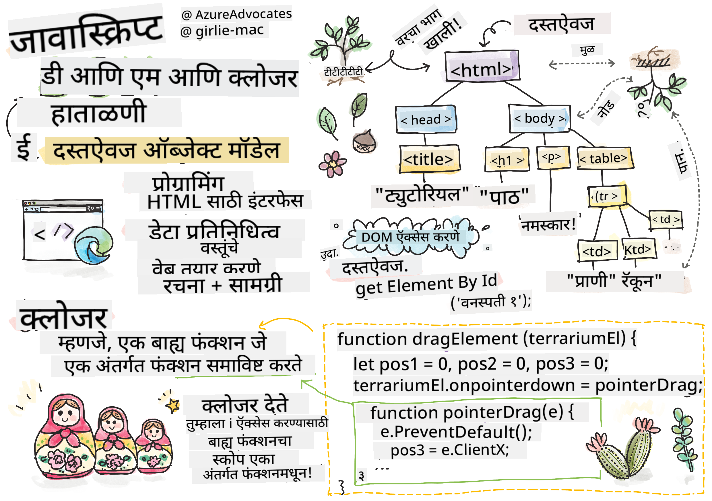
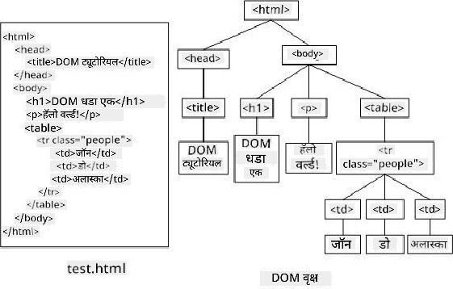

<!--
CO_OP_TRANSLATOR_METADATA:
{
  "original_hash": "30f8903a1f290e3d438dc2c70fe60259",
  "translation_date": "2025-08-25T21:17:21+00:00",
  "source_file": "3-terrarium/3-intro-to-DOM-and-closures/README.md",
  "language_code": "mr"
}
-->
# टेरॅरियम प्रकल्प भाग ३: DOM मॅनिप्युलेशन आणि क्लोजर


> स्केच नोट [Tomomi Imura](https://twitter.com/girlie_mac) यांच्याकडून

## प्री-लेक्चर क्विझ

[प्री-लेक्चर क्विझ](https://ff-quizzes.netlify.app/web/quiz/19)

### परिचय

DOM म्हणजे "डॉक्युमेंट ऑब्जेक्ट मॉडेल" मॅनिप्युलेट करणे हे वेब डेव्हलपमेंटमधील एक महत्त्वाचा भाग आहे. [MDN](https://developer.mozilla.org/docs/Web/API/Document_Object_Model/Introduction) नुसार, "डॉक्युमेंट ऑब्जेक्ट मॉडेल (DOM) ही वेबवरील डॉक्युमेंटची रचना आणि सामग्री बनवणाऱ्या ऑब्जेक्ट्सची डेटा रिप्रेझेंटेशन आहे." DOM मॅनिप्युलेशनमधील आव्हाने अनेकदा जावास्क्रिप्ट फ्रेमवर्क्स वापरण्याचे कारण बनले आहेत, परंतु आपण व्हॅनिला जावास्क्रिप्ट वापरून स्वतःच व्यवस्थापन करू!

याशिवाय, या धड्यात [जावास्क्रिप्ट क्लोजर](https://developer.mozilla.org/docs/Web/JavaScript/Closures) या संकल्पनेची ओळख करून दिली जाईल, ज्याला तुम्ही एका फंक्शनने दुसऱ्या फंक्शनला बंदिस्त केले आहे असे समजू शकता, ज्यामुळे आतील फंक्शनला बाहेरील फंक्शनच्या स्कोपमध्ये प्रवेश मिळतो.

> जावास्क्रिप्ट क्लोजर ही एक विस्तृत आणि गुंतागुंतीची संकल्पना आहे. या धड्यात टेरॅरियमच्या कोडमध्ये तुम्हाला एक क्लोजर सापडेल: एक आतील फंक्शन आणि एक बाहेरील फंक्शन अशा प्रकारे तयार केले गेले आहे की आतील फंक्शनला बाहेरील फंक्शनच्या स्कोपमध्ये प्रवेश मिळतो. हे कसे कार्य करते याबद्दल अधिक माहितीसाठी [विस्तृत दस्तऐवज](https://developer.mozilla.org/docs/Web/JavaScript/Closures) पहा.

आपण DOM मॅनिप्युलेट करण्यासाठी क्लोजर वापरणार आहोत.

DOM ला एक झाड म्हणून विचार करा, जे वेब पृष्ठ डॉक्युमेंटला मॅनिप्युलेट करण्याच्या सर्व प्रकारांचे प्रतिनिधित्व करते. विविध API (अॅप्लिकेशन प्रोग्राम इंटरफेस) लिहिले गेले आहेत जेणेकरून प्रोग्रामर त्यांच्या पसंतीच्या प्रोग्रामिंग भाषेचा वापर करून DOM मध्ये प्रवेश करू शकतील आणि त्याचे संपादन, बदल, पुनर्रचना आणि व्यवस्थापन करू शकतील.



> DOM आणि त्याचा संदर्भ देणारा HTML मार्कअपचे प्रतिनिधित्व. [Olfa Nasraoui](https://www.researchgate.net/publication/221417012_Profile-Based_Focused_Crawler_for_Social_Media-Sharing_Websites) यांच्याकडून

या धड्यात, आपण आपल्या इंटरॅक्टिव्ह टेरॅरियम प्रकल्प पूर्ण करणार आहोत, ज्यामध्ये वापरकर्त्याला पृष्ठावरील झाडे मॅनिप्युलेट करण्यासाठी जावास्क्रिप्ट तयार करायची आहे.

### पूर्वतयारी

तुमच्याकडे टेरॅरियमसाठी HTML आणि CSS तयार असले पाहिजे. या धड्याच्या शेवटी तुम्ही झाडांना टेरॅरियममध्ये हलवून आणि बाहेर काढून ड्रॅग करण्यास सक्षम असाल.

### कार्य

तुमच्या टेरॅरियम फोल्डरमध्ये `script.js` नावाची नवीन फाइल तयार करा. ती फाइल `<head>` विभागात इम्पोर्ट करा:

```html
	<script src="./script.js" defer></script>
```

> लक्षात ठेवा: HTML फाइल पूर्णपणे लोड झाल्यानंतरच जावास्क्रिप्ट चालवण्यासाठी बाह्य जावास्क्रिप्ट फाइल इम्पोर्ट करताना `defer` वापरा. तुम्ही `async` अॅट्रिब्यूट देखील वापरू शकता, ज्यामुळे स्क्रिप्ट HTML फाइल पार्स करत असताना चालते, परंतु आपल्या प्रकरणात, ड्रॅग स्क्रिप्ट चालवण्यापूर्वी HTML घटक पूर्णपणे उपलब्ध असणे महत्त्वाचे आहे.
---

## DOM घटक

सर्वप्रथम तुम्हाला DOM मध्ये मॅनिप्युलेट करायच्या घटकांचे संदर्भ तयार करणे आवश्यक आहे. आपल्या प्रकरणात, ते १४ झाडे आहेत जी साइड बारमध्ये प्रतीक्षा करत आहेत.

### कार्य

```html
dragElement(document.getElementById('plant1'));
dragElement(document.getElementById('plant2'));
dragElement(document.getElementById('plant3'));
dragElement(document.getElementById('plant4'));
dragElement(document.getElementById('plant5'));
dragElement(document.getElementById('plant6'));
dragElement(document.getElementById('plant7'));
dragElement(document.getElementById('plant8'));
dragElement(document.getElementById('plant9'));
dragElement(document.getElementById('plant10'));
dragElement(document.getElementById('plant11'));
dragElement(document.getElementById('plant12'));
dragElement(document.getElementById('plant13'));
dragElement(document.getElementById('plant14'));
```

इथे काय चालले आहे? तुम्ही डॉक्युमेंटचा संदर्भ घेत आहात आणि त्याच्या DOM मध्ये शोधून विशिष्ट Id असलेला घटक शोधत आहात. HTML च्या पहिल्या धड्यात तुम्ही प्रत्येक झाडाच्या प्रतिमेला वैयक्तिक Id दिले होते (`id="plant1"`)? आता तुम्ही त्या प्रयत्नाचा उपयोग करणार आहात. प्रत्येक घटक ओळखल्यानंतर, तुम्ही त्या आयटमला `dragElement` नावाच्या फंक्शनमध्ये पास करता, जे तुम्ही थोड्याच वेळात तयार करणार आहात. त्यामुळे HTML मधील घटक आता ड्रॅग-एनेबल्ड होईल, किंवा लवकरच होईल.

✅ आपण Id द्वारे घटकांचा संदर्भ का घेतो? CSS क्लासद्वारे का नाही? या प्रश्नाचे उत्तर देण्यासाठी CSS च्या मागील धडाचा संदर्भ घ्या.

---

## क्लोजर

आता तुम्ही `dragElement` क्लोजर तयार करण्यासाठी तयार आहात, जे एक बाहेरील फंक्शन आहे जे एका किंवा अधिक आतील फंक्शनला बंदिस्त करते (आपल्या प्रकरणात, तीन फंक्शन असतील).

क्लोजर उपयुक्त असतात जेव्हा एका किंवा अधिक फंक्शनला बाहेरील फंक्शनच्या स्कोपमध्ये प्रवेश करणे आवश्यक असते. उदाहरण येथे आहे:

```javascript
function displayCandy(){
	let candy = ['jellybeans'];
	function addCandy(candyType) {
		candy.push(candyType)
	}
	addCandy('gumdrops');
}
displayCandy();
console.log(candy)
```

या उदाहरणात, `displayCandy` फंक्शन एका फंक्शनला बंदिस्त करते जे आधीपासून फंक्शनमध्ये असलेल्या ऍरेमध्ये नवीन कँडी प्रकार पुश करते. जर तुम्ही हा कोड चालवला तर `candy` ऍरे अनिर्दिष्ट असेल, कारण ते एक स्थानिक व्हेरिएबल आहे (क्लोजरच्या स्थानिक स्कोपमध्ये).

✅ तुम्ही `candy` ऍरे कसा उपलब्ध करू शकता? प्रयत्न करून ते क्लोजरच्या बाहेर हलवा. यामुळे ऍरे स्थानिक राहण्याऐवजी जागतिक होईल.

### कार्य

`script.js` मध्ये घटक डिक्लेरेशनच्या खाली एक फंक्शन तयार करा:

```javascript
function dragElement(terrariumElement) {
	//set 4 positions for positioning on the screen
	let pos1 = 0,
		pos2 = 0,
		pos3 = 0,
		pos4 = 0;
	terrariumElement.onpointerdown = pointerDrag;
}
```

`dragElement` ला त्याचा `terrariumElement` ऑब्जेक्ट स्क्रिप्टच्या शीर्षस्थानी असलेल्या डिक्लेरेशनमधून मिळतो. मग, तुम्ही त्या फंक्शनमध्ये पास केलेल्या ऑब्जेक्टसाठी काही स्थानिक पोझिशन्स `0` वर सेट करता. हे स्थानिक व्हेरिएबल्स आहेत जे प्रत्येक घटकासाठी मॅनिप्युलेट केले जातील कारण तुम्ही प्रत्येक घटकात ड्रॅग आणि ड्रॉप फंक्शनॅलिटी जोडता. टेरॅरियम या ड्रॅग केलेल्या घटकांनी भरले जाईल, त्यामुळे अॅप्लिकेशनला त्यांची जागा कुठे आहे हे ट्रॅक करणे आवश्यक आहे.

याशिवाय, फंक्शनला पास केलेल्या `terrariumElement` ला `pointerdown` इव्हेंट असाइन केले जाते, जे [वेब API](https://developer.mozilla.org/docs/Web/API) चा भाग आहे जो DOM व्यवस्थापनासाठी डिझाइन केलेला आहे. `onpointerdown` बटण पुश केल्यावर किंवा आपल्या प्रकरणात, ड्रॅग करण्यायोग्य घटकाला स्पर्श केल्यावर फायर होते. हा इव्हेंट हँडलर [वेब आणि मोबाइल ब्राउझर](https://caniuse.com/?search=onpointerdown) वर कार्य करतो, काही अपवादांसह.

✅ [इव्हेंट हँडलर `onclick`](https://developer.mozilla.org/docs/Web/API/GlobalEventHandlers/onclick) ला क्रॉस-ब्राउझर अधिक समर्थन आहे; तुम्ही ते इथे का वापरत नाही? तुम्ही तयार करायच्या स्क्रीन इंटरॅक्शनच्या प्रकाराबद्दल विचार करा.

---

## Pointerdrag फंक्शन

`terrariumElement` आता ड्रॅग करण्यासाठी तयार आहे; जेव्हा `onpointerdown` इव्हेंट फायर होतो, तेव्हा `pointerDrag` फंक्शन कॉल केले जाते. त्या ओळीखाली हे फंक्शन जोडा: `terrariumElement.onpointerdown = pointerDrag;`:

### कार्य 

```javascript
function pointerDrag(e) {
	e.preventDefault();
	console.log(e);
	pos3 = e.clientX;
	pos4 = e.clientY;
}
```

काही गोष्टी घडतात. प्रथम, तुम्ही `e.preventDefault();` वापरून pointerdown वर सामान्यतः घडणाऱ्या डिफॉल्ट इव्हेंट्स होण्यापासून प्रतिबंधित करता. यामुळे तुम्हाला इंटरफेसच्या वर्तनावर अधिक नियंत्रण मिळते.

> स्क्रिप्ट फाइल पूर्णपणे तयार झाल्यावर या ओळीवर परत या आणि `e.preventDefault()` वगळून प्रयत्न करा - काय होते?

दुसरे, `index.html` ब्राउझर विंडोमध्ये उघडा आणि इंटरफेस तपासा. जेव्हा तुम्ही झाडावर क्लिक करता, तेव्हा तुम्ही 'e' इव्हेंट कसा कॅप्चर केला जातो ते पाहू शकता. इव्हेंटमध्ये किती माहिती गोळा केली जाते ते पाहण्यासाठी इव्हेंटमध्ये खोलवर जा!

यानंतर, स्थानिक व्हेरिएबल्स `pos3` आणि `pos4` `e.clientX` वर सेट केल्या जातात. तुम्ही इन्स्पेक्शन पॅनमध्ये `e` व्हॅल्यूज शोधू शकता. या व्हॅल्यूज झाडाच्या x आणि y कोऑर्डिनेट्स कॅप्चर करतात जेव्हा तुम्ही त्यावर क्लिक करता किंवा स्पर्श करता. तुम्हाला झाडांच्या वर्तनावर सूक्ष्म नियंत्रण आवश्यक आहे कारण तुम्ही त्यांना क्लिक आणि ड्रॅग करता, त्यामुळे तुम्ही त्यांच्या कोऑर्डिनेट्सचा मागोवा ठेवता.

✅ हे अॅप एका मोठ्या क्लोजरने का तयार केले आहे हे अधिक स्पष्ट होत आहे का? जर तसे नसते, तर तुम्ही १४ ड्रॅग करण्यायोग्य झाडांसाठी स्कोप कसा राखला असता?

प्रारंभिक फंक्शन पूर्ण करण्यासाठी `pos4 = e.clientY` च्या खाली आणखी दोन pointer इव्हेंट मॅनिप्युलेशन जोडा:

```html
document.onpointermove = elementDrag;
document.onpointerup = stopElementDrag;
```
आता तुम्ही झाडाला पॉइंटरसह हलवण्याचा इशारा देत आहात आणि झाड निवडणे थांबवल्यावर ड्रॅगिंग थांबवण्याचा इशारा देत आहात. `onpointermove` आणि `onpointerup` हे `onpointerdown` सारख्या API चा भाग आहेत. इंटरफेस आता त्रुटी फेकतो कारण तुम्ही अद्याप `elementDrag` आणि `stopElementDrag` फंक्शन डिफाइन केले नाहीत, त्यामुळे पुढे ते तयार करा.

## elementDrag आणि stopElementDrag फंक्शन

तुम्ही दोन अंतर्गत फंक्शन जोडून तुमचे क्लोजर पूर्ण कराल, जे तुम्ही झाड ड्रॅग करता तेव्हा आणि ड्रॅग करणे थांबवता तेव्हा काय होते ते हाताळतील. तुम्हाला हवे असलेले वर्तन असे आहे की तुम्ही कोणतेही झाड कधीही ड्रॅग करू शकता आणि ते स्क्रीनवर कुठेही ठेवू शकता. हा इंटरफेस खूप अन-ओपिनियनटेड आहे (उदाहरणार्थ, येथे ड्रॉप झोन नाही) जेणेकरून तुम्ही तुमचे टेरॅरियम तुमच्या आवडीनुसार डिझाइन करू शकता - झाडे जोडून, काढून टाकून आणि पुन्हा स्थानांतरित करून.

### कार्य

`pointerDrag` च्या बंद करणाऱ्या कर्ली ब्रॅकेटच्या नंतर `elementDrag` फंक्शन जोडा:

```javascript
function elementDrag(e) {
	pos1 = pos3 - e.clientX;
	pos2 = pos4 - e.clientY;
	pos3 = e.clientX;
	pos4 = e.clientY;
	console.log(pos1, pos2, pos3, pos4);
	terrariumElement.style.top = terrariumElement.offsetTop - pos2 + 'px';
	terrariumElement.style.left = terrariumElement.offsetLeft - pos1 + 'px';
}
```
या फंक्शनमध्ये, तुम्ही प्रारंभिक पोझिशन्स १-४ संपादित करता, जे तुम्ही बाहेरील फंक्शनमध्ये स्थानिक व्हेरिएबल्स म्हणून सेट केले होते. येथे काय चालले आहे?

तुम्ही ड्रॅग करता तेव्हा, तुम्ही `pos1` ला `pos3` (जे तुम्ही पूर्वी `e.clientX` म्हणून सेट केले होते) - सध्याच्या `e.clientX` व्हॅल्यूच्या बरोबरीने बनवून पुन्हा असाइन करता. तुम्ही `pos2` वर समान ऑपरेशन करता. मग, तुम्ही `pos3` आणि `pos4` ला घटकाच्या नवीन x आणि y कोऑर्डिनेट्सवर रीसेट करता. तुम्ही ड्रॅग करत असताना कन्सोलमध्ये या बदलांचा मागोवा घेऊ शकता. मग, तुम्ही झाडाच्या css स्टाइलला त्याच्या नवीन पोझिशनवर सेट करण्यासाठी मॅनिप्युलेट करता, `pos1` आणि `pos2` च्या नवीन पोझिशन्सच्या तुलनेत झाडाच्या टॉप आणि लेफ्ट x आणि y कोऑर्डिनेट्सची गणना करता.

> `offsetTop` आणि `offsetLeft` हे CSS प्रॉपर्टीज आहेत जे एखाद्या घटकाची स्थिती त्याच्या पालकाच्या स्थितीच्या आधारे सेट करतात; त्याचा पालक कोणताही घटक असू शकतो जो `static` म्हणून पोझिशन केलेला नाही.

या पोझिशनिंगची पुनर्गणना तुम्हाला टेरॅरियम आणि त्याच्या झाडांच्या वर्तनावर सूक्ष्म नियंत्रण ठेवण्यास अनुमती देते.

### कार्य 

इंटरफेस पूर्ण करण्यासाठी अंतिम कार्य म्हणजे `elementDrag` च्या बंद करणाऱ्या कर्ली ब्रॅकेटच्या नंतर `stopElementDrag` फंक्शन जोडणे:

```javascript
function stopElementDrag() {
	document.onpointerup = null;
	document.onpointermove = null;
}
```

हे छोटे फंक्शन `onpointerup` आणि `onpointermove` इव्हेंट्स रीसेट करते जेणेकरून तुम्ही तुमच्या झाडाची प्रगती पुन्हा सुरू करू शकता किंवा नवीन झाड ड्रॅग करण्यास सुरुवात करू शकता.

✅ तुम्ही हे इव्हेंट्स null वर सेट केले नाहीत तर काय होते?

आता तुम्ही तुमचा प्रकल्प पूर्ण केला आहे!

🥇 अभिनंदन! तुम्ही तुमचे सुंदर टेरॅरियम पूर्ण केले आहे! 

---

## 🚀चॅलेंज

तुमच्या क्लोजरमध्ये नवीन इव्हेंट हँडलर जोडा जेणेकरून झाडांवर आणखी काही करता येईल; उदाहरणार्थ, झाडावर डबल-क्लिक करून ते पुढे आणा. क्रिएटिव्ह व्हा!

## पोस्ट-लेक्चर क्विझ

[पोस्ट-लेक्चर क्विझ](https://ff-quizzes.netlify.app/web/quiz/20)

## पुनरावलोकन आणि स्व-अभ्यास

स्क्रीनवर घटक ड्रॅग करणे सामान्य वाटत असले तरी, हे करण्याचे अनेक मार्ग आहेत आणि तुम्ही शोधत असलेल्या परिणामावर अवलंबून अनेक अडचणी आहेत. खरं तर, [ड्रॅग आणि ड्रॉप API](https://developer.mozilla.org/docs/Web/API/HTML_Drag_and_Drop_API) आहे ज्याचा तुम्ही प्रयत्न करू शकता. आम्ही या मॉड्यूलमध्ये ते वापरले नाही कारण आम्हाला हवा असलेला परिणाम थोडा वेगळा होता, परंतु स्वतःच्या प्रकल्पावर या API चा प्रयत्न करा आणि तुम्ही काय साध्य करू शकता ते पहा.

पॉइंटर इव्हेंट्सबद्दल अधिक माहिती [W3C दस्तऐवज](https://www.w3.org/TR/pointerevents1/) आणि [MDN वेब दस्तऐवज](https://developer.mozilla.org/docs/Web/API/Pointer_events) वर शोधा.

नेहमी ब्राउझर क्षमता तपासा [CanIUse.com](https://caniuse.com/) वापरून.

## असाइनमेंट

[DOM सह आणखी थोडे काम करा](assignment.md)

**अस्वीकरण**:  
हा दस्तऐवज AI भाषांतर सेवा [Co-op Translator](https://github.com/Azure/co-op-translator) वापरून भाषांतरित करण्यात आला आहे. आम्ही अचूकतेसाठी प्रयत्नशील असलो तरी कृपया लक्षात ठेवा की स्वयंचलित भाषांतरांमध्ये त्रुटी किंवा अचूकतेचा अभाव असू शकतो. मूळ भाषेतील दस्तऐवज हा अधिकृत स्रोत मानला जावा. महत्त्वाच्या माहितीसाठी व्यावसायिक मानवी भाषांतराची शिफारस केली जाते. या भाषांतराचा वापर करून उद्भवलेल्या कोणत्याही गैरसमज किंवा चुकीच्या अर्थासाठी आम्ही जबाबदार राहणार नाही.