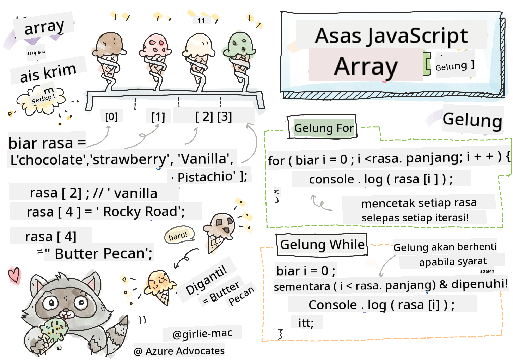

<!--
CO_OP_TRANSLATOR_METADATA:
{
  "original_hash": "3f7f87871312cf6cc12662da7d973182",
  "translation_date": "2025-08-27T22:52:37+00:00",
  "source_file": "2-js-basics/4-arrays-loops/README.md",
  "language_code": "ms"
}
-->
# Asas JavaScript: Array dan Gelung


> Sketchnote oleh [Tomomi Imura](https://twitter.com/girlie_mac)

## Kuiz Pra-Kuliah
[Kuiz pra-kuliah](https://ff-quizzes.netlify.app/web/quiz/13)

Pelajaran ini merangkumi asas JavaScript, bahasa yang memberikan interaktiviti di web. Dalam pelajaran ini, anda akan mempelajari tentang array dan gelung, yang digunakan untuk memanipulasi data.

[](https://youtube.com/watch?v=1U4qTyq02Xw "Array")

[](https://www.youtube.com/watch?v=Eeh7pxtTZ3k "Gelung")

> 🎥 Klik imej di atas untuk video tentang array dan gelung.

> Anda boleh mengikuti pelajaran ini di [Microsoft Learn](https://docs.microsoft.com/learn/modules/web-development-101-arrays/?WT.mc_id=academic-77807-sagibbon)!

## Array

Bekerja dengan data adalah tugas biasa dalam mana-mana bahasa, dan ia menjadi lebih mudah apabila data disusun dalam format struktur seperti array. Dengan array, data disimpan dalam struktur yang serupa dengan senarai. Salah satu kelebihan utama array ialah anda boleh menyimpan pelbagai jenis data dalam satu array.

✅ Array ada di sekeliling kita! Bolehkah anda memikirkan contoh array dalam kehidupan sebenar, seperti susunan panel solar?

Sintaks untuk array ialah sepasang kurungan segi empat.

```javascript
let myArray = [];
```

Ini adalah array kosong, tetapi array boleh diisytiharkan dengan data yang telah diisi. Nilai-nilai dalam array dipisahkan dengan koma.

```javascript
let iceCreamFlavors = ["Chocolate", "Strawberry", "Vanilla", "Pistachio", "Rocky Road"];
```

Nilai-nilai dalam array diberikan nilai unik yang dipanggil **indeks**, iaitu nombor bulat yang diberikan berdasarkan jaraknya dari permulaan array. Dalam contoh di atas, nilai string "Chocolate" mempunyai indeks 0, dan indeks "Rocky Road" ialah 4. Gunakan indeks dengan kurungan segi empat untuk mendapatkan, mengubah, atau memasukkan nilai dalam array.

✅ Adakah anda terkejut bahawa array bermula pada indeks sifar? Dalam beberapa bahasa pengaturcaraan, indeks bermula pada 1. Terdapat sejarah menarik mengenainya, yang anda boleh [baca di Wikipedia](https://en.wikipedia.org/wiki/Zero-based_numbering).

```javascript
let iceCreamFlavors = ["Chocolate", "Strawberry", "Vanilla", "Pistachio", "Rocky Road"];
iceCreamFlavors[2]; //"Vanilla"
```

Anda boleh menggunakan indeks untuk mengubah nilai, seperti ini:

```javascript
iceCreamFlavors[4] = "Butter Pecan"; //Changed "Rocky Road" to "Butter Pecan"
```

Dan anda boleh memasukkan nilai baru pada indeks tertentu seperti ini:

```javascript
iceCreamFlavors[5] = "Cookie Dough"; //Added "Cookie Dough"
```

✅ Cara yang lebih biasa untuk menambah nilai ke dalam array adalah dengan menggunakan operator array seperti array.push()

Untuk mengetahui berapa banyak item dalam array, gunakan sifat `length`.

```javascript
let iceCreamFlavors = ["Chocolate", "Strawberry", "Vanilla", "Pistachio", "Rocky Road"];
iceCreamFlavors.length; //5
```

✅ Cuba sendiri! Gunakan konsol pelayar anda untuk mencipta dan memanipulasi array ciptaan anda sendiri.

## Gelung

Gelung membolehkan kita melakukan tugas berulang atau **iteratif**, dan boleh menjimatkan banyak masa dan kod. Setiap iterasi boleh berbeza dalam pembolehubah, nilai, dan syaratnya. Terdapat pelbagai jenis gelung dalam JavaScript, dan semuanya mempunyai perbezaan kecil, tetapi pada dasarnya melakukan perkara yang sama: mengulangi data.

### Gelung For

Gelung `for` memerlukan 3 bahagian untuk iterasi:
- `counter` Pembolehubah yang biasanya dimulakan dengan nombor yang mengira bilangan iterasi
- `condition` Ungkapan yang menggunakan operator perbandingan untuk menghentikan gelung apabila `false`
- `iteration-expression` Dilaksanakan pada akhir setiap iterasi, biasanya digunakan untuk mengubah nilai counter
  
```javascript
// Counting up to 10
for (let i = 0; i < 10; i++) {
  console.log(i);
}
```

✅ Jalankan kod ini dalam konsol pelayar. Apa yang berlaku apabila anda membuat perubahan kecil pada counter, condition, atau iteration expression? Bolehkah anda membuatnya berjalan ke belakang, mencipta undur?

### Gelung While

Tidak seperti sintaks gelung `for`, gelung `while` hanya memerlukan syarat yang akan menghentikan gelung apabila syarat menjadi `false`. Syarat dalam gelung biasanya bergantung pada nilai lain seperti counter, dan mesti diuruskan semasa gelung. Nilai permulaan untuk counter mesti dicipta di luar gelung, dan sebarang ungkapan untuk memenuhi syarat, termasuk mengubah counter mesti dikekalkan di dalam gelung.

```javascript
//Counting up to 10
let i = 0;
while (i < 10) {
 console.log(i);
 i++;
}
```

✅ Mengapa anda memilih gelung for berbanding gelung while? 17K penonton mempunyai soalan yang sama di StackOverflow, dan beberapa pendapat [mungkin menarik untuk anda](https://stackoverflow.com/questions/39969145/while-loops-vs-for-loops-in-javascript).

## Gelung dan Array

Array sering digunakan dengan gelung kerana kebanyakan syarat memerlukan panjang array untuk menghentikan gelung, dan indeks juga boleh menjadi nilai counter.

```javascript
let iceCreamFlavors = ["Chocolate", "Strawberry", "Vanilla", "Pistachio", "Rocky Road"];

for (let i = 0; i < iceCreamFlavors.length; i++) {
  console.log(iceCreamFlavors[i]);
} //Ends when all flavors are printed
```

✅ Bereksperimen dengan mengulangi array ciptaan anda sendiri dalam konsol pelayar. 

---

## 🚀 Cabaran

Terdapat cara lain untuk mengulangi array selain gelung for dan while. Terdapat [forEach](https://developer.mozilla.org/docs/Web/JavaScript/Reference/Global_Objects/Array/forEach), [for-of](https://developer.mozilla.org/docs/Web/JavaScript/Reference/Statements/for...of), dan [map](https://developer.mozilla.org/docs/Web/JavaScript/Reference/Global_Objects/Array/map). Tulis semula gelung array anda menggunakan salah satu teknik ini.

## Kuiz Pasca-Kuliah
[Kuiz pasca-kuliah](https://ff-quizzes.netlify.app/web/quiz/14)

## Ulasan & Kajian Kendiri

Array dalam JavaScript mempunyai banyak kaedah yang sangat berguna untuk manipulasi data. [Baca tentang kaedah-kaedah ini](https://developer.mozilla.org/docs/Web/JavaScript/Reference/Global_Objects/Array) dan cuba beberapa daripadanya (seperti push, pop, slice dan splice) pada array ciptaan anda.

## Tugasan

[Ulangi Array](assignment.md)

---

**Penafian**:  
Dokumen ini telah diterjemahkan menggunakan perkhidmatan terjemahan AI [Co-op Translator](https://github.com/Azure/co-op-translator). Walaupun kami berusaha untuk memastikan ketepatan, sila ambil perhatian bahawa terjemahan automatik mungkin mengandungi kesilapan atau ketidaktepatan. Dokumen asal dalam bahasa asalnya harus dianggap sebagai sumber yang berwibawa. Untuk maklumat yang kritikal, terjemahan manusia profesional adalah disyorkan. Kami tidak bertanggungjawab atas sebarang salah faham atau salah tafsir yang timbul daripada penggunaan terjemahan ini.