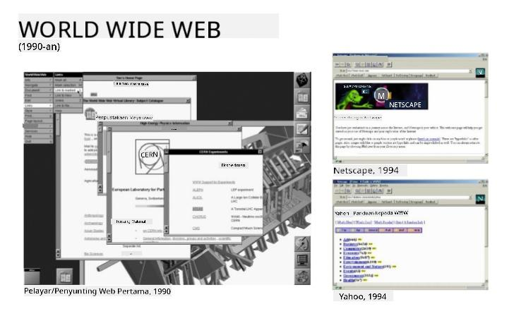
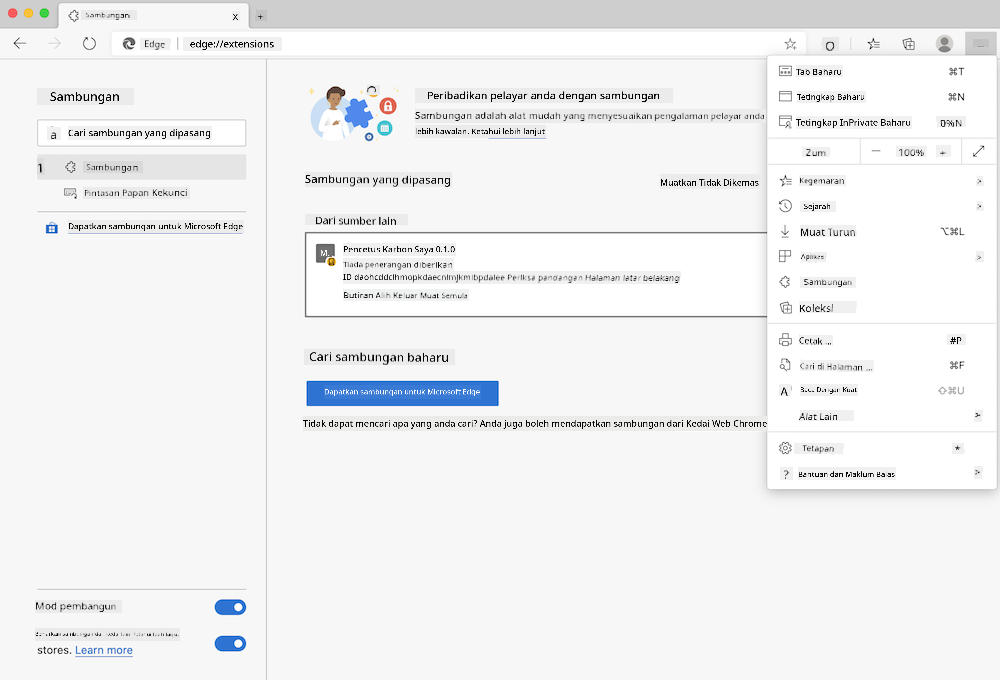
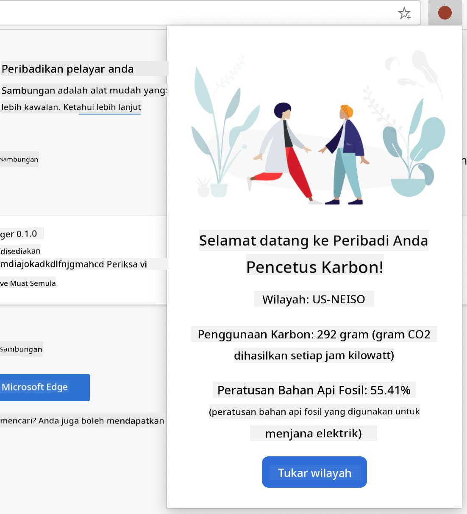

<!--
CO_OP_TRANSLATOR_METADATA:
{
  "original_hash": "0bb55e0b98600afab801eea115228873",
  "translation_date": "2025-08-27T22:17:35+00:00",
  "source_file": "5-browser-extension/1-about-browsers/README.md",
  "language_code": "ms"
}
-->
# Projek Sambungan Pelayar Bahagian 1: Semua Tentang Pelayar


> Sketchnote oleh [Wassim Chegham](https://dev.to/wassimchegham/ever-wondered-what-happens-when-you-type-in-a-url-in-an-address-bar-in-a-browser-3dob)

## Kuiz Pra-Kuliah

[Kuiz pra-kuliah](https://ashy-river-0debb7803.1.azurestaticapps.net/quiz/23)

### Pengenalan

Sambungan pelayar menambah fungsi tambahan kepada pelayar. Tetapi sebelum anda membina satu, anda perlu belajar sedikit tentang bagaimana pelayar berfungsi.

### Tentang pelayar

Dalam siri pelajaran ini, anda akan belajar cara membina sambungan pelayar yang boleh digunakan pada pelayar Chrome, Firefox, dan Edge. Dalam bahagian ini, anda akan meneroka bagaimana pelayar berfungsi dan merangka elemen sambungan pelayar.

Tetapi apa sebenarnya pelayar? Ia adalah aplikasi perisian yang membolehkan pengguna akhir mengakses kandungan dari pelayan dan memaparkannya pada halaman web.

✅ Sedikit sejarah: pelayar pertama dipanggil 'WorldWideWeb' dan dicipta oleh Sir Timothy Berners-Lee pada tahun 1990.


> Beberapa pelayar awal, melalui [Karen McGrane](https://www.slideshare.net/KMcGrane/week-4-ixd-history-personal-computing)

Apabila pengguna menyambung ke internet menggunakan alamat URL (Uniform Resource Locator), biasanya menggunakan Protokol Pemindahan Hiperteks melalui alamat `http` atau `https`, pelayar berkomunikasi dengan pelayan web dan mengambil halaman web.

Pada ketika ini, enjin rendering pelayar memaparkannya pada peranti pengguna, yang mungkin telefon bimbit, desktop, atau komputer riba.

Pelayar juga mempunyai keupayaan untuk menyimpan cache kandungan supaya ia tidak perlu diambil dari pelayan setiap kali. Ia boleh merekod sejarah aktiviti pelayaran pengguna, menyimpan 'cookies', iaitu data kecil yang mengandungi maklumat untuk menyimpan aktiviti pengguna, dan banyak lagi.

Satu perkara yang sangat penting untuk diingati tentang pelayar ialah ia tidak semuanya sama! Setiap pelayar mempunyai kekuatan dan kelemahan masing-masing, dan seorang pembangun web profesional perlu memahami cara membuat halaman web berfungsi dengan baik merentas pelayar. Ini termasuk menangani paparan kecil seperti telefon bimbit, serta pengguna yang berada di luar talian.

Satu laman web yang sangat berguna yang anda mungkin ingin tandakan dalam pelayar pilihan anda ialah [caniuse.com](https://www.caniuse.com). Apabila anda membina halaman web, sangat membantu untuk menggunakan senarai teknologi yang disokong oleh caniuse supaya anda dapat menyokong pengguna anda dengan sebaik mungkin.

✅ Bagaimana anda boleh mengetahui pelayar mana yang paling popular di kalangan pengguna laman web anda? Periksa analitik anda - anda boleh memasang pelbagai pakej analitik sebagai sebahagian daripada proses pembangunan web anda, dan ia akan memberitahu anda pelayar mana yang paling banyak digunakan oleh pengguna.

## Sambungan pelayar

Mengapa anda ingin membina sambungan pelayar? Ia adalah alat yang berguna untuk dilampirkan pada pelayar anda apabila anda memerlukan akses cepat kepada tugas yang sering anda ulangi. Sebagai contoh, jika anda sering perlu memeriksa warna pada pelbagai halaman web yang anda lawati, anda mungkin memasang sambungan pelayar pemilih warna. Jika anda sukar mengingati kata laluan, anda mungkin menggunakan sambungan pengurusan kata laluan.

Sambungan pelayar juga menyeronokkan untuk dibangunkan. Ia cenderung menguruskan sejumlah kecil tugas yang dilakukan dengan baik.

✅ Apakah sambungan pelayar kegemaran anda? Apakah tugas yang mereka lakukan?

### Memasang sambungan

Sebelum anda mula membina, lihat proses membina dan menyebarkan sambungan pelayar. Walaupun setiap pelayar sedikit berbeza dalam cara mereka menguruskan tugas ini, prosesnya serupa pada Chrome dan Firefox seperti contoh pada Edge:



> Nota: Pastikan untuk menghidupkan mod pembangun dan benarkan sambungan dari kedai lain.

Secara asasnya, prosesnya adalah:

- bina sambungan anda menggunakan `npm run build` 
- navigasi dalam pelayar ke panel sambungan menggunakan butang "Tetapan dan banyak lagi" (ikon `...`) di bahagian atas kanan
- jika ia adalah pemasangan baru, pilih `load unpacked` untuk memuat naik sambungan baru dari folder binaannya (dalam kes kita ia adalah `/dist`) 
- atau, klik `reload` jika anda memuat semula sambungan yang telah dipasang

✅ Arahan ini berkaitan dengan sambungan yang anda bina sendiri; untuk memasang sambungan yang telah dikeluarkan ke kedai sambungan pelayar yang berkaitan dengan setiap pelayar, anda harus navigasi ke [kedai tersebut](https://microsoftedge.microsoft.com/addons/Microsoft-Edge-Extensions-Home) dan pasang sambungan pilihan anda.

### Mula

Anda akan membina sambungan pelayar yang memaparkan jejak karbon kawasan anda, menunjukkan penggunaan tenaga kawasan anda dan sumber tenaga tersebut. Sambungan ini akan mempunyai borang yang mengumpul kunci API supaya anda boleh mengakses API CO2 Signal.

**Anda perlukan:**

- [kunci API](https://www.co2signal.com/); masukkan e-mel anda dalam kotak di halaman ini dan satu akan dihantar kepada anda
- [kod untuk kawasan anda](http://api.electricitymap.org/v3/zones) yang sepadan dengan [Peta Elektrik](https://www.electricitymap.org/map) (contohnya, di Boston, saya menggunakan 'US-NEISO').
- [kod permulaan](../../../../5-browser-extension/start). Muat turun folder `start`; anda akan melengkapkan kod dalam folder ini.
- [NPM](https://www.npmjs.com) - NPM adalah alat pengurusan pakej; pasang secara tempatan dan pakej yang disenaraikan dalam fail `package.json` anda akan dipasang untuk digunakan oleh aset web anda

✅ Ketahui lebih lanjut tentang pengurusan pakej dalam [modul pembelajaran yang hebat ini](https://docs.microsoft.com/learn/modules/create-nodejs-project-dependencies/?WT.mc_id=academic-77807-sagibbon)

Luangkan masa untuk melihat kod asas:

dist
    -|manifest.json (tetapan lalai di sini)
    -|index.html (markup HTML front-end di sini)
    -|background.js (JS latar belakang di sini)
    -|main.js (JS yang dibina)
src
    -|index.js (kod JS anda di sini)

✅ Setelah anda mempunyai kunci API dan kod kawasan anda, simpan di suatu tempat dalam nota untuk kegunaan masa depan.

### Bina HTML untuk sambungan

Sambungan ini mempunyai dua paparan. Satu untuk mengumpul kunci API dan kod kawasan:


Dan yang kedua untuk memaparkan penggunaan karbon kawasan:



Mari kita mulakan dengan membina HTML untuk borang dan menggayakannya dengan CSS.

Dalam folder `/dist`, anda akan membina borang dan kawasan hasil. Dalam fail `index.html`, isikan kawasan borang yang ditentukan:

```HTML
<form class="form-data" autocomplete="on">
	<div>
		<h2>New? Add your Information</h2>
	</div>
	<div>
		<label for="region">Region Name</label>
		<input type="text" id="region" required class="region-name" />
	</div>
	<div>
		<label for="api">Your API Key from tmrow</label>
		<input type="text" id="api" required class="api-key" />
	</div>
	<button class="search-btn">Submit</button>
</form>	
```
Ini adalah borang di mana maklumat yang disimpan akan dimasukkan dan disimpan ke storan tempatan.

Seterusnya, buat kawasan hasil; di bawah tag borang terakhir, tambahkan beberapa div:

```HTML
<div class="result">
	<div class="loading">loading...</div>
	<div class="errors"></div>
	<div class="data"></div>
	<div class="result-container">
		<p><strong>Region: </strong><span class="my-region"></span></p>
		<p><strong>Carbon Usage: </strong><span class="carbon-usage"></span></p>
		<p><strong>Fossil Fuel Percentage: </strong><span class="fossil-fuel"></span></p>
	</div>
	<button class="clear-btn">Change region</button>
</div>
```
Pada ketika ini, anda boleh mencuba binaan. Pastikan untuk memasang kebergantungan pakej sambungan ini:

```
npm install
```

Perintah ini akan menggunakan npm, Pengurus Pakej Node, untuk memasang webpack untuk proses binaan sambungan anda. Webpack adalah pembundel yang mengendalikan penyusunan kod. Anda boleh melihat output proses ini dengan melihat dalam `/dist/main.js` - anda akan melihat kod telah dibundel.

Buat masa ini, sambungan harus dibina dan, jika anda menyebarkannya ke Edge sebagai sambungan, anda akan melihat borang dipaparkan dengan kemas.

Tahniah, anda telah mengambil langkah pertama ke arah membina sambungan pelayar. Dalam pelajaran seterusnya, anda akan menjadikannya lebih berfungsi dan berguna.

---

## 🚀 Cabaran

Lihat kedai sambungan pelayar dan pasang satu ke pelayar anda. Anda boleh memeriksa failnya dengan cara yang menarik. Apa yang anda temui?

## Kuiz Pasca-Kuliah

[Kuiz pasca-kuliah](https://ashy-river-0debb7803.1.azurestaticapps.net/quiz/24)

## Ulasan & Kajian Kendiri

Dalam pelajaran ini, anda belajar sedikit tentang sejarah pelayar web; ambil peluang ini untuk belajar tentang bagaimana pencipta World Wide Web membayangkan penggunaannya dengan membaca lebih lanjut tentang sejarahnya. Beberapa laman yang berguna termasuk:

[Sejarah Pelayar Web](https://www.mozilla.org/firefox/browsers/browser-history/)

[Sejarah Web](https://webfoundation.org/about/vision/history-of-the-web/)

[Temu bual dengan Tim Berners-Lee](https://www.theguardian.com/technology/2019/mar/12/tim-berners-lee-on-30-years-of-the-web-if-we-dream-a-little-we-can-get-the-web-we-want)

## Tugasan 

[Gayakan semula sambungan anda](assignment.md)

---

**Penafian**:  
Dokumen ini telah diterjemahkan menggunakan perkhidmatan terjemahan AI [Co-op Translator](https://github.com/Azure/co-op-translator). Walaupun kami berusaha untuk memastikan ketepatan, sila ambil perhatian bahawa terjemahan automatik mungkin mengandungi kesilapan atau ketidaktepatan. Dokumen asal dalam bahasa asalnya harus dianggap sebagai sumber yang berwibawa. Untuk maklumat yang kritikal, terjemahan manusia profesional adalah disyorkan. Kami tidak bertanggungjawab atas sebarang salah faham atau salah tafsir yang timbul daripada penggunaan terjemahan ini.