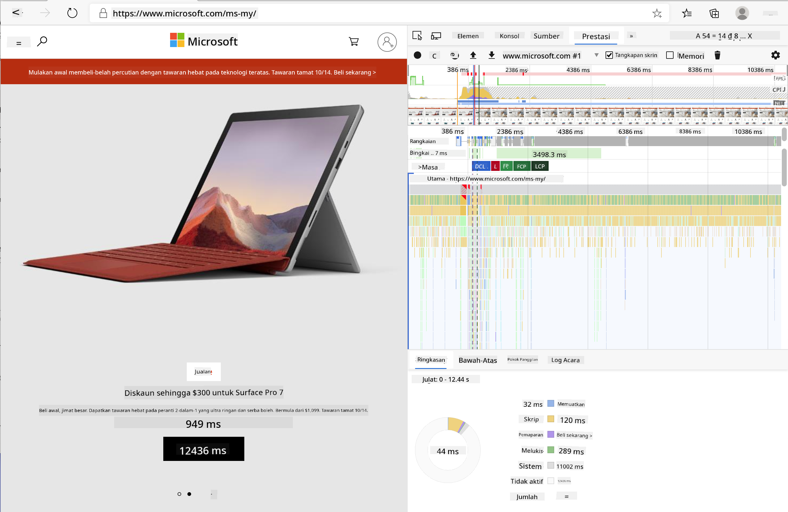
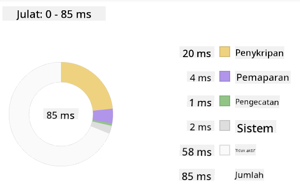

<!--
CO_OP_TRANSLATOR_METADATA:
{
  "original_hash": "f198c6b817b4b2a99749f4662e7cae98",
  "translation_date": "2025-08-27T22:21:08+00:00",
  "source_file": "5-browser-extension/3-background-tasks-and-performance/README.md",
  "language_code": "ms"
}
-->
# Projek Sambungan Pelayar Bahagian 3: Belajar tentang Tugas Latar Belakang dan Prestasi

## Kuiz Pra-Kuliah

[Kuiz pra-kuliah](https://ashy-river-0debb7803.1.azurestaticapps.net/quiz/27)

### Pengenalan

Dalam dua pelajaran terakhir modul ini, anda telah belajar cara membina borang dan kawasan paparan untuk data yang diambil daripada API. Ini adalah cara yang sangat standard untuk mencipta kehadiran web di web. Anda juga telah belajar cara mengendalikan pengambilan data secara asinkron. Sambungan pelayar anda hampir siap.

Yang tinggal adalah menguruskan beberapa tugas latar belakang, termasuk menyegarkan warna ikon sambungan, jadi ini adalah masa yang sesuai untuk membincangkan bagaimana pelayar menguruskan jenis tugas ini. Mari kita fikirkan tentang tugas-tugas pelayar ini dalam konteks prestasi aset web anda semasa anda membinanya.

## Asas Prestasi Web

> "Prestasi laman web adalah tentang dua perkara: seberapa cepat halaman dimuat, dan seberapa cepat kod di dalamnya berjalan." -- [Zack Grossbart](https://www.smashingmagazine.com/2012/06/javascript-profiling-chrome-developer-tools/)

Topik tentang cara menjadikan laman web anda sangat pantas pada semua jenis peranti, untuk semua jenis pengguna, dalam semua jenis situasi, sememangnya luas. Berikut adalah beberapa perkara yang perlu diingat semasa anda membina projek web standard atau sambungan pelayar.

Perkara pertama yang perlu anda lakukan untuk memastikan laman anda berjalan dengan cekap adalah mengumpulkan data tentang prestasinya. Tempat pertama untuk melakukannya adalah dalam alat pembangun pelayar web anda. Dalam Edge, anda boleh memilih butang "Tetapan dan lagi" (ikon tiga titik di bahagian atas kanan pelayar), kemudian navigasi ke Alat Lain > Alat Pembangun dan buka tab Prestasi. Anda juga boleh menggunakan pintasan papan kekunci `Ctrl` + `Shift` + `I` pada Windows atau `Option` + `Command` + `I` pada Mac untuk membuka alat pembangun.

Tab Prestasi mengandungi alat Profiling. Buka laman web (cuba, sebagai contoh, [https://www.microsoft.com](https://www.microsoft.com/?WT.mc_id=academic-77807-sagibbon)) dan klik butang 'Record', kemudian segarkan laman tersebut. Hentikan rakaman pada bila-bila masa, dan anda akan dapat melihat rutin yang dihasilkan untuk 'script', 'render', dan 'paint' laman tersebut:



✅ Lawati [Dokumentasi Microsoft](https://docs.microsoft.com/microsoft-edge/devtools-guide/performance/?WT.mc_id=academic-77807-sagibbon) tentang panel Prestasi dalam Edge

> Tip: untuk mendapatkan bacaan yang tepat tentang masa permulaan laman web anda, kosongkan cache pelayar anda

Pilih elemen garis masa profil untuk mengezum masuk pada acara yang berlaku semasa halaman anda dimuat.

Dapatkan gambaran prestasi halaman anda dengan memilih sebahagian daripada garis masa profil dan melihat panel ringkasan:



Periksa panel Log Acara untuk melihat jika ada acara yang mengambil masa lebih daripada 15 ms:


✅ Kenali alat profiler anda! Buka alat pembangun di laman ini dan lihat jika terdapat sebarang halangan. Apakah aset yang paling lambat dimuat? Yang paling pantas?

## Pemeriksaan Profiling

Secara umum, terdapat beberapa "kawasan masalah" yang setiap pembangun web harus perhatikan semasa membina laman untuk mengelakkan kejutan yang tidak menyenangkan apabila tiba masa untuk melancarkan ke pengeluaran.

**Saiz aset**: Web telah menjadi lebih 'berat', dan dengan itu lebih perlahan, dalam beberapa tahun kebelakangan ini. Sebahagian daripada berat ini berkaitan dengan penggunaan imej.

✅ Lihat melalui [Internet Archive](https://httparchive.org/reports/page-weight) untuk pandangan sejarah tentang berat halaman dan banyak lagi.

Amalan yang baik adalah memastikan bahawa imej anda dioptimumkan dan dihantar pada saiz dan resolusi yang betul untuk pengguna anda.

**Traversals DOM**: Pelayar perlu membina Model Objek Dokumen berdasarkan kod yang anda tulis, jadi demi prestasi halaman yang baik, pastikan tag anda minimum, hanya menggunakan dan menggayakan apa yang diperlukan oleh halaman. Untuk perkara ini, CSS berlebihan yang dikaitkan dengan halaman boleh dioptimumkan; gaya yang hanya perlu digunakan pada satu halaman tidak perlu dimasukkan dalam helaian gaya utama, sebagai contoh.

**JavaScript**: Setiap pembangun JavaScript harus memerhatikan skrip 'render-blocking' yang mesti dimuat sebelum DOM lain dapat dilalui dan dilukis ke pelayar. Pertimbangkan untuk menggunakan `defer` dengan skrip sebaris anda (seperti yang dilakukan dalam modul Terrarium).

✅ Cuba beberapa laman di [Laman Ujian Kelajuan Laman](https://www.webpagetest.org/) untuk mengetahui lebih lanjut tentang pemeriksaan biasa yang dilakukan untuk menentukan prestasi laman.

Sekarang anda mempunyai idea tentang bagaimana pelayar memaparkan aset yang anda hantar kepadanya, mari kita lihat beberapa perkara terakhir yang perlu anda lakukan untuk melengkapkan sambungan anda:

### Cipta fungsi untuk mengira warna

Bekerja dalam `/src/index.js`, tambahkan fungsi yang dipanggil `calculateColor()` selepas siri pembolehubah `const` yang anda tetapkan untuk mendapatkan akses kepada DOM:

```JavaScript
function calculateColor(value) {
	let co2Scale = [0, 150, 600, 750, 800];
	let colors = ['#2AA364', '#F5EB4D', '#9E4229', '#381D02', '#381D02'];

	let closestNum = co2Scale.sort((a, b) => {
		return Math.abs(a - value) - Math.abs(b - value);
	})[0];
	console.log(value + ' is closest to ' + closestNum);
	let num = (element) => element > closestNum;
	let scaleIndex = co2Scale.findIndex(num);

	let closestColor = colors[scaleIndex];
	console.log(scaleIndex, closestColor);

	chrome.runtime.sendMessage({ action: 'updateIcon', value: { color: closestColor } });
}
```

Apa yang berlaku di sini? Anda menghantar nilai (keamatan karbon) daripada panggilan API yang anda selesaikan dalam pelajaran terakhir, dan kemudian anda mengira sejauh mana nilainya dengan indeks yang dibentangkan dalam array warna. Kemudian anda menghantar nilai warna terdekat itu ke runtime chrome.

Chrome.runtime mempunyai [API](https://developer.chrome.com/extensions/runtime) yang mengendalikan semua jenis tugas latar belakang, dan sambungan anda memanfaatkan itu:

> "Gunakan API chrome.runtime untuk mendapatkan halaman latar belakang, mengembalikan butiran tentang manifest, dan mendengar serta bertindak balas terhadap acara dalam kitaran hayat aplikasi atau sambungan. Anda juga boleh menggunakan API ini untuk menukar laluan relatif URL kepada URL yang sepenuhnya layak."

✅ Jika anda membangunkan sambungan pelayar ini untuk Edge, mungkin mengejutkan anda bahawa anda menggunakan API chrome. Versi pelayar Edge yang lebih baru berjalan pada enjin pelayar Chromium, jadi anda boleh memanfaatkan alat ini.

> Nota, jika anda ingin memprofilkan sambungan pelayar, lancarkan alat pembangun dari dalam sambungan itu sendiri, kerana ia adalah contoh pelayar yang berasingan.

### Tetapkan warna ikon lalai

Sekarang, dalam fungsi `init()`, tetapkan ikon kepada warna hijau generik untuk memulakan dengan sekali lagi memanggil tindakan `updateIcon` chrome:

```JavaScript
chrome.runtime.sendMessage({
	action: 'updateIcon',
		value: {
			color: 'green',
		},
});
```

### Panggil fungsi, laksanakan panggilan

Seterusnya, panggil fungsi yang baru anda cipta dengan menambahkannya kepada janji yang dikembalikan oleh API C02Signal:

```JavaScript
//let CO2...
calculateColor(CO2);
```

Dan akhirnya, dalam `/dist/background.js`, tambahkan pendengar untuk panggilan tindakan latar belakang ini:

```JavaScript
chrome.runtime.onMessage.addListener(function (msg, sender, sendResponse) {
	if (msg.action === 'updateIcon') {
		chrome.browserAction.setIcon({ imageData: drawIcon(msg.value) });
	}
});
//borrowed from energy lollipop extension, nice feature!
function drawIcon(value) {
	let canvas = document.createElement('canvas');
	let context = canvas.getContext('2d');

	context.beginPath();
	context.fillStyle = value.color;
	context.arc(100, 100, 50, 0, 2 * Math.PI);
	context.fill();

	return context.getImageData(50, 50, 100, 100);
}
```

Dalam kod ini, anda menambah pendengar untuk sebarang mesej yang datang kepada pengurus tugas latar belakang. Jika ia dipanggil 'updateIcon', maka kod seterusnya dijalankan untuk melukis ikon warna yang betul menggunakan API Canvas.

✅ Anda akan belajar lebih lanjut tentang API Canvas dalam [pelajaran Permainan Angkasa](../../6-space-game/2-drawing-to-canvas/README.md).

Sekarang, bina semula sambungan anda (`npm run build`), segarkan dan lancarkan sambungan anda, dan perhatikan perubahan warna. Adakah ini masa yang sesuai untuk menjalankan tugas atau mencuci pinggan? Sekarang anda tahu!

Tahniah, anda telah membina sambungan pelayar yang berguna dan belajar lebih lanjut tentang bagaimana pelayar berfungsi dan cara memprofilkan prestasinya.

---

## 🚀 Cabaran

Selidiki beberapa laman web sumber terbuka yang telah wujud sejak lama dahulu, dan, berdasarkan sejarah GitHub mereka, lihat jika anda dapat menentukan bagaimana mereka dioptimumkan selama bertahun-tahun untuk prestasi, jika ada. Apakah titik sakit yang paling biasa?

## Kuiz Pasca-Kuliah

[Kuiz pasca-kuliah](https://ashy-river-0debb7803.1.azurestaticapps.net/quiz/28)

## Ulasan & Kajian Kendiri

Pertimbangkan untuk mendaftar ke [surat berita prestasi](https://perf.email/)

Selidiki beberapa cara pelayar mengukur prestasi web dengan melihat melalui tab prestasi dalam alat web mereka. Adakah anda menemui sebarang perbezaan utama?

## Tugasan

[Analisis laman untuk prestasi](assignment.md)

---

**Penafian**:  
Dokumen ini telah diterjemahkan menggunakan perkhidmatan terjemahan AI [Co-op Translator](https://github.com/Azure/co-op-translator). Walaupun kami berusaha untuk memastikan ketepatan, sila ambil perhatian bahawa terjemahan automatik mungkin mengandungi kesilapan atau ketidaktepatan. Dokumen asal dalam bahasa asalnya harus dianggap sebagai sumber yang berwibawa. Untuk maklumat yang kritikal, terjemahan manusia profesional adalah disyorkan. Kami tidak bertanggungjawab atas sebarang salah faham atau salah tafsir yang timbul daripada penggunaan terjemahan ini.