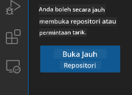
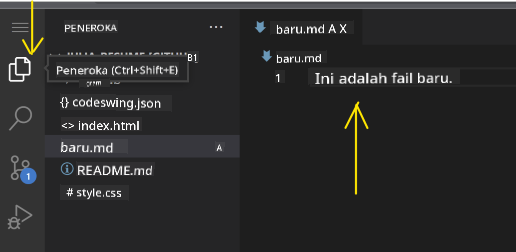
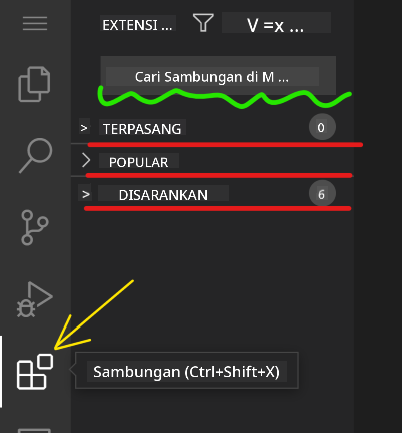
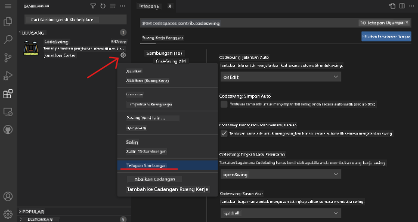

<!--
CO_OP_TRANSLATOR_METADATA:
{
  "original_hash": "7aa6e4f270d38d9cb17f2b5bd86b863d",
  "translation_date": "2025-08-27T23:05:36+00:00",
  "source_file": "8-code-editor/1-using-a-code-editor/README.md",
  "language_code": "ms"
}
-->
# Menggunakan editor kod

Pelajaran ini merangkumi asas penggunaan [VSCode.dev](https://vscode.dev), sebuah editor kod berasaskan web, supaya anda boleh membuat perubahan pada kod anda dan menyumbang kepada projek tanpa perlu memasang apa-apa pada komputer anda.

## Objektif pembelajaran

Dalam pelajaran ini, anda akan belajar bagaimana untuk:

- Menggunakan editor kod dalam projek kod
- Menjejaki perubahan dengan kawalan versi
- Menyesuaikan editor untuk pembangunan

### Prasyarat

Sebelum anda bermula, anda perlu membuat akaun dengan [GitHub](https://github.com). Pergi ke [GitHub](https://github.com/) dan buat akaun jika anda belum memilikinya.

### Pengenalan

Editor kod adalah alat penting untuk menulis program dan bekerjasama dengan projek kod yang sedia ada. Setelah anda memahami asas editor dan cara menggunakan ciri-cirinya, anda boleh menerapkannya semasa menulis kod.

## Memulakan dengan VSCode.dev

[VSCode.dev](https://vscode.dev) adalah editor kod di web. Anda tidak perlu memasang apa-apa untuk menggunakannya, sama seperti membuka laman web lain. Untuk memulakan editor, buka pautan berikut: [https://vscode.dev](https://vscode.dev). Jika anda belum log masuk ke [GitHub](https://github.com/), ikuti arahan untuk log masuk atau buat akaun baru dan kemudian log masuk.

Setelah ia dimuatkan, ia sepatutnya kelihatan seperti imej ini:


Terdapat tiga bahagian utama, bermula dari kiri paling jauh dan bergerak ke kanan:

1. _Activity bar_ yang termasuk beberapa ikon, seperti kaca pembesar 🔎, gear ⚙️, dan beberapa lagi.
2. _Side bar_ yang diperluaskan, yang secara lalai adalah _Explorer_.
3. Dan akhirnya, kawasan kod di sebelah kanan.

Klik pada setiap ikon untuk memaparkan menu yang berbeza. Setelah selesai, klik pada _Explorer_ supaya anda kembali ke tempat asal.

Apabila anda mula mencipta kod atau mengubah kod yang sedia ada, ia akan berlaku di kawasan terbesar di sebelah kanan. Anda akan menggunakan kawasan ini untuk melihat kod yang sedia ada juga, yang akan anda lakukan seterusnya.

## Membuka repositori GitHub

Perkara pertama yang anda perlukan adalah membuka repositori GitHub. Terdapat pelbagai cara untuk membuka repositori. Dalam bahagian ini, anda akan melihat dua cara berbeza untuk membuka repositori supaya anda boleh mula bekerja pada perubahan.

### 1. Dengan editor

Gunakan editor itu sendiri untuk membuka repositori jauh. Jika anda pergi ke [VSCode.dev](https://vscode.dev), anda akan melihat butang _"Open Remote Repository"_:



Anda juga boleh menggunakan _command palette_. _Command palette_ adalah kotak input di mana anda boleh menaip sebarang perkataan yang merupakan sebahagian daripada arahan atau tindakan untuk mencari arahan yang betul untuk dilaksanakan. Gunakan menu di bahagian kiri atas, kemudian pilih _View_, dan kemudian pilih _Command Palette_, atau gunakan pintasan papan kekunci berikut: Ctrl-Shift-P (pada MacOS ia adalah Command-Shift-P).


Setelah menu dibuka, taip _open remote repository_, dan kemudian pilih pilihan pertama. Pelbagai repositori yang anda sertai atau yang telah anda buka baru-baru ini akan muncul. Anda juga boleh menggunakan URL GitHub penuh untuk memilih satu. Gunakan URL berikut dan tampal ke dalam kotak:

```
https://github.com/microsoft/Web-Dev-For-Beginners
```

✅ Jika berjaya, anda akan melihat semua fail untuk repositori ini dimuatkan dalam editor teks.

### 2. Menggunakan URL

Anda juga boleh menggunakan URL secara langsung untuk memuatkan repositori. Sebagai contoh, URL penuh untuk repositori semasa adalah [https://github.com/microsoft/Web-Dev-For-Beginners](https://github.com/microsoft/Web-Dev-For-Beginners), tetapi anda boleh menukar domain GitHub dengan `VSCode.dev/github` dan memuatkan repositori secara langsung. URL yang terhasil adalah [https://vscode.dev/github/microsoft/Web-Dev-For-Beginners](https://vscode.dev/github/microsoft/Web-Dev-For-Beginners).

## Mengedit fail

Setelah anda membuka repositori pada pelayar/vscode.dev, langkah seterusnya adalah membuat kemas kini atau perubahan pada projek.

### 1. Membuat fail baru

Anda boleh membuat fail di dalam folder yang sedia ada, atau membuatnya di direktori/folder root. Untuk membuat fail baru, buka lokasi/direktori di mana anda mahu fail disimpan dan pilih ikon _'New file ...'_ pada _activity bar_ _(kiri)_, berikan nama dan tekan enter.


### 2. Mengedit dan menyimpan fail pada repositori

Menggunakan vscode.dev adalah berguna apabila anda ingin membuat kemas kini cepat pada projek anda tanpa perlu memuatkan sebarang perisian secara tempatan.  
Untuk mengemas kini kod anda, klik ikon 'Explorer', yang juga terletak pada _activity bar_ untuk melihat fail & folder dalam repositori.  
Pilih fail untuk membukanya di kawasan kod, buat perubahan anda dan simpan.



Setelah anda selesai mengemas kini projek anda, pilih ikon _`source control`_ yang mengandungi semua perubahan baru yang telah anda buat pada repositori anda.

Untuk melihat perubahan yang anda buat pada projek anda, pilih fail dalam folder `Changes` di _activity bar_ yang diperluaskan. Ini akan membuka 'Working Tree' untuk anda melihat secara visual perubahan yang anda buat pada fail. Merah menunjukkan penghapusan pada projek, manakala hijau menandakan penambahan.


Jika anda berpuas hati dengan perubahan yang anda buat, letakkan tetikus pada folder `Changes` dan klik butang `+` untuk _stage_ perubahan tersebut. _Staging_ bermaksud menyediakan perubahan anda untuk dikomitkan ke GitHub.

Jika anda tidak selesa dengan beberapa perubahan dan ingin membuangnya, letakkan tetikus pada folder `Changes` dan pilih ikon `undo`.

Kemudian, taipkan `commit message` _(Deskripsi perubahan yang telah anda buat pada projek)_, klik ikon `check` untuk _commit_ dan _push_ perubahan anda.

Setelah selesai bekerja pada projek anda, pilih ikon `hamburger menu` di bahagian kiri atas untuk kembali ke repositori di github.com.


## Menggunakan ekstensi

Memasang ekstensi pada VSCode membolehkan anda menambah ciri baru dan pilihan persekitaran pembangunan yang disesuaikan pada editor anda untuk meningkatkan aliran kerja pembangunan anda. Ekstensi ini juga membantu anda menambah sokongan untuk pelbagai bahasa pengaturcaraan dan sering kali merupakan ekstensi generik atau berbasis bahasa.

Untuk melihat senarai semua ekstensi yang tersedia, klik ikon _`Extensions`_ pada _activity bar_ dan mula menaip nama ekstensi pada medan teks yang dilabelkan _'Search Extensions in Marketplace'_.  
Anda akan melihat senarai ekstensi, setiap satu mengandungi **nama ekstensi, nama penerbit, deskripsi satu ayat, jumlah muat turun** dan **penilaian bintang**.


Anda juga boleh melihat semua ekstensi yang telah dipasang sebelumnya dengan mengembangkan folder _`Installed`_, ekstensi popular yang digunakan oleh kebanyakan pembangun dalam folder _`Popular`_, dan ekstensi yang disarankan untuk anda sama ada oleh pengguna dalam ruang kerja yang sama atau berdasarkan fail yang baru dibuka dalam folder _`Recommended`_.



### 1. Memasang ekstensi

Untuk memasang ekstensi, taip nama ekstensi dalam medan carian dan klik padanya untuk melihat maklumat tambahan tentang ekstensi tersebut di kawasan kod setelah ia muncul pada _activity bar_ yang diperluaskan.

Anda boleh klik butang _install biru_ pada _activity bar_ yang diperluaskan untuk memasang atau menggunakan butang _install_ yang muncul di kawasan kod setelah anda memilih ekstensi untuk memuatkan maklumat tambahan.


### 2. Menyesuaikan ekstensi

Setelah memasang ekstensi, anda mungkin perlu mengubah tingkah lakunya dan menyesuaikannya berdasarkan keutamaan anda. Untuk melakukan ini, pilih ikon Extensions, dan kali ini, ekstensi anda akan muncul dalam folder _Installed_, klik pada ikon _**Gear**_ dan navigasi ke _Extensions Setting_.



### 3. Mengurus ekstensi

Setelah memasang dan menggunakan ekstensi anda, vscode.dev menawarkan pilihan untuk mengurus ekstensi anda berdasarkan keperluan yang berbeza. Sebagai contoh, anda boleh memilih untuk:

- **Disable:** _(Anda boleh melumpuhkan sementara ekstensi apabila anda tidak lagi memerlukannya tetapi tidak mahu menyahpasangnya sepenuhnya)_

    Pilih ekstensi yang dipasang pada _activity bar_ yang diperluaskan > klik ikon Gear > pilih 'Disable' atau 'Disable (Workspace)' **ATAU** Buka ekstensi pada kawasan kod dan klik butang Disable biru.

- **Uninstall:** Pilih ekstensi yang dipasang pada _activity bar_ yang diperluaskan > klik ikon Gear > pilih 'Uninstall' **ATAU** Buka ekstensi pada kawasan kod dan klik butang Uninstall biru.

---

## Tugasan

[Hasilkan laman web resume menggunakan vscode.dev](https://github.com/microsoft/Web-Dev-For-Beginners/blob/main/8-code-editor/1-using-a-code-editor/assignment.md)

## Kajian & Pembelajaran Kendiri

Baca lebih lanjut tentang [VSCode.dev](https://code.visualstudio.com/docs/editor/vscode-web?WT.mc_id=academic-0000-alfredodeza) dan beberapa ciri lain yang dimilikinya.

---

**Penafian**:  
Dokumen ini telah diterjemahkan menggunakan perkhidmatan terjemahan AI [Co-op Translator](https://github.com/Azure/co-op-translator). Walaupun kami berusaha untuk memastikan ketepatan, sila ambil perhatian bahawa terjemahan automatik mungkin mengandungi kesilapan atau ketidaktepatan. Dokumen asal dalam bahasa asalnya harus dianggap sebagai sumber yang berwibawa. Untuk maklumat yang kritikal, terjemahan manusia profesional adalah disyorkan. Kami tidak bertanggungjawab atas sebarang salah faham atau salah tafsir yang timbul daripada penggunaan terjemahan ini.