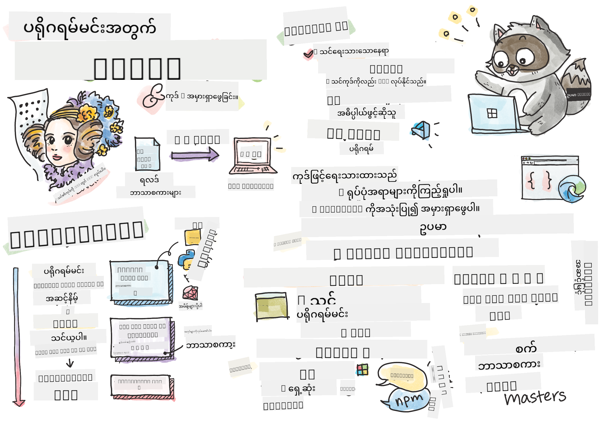

<!--
CO_OP_TRANSLATOR_METADATA:
{
  "original_hash": "c63675cfaf1d223b37bb9fecbfe7c252",
  "translation_date": "2025-08-27T22:47:06+00:00",
  "source_file": "1-getting-started-lessons/1-intro-to-programming-languages/README.md",
  "language_code": "my"
}
-->
# ပရိုဂရမ်မင်းဘာသာစကားများနှင့် အသုံးဝင်သောကိရိယာများ

ဒီသင်ခန်းစာမှာ ပရိုဂရမ်မင်းဘာသာစကားများ၏ အခြေခံအချက်များကို လေ့လာပါမည်။ ဒီမှာဖော်ပြထားတဲ့အကြောင်းအရာတွေဟာ ယနေ့ခေတ်ပရိုဂရမ်မင်းဘာသာစကားများအများစုအတွက် သက်ဆိုင်ပါတယ်။ "အသုံးဝင်သောကိရိယာများ" အပိုင်းမှာတော့ ပရိုဂရမ်မာတစ်ဦးအနေနဲ့ အသုံးဝင်မယ့် ဆော့ဖ်ဝဲလ်များကို လေ့လာနိုင်ပါမည်။

  
> Sketchnote by [Tomomi Imura](https://twitter.com/girlie_mac)

## သင်ခန်းစာမတိုင်မီ စမ်းမေးခွန်း
[Pre-lecture quiz](https://forms.office.com/r/dru4TE0U9n?origin=lprLink)

## နိဒါန်း

ဒီသင်ခန်းစာမှာ ကျွန်ုပ်တို့ လေ့လာမည့်အကြောင်းအရာများမှာ -

- ပရိုဂရမ်မင်းဆိုတာဘာလဲ?
- ပရိုဂရမ်မင်းဘာသာစကားအမျိုးအစားများ
- ပရိုဂရမ်တစ်ခု၏ အခြေခံအချက်များ
- ပရိုဂရမ်မာအတွက် အသုံးဝင်သော ဆော့ဖ်ဝဲလ်နှင့် ကိရိယာများ

> ဒီသင်ခန်းစာကို [Microsoft Learn](https://docs.microsoft.com/learn/modules/web-development-101/introduction-programming/?WT.mc_id=academic-77807-sagibbon) မှာလည်း လေ့လာနိုင်ပါတယ်။

## ပရိုဂရမ်မင်းဆိုတာဘာလဲ?

ပရိုဂရမ်မင်း (coding) ဆိုတာက ကွန်ပျူတာ သို့မဟုတ် မိုဘိုင်းစက်ကိရိယာတစ်ခုအတွက် အညွှန်းများရေးသားခြင်းဖြစ်ပါတယ်။ ဒီအညွှန်းတွေကို ပရိုဂရမ်မင်းဘာသာစကားတစ်ခုနဲ့ရေးပြီး စက်ကိရိယာက အဓိပ္ပါယ်ဖွင့်ဆိုပေးပါတယ်။ ဒီအညွှန်းတွေကို *program*, *computer program*, *application (app)*, *executable* စတဲ့အမည်တွေနဲ့ ခေါ်ဆိုနိုင်ပါတယ်။

*Program* ဆိုတာက ကုဒ်နဲ့ရေးထားတဲ့ အရာတစ်ခုဖြစ်ပါတယ်။ ဥပမာ - ဝဘ်ဆိုဒ်များ, ဂိမ်းများ, ဖုန်းအက်ပ်များစသည်ဖြင့်။ ကုဒ်မရေးဘဲနဲ့လည်း ပရိုဂရမ်တစ်ခုဖန်တီးနိုင်ပေမယ့် အခြေခံလောဂျစ်ကို စက်ကိရိယာက ဖွင့်ဆိုပေးရမှာဖြစ်ပြီး အဲ့ဒီလောဂျစ်ကို ကုဒ်နဲ့ရေးထားတာဖြစ်နိုင်ပါတယ်။ *Running* သို့မဟုတ် *executing* လုပ်နေတဲ့ ပရိုဂရမ်တစ်ခုက အညွှန်းတွေကို လုပ်ဆောင်နေပါတယ်။ သင်ဒီသင်ခန်းစာကို ဖတ်နေတဲ့ စက်ကိရိယာကလည်း ပရိုဂရမ်တစ်ခုကို လည်ပတ်နေပါတယ်။

✅ သုတေသနလုပ်ပါ - ကမ္ဘာ့ပထမဆုံး ကွန်ပျူတာပရိုဂရမ်မာအဖြစ် သတ်မှတ်ခံရသူက ဘယ်သူလဲ?

## ပရိုဂရမ်မင်းဘာသာစကားများ

ပရိုဂရမ်မင်းဘာသာစကားတွေက စက်ကိရိယာအတွက် အညွှန်းရေးဖို့ ပရိုဂရမ်မာတွေကို အခွင့်အလမ်းပေးပါတယ်။ စက်ကိရိယာတွေက binary (1s နှင့် 0s) ကိုသာ နားလည်နိုင်ပြီး အများစုသော ပရိုဂရမ်မာတွေအတွက် အဲ့ဒီနည်းနဲ့ ဆက်သွယ်ဖို့ မထိရောက်ပါဘူး။ ပရိုဂရမ်မင်းဘာသာစကားတွေက လူနဲ့ စက်ကြား ဆက်သွယ်ရေးအတွက် အထောက်အကူပေးပါတယ်။

ပရိုဂရမ်မင်းဘာသာစကားတွေဟာ အမျိုးအစားအမျိုးမျိုးရှိပြီး ရည်ရွယ်ချက်အမျိုးမျိုးအတွက် အသုံးပြုနိုင်ပါတယ်။ ဥပမာ - JavaScript ကို ဝဘ်အက်ပ်လီကေးရှင်းများအတွက် အသုံးပြုပြီး Bash ကို အပရိုပရိုစစ်ဆင်ရေးစနစ်များအတွက် အသုံးပြုပါတယ်။

*Low level languages* တွေဟာ စက်ကိရိယာအတွက် အညွှန်းဖွင့်ဆိုဖို့ အဆင့်နည်းနည်းသာ လိုအပ်ပါတယ်။ ဒါပေမယ့် *high level languages* တွေက ဖတ်ရှုရလွယ်ကူပြီး အထောက်အပံ့များတဲ့အတွက် လူကြိုက်များပါတယ်။ JavaScript ကို *high level language* အဖြစ် သတ်မှတ်နိုင်ပါတယ်။

အောက်ပါကုဒ်က JavaScript နဲ့ ARM assembly code တို့ကို အသုံးပြုပြီး *high level* နဲ့ *low level* ဘာသာစကားကြား ကွာခြားချက်ကို ဖော်ပြထားပါတယ်။

```javascript
let number = 10
let n1 = 0, n2 = 1, nextTerm;

for (let i = 1; i <= number; i++) {
    console.log(n1);
    nextTerm = n1 + n2;
    n1 = n2;
    n2 = nextTerm;
}
```

```c
 area ascen,code,readonly
 entry
 code32
 adr r0,thumb+1
 bx r0
 code16
thumb
 mov r0,#00
 sub r0,r0,#01
 mov r1,#01
 mov r4,#10
 ldr r2,=0x40000000
back add r0,r1
 str r0,[r2]
 add r2,#04
 mov r3,r0
 mov r0,r1
 mov r1,r3
 sub r4,#01
 cmp r4,#00
 bne back
 end
```

ယုံကြည်ပါ - *သူတို့နှစ်ခုလုံး တူညီတဲ့အရာကို လုပ်ဆောင်နေပါတယ်*: Fibonacci အစီအစဉ်ကို 10 အထိ ပုံနှိပ်ပြနေပါတယ်။

✅ Fibonacci အစီအစဉ်ဆိုတာ [သတ်မှတ်ထားသည်](https://en.wikipedia.org/wiki/Fibonacci_number) - 0 နဲ့ 1 ကနေ စတင်ပြီး နောက်ထပ်နံပါတ်တစ်ခုဟာ အရင်နံပါတ်နှစ်ခုရဲ့ စုစုပေါင်းဖြစ်ပါတယ်။ ပထမဆုံး 10 ခုက 0, 1, 1, 2, 3, 5, 8, 13, 21, 34 ဖြစ်ပါတယ်။

## ပရိုဂရမ်တစ်ခု၏ အခြေခံအချက်များ

ပရိုဂရမ်တစ်ခုအတွင်း အညွှန်းတစ်ခုကို *statement* လို့ခေါ်ပြီး အညွှန်းတစ်ခုပြီးဆုံးတဲ့နေရာကို သတ်မှတ်ထားတဲ့ စာလုံး သို့မဟုတ် လိုင်းအကွာအဝေးရှိပါတယ်။ ဘာသာစကားတစ်ခုစီအလိုက် အညွှန်းပြီးဆုံးပုံက မတူနိုင်ပါတယ်။

ပရိုဂရမ်အတွင်းရှိ အညွှန်းတွေဟာ အသုံးပြုသူ သို့မဟုတ် အခြားနေရာကနေ ရရှိတဲ့ ဒေတာကို အခြေခံပြီး လုပ်ဆောင်နိုင်ပါတယ်။ ဒေတာဟာ ပရိုဂရမ်ရဲ့ အပြုအမူကို ပြောင်းလဲနိုင်တဲ့အတွက် ပရိုဂရမ်မင်းဘာသာစကားတွေမှာ ဒေတာကို ယာယီသိမ်းဆည်းဖို့ နည်းလမ်းတစ်ခုပါဝင်ပါတယ်။ ဒါတွေကို *variables* လို့ခေါ်ပါတယ်။ Variables တွေဟာ ဒေတာကို စက်ရဲ့ မှတ်ဉာဏ်ထဲမှာ သိမ်းဆည်းဖို့ အညွှန်းပေးတဲ့ statement တွေဖြစ်ပါတယ်။ Variables တွေဟာ အလျားလိုက်သင်္ချာမှာရှိတဲ့ variables တွေနဲ့ ဆင်တူပြီး အမည်တစ်ခုရှိပြီး တန်ဖိုးက အချိန်အလိုက် ပြောင်းလဲနိုင်ပါတယ်။

တစ်ခါတစ်လေမှာ အညွှန်းတစ်ချို့ကို စက်ကိရိယာက မလုပ်ဆောင်နိုင်ပါဘူး။ ဒါဟာ ပရိုဂရမ်မာရဲ့ ရည်ရွယ်ချက်အတိုင်း ဖြစ်နိုင်သလို မမျှော်လင့်ထားတဲ့ အမှားတစ်ခုကြောင့် ဖြစ်နိုင်ပါတယ်။ ဒီလို application ကို ထိန်းချုပ်နိုင်ခြင်းက ပိုမိုခိုင်မာပြီး ပြုပြင်ထိန်းသိမ်းရလွယ်ကူစေပါတယ်။ အများအားဖြင့် ဒီလို ထိန်းချုပ်မှုတွေဟာ အခြေအနေတစ်ခုဖြစ်ပေါ်တဲ့အခါမှာ ဖြစ်ပါတယ်။ ယနေ့ခေတ်ပရိုဂရမ်မင်းမှာ အများဆုံးအသုံးပြုတဲ့ statement တစ်ခုက `if..else` statement ဖြစ်ပါတယ်။

✅ ဒီလို statement အမျိုးအစားကို နောက်ထပ်သင်ခန်းစာတွေမှာ ပိုမိုလေ့လာနိုင်ပါမည်။

## အသုံးဝင်သောကိရိယာများ

[](https://youtube.com/watch?v=69WJeXGBdxg "Tools of the Trade")

> 🎥 အထက်ပါပုံကို နှိပ်ပြီး tooling အကြောင်း ဗီဒီယိုကြည့်ပါ

ဒီအပိုင်းမှာ သင့်ရဲ့ ပရိုဂရမ်မင်းခရီးစတင်ရာမှာ အသုံးဝင်မယ့် ဆော့ဖ်ဝဲလ်တစ်ချို့ကို လေ့လာနိုင်ပါမည်။

**ဖွံ့ဖြိုးရေးပတ်ဝန်းကျင်** ဆိုတာက ပရိုဂရမ်မာတစ်ဦးအနေနဲ့ ဆော့ဖ်ဝဲရေးသားရာမှာ မကြာခဏ အသုံးပြုရတဲ့ ကိရိယာများနှင့် လုပ်ဆောင်ချက်များရဲ့ ပုံစံတစ်ခုဖြစ်ပါတယ်။ ဒီကိရိယာတစ်ချို့ဟာ ပရိုဂရမ်မာရဲ့ လိုအပ်ချက်အရ ပြင်ဆင်ထားပြီး အချိန်အလိုက် ပြောင်းလဲနိုင်ပါတယ်။ 

### Editor များ

ဆော့ဖ်ဝဲရေးသားရာမှာ အရေးကြီးဆုံးကိရိယာတစ်ခုက Editor ဖြစ်ပါတယ်။ Editor တွေမှာ သင့်ရဲ့ကုဒ်ကို ရေးပြီး တစ်ခါတစ်လေမှာတော့ အဲ့ဒီကုဒ်ကို အလုပ်လုပ်စေပါမည်။

Developer တွေဟာ Editor တွေကို အောက်ပါအကြောင်းအရာများအတွက် အားထားကြပါတယ် -

- *Debugging* က ကုဒ်ထဲမှာ Bug နဲ့ အမှားတွေကို ရှာဖွေဖို့ ကူညီပါတယ်။ တချို့ Editor တွေမှာ Debugging လုပ်ဆောင်ချက်ပါဝင်ပြီး သတ်မှတ်ထားတဲ့ ဘာသာစကားအတွက် ပြင်ဆင်နိုင်ပါတယ်။
- *Syntax highlighting* က ကုဒ်ကို ဖတ်ရလွယ်ကူစေဖို့ အရောင်နဲ့ စာသားဖော်ပြမှုတွေ ထည့်သွင်းပေးပါတယ်။
- *Extensions and Integrations* တွေက Developer တွေအတွက် အထူးပြုလုပ်ထားတဲ့ ကိရိယာတွေဖြစ်ပါတယ်။
- *Customization* က Developer တစ်ဦးချင်းစီရဲ့ လိုအပ်ချက်အရ Development Environment ကို ပြင်ဆင်နိုင်စေပါတယ်။

#### လူကြိုက်များတဲ့ Editor များနှင့် Web Development Extensions

- [Visual Studio Code](https://code.visualstudio.com/?WT.mc_id=academic-77807-sagibbon)
  - [Code Spell Checker](https://marketplace.visualstudio.com/items?itemName=streetsidesoftware.code-spell-checker)
  - [Live Share](https://marketplace.visualstudio.com/items?itemName=MS-vsliveshare.vsliveshare)
  - [Prettier - Code formatter](https://marketplace.visualstudio.com/items?itemName=esbenp.prettier-vscode)
- [Atom](https://atom.io/)
  - [spell-check](https://atom.io/packages/spell-check)
  - [teletype](https://atom.io/packages/teletype)
  - [atom-beautify](https://atom.io/packages/atom-beautify)
- [Sublimetext](https://www.sublimetext.com/)
  - [emmet](https://emmet.io/)
  - [SublimeLinter](http://www.sublimelinter.com/en/stable/)

### Browser များ

Web Developer တွေအတွက် Browser ကလည်း အရေးကြီးတဲ့ ကိရိယာတစ်ခုဖြစ်ပါတယ်။ Browser တွေက Web ပေါ်မှာ ကုဒ်တွေကို ဘယ်လို အလုပ်လုပ်တယ်ဆိုတာ ကြည့်ဖို့ အသုံးဝင်ပါတယ်။

Browser တွေမှာ *Developer Tools* (DevTools) ဆိုတဲ့ Feature တွေပါဝင်ပြီး Application အကြောင်း အရေးကြီးတဲ့ အချက်အလက်တွေကို စုဆောင်းဖို့ ကူညီပါတယ်။

#### လူကြိုက်များတဲ့ Browser များနှင့် DevTools

- [Edge](https://docs.microsoft.com/microsoft-edge/devtools-guide-chromium/?WT.mc_id=academic-77807-sagibbon)
- [Chrome](https://developers.google.com/web/tools/chrome-devtools/)
- [Firefox](https://developer.mozilla.org/docs/Tools)

### Command Line Tools

တချို့ Developer တွေက ပုံမှန် GUI မျက်နှာပြင်ထက် Command Line ကို ပိုမိုအားထားကြပါတယ်။ Command Line က Developer တွေ Keyboard မှာ အလုပ်လုပ်နေစဉ် Mouse ကို အသုံးမပြုဘဲ အလုပ်လုပ်နိုင်စေပါတယ်။

#### လူကြိုက်များတဲ့ Command Line Tools

- [Git](https://git-scm.com/) (💻 အများစုသော OS တွေမှာ ပါဝင်ပြီးသား)
- [NPM](https://www.npmjs.com/)
- [Yarn](https://classic.yarnpkg.com/en/docs/cli/)

### Documentation

Developer တစ်ဦးအနေနဲ့ အသစ်တစ်ခုကို လေ့လာချင်တဲ့အခါ Documentation ကို အားထားကြပါတယ်။ Documentation တွေက Tools နဲ့ ဘာသာစကားတွေကို မှန်ကန်စွာ အသုံးပြုဖို့ လမ်းညွှန်ပေးပါတယ်။

#### လူကြိုက်များတဲ့ Web Development Documentation

- [Mozilla Developer Network (MDN)](https://developer.mozilla.org/docs/Web)
- [Frontend Masters](https://frontendmasters.com/learn/)
- [Web.dev](https://web.dev)
- [Microsoft Developer Docs](https://docs.microsoft.com/microsoft-edge/#microsoft-edge-for-developers)
- [W3 Schools](https://www.w3schools.com/where_to_start.asp)

✅ သုတေသနလုပ်ပါ - Web Developer ရဲ့ ပတ်ဝန်းကျင်နဲ့ Web Designer ရဲ့ ပတ်ဝန်းကျင်ကို နှိုင်းယှဉ်ကြည့်ပါ။

---

## 🚀 စိန်ခေါ်မှု

Programming Language တချို့ကို နှိုင်းယှဉ်ကြည့်ပါ။ JavaScript နဲ့ Java ရဲ့ ထူးခြားချက်တွေက ဘာတွေလဲ? COBOL နဲ့ Go ရဲ့ ကွာခြားချက်တွေက ဘာတွေလဲ?

## သင်ခန်းစာပြီးနောက် စမ်းမေးခွန်း
[Post-lecture quiz](https://ashy-river-0debb7803.1.azurestaticapps.net/quiz/2)

## ပြန်လည်သုံးသပ်ခြင်းနှင့် ကိုယ်တိုင်လေ့လာခြင်း

ပရိုဂရမ်မာအနေနဲ့ အသုံးပြုနိုင်တဲ့ ဘာသာစကားအမျိုးမျိုးကို လေ့လာပါ။ ဘာသာစကားတစ်ခုနဲ့ ကုဒ်တစ်ကြောင်းရေးပြီး နောက်ထပ်နှစ်ခုမှာ ပြန်ရေးကြည့်ပါ။ ဘာတွေ သင်ယူရမလဲ?

## အိမ်စာ

[Reading the Docs](assignment.md)

---

**ဝက်ဘ်ဆိုက်မှတ်ချက်**:  
ဤစာရွက်စာတမ်းကို AI ဘာသာပြန်ဝန်ဆောင်မှု [Co-op Translator](https://github.com/Azure/co-op-translator) ကို အသုံးပြု၍ ဘာသာပြန်ထားပါသည်။ ကျွန်ုပ်တို့သည် တိကျမှန်ကန်မှုအတွက် ကြိုးစားနေပါသော်လည်း၊ အလိုအလျောက်ဘာသာပြန်ဆိုမှုများတွင် အမှားများ သို့မဟုတ် မတိကျမှုများ ပါဝင်နိုင်သည်ကို ကျေးဇူးပြု၍ သတိပြုပါ။ မူရင်းစာရွက်စာတမ်းကို ၎င်း၏ မူလဘာသာစကားဖြင့် အာဏာတည်သောရင်းမြစ်အဖြစ် သတ်မှတ်ရန် လိုအပ်ပါသည်။ အရေးကြီးသော အချက်အလက်များအတွက် လူက ဘာသာပြန်ဆောင်ရွက်မှုကို အကြံပြုပါသည်။ ဤဘာသာပြန်ကို အသုံးပြုခြင်းမှ ဖြစ်ပေါ်လာသော နားလည်မှုမှားများ သို့မဟုတ် အဓိပ္ပါယ်မှားများအတွက် ကျွန်ုပ်တို့သည် တာဝန်မယူပါ။