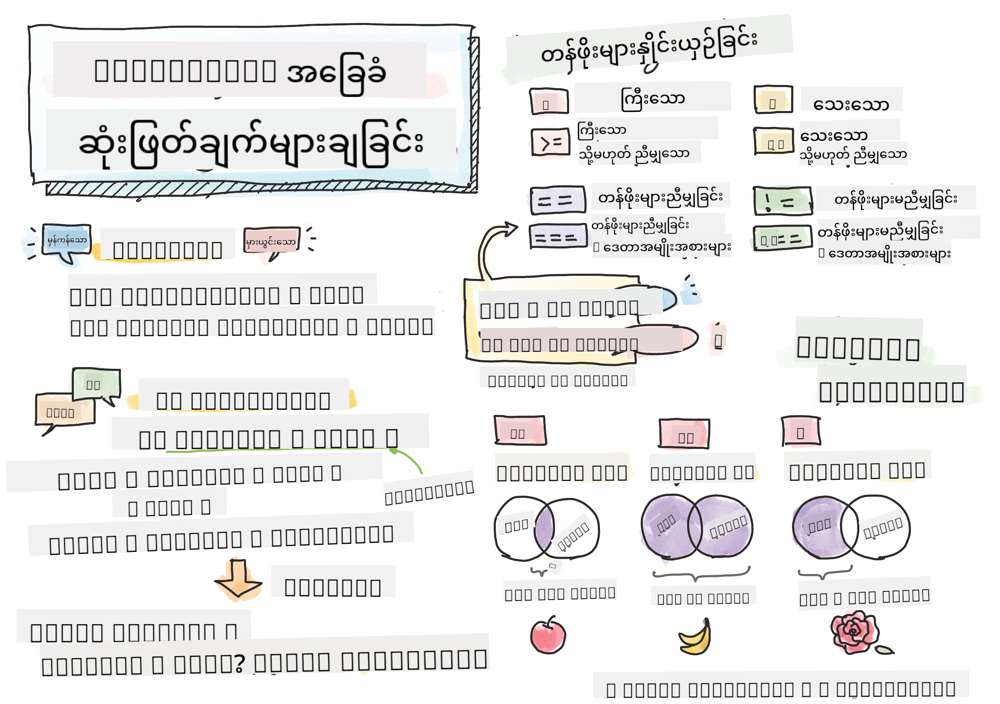

<!--
CO_OP_TRANSLATOR_METADATA:
{
  "original_hash": "888609c48329c280ca2477d2df40f2e5",
  "translation_date": "2025-08-27T22:29:48+00:00",
  "source_file": "2-js-basics/3-making-decisions/README.md",
  "language_code": "my"
}
-->
# JavaScript အခြေခံများ: ဆုံးဖြတ်ချက်များချခြင်း



> Sketchnote by [Tomomi Imura](https://twitter.com/girlie_mac)

## မိန့်ခွန်းမတင်မီ စမ်းမေးခွန်း

[Pre-lecture quiz](https://ff-quizzes.netlify.app/web/quiz/11)

ဆုံးဖြတ်ချက်များချခြင်းနှင့် သင့်ကုဒ်ကို အစီအစဉ်တကျ လည်ပတ်စေခြင်းသည် သင့်ကုဒ်ကို ပြန်လည်အသုံးပြုနိုင်စေပြီး ခိုင်မာစေပါသည်။ ဤအပိုင်းတွင် JavaScript တွင် ဒေတာလှည့်ပတ်မှုကို ထိန်းချုပ်ရန် syntax နှင့် Boolean ဒေတာအမျိုးအစားများနှင့် တွဲဖက်အသုံးပြုသောအခါ ၎င်း၏ အရေးပါမှုကို ဖော်ပြထားသည်။

[](https://youtube.com/watch?v=SxTp8j-fMMY "Making Decisions")

> 🎥 အထက်ပါပုံကို နှိပ်ပြီး ဆုံးဖြတ်ချက်များချခြင်းအကြောင်း ဗီဒီယိုကို ကြည့်ပါ။

> ဤသင်ခန်းစာကို [Microsoft Learn](https://docs.microsoft.com/learn/modules/web-development-101-if-else/?WT.mc_id=academic-77807-sagibbon) တွင်လည်း လေ့လာနိုင်ပါသည်။

## Boolean များအကြောင်း အကျဉ်းချုပ်

Boolean များတွင် `true` သို့မဟုတ် `false` ဆိုသော တန်ဖိုးနှစ်ခုသာ ရှိနိုင်သည်။ Boolean များသည် အခြေအနေတစ်ခုခုဖြင့် သတ်မှတ်ထားသောအခါ သင့်ကုဒ်၏ ဘယ်လိုလိုင်းများကို လည်ပတ်စေမည်ကို ဆုံးဖြတ်ရန် အထောက်အကူပြုသည်။

သင့် Boolean ကို `true` သို့မဟုတ် `false` အဖြစ် သတ်မှတ်ပါ-

`let myTrueBool = true`  
`let myFalseBool = false`

✅ Boolean များကို အင်္ဂလိပ် သင်္ချာပညာရှင်၊ အတွေးအခေါ်ပညာရှင်နှင့် သီအိုရီပညာရှင် George Boole (1815–1864) ၏ နာမည်မှ ဆောင်ယူထားသည်။

## နှိုင်းယှဉ်မှု Operator များနှင့် Boolean များ

Operator များကို အခြေအနေများကို နှိုင်းယှဉ်ရန် အသုံးပြုပြီး Boolean တန်ဖိုးတစ်ခုကို ဖန်တီးသည်။ အောက်တွင် မကြာခဏ အသုံးပြုသော Operator များစာရင်းကို ဖော်ပြထားသည်။

| သင်္ကေတ | ဖော်ပြချက်                                                                                                                                                   | ဥပမာ               |
| ------ | ------------------------------------------------------------------------------------------------------------------------------------------------------------- | ------------------ |
| `<`    | **နည်းသော**: တန်ဖိုးနှစ်ခုကို နှိုင်းယှဉ်ပြီး ဘယ်ဘက်တန်ဖိုးသည် ညာဘက်ထက် နည်းသောအခါ `true` Boolean တန်ဖိုးကို ပြန်ပေးသည်                              | `5 < 6 // true`    |
| `<=`   | **နည်းသော်လည်း ညီမျှသော**: တန်ဖိုးနှစ်ခုကို နှိုင်းယှဉ်ပြီး ဘယ်ဘက်တန်ဖိုးသည် ညာဘက်ထက် နည်းသော်လည်း ညီမျှသောအခါ `true` Boolean တန်ဖိုးကို ပြန်ပေးသည်      | `5 <= 6 // true`   |
| `>`    | **ကြီးသော**: တန်ဖိုးနှစ်ခုကို နှိုင်းယှဉ်ပြီး ဘယ်ဘက်တန်ဖိုးသည် ညာဘက်ထက် ကြီးသောအခါ `true` Boolean တန်ဖိုးကို ပြန်ပေးသည်                         | `5 > 6 // false`   |
| `>=`   | **ကြီးသော်လည်း ညီမျှသော**: တန်ဖိုးနှစ်ခုကို နှိုင်းယှဉ်ပြီး ဘယ်ဘက်တန်ဖိုးသည် ညာဘက်ထက် ကြီးသော်လည်း ညီမျှသောအခါ `true` Boolean တန်ဖိုးကို ပြန်ပေးသည် | `5 >= 6 // false`  |
| `===`  | **တိကျသော ညီမျှမှု**: တန်ဖိုးနှစ်ခုကို နှိုင်းယှဉ်ပြီး ဘယ်ဘက်နှင့် ညာဘက်တန်ဖိုးများသည် တူညီပြီး ဒေတာအမျိုးအစားလည်း တူညီသောအခါ `true` Boolean တန်ဖိုးကို ပြန်ပေးသည် | `5 === 6 // false` |
| `!==`  | **မညီမျှမှု**: တန်ဖိုးနှစ်ခုကို နှိုင်းယှဉ်ပြီး တိကျသော ညီမျှမှု operator ၏ ဆန့်ကျင်ဘက် Boolean တန်ဖိုးကို ပြန်ပေးသည်                                    | `5 !== 6 // true`  |

✅ သင့် browser ၏ console တွင် နှိုင်းယှဉ်မှုအချို့ကို ရေးသားပြီး သင့်အသိပညာကို စစ်ဆေးပါ။ ပြန်လာသောဒေတာများထဲတွင် အံ့အားသင့်စရာတစ်ခုခု ရှိပါသလား?

## If Statement

`if` statement သည် အခြေအနေတစ်ခု `true` ဖြစ်ပါက ၎င်း၏ block များအတွင်းရှိကုဒ်ကို လည်ပတ်စေပါသည်။

```javascript
if (condition) {
  //Condition is true. Code in this block will run.
}
```

အခြေအနေဖွဲ့စည်းရာတွင် Logical operator များကို မကြာခဏ အသုံးပြုသည်။

```javascript
let currentMoney;
let laptopPrice;

if (currentMoney >= laptopPrice) {
  //Condition is true. Code in this block will run.
  console.log("Getting a new laptop!");
}
```

## If..Else Statement

`else` statement သည် အခြေအနေတစ်ခု `false` ဖြစ်ပါက ၎င်း၏ block များအတွင်းရှိကုဒ်ကို လည်ပတ်စေပါသည်။ ၎င်းသည် `if` statement နှင့်အတူ ရွေးချယ်စရာဖြစ်သည်။

```javascript
let currentMoney;
let laptopPrice;

if (currentMoney >= laptopPrice) {
  //Condition is true. Code in this block will run.
  console.log("Getting a new laptop!");
} else {
  //Condition is false. Code in this block will run.
  console.log("Can't afford a new laptop, yet!");
}
```

✅ ဤကုဒ်နှင့် အောက်ပါကုဒ်ကို browser console တွင် လည်ပတ်စေပြီး သင့်နားလည်မှုကို စမ်းသပ်ပါ။ `currentMoney` နှင့် `laptopPrice` variable များ၏ တန်ဖိုးများကို ပြောင်းလဲပြီး `console.log()` ၏ output ကို ပြောင်းလဲကြည့်ပါ။

## Switch Statement

`switch` statement သည် အခြေအနေအမျိုးမျိုးအပေါ် မူတည်၍ ကွဲပြားသော လုပ်ဆောင်မှုများကို ပြုလုပ်ရန် အသုံးပြုသည်။ `switch` statement ကို အသုံးပြု၍ လည်ပတ်စေလိုသော code block တစ်ခုကို ရွေးချယ်ပါ။

```javascript
switch (expression) {
  case x:
    // code block
    break;
  case y:
    // code block
    break;
  default:
  // code block
}
```

```javascript
// program using switch statement
let a = 2;

switch (a) {
  case 1:
    a = "one";
    break;
  case 2:
    a = "two";
    break;
  default:
    a = "not found";
    break;
}
console.log(`The value is ${a}`);
```

✅ ဤကုဒ်နှင့် အောက်ပါကုဒ်ကို browser console တွင် လည်ပတ်စေပြီး သင့်နားလည်မှုကို စမ်းသပ်ပါ။ `a` variable ၏ တန်ဖိုးကို ပြောင်းလဲပြီး `console.log()` ၏ output ကို ပြောင်းလဲကြည့်ပါ။

## Logical Operator များနှင့် Boolean များ

ဆုံးဖြတ်ချက်များသည် တစ်ခုထက်ပိုသော နှိုင်းယှဉ်မှုများလိုအပ်နိုင်ပြီး Logical operator များဖြင့် string တစ်ခုအဖြစ် ပေါင်းစပ်၍ Boolean တန်ဖိုးတစ်ခုကို ဖန်တီးနိုင်သည်။

| သင်္ကေတ | ဖော်ပြချက်                                                                                     | ဥပမာ                                                                 |
| ------ | ----------------------------------------------------------------------------------------------- | ----------------------------------------------------------------------- |
| `&&`   | **Logical AND**: Boolean အထုတ်ဖော်ချက်နှစ်ခုကို နှိုင်းယှဉ်သည်။ နှစ်ဖက်လုံး `true` ဖြစ်ပါကသာ `true` ကို ပြန်ပေးသည် | `(5 > 6) && (5 < 6 ) //တစ်ဖက် false, တစ်ဖက် true. false ကို ပြန်ပေးသည်` |
| `\|\|` | **Logical OR**: Boolean အထုတ်ဖော်ချက်နှစ်ခုကို နှိုင်းယှဉ်သည်။ အနည်းဆုံးတစ်ဖက် `true` ဖြစ်ပါက `true` ကို ပြန်ပေးသည်     | `(5 > 6) \|\| (5 < 6) //တစ်ဖက် false, တစ်ဖက် true. true ကို ပြန်ပေးသည်` |
| `!`    | **Logical NOT**: Boolean အထုတ်ဖော်ချက်၏ ဆန့်ကျင်ဘက်တန်ဖိုးကို ပြန်ပေးသည်                             | `!(5 > 6) // 5 သည် 6 ထက် ကြီးမဟုတ်သော်လည်း "!" သည် true ကို ပြန်ပေးသည်`         |

## Logical Operator များဖြင့် အခြေအနေများနှင့် ဆုံးဖြတ်ချက်များ

Logical operator များကို `if..else` statement များတွင် အခြေအနေဖွဲ့စည်းရန် အသုံးပြုနိုင်သည်။

```javascript
let currentMoney;
let laptopPrice;
let laptopDiscountPrice = laptopPrice - laptopPrice * 0.2; //Laptop price at 20 percent off

if (currentMoney >= laptopPrice || currentMoney >= laptopDiscountPrice) {
  //Condition is true. Code in this block will run.
  console.log("Getting a new laptop!");
} else {
  //Condition is true. Code in this block will run.
  console.log("Can't afford a new laptop, yet!");
}
```

### Negation operator

ယခင်တွင် သင်သည် `if...else` statement ကို အသုံးပြု၍ conditional logic ဖန်တီးနိုင်ကြောင်း မြင်ခဲ့ပါသည်။ `if` အတွင်းသို့ ဝင်သောအရာအားလုံးသည် `true/false` အဖြစ် အကဲဖြတ်ရမည်ဖြစ်သည်။ `!` operator ကို အသုံးပြု၍ အထုတ်ဖော်ချက်ကို _ဆန့်ကျင်_ ပြုလုပ်နိုင်သည်။ ၎င်းသည် အောက်ပါအတိုင်း ဖြစ်ပါမည်-

```javascript
if (!condition) {
  // runs if condition is false
} else {
  // runs if condition is true
}
```

### Ternary expressions

`if...else` သည် ဆုံးဖြတ်ချက် logic ကို ဖော်ပြရန် တစ်ခုတည်းသော နည်းလမ်းမဟုတ်ပါ။ သင်သည် ternary operator ဟုခေါ်သော အရာတစ်ခုကိုလည်း အသုံးပြုနိုင်သည်။ ၎င်း၏ syntax သည် အောက်ပါအတိုင်း ဖြစ်ပါသည်-

```javascript
let variable = condition ? <return this if true> : <return this if false>
```

အောက်တွင် ပိုမိုလက်တွေ့ကျသော ဥပမာတစ်ခုကို ဖော်ပြထားသည်-

```javascript
let firstNumber = 20;
let secondNumber = 10;
let biggestNumber = firstNumber > secondNumber ? firstNumber : secondNumber;
```

✅ ဤကုဒ်ကို အချိန်ယူဖတ်ပါ။ Operator များသည် ဘယ်လို လည်ပတ်နေသည်ကို နားလည်ပါသလား?

အထက်ပါကုဒ်သည်-

- `firstNumber` သည် `secondNumber` ထက် ကြီးပါက  
- `firstNumber` ကို `biggestNumber` သို့ သတ်မှတ်ပါ  
- မဟုတ်ပါက `secondNumber` ကို သတ်မှတ်ပါ။

Ternary expression သည် အောက်ပါကုဒ်ကို ရေးသားရန် အကျဉ်းချုပ်နည်းလမ်းသာဖြစ်သည်-

```javascript
let biggestNumber;
if (firstNumber > secondNumber) {
  biggestNumber = firstNumber;
} else {
  biggestNumber = secondNumber;
}
```

---

## 🚀 စိန်ခေါ်မှု

Logical operator များကို အသုံးပြု၍ ရေးသားထားသော အစီအစဉ်တစ်ခုကို ဖန်တီးပါ၊ ထို့နောက် ၎င်းကို ternary expression အသုံးပြု၍ ပြန်ရေးပါ။ သင့်အကြိုက်ဆုံး syntax သည် ဘယ်ဟာလဲ?

---

## မိန့်ခွန်းပြီးနောက် စမ်းမေးခွန်း

[Post-lecture quiz](https://ff-quizzes.netlify.app/web/quiz/12)

## ပြန်လည်သုံးသပ်ခြင်းနှင့် ကိုယ်တိုင်လေ့လာခြင်း

အသုံးပြုသူအတွက် ရရှိနိုင်သော operator များစွာအကြောင်းကို [MDN](https://developer.mozilla.org/docs/Web/JavaScript/Reference/Operators) တွင် ဖတ်ရှုပါ။

Josh Comeau ၏ အံ့သြဖွယ် [operator lookup](https://joshwcomeau.com/operator-lookup/) ကို လေ့လာပါ!

## လုပ်ငန်းတာဝန်

[Operators](assignment.md)

---

**အကြောင်းကြားချက်**:  
ဤစာရွက်စာတမ်းကို AI ဘာသာပြန်ဝန်ဆောင်မှု [Co-op Translator](https://github.com/Azure/co-op-translator) ကို အသုံးပြု၍ ဘာသာပြန်ထားပါသည်။ ကျွန်ုပ်တို့သည် တိကျမှုအတွက် ကြိုးစားနေပါသော်လည်း၊ အလိုအလျောက် ဘာသာပြန်ခြင်းတွင် အမှားများ သို့မဟုတ် မတိကျမှုများ ပါရှိနိုင်သည်ကို သတိပြုပါ။ မူရင်းဘာသာစကားဖြင့် ရေးသားထားသော စာရွက်စာတမ်းကို အာဏာရှိသော ရင်းမြစ်အဖြစ် သတ်မှတ်သင့်ပါသည်။ အရေးကြီးသော အချက်အလက်များအတွက် လူ့ဘာသာပြန်ပညာရှင်များမှ ပရော်ဖက်ရှင်နယ် ဘာသာပြန်ခြင်းကို အကြံပြုပါသည်။ ဤဘာသာပြန်ကို အသုံးပြုခြင်းမှ ဖြစ်ပေါ်လာသော အလွဲအမှားများ သို့မဟုတ် အနားယူမှုများအတွက် ကျွန်ုပ်တို့သည် တာဝန်မယူပါ။