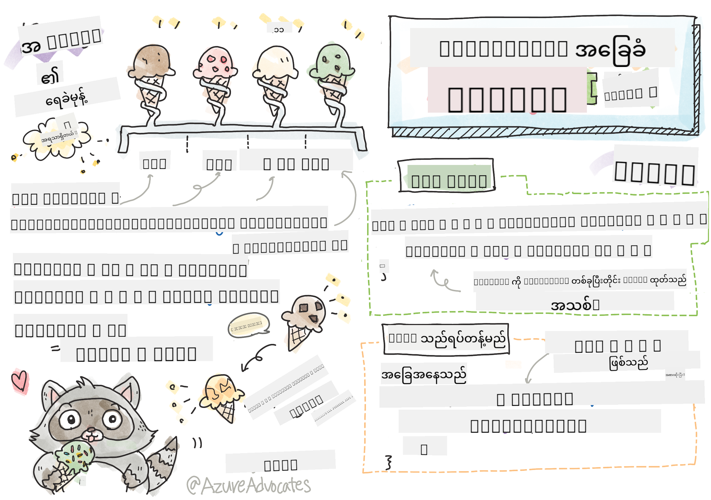

<!--
CO_OP_TRANSLATOR_METADATA:
{
  "original_hash": "3f7f87871312cf6cc12662da7d973182",
  "translation_date": "2025-08-27T22:32:51+00:00",
  "source_file": "2-js-basics/4-arrays-loops/README.md",
  "language_code": "my"
}
-->
# JavaScript အခြေခံ: Arrays နှင့် Loops


> Sketchnote by [Tomomi Imura](https://twitter.com/girlie_mac)

## မိန့်ခွန်းမပြောမီ Quiz
[Pre-lecture quiz](https://ashy-river-0debb7803.1.azurestaticapps.net/quiz/13)

ဒီသင်ခန်းစာမှာ JavaScript အခြေခံများကို လေ့လာပါမည်။ JavaScript သည် ဝဘ်ပေါ်တွင် အပြန်အလှန်လုပ်ဆောင်မှုများကို ပေးစွမ်းသော ဘာသာစကားဖြစ်သည်။ ဒီသင်ခန်းစာတွင် သင်သည် ဒေတာများကို စီမံခန့်ခွဲရန် အသုံးပြုသော arrays နှင့် loops အကြောင်းကို လေ့လာပါမည်။

[](https://youtube.com/watch?v=1U4qTyq02Xw "Arrays")

[](https://www.youtube.com/watch?v=Eeh7pxtTZ3k "Loops")

> 🎥 အထက်ရှိပုံများကို နှိပ်ပြီး arrays နှင့် loops အကြောင်း ဗီဒီယိုများကို ကြည့်ပါ။

> ဒီသင်ခန်းစာကို [Microsoft Learn](https://docs.microsoft.com/learn/modules/web-development-101-arrays/?WT.mc_id=academic-77807-sagibbon) တွင် လေ့လာနိုင်ပါသည်။

## Arrays

ဒေတာများနှင့် အလုပ်လုပ်ခြင်းသည် ဘာသာစကားတစ်ခုအတွက် အများဆုံးလုပ်ဆောင်ရသောအရာဖြစ်ပြီး ဒေတာများကို စနစ်တကျ စီစဉ်ထားသော ဖွဲ့စည်းမှု (arrays) တွင် သိမ်းဆည်းထားပါက ပိုမိုလွယ်ကူစေပါသည်။ Arrays တွင် ဒေတာများကို စာရင်းတစ်ခုလိုမျိုး ဖွဲ့စည်းထားသော ပုံစံတွင် သိမ်းဆည်းထားသည်။ Arrays ၏ အဓိကအားသာချက်တစ်ခုမှာ array တစ်ခုတွင် ဒေတာအမျိုးအစားများစွာကို သိမ်းဆည်းနိုင်ခြင်းဖြစ်သည်။

✅ Arrays သည် ကျွန်ုပ်တို့၏ နေ့စဉ်ဘဝတွင် တွေ့ရသည်။ Solar panel array ကဲ့သို့ array တစ်ခုကို သင်စဉ်းစားနိုင်ပါသလား?

Array ရေးသားရန် syntax သည် square brackets တစ်စုံဖြစ်သည်။

```javascript
let myArray = [];
```

ဤသည်မှာ အလွတ် array ဖြစ်သည်။ သို့သော် arrays များကို ဒေတာများဖြင့် ပြည့်စုံစွာ ကြေညာနိုင်ပါသည်။ Array တွင် ဒေတာများကို comma ဖြင့် ခွဲထားသည်။

```javascript
let iceCreamFlavors = ["Chocolate", "Strawberry", "Vanilla", "Pistachio", "Rocky Road"];
```

Array တွင်ရှိသော ဒေတာများသည် **index** ဟုခေါ်သော တစ်ခုတည်းသော တန်ဖိုးကို ပေးထားသည်။ Index သည် array ၏အစမှ အကွာအဝေးအပေါ် မူတည်၍ သတ်မှတ်ထားသော ကိန်းဂဏန်းဖြစ်သည်။ အထက်ပါဥပမာတွင် "Chocolate" သည် index 0 ရှိပြီး "Rocky Road" သည် index 4 ရှိသည်။ Square brackets နှင့် index ကို အသုံးပြု၍ array တန်ဖိုးများကို ရယူ၊ ပြောင်းလဲ၊ သို့မဟုတ် ထည့်သွင်းနိုင်သည်။

✅ Arrays သည် 0 index မှ စတင်သည်ဟု သင်အံ့ဩပါသလား? အချို့ programming languages တွင် index များသည် 1 မှ စတင်သည်။ ဤအကြောင်းအရာကို [Wikipedia](https://en.wikipedia.org/wiki/Zero-based_numbering) တွင် ဖတ်ရှုနိုင်ပါသည်။

```javascript
let iceCreamFlavors = ["Chocolate", "Strawberry", "Vanilla", "Pistachio", "Rocky Road"];
iceCreamFlavors[2]; //"Vanilla"
```

Index ကို အသုံးပြု၍ တန်ဖိုးကို ပြောင်းလဲနိုင်သည်။

```javascript
iceCreamFlavors[4] = "Butter Pecan"; //Changed "Rocky Road" to "Butter Pecan"
```

Index တစ်ခုတွင် တန်ဖိုးအသစ်ကို ထည့်သွင်းနိုင်သည်။

```javascript
iceCreamFlavors[5] = "Cookie Dough"; //Added "Cookie Dough"
```

✅ Array တွင် တန်ဖိုးများကို push လုပ်ရန် array.push() ကဲ့သို့သော array operators ကို အသုံးပြုခြင်းသည် ပိုမိုရိုးရှင်းသည်။

Array တွင်ရှိသော item အရေအတွက်ကို သိရန် `length` property ကို အသုံးပြုပါ။

```javascript
let iceCreamFlavors = ["Chocolate", "Strawberry", "Vanilla", "Pistachio", "Rocky Road"];
iceCreamFlavors.length; //5
```

✅ ကိုယ်ပိုင် array တစ်ခုကို ဖန်တီးပြီး browser console တွင် စမ်းသပ်ပါ။

## Loops

Loops များသည် ထပ်တလဲလဲလုပ်ဆောင်မှုများ (repetitive tasks) ကို လုပ်ဆောင်ရန် အချိန်နှင့် ကုဒ်များကို သက်သာစေသည်။ Iteration တစ်ခုစီသည် variable, value, condition များအပေါ် မူတည်၍ ကွဲပြားနိုင်သည်။ JavaScript တွင် loops အမျိုးအစားများစွာရှိပြီး အနည်းငယ်ကွဲပြားသော်လည်း အဓိကအားဖြင့် တူညီသောအရာကို လုပ်ဆောင်သည်။

### For Loop

`for` loop သည် iteration ပြုလုပ်ရန် အချက် ၃ ခုလိုအပ်သည်။
- `counter` Iteration အရေအတွက်ကို ရေတွက်ရန် သတ်မှတ်ထားသော variable
- `condition` Comparison operators ကို အသုံးပြု၍ `false` ဖြစ်သောအခါ loop ကို ရပ်တန့်စေသော expression
- `iteration-expression` Iteration တစ်ခုစီ၏ အဆုံးတွင် run လုပ်ပြီး counter value ကို ပြောင်းလဲရန် အသုံးပြုသည်

```javascript
// Counting up to 10
for (let i = 0; i < 10; i++) {
  console.log(i);
}
```

✅ ဤကုဒ်ကို browser console တွင် run လုပ်ပါ။ Counter, condition, iteration expression ကို အနည်းငယ်ပြောင်းလဲပါက ဘာဖြစ်မည်ကို စမ်းသပ်ပါ။ Countdown ပြုလုပ်ရန် နောက်ပြန် run လုပ်နိုင်ပါသလား?

### While loop

`for` loop ၏ syntax နှင့် မတူကွဲပြားပြီး `while` loop သည် condition တစ်ခုသာ လိုအပ်သည်။ Condition သည် `false` ဖြစ်သောအခါ loop ကို ရပ်တန့်စေသည်။ Loop တွင် condition များသည် counter ကဲ့သို့သော တန်ဖိုးများကို အခြေခံပြီး loop အတွင်းတွင် စီမံရမည်။ Counter များကို loop အပြင်တွင် စတင်ဖန်တီးရမည်။

```javascript
//Counting up to 10
let i = 0;
while (i < 10) {
 console.log(i);
 i++;
}
```

✅ For loop နှင့် while loop ကို ဘာကြောင့် ရွေးချယ်ရမည်ဟု သင်ထင်ပါသလဲ? StackOverflow တွင် 17K ကြည့်ရှုသူများ၏ အမြင်များကို [ဖတ်ရှုနိုင်ပါသည်](https://stackoverflow.com/questions/39969145/while-loops-vs-for-loops-in-javascript)။

## Loops နှင့် Arrays

Loops များသည် arrays နှင့် အတူ အသုံးပြုလေ့ရှိသည်။ အများဆုံး condition များသည် array ၏ length ကို loop ရပ်တန့်ရန် လိုအပ်ပြီး index ကို counter value အဖြစ် အသုံးပြုနိုင်သည်။

```javascript
let iceCreamFlavors = ["Chocolate", "Strawberry", "Vanilla", "Pistachio", "Rocky Road"];

for (let i = 0; i < iceCreamFlavors.length; i++) {
  console.log(iceCreamFlavors[i]);
} //Ends when all flavors are printed
```

✅ ကိုယ်ပိုင် array တစ်ခုကို ဖန်တီးပြီး browser console တွင် loop လုပ်ခြင်းကို စမ်းသပ်ပါ။

---

## 🚀 စိန်ခေါ်မှု

For နှင့် while loops များအပြင် arrays ကို loop လုပ်ရန် နည်းလမ်းများရှိသည်။ [forEach](https://developer.mozilla.org/docs/Web/JavaScript/Reference/Global_Objects/Array/forEach), [for-of](https://developer.mozilla.org/docs/Web/JavaScript/Reference/Statements/for...of), [map](https://developer.mozilla.org/docs/Web/JavaScript/Reference/Global_Objects/Array/map) ကဲ့သို့သော နည်းလမ်းများကို အသုံးပြု၍ သင်၏ array loop ကို ပြန်ရေးပါ။

## မိန့်ခွန်းပြီးနောက် Quiz
[Post-lecture quiz](https://ashy-river-0debb7803.1.azurestaticapps.net/quiz/14)

## ပြန်လည်သုံးသပ်ခြင်းနှင့် ကိုယ်တိုင်လေ့လာခြင်း

JavaScript တွင် arrays များသည် ဒေတာများကို စီမံခန့်ခွဲရန် အသုံးဝင်သော method များစွာပါရှိသည်။ [ဤ method များကို ဖတ်ရှုပါ](https://developer.mozilla.org/docs/Web/JavaScript/Reference/Global_Objects/Array)။ Push, pop, slice, splice ကဲ့သို့သော method များကို ကိုယ်ပိုင် array တွင် စမ်းသပ်ပါ။

## အလုပ်ပေးစာ

[Loop an Array](assignment.md)

---

**အကြောင်းကြားချက်**:  
ဤစာရွက်စာတမ်းကို AI ဘာသာပြန်ဝန်ဆောင်မှု [Co-op Translator](https://github.com/Azure/co-op-translator) ကို အသုံးပြု၍ ဘာသာပြန်ထားပါသည်။ ကျွန်ုပ်တို့သည် တိကျမှုအတွက် ကြိုးစားနေသော်လည်း၊ အလိုအလျောက် ဘာသာပြန်မှုများတွင် အမှားများ သို့မဟုတ် မမှန်ကန်မှုများ ပါဝင်နိုင်သည်ကို သတိပြုပါ။ မူရင်းစာရွက်စာတမ်းကို ၎င်း၏ မူရင်းဘာသာစကားဖြင့် အာဏာတရားရှိသော အရင်းအမြစ်အဖြစ် သတ်မှတ်သင့်ပါသည်။ အရေးကြီးသော အချက်အလက်များအတွက် လူ့ဘာသာပြန်ပညာရှင်များမှ ပရော်ဖက်ရှင်နယ် ဘာသာပြန်မှုကို အကြံပြုပါသည်။ ဤဘာသာပြန်မှုကို အသုံးပြုခြင်းမှ ဖြစ်ပေါ်လာသော အလွဲအမှားများ သို့မဟုတ် အနားလွဲမှုများအတွက် ကျွန်ုပ်တို့သည် တာဝန်မယူပါ။