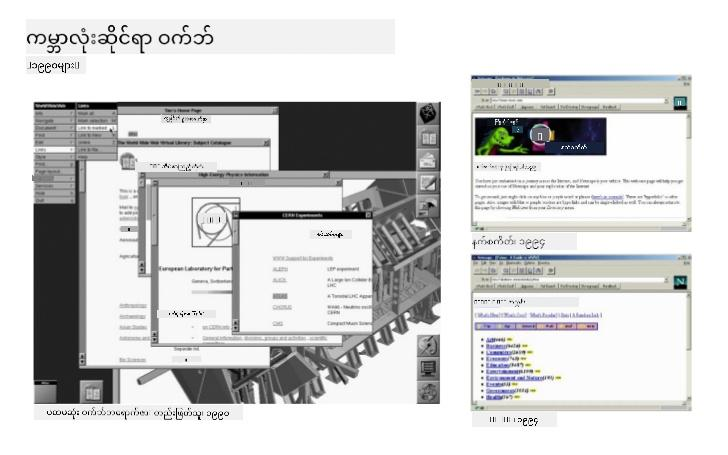
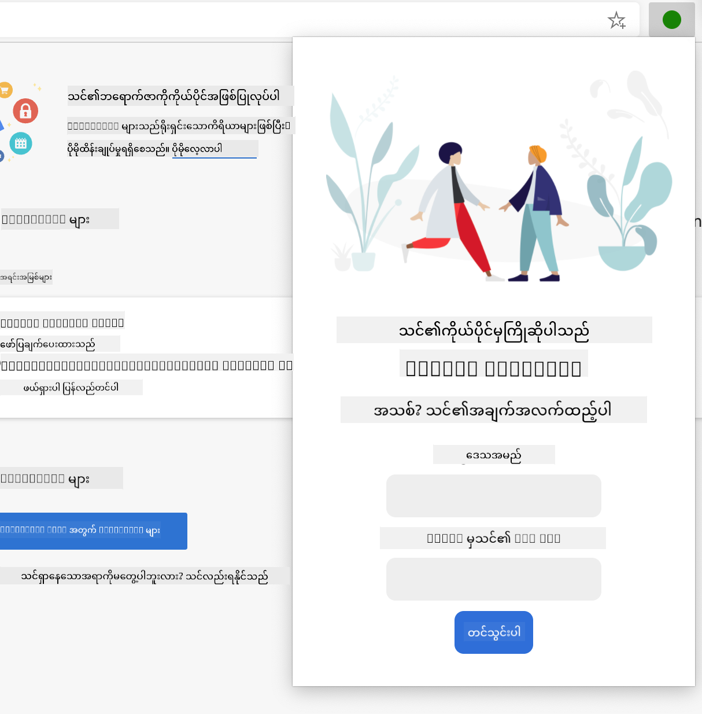
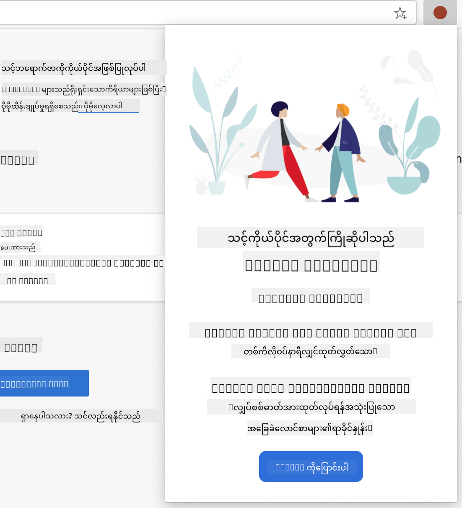

<!--
CO_OP_TRANSLATOR_METADATA:
{
  "original_hash": "0bb55e0b98600afab801eea115228873",
  "translation_date": "2025-08-27T22:10:05+00:00",
  "source_file": "5-browser-extension/1-about-browsers/README.md",
  "language_code": "my"
}
-->
# Browser Extension Project Part 1: Browser များအကြောင်း


> Sketchnote by [Wassim Chegham](https://dev.to/wassimchegham/ever-wondered-what-happens-when-you-type-in-a-url-in-an-address-bar-in-a-browser-3dob)

## မိမိကိုယ်ကိုစစ်မေးရန်မေးခွန်းများ

[Pre-lecture quiz](https://ashy-river-0debb7803.1.azurestaticapps.net/quiz/23)

### အကျဉ်းချုပ်

Browser Extension များသည် Browser တွင်အပိုလုပ်ဆောင်ချက်များထည့်သွင်းပေးနိုင်သည်။ Browser Extension တစ်ခုကိုတည်ဆောက်မည်ဆိုပါက Browser များအလုပ်လုပ်ပုံကိုအရင်လေ့လာသင့်သည်။

### Browser အကြောင်း

ဒီသင်ခန်းစာများတွင် Chrome, Firefox, Edge Browser များတွင်အလုပ်လုပ်နိုင်သော Browser Extension တစ်ခုကိုတည်ဆောက်ပုံကိုလေ့လာမည်ဖြစ်သည်။ ဒီအပိုင်းတွင် Browser များအလုပ်လုပ်ပုံနှင့် Browser Extension ၏အခြေခံဖွဲ့စည်းမှုများကိုလေ့လာမည်ဖြစ်သည်။

Browser ဆိုတာဘာလဲ? ဒါဟာ End User တစ်ဦးက Server မှအကြောင်းအရာများကိုရယူပြီး Web Page များပေါ်တွင်ပြသနိုင်စေသော Software Application တစ်ခုဖြစ်သည်။

✅ သမိုင်းအနည်းငယ်: ပထမဆုံး Browser ကို 'WorldWideWeb' ဟုခေါ်ပြီး Sir Timothy Berners-Lee က 1990 ခုနှစ်တွင်ဖန်တီးခဲ့သည်။


> Some early browsers, via [Karen McGrane](https://www.slideshare.net/KMcGrane/week-4-ixd-history-personal-computing)

User တစ်ဦးက URL (Uniform Resource Locator) လိပ်စာကိုအသုံးပြု၍ အင်တာနက်နှင့်ချိတ်ဆက်သောအခါ၊ `http` သို့မဟုတ် `https` လိပ်စာကိုအသုံးပြု၍ Hypertext Transfer Protocol ဖြင့် Web Server နှင့်ဆက်သွယ်ပြီး Web Page ကိုရယူသည်။

ဒီအချိန်တွင် Browser ၏ Rendering Engine က User ၏ Device (မိုဘိုင်းဖုန်း, Desktop, Laptop စသည်တို့) ပေါ်တွင် Web Page ကိုပြသပေးသည်။

Browser များတွင် Content ကို Cache လုပ်ထားနိုင်သောစွမ်းရည်ရှိပြီး Server မှအကြောင်းအရာများကိုအကြိမ်တိုင်းရယူရန်မလိုအပ်စေပါ။ User ၏ Browsing Activity ကိုမှတ်တမ်းတင်ထားနိုင်ပြီး 'Cookies' ဟုခေါ်သော Data အနည်းငယ်ကိုသိမ်းဆည်းထားနိုင်သည်။ Cookies တွင် User ၏လုပ်ဆောင်မှုများနှင့်ပတ်သက်သောအချက်အလက်များပါဝင်သည်။

Browser များသည်တစ်ခုနှင့်တစ်ခုမတူကြောင်းသတိထားပါ။ Browser တစ်ခုစီတွင်အားသာချက်နှင့်အားနည်းချက်များရှိပြီး Professional Web Developer တစ်ဦးအနေဖြင့် Web Page များကို Cross-Browser တွင်အကောင်းဆုံးအလုပ်လုပ်စေရန်နားလည်ထားရန်လိုအပ်သည်။ ဒါတွင် မိုဘိုင်းဖုန်းကဲ့သို့သော Viewport သေးငယ်များကို Handle လုပ်ခြင်းနှင့် Offline ဖြစ်နေသော User များကို Handle လုပ်ခြင်းတို့ပါဝင်သည်။

သင့်အကြိုက် Browser ကိုအသုံးပြု၍ Bookmark လုပ်ထားသင့်သော Website တစ်ခုက [caniuse.com](https://www.caniuse.com) ဖြစ်သည်။ Web Page များကိုတည်ဆောက်နေစဉ်တွင် caniuse ၏ Supported Technologies စာရင်းများကိုအသုံးပြုခြင်းသည် User များကိုအကောင်းဆုံး Support ပေးနိုင်ရန်အထောက်အကူဖြစ်သည်။

✅ သင့် Website ၏ User Base တွင်အများဆုံးအသုံးပြုသော Browser များကိုဘယ်လိုသိနိုင်မလဲ? Analytics ကိုစစ်ဆေးပါ - Web Development Process ၏အစိတ်အပိုင်းအဖြစ် Analytics Package များကိုတပ်ဆင်နိုင်ပြီး Popular Browser များအားလုံးတွင်အများဆုံးအသုံးပြုသော Browser များကိုပြသပေးပါမည်။

## Browser Extension များ

Browser Extension တစ်ခုကိုဘယ်လိုတည်ဆောက်ချင်ရတာလဲ? သင်မကြာခဏလုပ်ဆောင်ရသော Tasks များကိုလွယ်ကူစွာရယူရန် Browser တွင်တပ်ဆင်ထားသောအရာတစ်ခုဖြစ်သည်။ ဥပမာအားဖြင့် Web Page များတွင်အရောင်များကိုစစ်ဆေးရန်လိုအပ်လျှင် Color-picker Browser Extension တစ်ခုကိုတပ်ဆင်နိုင်သည်။ Password များကိုမှတ်မိရန်အခက်အခဲရှိလျှင် Password-management Browser Extension ကိုအသုံးပြုနိုင်သည်။

Browser Extension များကိုတည်ဆောက်ခြင်းသည်ပျော်စရာကောင်းသည်။ အကန့်အသတ်ရှိသော Tasks များကိုအကောင်းဆုံးလုပ်ဆောင်ပေးနိုင်သည်။

✅ သင့်အကြိုက် Browser Extension များကဘာလဲ? သူတို့ဘယ်လို Tasks များကိုလုပ်ဆောင်ပေးသလဲ?

### Extension များတပ်ဆင်ခြင်း

Browser Extension တစ်ခုကိုတည်ဆောက်ပြီး Deploy လုပ်ပုံကိုကြည့်ရှုပါ။ Browser တစ်ခုစီတွင်ဒီလုပ်ငန်းစဉ်ကို Handle လုပ်ပုံကွဲပြားနိုင်သော်လည်း Chrome နှင့် Firefox တွင် Edge Browser တွင်လုပ်ဆောင်ပုံနှင့်ဆင်တူသည်။


> Note: Developer Mode ကိုဖွင့်ထားပြီး Other Stores မှ Extension များကို Allow လုပ်ထားရန်သေချာပါ။

အခြေခံအားဖြင့်လုပ်ငန်းစဉ်မှာ -

- `npm run build` ကိုအသုံးပြု၍ Extension ကို Build လုပ်ပါ
- Browser တွင် "Settings and more" Button (အပေါ်ယံညာဘက်ရှိ `...` icon) ကိုအသုံးပြု၍ Extension Pane သို့သွားပါ
- Installation အသစ်ဖြစ်လျှင် `load unpacked` ကိုရွေးချယ်ပြီး Build Folder (ဤကိစ္စတွင် `/dist`) မှ Fresh Extension ကို Upload လုပ်ပါ
- သို့မဟုတ်, ရှိပြီးသား Installed Extension ကို Reload လုပ်ပါ

✅ ဒီအညွှန်းများသည် သင်တိုင်တည်ဆောက်သော Extension များအတွက်ဖြစ်သည်။ Browser Extension Store တွင် Release လုပ်ထားသော Extension များကိုတပ်ဆင်ရန် Browser တစ်ခုစီနှင့်ဆက်စပ်သော [Stores](https://microsoftedge.microsoft.com/addons/Microsoft-Edge-Extensions-Home) သို့သွားပြီး သင့်အကြိုက် Extension ကိုတပ်ဆင်ပါ။

### စတင်လုပ်ဆောင်ပါ

သင့်ဒေသ၏ Carbon Footprint ကိုပြသသော Browser Extension တစ်ခုကိုတည်ဆောက်မည်ဖြစ်သည်။ ဒေသ၏ Energy Usage နှင့် Energy Source ကိုပြသမည်။ Extension တွင် API Key ကိုရယူရန် Form တစ်ခုပါဝင်မည်။

**လိုအပ်သောအရာများ:**

- [API key](https://www.co2signal.com/) - ဒီ Page တွင် Email ကိုထည့်ပြီး API Key ရယူပါ
- [Region Code](http://api.electricitymap.org/v3/zones) - [Electricity Map](https://www.electricitymap.org/map) တွင်သင့်ဒေသ၏ Code ကိုရယူပါ (ဥပမာ Boston တွင် 'US-NEISO' ကိုအသုံးပြုသည်)
- [Starter Code](../../../../5-browser-extension/start) - `start` Folder ကို Download လုပ်ပါ; ဒီ Folder တွင် Code ကိုပြီးစီးပါမည်။
- [NPM](https://www.npmjs.com) - NPM သည် Package Management Tool ဖြစ်သည်; သင့် Local Computer တွင် Install လုပ်ပြီး `package.json` File တွင်ဖော်ပြထားသော Packages များကို Install လုပ်ပါ

✅ Package Management အကြောင်းကို [Learn module](https://docs.microsoft.com/learn/modules/create-nodejs-project-dependencies/?WT.mc_id=academic-77807-sagibbon) မှာပိုမိုလေ့လာပါ

Codebase ကိုကြည့်ရှုရန်အချိန်ယူပါ:

dist
    -|manifest.json (defaults set here)
    -|index.html (front-end HTML markup here)
    -|background.js (background JS here)
    -|main.js (built JS)
src
    -|index.js (your JS code goes here)

✅ API Key နှင့် Region Code ကိုရယူပြီးနောက် Note တစ်ခုတွင်သိမ်းဆည်းထားပါ။

### Extension ၏ HTML ကိုတည်ဆောက်ပါ

ဒီ Extension တွင် Views နှစ်ခုပါဝင်သည်။ API Key နှင့် Region Code ကိုရယူရန် View တစ်ခု:



နှင့် Region ၏ Carbon Usage ကိုပြသရန် View တစ်ခု:



Form ကိုတည်ဆောက်ပြီး CSS ဖြင့် Style လုပ်ခြင်းမှစတင်ပါ။

`/dist` Folder တွင် Form နှင့် Result Area တစ်ခုကိုတည်ဆောက်ပါ။ `index.html` File တွင် Form Area ကို Populate လုပ်ပါ:

```HTML
<form class="form-data" autocomplete="on">
	<div>
		<h2>New? Add your Information</h2>
	</div>
	<div>
		<label for="region">Region Name</label>
		<input type="text" id="region" required class="region-name" />
	</div>
	<div>
		<label for="api">Your API Key from tmrow</label>
		<input type="text" id="api" required class="api-key" />
	</div>
	<button class="search-btn">Submit</button>
</form>	
```
ဒီ Form သည်သင့် Save လုပ်ထားသောအချက်အလက်များကို Input လုပ်ပြီး Local Storage တွင်သိမ်းဆည်းရန်ဖြစ်သည်။

နောက်တစ်ဆင့် Result Area ကိုတည်ဆောက်ပါ; Form Tag ၏အောက်တွင် Div များကိုထည့်ပါ:

```HTML
<div class="result">
	<div class="loading">loading...</div>
	<div class="errors"></div>
	<div class="data"></div>
	<div class="result-container">
		<p><strong>Region: </strong><span class="my-region"></span></p>
		<p><strong>Carbon Usage: </strong><span class="carbon-usage"></span></p>
		<p><strong>Fossil Fuel Percentage: </strong><span class="fossil-fuel"></span></p>
	</div>
	<button class="clear-btn">Change region</button>
</div>
```
ဒီအချိန်တွင် Build လုပ်နိုင်ပါပြီ။ Extension ၏ Package Dependencies များကို Install လုပ်ရန်သေချာပါ:

```
npm install
```

ဒီ Command သည် npm, Node Package Manager ကိုအသုံးပြု၍ Extension ၏ Build Process အတွက် webpack ကို Install လုပ်ပါမည်။ ဒီ Process ၏ Output ကို `/dist/main.js` တွင်ကြည့်နိုင်သည် - Code ကို Bundled လုပ်ထားသည်ကိုတွေ့ရမည်။

အခုအချိန်တွင် Extension ကို Build လုပ်ပြီး Edge Browser တွင် Extension အဖြစ် Deploy လုပ်ပါက Form တစ်ခုကိုတိကျစွာပြသထားသည်ကိုတွေ့ရမည်။

အောင်မြင်ပါပြီ၊ Browser Extension တစ်ခုကိုတည်ဆောက်ရန်ပထမဆုံးအဆင့်များကိုအောင်မြင်စွာလုပ်ဆောင်ပြီးပါပြီ။ နောက်ထပ်သင်ခန်းစာများတွင် Functionality ပိုမိုကောင်းမွန်ပြီးအသုံးဝင်သော Extension တစ်ခုကိုတည်ဆောက်မည်ဖြစ်သည်။

---

## 🚀 စိန်ခေါ်မှု

Browser Extension Store တစ်ခုကိုကြည့်ရှုပြီး Browser တွင် Extension တစ်ခုကိုတပ်ဆင်ပါ။ Files များကိုစူးစမ်းကြည့်ပါ။ ဘာတွေတွေ့ရလဲ?

## မိမိကိုယ်ကိုစစ်မေးရန်မေးခွန်းများ

[Post-lecture quiz](https://ashy-river-0debb7803.1.azurestaticapps.net/quiz/24)

## ပြန်လည်သုံးသပ်ခြင်းနှင့်ကိုယ်တိုင်လေ့လာခြင်း

ဒီသင်ခန်းစာတွင် Web Browser ၏သမိုင်းအနည်းငယ်ကိုလေ့လာခဲ့သည်။ World Wide Web ၏တီထွင်သူများက Web ကိုဘယ်လိုအသုံးပြုရန်ရည်ရွယ်ခဲ့သည်ကိုပိုမိုလေ့လာရန်အခွင့်အရေးယူပါ။ အသုံးဝင်သော Website များမှာ -

[The History of Web Browsers](https://www.mozilla.org/firefox/browsers/browser-history/)

[History of the Web](https://webfoundation.org/about/vision/history-of-the-web/)

[An interview with Tim Berners-Lee](https://www.theguardian.com/technology/2019/mar/12/tim-berners-lee-on-30-years-of-the-web-if-we-dream-a-little-we-can-get-the-web-we-want)

## လုပ်ငန်းတာဝန်

[Restyle your extension](assignment.md)

---

**အကြောင်းကြားချက်**:  
ဤစာရွက်စာတမ်းကို AI ဘာသာပြန်ဝန်ဆောင်မှု [Co-op Translator](https://github.com/Azure/co-op-translator) ကို အသုံးပြု၍ ဘာသာပြန်ထားပါသည်။ ကျွန်ုပ်တို့သည် တိကျမှုအတွက် ကြိုးစားနေသော်လည်း၊ အလိုအလျောက် ဘာသာပြန်ခြင်းတွင် အမှားများ သို့မဟုတ် မတိကျမှုများ ပါဝင်နိုင်သည်ကို သတိပြုပါ။ မူရင်းဘာသာစကားဖြင့် ရေးသားထားသော စာရွက်စာတမ်းကို အာဏာရှိသော ရင်းမြစ်အဖြစ် သတ်မှတ်သင့်ပါသည်။ အရေးကြီးသော အချက်အလက်များအတွက် လူ့ဘာသာပြန်ပညာရှင်များမှ ပရော်ဖက်ရှင်နယ် ဘာသာပြန်ခြင်းကို အကြံပြုပါသည်။ ဤဘာသာပြန်ကို အသုံးပြုခြင်းမှ ဖြစ်ပေါ်လာသော အလွဲအမှားများ သို့မဟုတ် အနားလွဲမှုများအတွက် ကျွန်ုပ်တို့သည် တာဝန်မယူပါ။