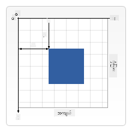

<!--
CO_OP_TRANSLATOR_METADATA:
{
  "original_hash": "41be8d35e7f30aa9dad10773c35e89c4",
  "translation_date": "2025-08-27T22:24:34+00:00",
  "source_file": "6-space-game/2-drawing-to-canvas/README.md",
  "language_code": "my"
}
-->
# အာကာသဂိမ်းတည်ဆောက်ခြင်း အပိုင်း ၂: ဟီးရိုနှင့် မုဆိုးများကို Canvas တွင် ရေးဆွဲခြင်း

## မိန့်ခွန်းမတိုင်မီ မေးခွန်း

[မိန့်ခွန်းမတိုင်မီ မေးခွန်း](https://ff-quizzes.netlify.app/web/quiz/31)

## Canvas

Canvas သည် HTML element တစ်ခုဖြစ်ပြီး မူရင်းအားဖြင့် အကြောင်းအရာမပါရှိပါ။ ၎င်းသည် အလွတ်ဖြစ်ပြီး သင်ရေးဆွဲရန်လိုအပ်သည်။

✅ [Canvas API](https://developer.mozilla.org/docs/Web/API/Canvas_API) ကို MDN တွင် ဖတ်ရှုပါ။

ဤသည်ကို မူလအားဖြင့် စာမျက်နှာ၏ body အစိတ်အပိုင်းအဖြစ် ကြေညာထားသည်။

```html
<canvas id="myCanvas" width="200" height="100"></canvas>
```

အထက်တွင် `id`, `width` နှင့် `height` ကို သတ်မှတ်ထားသည်။

- `id`: ၎င်းကို သတ်မှတ်ထားသည့်အခါ interaction လုပ်ရန် reference ရယူနိုင်ရန်။
- `width`: element ၏ အကျယ်။
- `height`: element ၏ အမြင့်။

## ရိုးရှင်းသော ဂျီဩမေတြီရေးဆွဲခြင်း

Canvas သည် cartesian coordinate system ကို အသုံးပြု၍ အရာများကို ရေးဆွဲသည်။ ထို့ကြောင့် x-axis နှင့် y-axis ကို အသုံးပြု၍ တည်နေရာကို ဖော်ပြသည်။ `0,0` တည်နေရာသည် အပေါ်ဘက် ဘယ်ဖက်ဖြစ်ပြီး အောက်ဘက် ညာဖက်သည် သင်သတ်မှတ်ထားသော Canvas ၏ WIDTH နှင့် HEIGHT ဖြစ်သည်။


> [MDN](https://developer.mozilla.org/docs/Web/API/Canvas_API/Tutorial/Drawing_shapes) မှရရှိသော ပုံ

Canvas element တွင် ရေးဆွဲရန် အောက်ပါအဆင့်များကို လိုက်နာရမည်။

1. **Reference ရယူပါ** Canvas element ကို ရယူပါ။
2. **Reference ရယူပါ** Canvas element အတွင်းရှိ Context element ကို ရယူပါ။
3. **ရေးဆွဲမှုလုပ်ဆောင်ပါ** Context element ကို အသုံးပြုပါ။

အထက်ပါအဆင့်များအတွက် ကုဒ်သည် အောက်ပါအတိုင်းဖြစ်သည်။

```javascript
// draws a red rectangle
//1. get the canvas reference
canvas = document.getElementById("myCanvas");

//2. set the context to 2D to draw basic shapes
ctx = canvas.getContext("2d");

//3. fill it with the color red
ctx.fillStyle = 'red';

//4. and draw a rectangle with these parameters, setting location and size
ctx.fillRect(0,0, 200, 200) // x,y,width, height
```

✅ Canvas API သည် အဓိကအားဖြင့် 2D shapes ကို အခြေခံထားပြီး 3D element များကိုလည်း ရေးဆွဲနိုင်သည်။ ၎င်းအတွက် [WebGL API](https://developer.mozilla.org/docs/Web/API/WebGL_API) ကို အသုံးပြုနိုင်သည်။

Canvas API ဖြင့် ရေးဆွဲနိုင်သော အရာများမှာ -

- **ဂျီဩမေတြီပုံသဏ္ဍာန်များ** - Rectangle ရေးဆွဲပုံကို ပြထားပြီး အခြားပုံသဏ္ဍာန်များကိုလည်း ရေးဆွဲနိုင်သည်။
- **စာသား** - မည်သည့် font နှင့် အရောင်ဖြင့်မဆို စာသားကို ရေးဆွဲနိုင်သည်။
- **ပုံများ** - .jpg သို့မဟုတ် .png ကဲ့သို့သော ပုံ asset ကို အသုံးပြု၍ ပုံကို ရေးဆွဲနိုင်သည်။

✅ စမ်းကြည့်ပါ! Rectangle ရေးဆွဲပုံကို သိပြီး Circle ကို စမ်းရေးဆွဲနိုင်ပါသလား။ CodePen တွင် Canvas ရေးဆွဲမှုများကို စိတ်ဝင်စားစွာ ကြည့်ပါ။ [အလွန်အံ့ဩဖွယ်ကောင်းသော ဥပမာ](https://codepen.io/dissimulate/pen/KrAwx) တစ်ခုကို ကြည့်ပါ။

## ပုံ asset တစ်ခုကို Load လုပ်ပြီး ရေးဆွဲခြင်း

ပုံ asset ကို `Image` object တစ်ခုဖန်တီးပြီး ၎င်း၏ `src` property ကို သတ်မှတ်ခြင်းဖြင့် Load လုပ်သည်။ ထို့နောက် `load` event ကို နားထောင်ပြီး အသုံးပြုရန် အဆင်သင့်ဖြစ်သောအခါ သိရှိနိုင်သည်။ ကုဒ်သည် အောက်ပါအတိုင်းဖြစ်သည်။

### Asset Load လုပ်ခြင်း

```javascript
const img = new Image();
img.src = 'path/to/my/image.png';
img.onload = () => {
  // image loaded and ready to be used
}
```

### Asset Load လုပ်ပုံစံ

အထက်ပါကို အောက်ပါပုံစံအတိုင်း wrap လုပ်ရန် အကြံပြုသည်။ ၎င်းသည် အသုံးပြုရန် လွယ်ကူပြီး အဆင်သင့်ဖြစ်သောအခါမှသာ Manipulate လုပ်ရန် ဖြစ်သည်။

```javascript
function loadAsset(path) {
  return new Promise((resolve) => {
    const img = new Image();
    img.src = path;
    img.onload = () => {
      // image loaded and ready to be used
      resolve(img);
    }
  })
}

// use like so

async function run() {
  const heroImg = await loadAsset('hero.png')
  const monsterImg = await loadAsset('monster.png')
}

```

Game asset များကို Screen တွင် ရေးဆွဲရန် သင့်ကုဒ်သည် အောက်ပါအတိုင်းဖြစ်သည်။

```javascript
async function run() {
  const heroImg = await loadAsset('hero.png')
  const monsterImg = await loadAsset('monster.png')

  canvas = document.getElementById("myCanvas");
  ctx = canvas.getContext("2d");
  ctx.drawImage(heroImg, canvas.width/2,canvas.height/2);
  ctx.drawImage(monsterImg, 0,0);
}
```

## အခုတော့ သင့်ဂိမ်းကို တည်ဆောက်ရန် အချိန်ရောက်ပြီ

### ဘာကို တည်ဆောက်မလဲ

Canvas element ပါရှိသော Web page တစ်ခုကို တည်ဆောက်ပါ။ ၎င်းသည် `1024*768` အနက်ရောင် Screen ကို Render လုပ်သင့်သည်။ သင့်အား ပေးထားသော ပုံနှစ်ခုမှာ -

- ဟီးရိုသင်္ဘော

   

- 5*5 မုဆိုး

   

### တည်ဆောက်မှုကို စတင်ရန် အကြံပြုသော အဆင့်များ

`your-work` sub folder တွင် ဖန်တီးထားသော ဖိုင်များကို ရှာပါ။ ၎င်းတွင် အောက်ပါအရာများ ပါဝင်သင့်သည် -

```bash
-| assets
  -| enemyShip.png
  -| player.png
-| index.html
-| app.js
-| package.json
```

ဤ folder ၏ copy ကို Visual Studio Code တွင် ဖွင့်ပါ။ သင့်တွင် Visual Studio Code, NPM နှင့် Node တပ်ဆင်ထားသော Local Development Environment ရှိသင့်သည်။ သင့်ကွန်ပျူတာတွင် `npm` မရှိပါက [ဤနေရာတွင်](https://www.npmjs.com/get-npm) တပ်ဆင်ရန် လမ်းညွှန်ချက်ကို ကြည့်ပါ။

သင့် Project ကို `your_work` folder တွင် စတင်ပါ -

```bash
cd your-work
npm start
```

အထက်ပါသည် `http://localhost:5000` တွင် HTTP Server တစ်ခုကို စတင်မည်။ Browser တစ်ခုဖွင့်ပြီး အဆိုပါလိပ်စာကို ထည့်ပါ။ ယခုအချိန်တွင် Blank Page ဖြစ်နေသော်လည်း အနည်းငယ်ကြာပြီး ပြောင်းလဲလာမည်။

> မှတ်ချက် - Screen ပေါ်တွင် ပြောင်းလဲမှုများကို ကြည့်ရန် Browser ကို Refresh လုပ်ပါ။

### ကုဒ်ထည့်ပါ

`your-work/app.js` တွင် အောက်ပါအရာများကို ဖြေရှင်းရန် လိုအပ်သော ကုဒ်ကို ထည့်ပါ။

1. **Canvas** ကို အနက်ရောင်နောက်ခံဖြင့် ရေးဆွဲပါ
   > အကြံပြုချက် - `/app.js` တွင် သင့် `ctx` element ကို အနက်ရောင်သတ်မှတ်ပြီး Top/Left coordinates ကို 0,0 သတ်မှတ်ပါ။ Canvas ၏ အမြင့်နှင့် အကျယ်ကို သတ်မှတ်ပါ။
2. **Textures** ကို Load လုပ်ပါ
   > အကြံပြုချက် - Player နှင့် Enemy ပုံများကို `await loadTexture` ဖြင့် Load လုပ်ပါ။ ပုံများကို Screen ပေါ်တွင် မမြင်ရသေးပါ။
3. **ဟီးရို** ကို Screen ၏ အောက်ခြေ အလယ်တွင် ရေးဆွဲပါ
   > အကြံပြုချက် - `drawImage` API ကို အသုံးပြု၍ `heroImg` ကို Screen ပေါ်တွင် ရေးဆွဲပါ။ `canvas.width / 2 - 45` နှင့် `canvas.height - canvas.height / 4)` ကို သတ်မှတ်ပါ။
4. **5*5 မုဆိုးများ** ကို ရေးဆွဲပါ
   > အကြံပြုချက် - Enemy များကို Screen ပေါ်တွင် ရေးဆွဲရန် Code ကို Uncomment လုပ်ပါ။ ထို့နောက် `createEnemies` function သို့သွားပြီး ၎င်းကို တည်ဆောက်ပါ။

   အရင်ဆုံး Constants များကို သတ်မှတ်ပါ -

    ```javascript
    const MONSTER_TOTAL = 5;
    const MONSTER_WIDTH = MONSTER_TOTAL * 98;
    const START_X = (canvas.width - MONSTER_WIDTH) / 2;
    const STOP_X = START_X + MONSTER_WIDTH;
    ```

    ထို့နောက် မုဆိုး array ကို Screen ပေါ်တွင် ရေးဆွဲရန် Loop တစ်ခုကို ဖန်တီးပါ -

    ```javascript
    for (let x = START_X; x < STOP_X; x += 98) {
        for (let y = 0; y < 50 * 5; y += 50) {
          ctx.drawImage(enemyImg, x, y);
        }
      }
    ```

## ရလဒ်

ပြီးစီးသော ရလဒ်သည် အောက်ပါအတိုင်းဖြစ်သင့်သည် -


## ဖြေရှင်းချက်

အရင်ဆုံး သင်ကိုယ်တိုင် ဖြေရှင်းရန် ကြိုးစားပါ။ သို့သော် အကူအညီလိုအပ်ပါက [ဖြေရှင်းချက်](../../../../6-space-game/2-drawing-to-canvas/solution/app.js) ကို ကြည့်ပါ။

---

## 🚀 စိန်ခေါ်မှု

သင်သည် 2D Canvas API ဖြင့် ရေးဆွဲခြင်းကို သင်ယူပြီးပါပြီ။ [WebGL API](https://developer.mozilla.org/docs/Web/API/WebGL_API) ကို ကြည့်ပြီး 3D object တစ်ခုကို ရေးဆွဲကြည့်ပါ။

## မိန့်ခွန်းပြီးနောက် မေးခွန်း

[မိန့်ခွန်းပြီးနောက် မေးခွန်း](https://ff-quizzes.netlify.app/web/quiz/32)

## ပြန်လည်သုံးသပ်ခြင်းနှင့် ကိုယ်တိုင်လေ့လာခြင်း

Canvas API အကြောင်း [ဖတ်ရှုခြင်း](https://developer.mozilla.org/docs/Web/API/Canvas_API) ဖြင့် ပိုမိုလေ့လာပါ။

## လုပ်ငန်းတာဝန်

[Canvas API ဖြင့် စမ်းသပ်ပါ](assignment.md)

---

**အကြောင်းကြားချက်**:  
ဤစာရွက်စာတမ်းကို AI ဘာသာပြန်ဝန်ဆောင်မှု [Co-op Translator](https://github.com/Azure/co-op-translator) ကို အသုံးပြု၍ ဘာသာပြန်ထားပါသည်။ ကျွန်ုပ်တို့သည် တိကျမှုအတွက် ကြိုးစားနေသော်လည်း၊ အလိုအလျောက် ဘာသာပြန်ခြင်းတွင် အမှားများ သို့မဟုတ် မတိကျမှုများ ပါရှိနိုင်သည်ကို သတိပြုပါ။ မူရင်းဘာသာစကားဖြင့် ရေးသားထားသော စာရွက်စာတမ်းကို အာဏာရှိသော ရင်းမြစ်အဖြစ် သတ်မှတ်သင့်ပါသည်။ အရေးကြီးသော အချက်အလက်များအတွက် လူ့ဘာသာပြန်ပညာရှင်များမှ ပရော်ဖက်ရှင်နယ် ဘာသာပြန်ခြင်းကို အကြံပြုပါသည်။ ဤဘာသာပြန်ကို အသုံးပြုခြင်းမှ ဖြစ်ပေါ်လာသော အလွဲအမှားများ သို့မဟုတ် အနားယူမှုများအတွက် ကျွန်ုပ်တို့သည် တာဝန်မယူပါ။