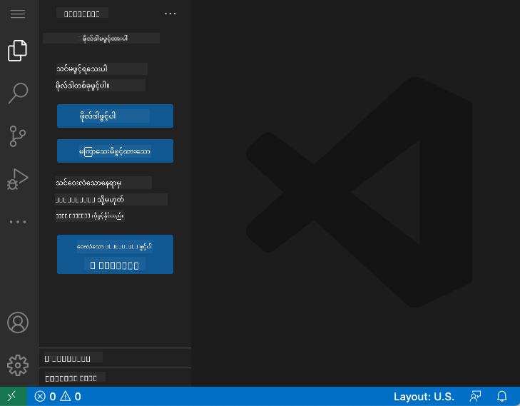
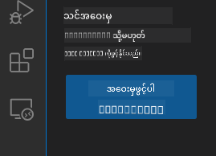
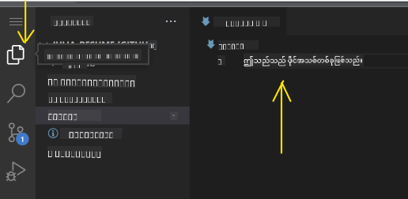

<!--
CO_OP_TRANSLATOR_METADATA:
{
  "original_hash": "7aa6e4f270d38d9cb17f2b5bd86b863d",
  "translation_date": "2025-08-27T22:41:42+00:00",
  "source_file": "8-code-editor/1-using-a-code-editor/README.md",
  "language_code": "my"
}
-->
# ကုဒ်အယ်ဒီတာ အသုံးပြုခြင်း

ဒီသင်ခန်းစာမှာ [VSCode.dev](https://vscode.dev) ဆိုတဲ့ ဝဘ်အခြေပြုကုဒ်အယ်ဒီတာကို အသုံးပြုပြီး သင့်ရဲ့ကုဒ်ကို ပြင်ဆင်ခြင်းနှင့် ပရောဂျက်တွင် ပါဝင်ဆောင်ရွက်နိုင်ရန် အခြေခံအချက်များကို လေ့လာပါမည်။ ဒီအရာတွေကို သင့်ကွန်ပျူတာမှာ ဘာမှ ထည့်သွင်းမထားဘဲ လုပ်ဆောင်နိုင်ပါတယ်။

## သင်ခန်းစာရည်မှန်းချက်များ

ဒီသင်ခန်းစာအပြီးမှာ သင်တတ်မြောက်မည့်အရာများမှာ -

- ကုဒ်ပရောဂျက်တစ်ခုအတွင်း ကုဒ်အယ်ဒီတာကို အသုံးပြုနိုင်ခြင်း
- ဗားရှင်းထိန်းချုပ်မှုဖြင့် ပြောင်းလဲမှုများကို စောင့်ကြည့်နိုင်ခြင်း
- ဖွံ့ဖြိုးတိုးတက်မှုအတွက် အယ်ဒီတာကို စိတ်ကြိုက်ပြင်ဆင်နိုင်ခြင်း

### ကြိုတင်လိုအပ်ချက်များ

စတင်မည်မီ သင့်မှာ [GitHub](https://github.com) အကောင့်တစ်ခု ရှိဖို့လိုအပ်ပါတယ်။ [GitHub](https://github.com/) ကိုသွားပြီး အကောင့်မရှိသေးပါက အသစ်တစ်ခု ဖန်တီးပါ။

### နိဒါန်း

ကုဒ်အယ်ဒီတာသည် ပရိုဂရမ်ရေးသားခြင်းနှင့် ရှိပြီးသားကုဒ်ပရောဂျက်များတွင် ပူးပေါင်းဆောင်ရွက်ရန် အရေးကြီးသော ကိရိယာတစ်ခုဖြစ်သည်။ အယ်ဒီတာ၏ အခြေခံအချက်များနှင့် ၎င်း၏ အင်္ဂါရပ်များကို အသုံးချနည်းကို နားလည်ပြီးပါက သင့်ရဲ့ကုဒ်ရေးသားမှုတွင် အလွယ်တကူ အသုံးချနိုင်ပါမည်။

## VSCode.dev ဖြင့် စတင်ခြင်း

[VSCode.dev](https://vscode.dev) သည် ဝဘ်အခြေပြု ကုဒ်အယ်ဒီတာတစ်ခုဖြစ်သည်။ ၎င်းကို အသုံးပြုရန် ဘာမှ ထည့်သွင်းရန် မလိုအပ်ပါဘူး၊ အခြားဝဘ်ဆိုဒ်တစ်ခု ဖွင့်သလိုပဲ ဖွင့်နိုင်ပါတယ်။ စတင်ရန် [https://vscode.dev](https://vscode.dev) ကို ဖွင့်ပါ။ သင် [GitHub](https://github.com/) တွင် လော့ဂ်အင်မလုပ်ထားပါက လိုအပ်သော လမ်းညွှန်ချက်များကို လိုက်နာပြီး လော့ဂ်အင်လုပ်ပါ။

ဖွင့်ပြီးပါက အောက်ပါပုံနှင့် ဆင်တူသော အခြေအနေကို တွေ့ရပါမည် -



ဤအယ်ဒီတာတွင် အဓိကပိုင်းသုံးခုရှိသည် -

1. _Activity Bar_ - 🔎 မျှော်မှန်းမှန်၊ ⚙️ ဂီယာနှင့် အခြားအိုင်ကွန်များပါဝင်သည်။
2. _Side Bar_ - _Explorer_ အဖြစ် အဆင့်မြှင့်ထားသော Activity Bar ၏ အပိုင်း။
3. _Code Area_ - ညာဘက်တွင်ရှိပြီး ကုဒ်ကို ပြင်ဆင်ရန် အသုံးပြုသည်။

အိုင်ကွန်တစ်ခုချင်းစီကို နှိပ်ပြီး မီနူးအသစ်များကို ကြည့်ပါ။ ပြီးလျှင် _Explorer_ ကို ပြန်နှိပ်ပါ။

သင့်ရဲ့ကုဒ်ကို ဖန်တီးခြင်း သို့မဟုတ် ပြင်ဆင်ခြင်းကို ဤ Code Area တွင် ပြုလုပ်မည်ဖြစ်သည်။

## GitHub Repository ဖွင့်ခြင်း

GitHub Repository တစ်ခု ဖွင့်ရန် အမျိုးမျိုးသောနည်းလမ်းများရှိသည်။ ဒီအပိုင်းမှာ Repository ကို ဖွင့်နိုင်ရန် နည်းလမ်းနှစ်ခုကို လေ့လာပါမည်။

### ၁။ အယ်ဒီတာမှ ဖွင့်ခြင်း

အယ်ဒီတာကို အသုံးပြု၍ Remote Repository ကို ဖွင့်ပါ။ [VSCode.dev](https://vscode.dev) သို့ သွားပါ၊ _"Open Remote Repository"_ ခလုတ်ကို တွေ့ရပါမည်။



Command Palette ကိုလည်း အသုံးပြုနိုင်သည်။ Command Palette သည် အမိန့် သို့မဟုတ် လုပ်ဆောင်မှုတစ်ခုကို ရှာဖွေပြီး အမိန့်ကို အကောင်အထည်ဖော်ရန် အသုံးပြုသော အကွက်တစ်ခုဖြစ်သည်။ _View_ ကိုရွေးပြီး _Command Palette_ ကိုရွေးပါ၊ သို့မဟုတ် Ctrl-Shift-P (MacOS တွင် Command-Shift-P) ကို အသုံးပြုပါ။


Command Palette ဖွင့်ပြီး _open remote repository_ ဟု ရိုက်ထည့်ပါ၊ ထို့နောက် ပထမဆုံးရွေးချယ်မှုကို ရွေးပါ။ သင်ပါဝင်သော Repository များ သို့မဟုတ် မကြာသေးမီက ဖွင့်ထားသော Repository များကို တွေ့ရပါမည်။ GitHub URL တစ်ခုကိုလည်း ရိုက်ထည့်နိုင်သည်။ အောက်ပါ URL ကို အသုံးပြုပါ -

```
https://github.com/microsoft/Web-Dev-For-Beginners
```

✅ အောင်မြင်ပါက Repository ၏ ဖိုင်အားလုံးကို အယ်ဒီတာတွင် တွေ့ရပါမည်။

### ၂။ URL အသုံးပြုခြင်း

URL တစ်ခုကို တိုက်ရိုက်အသုံးပြု၍ Repository ကို ဖွင့်နိုင်သည်။ ဥပမာအားဖြင့် လက်ရှိ Repository ၏ URL သည် [https://github.com/microsoft/Web-Dev-For-Beginners](https://github.com/microsoft/Web-Dev-For-Beginners) ဖြစ်သည်။ GitHub domain ကို `VSCode.dev/github` ဖြင့် အစားထိုးပြီး Repository ကို တိုက်ရိုက်ဖွင့်နိုင်သည်။ ရလဒ် URL သည် [https://vscode.dev/github/microsoft/Web-Dev-For-Beginners](https://vscode.dev/github/microsoft/Web-Dev-For-Beginners) ဖြစ်ပါမည်။

## ဖိုင်များကို ပြင်ဆင်ခြင်း

Repository ကို Browser/VSCode.dev တွင် ဖွင့်ပြီးပါက ပရောဂျက်ကို ပြင်ဆင်ရန် နောက်တစ်ဆင့်ကို ဆက်လုပ်ပါမည်။

### ၁။ ဖိုင်အသစ်တစ်ခု ဖန်တီးခြင်း

ဖိုင်အသစ်တစ်ခုကို ရှိပြီးသားဖိုလ်ဒါအတွင်း သို့မဟုတ် Root Directory/Folder တွင် ဖန်တီးနိုင်သည်။ ဖိုင်အသစ်ဖန်တီးရန် ဖိုင်ကို သိမ်းဆည်းလိုသောနေရာ/Directory ကို ဖွင့်ပြီး _'New file ...'_ အိုင်ကွန်ကို နှိပ်ပါ၊ နာမည်ပေးပြီး Enter နှိပ်ပါ။


### ၂။ Repository တွင် ဖိုင်ကို ပြင်ဆင်ပြီး သိမ်းဆည်းခြင်း

VSCode.dev ကို အသုံးပြုခြင်းသည် သင့်ပရောဂျက်ကို အလျင်အမြန် ပြင်ဆင်ရန် အထောက်အကူဖြစ်သည်။ သင့်ကုဒ်ကို ပြင်ဆင်ရန် _Explorer_ အိုင်ကွန်ကို နှိပ်ပြီး Repository အတွင်းရှိ ဖိုင်များနှင့် ဖိုလ်ဒါများကို ကြည့်ပါ။ ဖိုင်တစ်ခုကို ရွေးပြီး Code Area တွင် ဖွင့်ပါ၊ ပြင်ဆင်ပြီး သိမ်းဆည်းပါ။



## Extension များ အသုံးပြုခြင်း

VSCode တွင် Extension များကို ထည့်သွင်းခြင်းဖြင့် သင့်ဖွံ့ဖြိုးတိုးတက်မှု လုပ်ငန်းစဉ်ကို တိုးတက်စေမည့် အင်္ဂါရပ်အသစ်များနှင့် စိတ်ကြိုက်ဖွဲ့စည်းမှုများကို ထည့်သွင်းနိုင်သည်။ Extension များသည် အများအားဖြင့် Generic Extension များ သို့မဟုတ် Programming Language အခြေပြု Extension များ ဖြစ်သည်။

---

## လုပ်ငန်းတာဝန်

[VSCode.dev ကို အသုံးပြု၍ CV/Resume ဝဘ်ဆိုဒ်တစ်ခု ဖန်တီးပါ](https://github.com/microsoft/Web-Dev-For-Beginners/blob/main/8-code-editor/1-using-a-code-editor/assignment.md)

## ပြန်လည်သုံးသပ်ခြင်းနှင့် ကိုယ်တိုင်လေ့လာခြင်း

[VSCode.dev](https://code.visualstudio.com/docs/editor/vscode-web?WT.mc_id=academic-0000-alfredodeza) နှင့် ၎င်း၏ အခြားအင်္ဂါရပ်များအကြောင်း ပိုမိုဖတ်ရှုပါ။

---

**အကြောင်းကြားချက်**:  
ဤစာရွက်စာတမ်းကို AI ဘာသာပြန်ဝန်ဆောင်မှု [Co-op Translator](https://github.com/Azure/co-op-translator) ကို အသုံးပြု၍ ဘာသာပြန်ထားပါသည်။ ကျွန်ုပ်တို့သည် တိကျမှုအတွက် ကြိုးစားနေသော်လည်း၊ အလိုအလျောက် ဘာသာပြန်ခြင်းတွင် အမှားများ သို့မဟုတ် မမှန်ကန်မှုများ ပါဝင်နိုင်သည်ကို သတိပြုပါ။ မူရင်းစာရွက်စာတမ်းကို ၎င်း၏ မူရင်းဘာသာစကားဖြင့် အာဏာတရားရှိသော အရင်းအမြစ်အဖြစ် ရှုလေ့ရှိသင့်ပါသည်။ အရေးကြီးသော အချက်အလက်များအတွက် လူ့ဘာသာပြန်ပညာရှင်များမှ ပရော်ဖက်ရှင်နယ် ဘာသာပြန်ခြင်းကို အကြံပြုပါသည်။ ဤဘာသာပြန်ကို အသုံးပြုခြင်းမှ ဖြစ်ပေါ်လာသော အလွဲအလွတ်များ သို့မဟုတ် အနားလွဲမှုများအတွက် ကျွန်ုပ်တို့သည် တာဝန်မယူပါ။