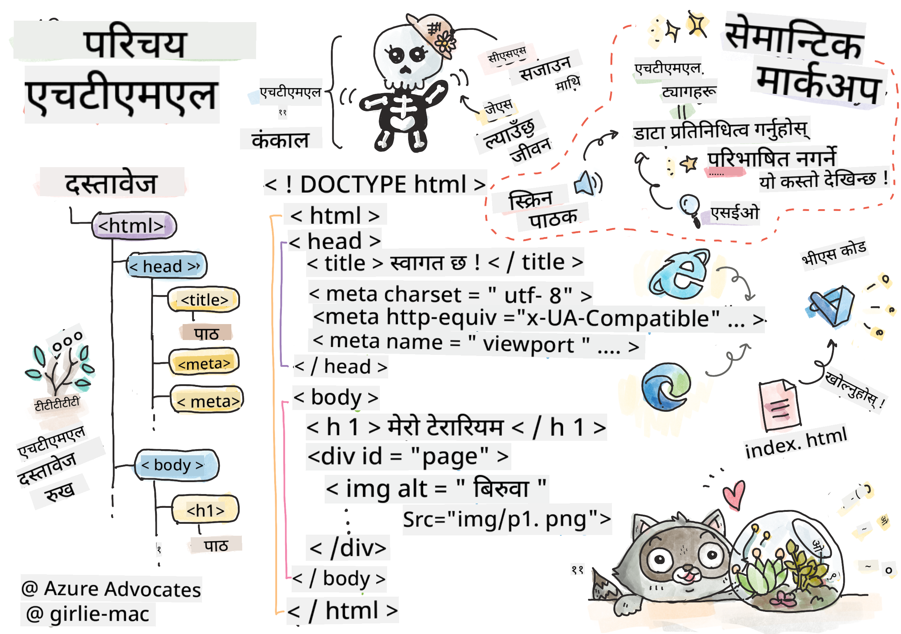
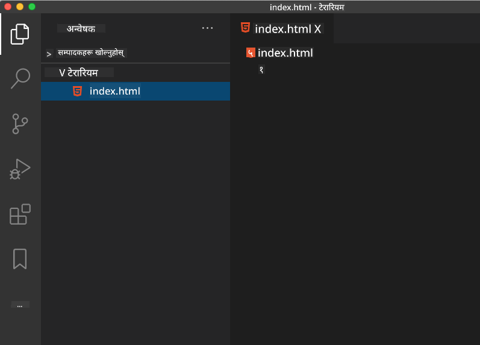

<!--
CO_OP_TRANSLATOR_METADATA:
{
  "original_hash": "46a0639e719b9cf1dfd062aa24cad639",
  "translation_date": "2025-08-25T21:08:47+00:00",
  "source_file": "3-terrarium/1-intro-to-html/README.md",
  "language_code": "ne"
}
-->
# टेरारियम प्रोजेक्ट भाग १: HTML को परिचय


> स्केच नोट [Tomomi Imura](https://twitter.com/girlie_mac) द्वारा

## प्रि-लेक्चर क्विज

[प्रि-लेक्चर क्विज](https://ff-quizzes.netlify.app/web/quiz/15)


> भिडियो हेर्नुहोस्

> 
> [](https://www.youtube.com/watch?v=1TvxJKBzhyQ)

### परिचय

HTML, वा हाइपरटेक्स्ट मार्कअप भाषा, वेबको 'कंकाल' हो। यदि CSS ले HTML लाई 'सजाउँछ' र JavaScript ले यसलाई जीवन दिन्छ भने, HTML तपाईंको वेब एप्लिकेसनको शरीर हो। HTML को सिन्ट्याक्सले पनि यो विचारलाई प्रतिबिम्बित गर्दछ, किनकि यसमा "head", "body", र "footer" ट्यागहरू समावेश छन्।

यस पाठमा, हामी HTML प्रयोग गरेर हाम्रो भर्चुअल टेरारियमको इन्टरफेसको 'कंकाल' लेआउट गर्नेछौं। यसमा शीर्षक र तीन स्तम्भहरू हुनेछन्: दायाँ र बायाँ स्तम्भ जहाँ ड्र्याग गर्न मिल्ने बिरुवाहरू रहनेछन्, र बीचको क्षेत्र जसले वास्तविक काँच-जस्तो टेरारियमको रूपमा काम गर्नेछ। यस पाठको अन्त्यसम्ममा, तपाईं स्तम्भहरूमा बिरुवाहरू देख्न सक्नुहुनेछ, तर इन्टरफेस अलि अजीब देखिनेछ; चिन्ता नगर्नुहोस्, अर्को भागमा तपाईं CSS शैलीहरू थपेर इन्टरफेसलाई राम्रो देखाउनेछ।

### कार्य

तपाईंको कम्प्युटरमा 'terrarium' नामको फोल्डर बनाउनुहोस् र त्यसको भित्र 'index.html' नामको फाइल बनाउनुहोस्। तपाईं यो Visual Studio Code मा गर्न सक्नुहुन्छ। आफ्नो terrarium फोल्डर बनाइसकेपछि नयाँ VS Code विन्डो खोल्नुहोस्, 'open folder' क्लिक गर्नुहोस्, र आफ्नो नयाँ फोल्डरमा जानुहोस्। Explorer प्यानमा सानो 'file' बटन क्लिक गरेर नयाँ फाइल बनाउनुहोस्:



वा

तपाईं git bash मा यी कमाण्डहरू प्रयोग गर्न सक्नुहुन्छ:
* `mkdir terrarium`
* `cd terrarium`
* `touch index.html`
* `code index.html` वा `nano index.html`

> index.html फाइलहरूले ब्राउजरलाई संकेत गर्छ कि यो फोल्डरको डिफल्ट फाइल हो; जस्तै `https://anysite.com/test` जस्ता URL हरू फोल्डर संरचनाको आधारमा बनाइएका हुन सक्छन् जसमा `test` नामको फोल्डर र त्यसको भित्र `index.html` हुन्छ; `index.html` URL मा देखिनु पर्दैन।

---

## DocType र html ट्यागहरू

HTML फाइलको पहिलो लाइन यसको DocType हो। यो अलि अचम्मको लाग्न सक्छ कि तपाईंले यो लाइन फाइलको सबैभन्दा माथि राख्नुपर्छ, तर यसले पुरानो ब्राउजरहरूलाई संकेत गर्छ कि पृष्ठलाई हालको HTML स्पेसिफिकेशन अनुसार स्ट्यान्डर्ड मोडमा रेंडर गर्नुपर्छ।

> टिप: VS Code मा, तपाईं ट्यागमाथि होभर गर्न सक्नुहुन्छ र MDN Reference गाइडहरूबाट यसको प्रयोगको बारेमा जानकारी प्राप्त गर्न सक्नुहुन्छ।

दोस्रो लाइन `<html>` ट्यागको ओपनिङ ट्याग हुनुपर्छ, अहिलेको लागि यसको क्लोजिङ ट्याग `</html>` को साथ। यी ट्यागहरू तपाईंको इन्टरफेसका रूट एलिमेन्टहरू हुन्।

### कार्य

तपाईंको `index.html` फाइलको माथि यी लाइनहरू थप्नुहोस्:

```HTML
<!DOCTYPE html>
<html></html>
```

✅ DocType सेट गरेर केही मोडहरू निर्धारण गर्न सकिन्छ: [Quirks Mode र Standards Mode](https://developer.mozilla.org/docs/Web/HTML/Quirks_Mode_and_Standards_Mode)। यी मोडहरू पुराना ब्राउजरहरूलाई समर्थन गर्न प्रयोग गरिन्थ्यो जुन अहिले सामान्यतया प्रयोग गरिँदैन (जस्तै Netscape Navigator 4 र Internet Explorer 5)। तपाईं स्ट्यान्डर्ड DocType घोषणा प्रयोग गर्न सक्नुहुन्छ।

---

## डकुमेन्टको 'head'

HTML डकुमेन्टको 'head' क्षेत्रले तपाईंको वेब पृष्ठको महत्त्वपूर्ण जानकारी समावेश गर्दछ, जसलाई [मेटाडाटा](https://developer.mozilla.org/docs/Web/HTML/Element/meta) पनि भनिन्छ। हाम्रो केसमा, हामी वेब सर्भरलाई चार कुराहरू बताउँछौं:

-   पृष्ठको शीर्षक
-   पृष्ठ मेटाडाटा जसमा समावेश छ:
    -   'character set', जसले पृष्ठमा प्रयोग गरिएको क्यारेक्टर इनकोडिङको बारेमा बताउँछ
    -   ब्राउजर जानकारी, जस्तै `x-ua-compatible` जसले IE=edge ब्राउजरलाई समर्थन गरेको संकेत गर्छ
    -   पृष्ठ लोड हुँदा viewport कसरी व्यवहार गर्ने भन्ने जानकारी। viewport लाई प्रारम्भिक स्केल 1 मा सेट गर्दा पृष्ठ पहिलो पटक लोड हुँदा जूम स्तर नियन्त्रण हुन्छ।

### कार्य

तपाईंको डकुमेन्टमा `<html>` ट्यागहरूको बीचमा 'head' ब्लक थप्नुहोस्।

```html
<head>
	<title>Welcome to my Virtual Terrarium</title>
	<meta charset="utf-8" />
	<meta http-equiv="X-UA-Compatible" content="IE=edge" />
	<meta name="viewport" content="width=device-width, initial-scale=1" />
</head>
```

✅ यदि तपाईंले viewport मेटा ट्यागलाई यसरी सेट गर्नुभयो भने के हुन्छ: `<meta name="viewport" content="width=600">`? [viewport](https://developer.mozilla.org/docs/Web/HTML/Viewport_meta_tag) को बारेमा थप पढ्नुहोस्।

---

## डकुमेन्टको `body`

### HTML ट्यागहरू

HTML मा, तपाईं आफ्नो .html फाइलमा ट्यागहरू थपेर वेब पृष्ठका एलिमेन्टहरू सिर्जना गर्नुहुन्छ। प्रत्येक ट्याग सामान्यतया ओपनिङ र क्लोजिङ ट्याग हुन्छ, जस्तै `<p>hello</p>` जसले अनुच्छेदलाई संकेत गर्छ। आफ्नो इन्टरफेसको body सिर्जना गर्न `<html>` ट्यागको जोडीभित्र `<body>` ट्यागहरूको सेट थप्नुहोस्; तपाईंको मार्कअप अब यसरी देखिन्छ:

### कार्य

```html
<!DOCTYPE html>
<html>
	<head>
		<title>Welcome to my Virtual Terrarium</title>
		<meta charset="utf-8" />
		<meta http-equiv="X-UA-Compatible" content="IE=edge" />
		<meta name="viewport" content="width=device-width, initial-scale=1" />
	</head>
	<body></body>
</html>
```

अब, तपाईं आफ्नो पृष्ठ निर्माण गर्न सुरु गर्न सक्नुहुन्छ। सामान्यतया, तपाईं `<div>` ट्यागहरू प्रयोग गरेर पृष्ठका छुट्टाछुट्टै एलिमेन्टहरू सिर्जना गर्नुहुन्छ। हामी `<div>` एलिमेन्टहरूको श्रृंखला सिर्जना गर्नेछौं जसले छविहरू समावेश गर्नेछ।

### छविहरू

एक HTML ट्याग जसलाई क्लोजिङ ट्याग आवश्यक पर्दैन, त्यो `` ट्याग हो, किनकि यसमा `src` एलिमेन्ट हुन्छ जसले पृष्ठलाई वस्तु रेंडर गर्न आवश्यक सबै जानकारी प्रदान गर्दछ।

तपाईंको एपमा `images` नामको फोल्डर सिर्जना गर्नुहोस् र त्यसमा [source code folder](../../../../3-terrarium/solution/images) का सबै छविहरू थप्नुहोस्; (त्यहाँ १४ वटा बिरुवाका छविहरू छन्)।

### कार्य

यी बिरुवाका छविहरू दुई स्तम्भहरूमा `<body></body>` ट्यागहरूको बीचमा थप्नुहोस्:

```html
<div id="page">
	<div id="left-container" class="container">
		<div class="plant-holder">
			
		</div>
		<div class="plant-holder">
			
		</div>
		<div class="plant-holder">
			
		</div>
		<div class="plant-holder">
			
		</div>
		<div class="plant-holder">
			
		</div>
		<div class="plant-holder">
			
		</div>
		<div class="plant-holder">
			
		</div>
	</div>
	<div id="right-container" class="container">
		<div class="plant-holder">
			
		</div>
		<div class="plant-holder">
			
		</div>
		<div class="plant-holder">
			
		</div>
		<div class="plant-holder">
			
		</div>
		<div class="plant-holder">
			
		</div>
		<div class="plant-holder">
			
		</div>
		<div class="plant-holder">
			
		</div>
	</div>
</div>
```

> नोट: Spans बनाम Divs। Divs 'ब्लक' एलिमेन्ट मानिन्छन्, र Spans 'इनलाइन'। यदि तपाईंले यी divs लाई spans मा परिवर्तन गर्नुभयो भने के हुन्छ?

यस मार्कअपको साथ, बिरुवाहरू अब स्क्रिनमा देखिन्छन्। यो अलि नराम्रो देखिन्छ, किनकि तिनीहरू CSS प्रयोग गरेर अझै स्टाइल गरिएको छैन, र हामी यो अर्को पाठमा गर्नेछौं।

प्रत्येक छविमा alt टेक्स्ट हुन्छ जुन तपाईंले छवि देख्न वा रेंडर गर्न नसक्ने अवस्थामा देखिन्छ। यो समावेश गर्न महत्त्वपूर्ण विशेषता हो जसले पहुँचयोग्यता सुनिश्चित गर्छ। भविष्यका पाठहरूमा पहुँचयोग्यताको बारेमा थप जान्नुहोस्; अहिलेको लागि, सम्झनुहोस् कि alt विशेषताले छविको लागि वैकल्पिक जानकारी प्रदान गर्छ यदि प्रयोगकर्ताले कुनै कारणले छवि हेर्न सक्दैन (जस्तै ढिलो कनेक्शन, src विशेषतामा त्रुटि, वा प्रयोगकर्ताले स्क्रिन रीडर प्रयोग गरेमा)।

✅ के तपाईंले ध्यान दिनुभयो कि प्रत्येक छविमा एउटै alt टेक्स्ट छ? के यो राम्रो अभ्यास हो? किन वा किन होइन? के तपाईंले यो कोड सुधार गर्न सक्नुहुन्छ?

---

## सेम्यान्टिक मार्कअप

सामान्यतया, HTML लेख्दा अर्थपूर्ण 'सेम्यान्टिक्स' प्रयोग गर्नु राम्रो मानिन्छ। यसको मतलब के हो? यसको मतलब तपाईं HTML ट्यागहरूलाई तिनीहरू डिजाइन गरिएको डेटा वा अन्तरक्रियाको प्रकारको प्रतिनिधित्व गर्न प्रयोग गर्नुहुन्छ। उदाहरणका लागि, पृष्ठको मुख्य शीर्षक पाठले `<h1>` ट्याग प्रयोग गर्नुपर्छ।

तपाईंको ओपनिङ `<body>` ट्यागको ठीक तल निम्न लाइन थप्नुहोस्:

```html
<h1>My Terrarium</h1>
```

सेम्यान्टिक मार्कअप प्रयोग गर्दा जस्तै हेडरहरू `<h1>` र अनऑर्डर्ड सूचीहरू `<ul>` को रूपमा रेंडर गर्दा स्क्रिन रीडरहरूले पृष्ठमा नेभिगेट गर्न मद्दत गर्छ। सामान्यतया, बटनहरू `<button>` को रूपमा लेखिनुपर्छ र सूचीहरू `<li>` को रूपमा। जबकि विशेष शैलीयुक्त `<span>` एलिमेन्टहरू क्लिक ह्यान्डलरहरूसँग प्रयोग गरेर बटनको नक्कल गर्न _सकिन्छ_, अपांग प्रयोगकर्ताहरूलाई पृष्ठमा बटन कहाँ छ भनेर निर्धारण गर्न र यससँग अन्तरक्रिया गर्न सजिलो बनाउँछ यदि एलिमेन्ट बटनको रूपमा देखिन्छ। यस कारणले गर्दा, सकेसम्म सेम्यान्टिक मार्कअप प्रयोग गर्न प्रयास गर्नुहोस्।

✅ स्क्रिन रीडर र [यो वेब पृष्ठसँग कसरी अन्तरक्रिया गर्छ](https://www.youtube.com/watch?v=OUDV1gqs9GA) हेर्नुहोस्। के तपाईं देख्न सक्नुहुन्छ कि गैर-सेम्यान्टिक मार्कअपले प्रयोगकर्तालाई किन निराश पार्न सक्छ?

## टेरारियम

इन्टरफेसको अन्तिम भागमा टेरारियम सिर्जना गर्न स्टाइल गरिने मार्कअप समावेश छ।

### कार्य:

अन्तिम `</div>` ट्यागको माथि यो मार्कअप थप्नुहोस्:

```html
<div id="terrarium">
	<div class="jar-top"></div>
	<div class="jar-walls">
		<div class="jar-glossy-long"></div>
		<div class="jar-glossy-short"></div>
	</div>
	<div class="dirt"></div>
	<div class="jar-bottom"></div>
</div>
```

✅ तपाईंले यो मार्कअप स्क्रिनमा थपे पनि, तपाईंले केही पनि रेंडर भएको देख्नुहुन्न। किन?

---

## 🚀चुनौती

HTML मा केही पुराना 'मजेदार' ट्यागहरू छन् जुन खेल्न रमाइलो हुन्छ, यद्यपि तपाईंले [यी ट्यागहरू](https://developer.mozilla.org/docs/Web/HTML/Element#Obsolete_and_deprecated_elements) जस्ता डिप्रिकेटेड ट्यागहरू आफ्नो मार्कअपमा प्रयोग गर्नु हुँदैन। तर, के तपाईंले पुरानो `<marquee>` ट्याग प्रयोग गरेर h1 शीर्षकलाई क्षैतिज रूपमा स्क्रोल गराउन सक्नुहुन्छ? (यदि तपाईंले गरिरहनुभएको छ भने, पछि यसलाई हटाउन नबिर्सनुहोस्)

## पोस्ट-लेक्चर क्विज

[पोस्ट-लेक्चर क्विज](https://ff-quizzes.netlify.app/web/quiz/16)

## समीक्षा र आत्म अध्ययन

HTML 'परीक्षित र सत्य' निर्माण ब्लक प्रणाली हो जसले वेबलाई आजको अवस्थामा निर्माण गर्न मद्दत गरेको छ। यसको इतिहासको बारेमा केही पुराना र नयाँ ट्यागहरू अध्ययन गरेर जान्नुहोस्। के तपाईंले पत्ता लगाउन सक्नुहुन्छ कि किन केही ट्यागहरू डिप्रिकेट गरिए र केही थपिए? भविष्यमा कुन ट्यागहरू परिचय गरिन सक्छन्?

वेब र मोबाइल उपकरणहरूको लागि साइटहरू निर्माण गर्ने बारेमा [Microsoft Learn](https://docs.microsoft.com/learn/modules/build-simple-website/?WT.mc_id=academic-77807-sagibbon) मा थप जान्नुहोस्।

## असाइनमेन्ट

[HTML अभ्यास गर्नुहोस्: ब्लग मक्कअप बनाउनुहोस्](assignment.md)

**अस्वीकरण**:  
यो दस्तावेज़ AI अनुवाद सेवा [Co-op Translator](https://github.com/Azure/co-op-translator) प्रयोग गरेर अनुवाद गरिएको छ। हामी शुद्धताको लागि प्रयास गर्छौं, तर कृपया ध्यान दिनुहोस् कि स्वचालित अनुवादमा त्रुटिहरू वा अशुद्धताहरू हुन सक्छ। यसको मूल भाषा मा रहेको मूल दस्तावेज़लाई आधिकारिक स्रोत मानिनुपर्छ। महत्वपूर्ण जानकारीको लागि, व्यावसायिक मानव अनुवाद सिफारिस गरिन्छ। यस अनुवादको प्रयोगबाट उत्पन्न हुने कुनै पनि गलतफहमी वा गलत व्याख्याको लागि हामी जिम्मेवार हुने छैनौं।