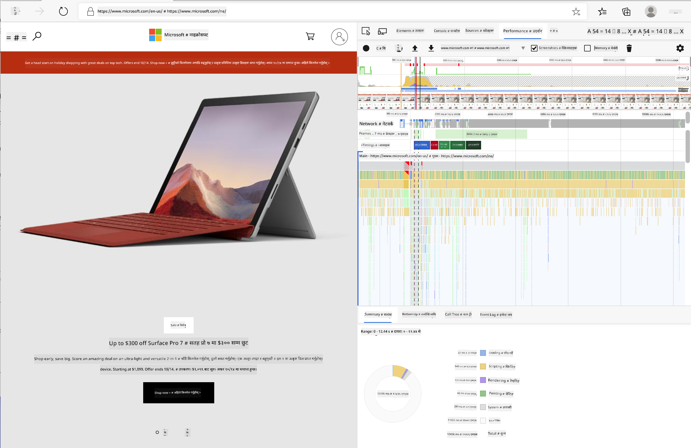
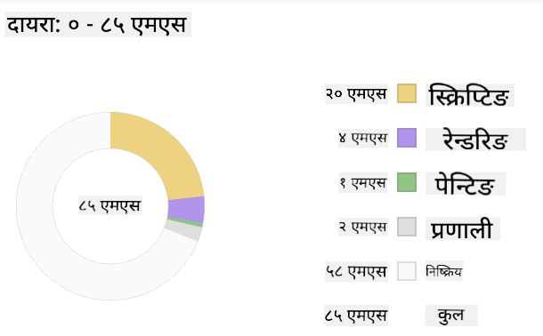

<!--
CO_OP_TRANSLATOR_METADATA:
{
  "original_hash": "f198c6b817b4b2a99749f4662e7cae98",
  "translation_date": "2025-08-25T23:46:17+00:00",
  "source_file": "5-browser-extension/3-background-tasks-and-performance/README.md",
  "language_code": "ne"
}
-->
# ब्राउजर एक्स्टेन्सन प्रोजेक्ट भाग ३: पृष्ठभूमि कार्यहरू र प्रदर्शनबारे जान्नुहोस्

## प्रि-लेक्चर क्विज

[प्रि-लेक्चर क्विज](https://ff-quizzes.netlify.app/web/quiz/27)

### परिचय

यस मोड्युलका पछिल्ला दुई पाठहरूमा, तपाईंले API बाट डेटा ल्याउनको लागि एउटा फारम र प्रदर्शन क्षेत्र कसरी निर्माण गर्ने भनेर सिक्नुभयो। यो वेबमा उपस्थिति सिर्जना गर्ने एकदमै सामान्य तरिका हो। तपाईंले डेटा असिन्क्रोनस रूपमा कसरी ल्याउने भनेर पनि सिक्नुभयो। तपाईंको ब्राउजर एक्स्टेन्सन लगभग तयार छ। 

अब केही पृष्ठभूमि कार्यहरू व्यवस्थापन गर्न बाँकी छ, जसमा एक्स्टेन्सनको आइकनको रंग ताजा गर्ने काम पनि समावेश छ। यो समय ब्राउजरले यस प्रकारका कार्यहरू कसरी व्यवस्थापन गर्छ भन्ने कुरा बुझ्नको लागि उपयुक्त छ। तपाईंले निर्माण गरिरहेका वेब सम्पत्तिहरूको प्रदर्शनको सन्दर्भमा यी ब्राउजर कार्यहरूबारे सोचौं।

## वेब प्रदर्शनको आधारभूत कुरा

> "वेबसाइट प्रदर्शन दुई कुराहरूमा निर्भर छ: पृष्ठ कति छिटो लोड हुन्छ, र त्यसमा रहेको कोड कति छिटो चल्छ।" -- [ज्याक ग्रोसबार्ट](https://www.smashingmagazine.com/2012/06/javascript-profiling-chrome-developer-tools/)

तपाईंको वेबसाइटहरूलाई सबै प्रकारका उपकरणहरू, प्रयोगकर्ताहरू, र परिस्थितिहरूमा छिटो बनाउनका लागि आवश्यक पर्ने विषयवस्तु विशाल छ। यहाँ केही बुँदाहरू छन् जुन तपाईंले सामान्य वेब प्रोजेक्ट वा ब्राउजर एक्स्टेन्सन निर्माण गर्दा ध्यानमा राख्नुपर्छ।

तपाईंको साइट कुशलतापूर्वक चलिरहेको छ भनेर सुनिश्चित गर्नको लागि पहिलो कुरा भनेको यसको प्रदर्शनबारे डेटा सङ्कलन गर्नु हो। यसको लागि पहिलो स्थान भनेको तपाईंको वेब ब्राउजरको डेभलपर टुल्स हो। Edge मा, तपाईं "सेटिङ्स र थप" बटन (ब्राउजरको माथिल्लो दायाँ कुनामा रहेको तीन डट्स आइकन) चयन गर्न सक्नुहुन्छ, त्यसपछि More Tools > Developer Tools मा जानुहोस् र Performance ट्याब खोल्नुहोस्। तपाईं Windows मा `Ctrl` + `Shift` + `I` वा Mac मा `Option` + `Command` + `I` कीबोर्ड सर्टकट प्रयोग गरेर पनि डेभलपर टुल्स खोल्न सक्नुहुन्छ।

Performance ट्याबमा प्रोफाइलिङ टुल हुन्छ। एउटा वेबसाइट खोल्नुहोस् (उदाहरणका लागि, [https://www.microsoft.com](https://www.microsoft.com/?WT.mc_id=academic-77807-sagibbon)) र 'Record' बटन क्लिक गर्नुहोस्, त्यसपछि साइट रिफ्रेश गर्नुहोस्। कुनै पनि समयमा रेकर्डिङ रोक्नुहोस्, र तपाईंले 'स्क्रिप्ट', 'रेन्डर', र 'पेन्ट' गर्न उत्पन्न हुने रुटिनहरू हेर्न सक्नुहुन्छ:



✅ [Microsoft डकुमेन्टेसन](https://docs.microsoft.com/microsoft-edge/devtools-guide/performance/?WT.mc_id=academic-77807-sagibbon) मा Edge को Performance प्यानलबारे जान्नुहोस्।

> टिप: तपाईंको वेबसाइटको स्टार्टअप समयको सही मापन गर्न, ब्राउजरको क्यास खाली गर्नुहोस्।

प्रोफाइल टाइमलाइनका तत्वहरू चयन गरेर तपाईंको पृष्ठ लोड हुँदा हुने घटनाहरूमा जुम इन गर्नुहोस्।

प्रोफाइल टाइमलाइनको कुनै भाग चयन गरेर र समरी प्यान हेरेर तपाईंको पृष्ठको प्रदर्शनको स्न्यापसट लिनुहोस्:



Event Log प्यान जाँच गर्नुहोस् कि कुनै घटना १५ मिलिसेकेन्डभन्दा बढी समय लिएको छ कि छैन:


✅ तपाईंको प्रोफाइलरलाई राम्रोसँग चिन्नुहोस्! यस साइटमा डेभलपर टुल्स खोल्नुहोस् र कुनै बोटलनेक छ कि छैन हेर्नुहोस्। सबैभन्दा ढिलो लोड हुने सम्पत्ति कुन हो? सबैभन्दा छिटो?

## प्रोफाइलिङ जाँचहरू

सामान्यतया, केही "समस्या क्षेत्रहरू" छन् जसलाई प्रत्येक वेब डेभलपरले साइट निर्माण गर्दा ध्यान दिनुपर्छ ताकि उत्पादनमा डिप्लोय गर्दा अप्रिय आश्चर्यहरूबाट बच्न सकियोस्।

**सम्पत्ति आकारहरू**: पछिल्ला केही वर्षहरूमा वेब 'गह्रौं' भएको छ, र यसैले ढिलो पनि। यस तौलको केही हिस्सा छविहरूको प्रयोगसँग सम्बन्धित छ।

✅ [इन्टरनेट आर्काइभ](https://httparchive.org/reports/page-weight) हेर्नुहोस् पृष्ठ तौलको ऐतिहासिक दृष्टिकोण र थप जानकारीको लागि।

एक राम्रो अभ्यास भनेको तपाईंको छविहरूलाई अनुकूलित गर्नु र तपाईंका प्रयोगकर्ताहरूको लागि सही आकार र रिजोल्युसनमा डेलिभर गर्नु हो।

**DOM ट्राभर्सलहरू**: ब्राउजरले तपाईंले लेखेको कोडको आधारमा यसको Document Object Model निर्माण गर्नुपर्छ, त्यसैले राम्रो पृष्ठ प्रदर्शनको लागि तपाईंका ट्यागहरू न्यूनतम राख्नु राम्रो हुन्छ। पृष्ठले आवश्यक पर्ने मात्र प्रयोग गर्नुहोस् र स्टाइल गर्नुहोस्। यस बुँदामा, पृष्ठसँग सम्बन्धित अतिरिक्त CSS अनुकूलित गर्न सकिन्छ; एउटा पृष्ठमा मात्र प्रयोग गर्नुपर्ने स्टाइलहरू मुख्य स्टाइल शीटमा समावेश गर्न आवश्यक छैन, उदाहरणका लागि।

**जाभास्क्रिप्ट**: प्रत्येक जाभास्क्रिप्ट डेभलपरले 'रेन्डर-ब्लकिङ' स्क्रिप्टहरूको लागि ध्यान दिनुपर्छ, जसले DOM ट्राभर्स र ब्राउजरमा पेन्ट हुनुअघि लोड हुनुपर्छ। तपाईंका इनलाइन स्क्रिप्टहरूसँग `defer` प्रयोग गर्न विचार गर्नुहोस् (जसरी Terrarium मोड्युलमा गरिएको छ)।

✅ [साइट स्पीड टेस्ट वेबसाइट](https://www.webpagetest.org/) मा केही साइटहरू प्रयास गर्नुहोस् र साइट प्रदर्शन निर्धारण गर्न गरिने सामान्य जाँचहरूबारे जान्नुहोस्।

अब तपाईंलाई ब्राउजरले तपाईंले पठाएका सम्पत्तिहरू कसरी रेन्डर गर्छ भन्ने थाहा भयो, अब तपाईंको एक्स्टेन्सन पूरा गर्न आवश्यक अन्तिम केही कुराहरू हेरौं:

### रंग गणना गर्ने फङ्सन बनाउनुहोस्

`/src/index.js` मा काम गर्दै, `calculateColor()` नामक फङ्सनलाई DOM पहुँच गर्न सेट गरिएका `const` भेरिएबलहरूको श्रृंखलापछि थप्नुहोस्:

```JavaScript
function calculateColor(value) {
	let co2Scale = [0, 150, 600, 750, 800];
	let colors = ['#2AA364', '#F5EB4D', '#9E4229', '#381D02', '#381D02'];

	let closestNum = co2Scale.sort((a, b) => {
		return Math.abs(a - value) - Math.abs(b - value);
	})[0];
	console.log(value + ' is closest to ' + closestNum);
	let num = (element) => element > closestNum;
	let scaleIndex = co2Scale.findIndex(num);

	let closestColor = colors[scaleIndex];
	console.log(scaleIndex, closestColor);

	chrome.runtime.sendMessage({ action: 'updateIcon', value: { color: closestColor } });
}
```

यहाँ के भइरहेको छ? तपाईंले API कलबाट प्राप्त कार्बन इन्टेन्सिटीको मानलाई पास गर्नुहुन्छ, र त्यसपछि यसको मान रंगहरूको एरेमा प्रस्तुत गरिएको सूचकांकसँग कति नजिक छ भनेर गणना गर्नुहुन्छ। त्यसपछि तपाईंले त्यो नजिकको रंग मानलाई chrome runtime मा पठाउनुहुन्छ।

chrome.runtime सँग [API](https://developer.chrome.com/extensions/runtime) छ जसले सबै प्रकारका पृष्ठभूमि कार्यहरू व्यवस्थापन गर्छ, र तपाईंको एक्स्टेन्सनले यसलाई प्रयोग गरिरहेको छ:

> "chrome.runtime API प्रयोग गरेर पृष्ठभूमि पृष्ठ पुनःप्राप्त गर्नुहोस्, म्यानिफेस्टको विवरणहरू फिर्ता गर्नुहोस्, र एप वा एक्स्टेन्सन जीवनचक्रमा घटनाहरूको लागि सुन्नुहोस् र प्रतिक्रिया दिनुहोस्। तपाईं यस API लाई URL को सापेक्ष पथलाई पूर्ण-योग्य URL मा रूपान्तरण गर्न पनि प्रयोग गर्न सक्नुहुन्छ।"

✅ यदि तपाईं यो ब्राउजर एक्स्टेन्सन Edge को लागि विकास गर्दै हुनुहुन्छ भने, तपाईंलाई यो थाहा पाउँदा अचम्म लाग्न सक्छ कि तपाईं chrome API प्रयोग गर्दै हुनुहुन्छ। नयाँ Edge ब्राउजर संस्करणहरू Chromium ब्राउजर इन्जिनमा चल्छन्, त्यसैले तपाईं यी उपकरणहरू प्रयोग गर्न सक्नुहुन्छ।

> नोट, यदि तपाईं ब्राउजर एक्स्टेन्सन प्रोफाइल गर्न चाहनुहुन्छ भने, एक्स्टेन्सनभित्रैबाट डेभलपर टुल्स सुरु गर्नुहोस्, किनभने यो आफ्नै अलग ब्राउजर इन्स्टेन्स हो।

### डिफल्ट आइकन रंग सेट गर्नुहोस्

अब, `init()` फङ्सनमा, आइकनलाई सुरुमा सामान्य हरियो रंगमा सेट गर्नुहोस् र फेरि chrome को `updateIcon` एक्सनलाई कल गर्नुहोस्:

```JavaScript
chrome.runtime.sendMessage({
	action: 'updateIcon',
		value: {
			color: 'green',
		},
});
```

### फङ्सनलाई कल गर्नुहोस्, कल कार्यान्वयन गर्नुहोस्

अन्तमा, तपाईंले सिर्जना गर्नुभएको फङ्सनलाई C02Signal API द्वारा फिर्ता गरिएको प्रॉमिसमा थपेर कल गर्नुहोस्:

```JavaScript
//let CO2...
calculateColor(CO2);
```

र अन्तमा, `/dist/background.js` मा, यी पृष्ठभूमि कार्य कलहरूको लागि लिस्नर थप्नुहोस्:

```JavaScript
chrome.runtime.onMessage.addListener(function (msg, sender, sendResponse) {
	if (msg.action === 'updateIcon') {
		chrome.browserAction.setIcon({ imageData: drawIcon(msg.value) });
	}
});
//borrowed from energy lollipop extension, nice feature!
function drawIcon(value) {
	let canvas = document.createElement('canvas');
	let context = canvas.getContext('2d');

	context.beginPath();
	context.fillStyle = value.color;
	context.arc(100, 100, 50, 0, 2 * Math.PI);
	context.fill();

	return context.getImageData(50, 50, 100, 100);
}
```

यस कोडमा, तपाईं पृष्ठभूमि टास्क म्यानेजरमा आउने कुनै पनि सन्देशहरूको लागि लिस्नर थप्दै हुनुहुन्छ। यदि यसलाई 'updateIcon' भनिन्छ भने, त्यसपछि क्यानभास API प्रयोग गरेर सही रंगको आइकन बनाउन अर्को कोड चलाइन्छ।

✅ तपाईं [Space Game पाठहरू](../../6-space-game/2-drawing-to-canvas/README.md) मा क्यानभास API को बारेमा थप जान्नुहुनेछ।

अब, तपाईंको एक्स्टेन्सन पुनः निर्माण गर्नुहोस् (`npm run build`), रिफ्रेश गर्नुहोस् र तपाईंको एक्स्टेन्सन सुरु गर्नुहोस्, र रंग परिवर्तन हेर्नुहोस्। के यो कुनै काम गर्न वा भाँडा माझ्न जाने समय हो? अब तपाईंलाई थाहा छ!

बधाई छ, तपाईंले उपयोगी ब्राउजर एक्स्टेन्सन निर्माण गर्नुभयो र ब्राउजर कसरी काम गर्छ र यसको प्रदर्शन कसरी प्रोफाइल गर्ने भनेर थप जान्नुभयो।

---

## 🚀 चुनौती

केही पुराना ओपन सोर्स वेबसाइटहरूको अनुसन्धान गर्नुहोस्, र तिनीहरूको GitHub इतिहासको आधारमा, तिनीहरूलाई प्रदर्शनको लागि कसरी अनुकूलित गरियो भनेर पत्ता लगाउन प्रयास गर्नुहोस्। सबैभन्दा सामान्य समस्या क्षेत्र के हो?

## पोस्ट-लेक्चर क्विज

[पोस्ट-लेक्चर क्विज](https://ff-quizzes.netlify.app/web/quiz/28)

## समीक्षा र आत्म-अध्ययन

[प्रदर्शन न्यूजलेटर](https://perf.email/) को लागि साइन अप गर्ने विचार गर्नुहोस्।

वेब टुल्समा प्रदर्शन ट्याबहरू हेरेर ब्राउजरहरूले वेब प्रदर्शन कसरी मापन गर्छन् भन्ने केही तरिकाहरूको अनुसन्धान गर्नुहोस्। के तपाईंले कुनै ठूला भिन्नताहरू फेला पार्नुभयो?

## असाइनमेन्ट

[साइटको प्रदर्शन विश्लेषण गर्नुहोस्](assignment.md)

**अस्वीकरण**:  
यो दस्तावेज़ AI अनुवाद सेवा [Co-op Translator](https://github.com/Azure/co-op-translator) प्रयोग गरेर अनुवाद गरिएको छ। हामी शुद्धताको लागि प्रयास गर्छौं, तर कृपया ध्यान दिनुहोस् कि स्वचालित अनुवादमा त्रुटिहरू वा अशुद्धताहरू हुन सक्छ। यसको मूल भाषा मा रहेको मूल दस्तावेज़लाई आधिकारिक स्रोत मानिनुपर्छ। महत्वपूर्ण जानकारीको लागि, व्यावसायिक मानव अनुवाद सिफारिस गरिन्छ। यस अनुवादको प्रयोगबाट उत्पन्न हुने कुनै पनि गलतफहमी वा गलत व्याख्याको लागि हामी जिम्मेवार हुने छैनौं।