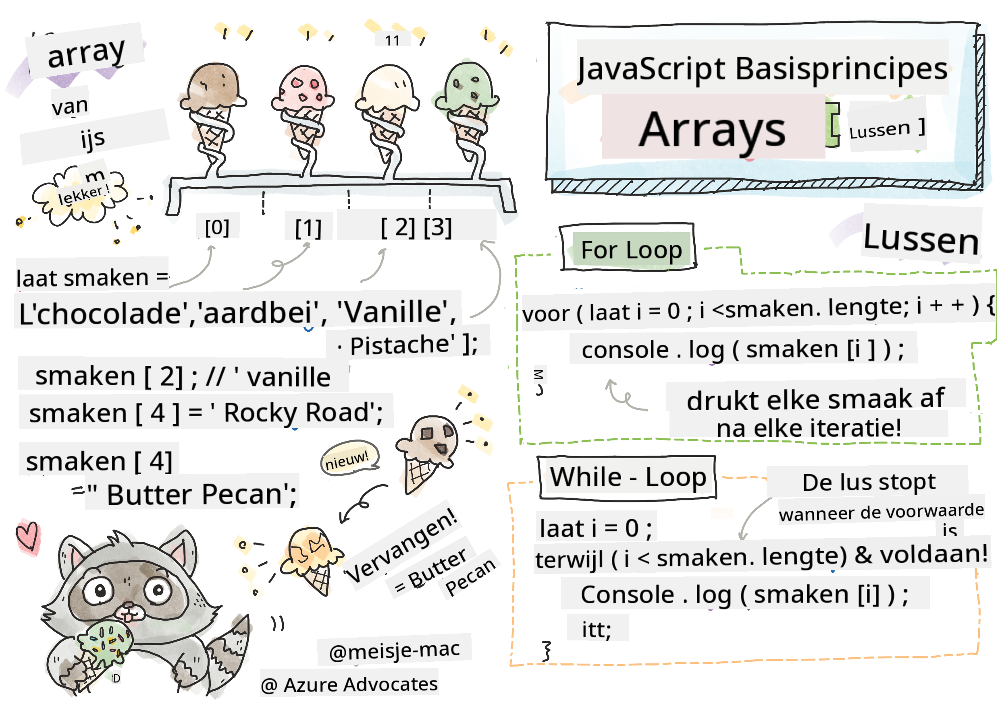

<!--
CO_OP_TRANSLATOR_METADATA:
{
  "original_hash": "3f7f87871312cf6cc12662da7d973182",
  "translation_date": "2025-08-27T20:16:23+00:00",
  "source_file": "2-js-basics/4-arrays-loops/README.md",
  "language_code": "nl"
}
-->
# JavaScript Basis: Arrays en Lussen


> Sketchnote door [Tomomi Imura](https://twitter.com/girlie_mac)

## Pre-Les Quiz
[Pre-les quiz](https://ashy-river-0debb7803.1.azurestaticapps.net/quiz/13)

Deze les behandelt de basis van JavaScript, de taal die interactiviteit op het web mogelijk maakt. In deze les leer je over arrays en lussen, die worden gebruikt om gegevens te manipuleren.

[](https://youtube.com/watch?v=1U4qTyq02Xw "Arrays")

[](https://www.youtube.com/watch?v=Eeh7pxtTZ3k "Lussen")

> 🎥 Klik op de afbeeldingen hierboven voor video's over arrays en lussen.

> Je kunt deze les volgen op [Microsoft Learn](https://docs.microsoft.com/learn/modules/web-development-101-arrays/?WT.mc_id=academic-77807-sagibbon)!

## Arrays

Werken met gegevens is een veelvoorkomende taak in elke programmeertaal, en het is een stuk eenvoudiger wanneer gegevens zijn georganiseerd in een structureel formaat, zoals arrays. Met arrays worden gegevens opgeslagen in een structuur die lijkt op een lijst. Een groot voordeel van arrays is dat je verschillende soorten gegevens in één array kunt opslaan.

✅ Arrays zijn overal om ons heen! Kun je een voorbeeld bedenken van een array in het echte leven, zoals een zonnepaneel-array?

De syntax voor een array is een paar vierkante haken.

```javascript
let myArray = [];
```

Dit is een lege array, maar arrays kunnen ook worden gedeclareerd met al ingevulde gegevens. Meerdere waarden in een array worden gescheiden door een komma.

```javascript
let iceCreamFlavors = ["Chocolate", "Strawberry", "Vanilla", "Pistachio", "Rocky Road"];
```

De waarden in een array krijgen een unieke waarde genaamd de **index**, een geheel getal dat wordt toegewezen op basis van de afstand vanaf het begin van de array. In het bovenstaande voorbeeld heeft de stringwaarde "Chocolate" een index van 0, en de index van "Rocky Road" is 4. Gebruik de index met vierkante haken om arraywaarden op te halen, te wijzigen of toe te voegen.

✅ Verrast het je dat arrays beginnen bij index nul? In sommige programmeertalen beginnen indexen bij 1. Er is een interessante geschiedenis hierover, die je kunt [lezen op Wikipedia](https://en.wikipedia.org/wiki/Zero-based_numbering).

```javascript
let iceCreamFlavors = ["Chocolate", "Strawberry", "Vanilla", "Pistachio", "Rocky Road"];
iceCreamFlavors[2]; //"Vanilla"
```

Je kunt de index gebruiken om een waarde te wijzigen, zoals dit:

```javascript
iceCreamFlavors[4] = "Butter Pecan"; //Changed "Rocky Road" to "Butter Pecan"
```

En je kunt een nieuwe waarde toevoegen op een bepaalde index zoals dit:

```javascript
iceCreamFlavors[5] = "Cookie Dough"; //Added "Cookie Dough"
```

✅ Een meer gebruikelijke manier om waarden toe te voegen aan een array is door gebruik te maken van array-operators zoals array.push()

Om te achterhalen hoeveel items er in een array zitten, gebruik je de `length` eigenschap.

```javascript
let iceCreamFlavors = ["Chocolate", "Strawberry", "Vanilla", "Pistachio", "Rocky Road"];
iceCreamFlavors.length; //5
```

✅ Probeer het zelf! Gebruik de console van je browser om een array te maken en te manipuleren die je zelf hebt bedacht.

## Lussen

Lussen stellen ons in staat om repetitieve of **iteratieve** taken uit te voeren, en kunnen veel tijd en code besparen. Elke iteratie kan variëren in variabelen, waarden en voorwaarden. Er zijn verschillende soorten lussen in JavaScript, en ze hebben allemaal kleine verschillen, maar doen in essentie hetzelfde: herhalen over gegevens.

### For-lus

De `for`-lus vereist 3 onderdelen om te itereren:
- `counter` Een variabele die meestal wordt geïnitialiseerd met een getal dat het aantal iteraties telt
- `condition` Een expressie die gebruikmaakt van vergelijkingsoperators om de lus te stoppen wanneer deze `false` wordt
- `iteration-expression` Wordt uitgevoerd aan het einde van elke iteratie, meestal gebruikt om de waarde van de teller te wijzigen
  
```javascript
// Counting up to 10
for (let i = 0; i < 10; i++) {
  console.log(i);
}
```

✅ Voer deze code uit in de console van je browser. Wat gebeurt er als je kleine wijzigingen aanbrengt in de teller, de voorwaarde of de iteratie-expressie? Kun je de lus achteruit laten lopen, zodat er een aftelling ontstaat?

### While-lus

In tegenstelling tot de syntax van de `for`-lus, vereist een `while`-lus alleen een voorwaarde die de lus stopt wanneer de voorwaarde `false` wordt. Voorwaarden in lussen zijn meestal afhankelijk van andere waarden zoals tellers, en moeten tijdens de lus worden beheerd. Startwaarden voor tellers moeten buiten de lus worden gemaakt, en alle expressies om aan een voorwaarde te voldoen, inclusief het wijzigen van de teller, moeten binnen de lus worden onderhouden.

```javascript
//Counting up to 10
let i = 0;
while (i < 10) {
 console.log(i);
 i++;
}
```

✅ Waarom zou je kiezen voor een for-lus versus een while-lus? 17K kijkers hadden dezelfde vraag op StackOverflow, en sommige van de meningen [kunnen interessant voor je zijn](https://stackoverflow.com/questions/39969145/while-loops-vs-for-loops-in-javascript).

## Lussen en Arrays

Arrays worden vaak gebruikt met lussen omdat de meeste voorwaarden de lengte van de array nodig hebben om de lus te stoppen, en de index kan ook de waarde van de teller zijn.

```javascript
let iceCreamFlavors = ["Chocolate", "Strawberry", "Vanilla", "Pistachio", "Rocky Road"];

for (let i = 0; i < iceCreamFlavors.length; i++) {
  console.log(iceCreamFlavors[i]);
} //Ends when all flavors are printed
```

✅ Experimenteer met het herhalen over een array die je zelf hebt gemaakt in de console van je browser.

---

## 🚀 Uitdaging

Er zijn andere manieren om over arrays te herhalen dan for- en while-lussen. Er zijn [forEach](https://developer.mozilla.org/docs/Web/JavaScript/Reference/Global_Objects/Array/forEach), [for-of](https://developer.mozilla.org/docs/Web/JavaScript/Reference/Statements/for...of), en [map](https://developer.mozilla.org/docs/Web/JavaScript/Reference/Global_Objects/Array/map). Herschrijf je array-lus met een van deze technieken.

## Post-Les Quiz
[Post-les quiz](https://ashy-river-0debb7803.1.azurestaticapps.net/quiz/14)

## Herhaling & Zelfstudie

Arrays in JavaScript hebben veel methoden die eraan gekoppeld zijn, die uiterst handig zijn voor gegevensmanipulatie. [Lees meer over deze methoden](https://developer.mozilla.org/docs/Web/JavaScript/Reference/Global_Objects/Array) en probeer er een paar uit (zoals push, pop, slice en splice) op een array die je zelf hebt gemaakt.

## Opdracht

[Herhaal een Array](assignment.md)

---

**Disclaimer**:  
Dit document is vertaald met behulp van de AI-vertalingsservice [Co-op Translator](https://github.com/Azure/co-op-translator). Hoewel we ons best doen voor nauwkeurigheid, dient u zich ervan bewust te zijn dat geautomatiseerde vertalingen fouten of onnauwkeurigheden kunnen bevatten. Het originele document in zijn oorspronkelijke taal moet worden beschouwd als de gezaghebbende bron. Voor kritieke informatie wordt professionele menselijke vertaling aanbevolen. Wij zijn niet aansprakelijk voor eventuele misverstanden of verkeerde interpretaties die voortvloeien uit het gebruik van deze vertaling.