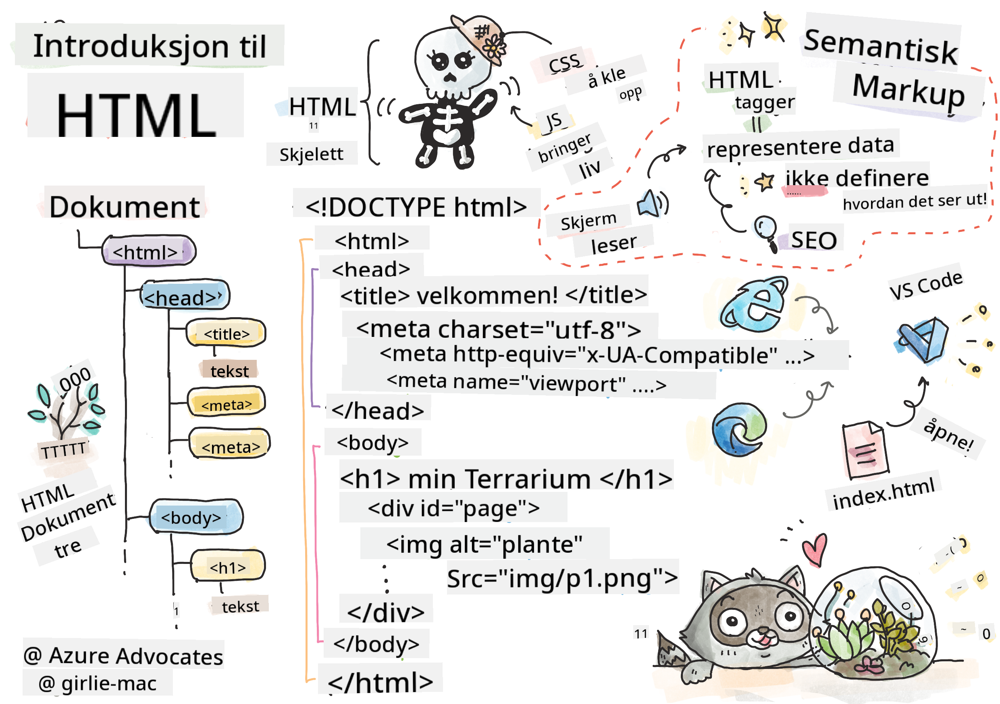
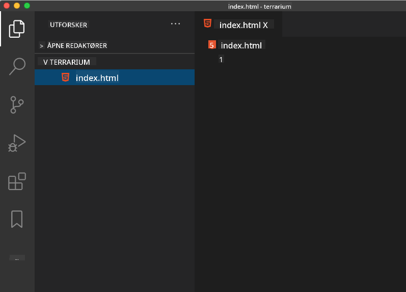

<!--
CO_OP_TRANSLATOR_METADATA:
{
  "original_hash": "46a0639e719b9cf1dfd062aa24cad639",
  "translation_date": "2025-08-26T21:30:54+00:00",
  "source_file": "3-terrarium/1-intro-to-html/README.md",
  "language_code": "no"
}
-->
# Terrarium-prosjekt Del 1: Introduksjon til HTML


> Sketchnote av [Tomomi Imura](https://twitter.com/girlie_mac)

## Quiz før forelesning

[Quiz før forelesning](https://ashy-river-0debb7803.1.azurestaticapps.net/quiz/15)


> Se video

> 
> [](https://www.youtube.com/watch?v=1TvxJKBzhyQ)

### Introduksjon

HTML, eller HyperText Markup Language, er 'skjelettet' til nettet. Hvis CSS 'kler opp' HTML-en din og JavaScript gir den liv, er HTML kroppen til din webapplikasjon. HTMLs syntaks reflekterer til og med denne ideen, da den inkluderer "head", "body" og "footer"-tagger.

I denne leksjonen skal vi bruke HTML til å lage 'skjelettet' til grensesnittet for vårt virtuelle terrarium. Det vil ha en tittel og tre kolonner: en høyre og en venstre kolonne hvor de flyttbare plantene befinner seg, og et midtområde som vil være det faktiske glassaktige terrariet. Ved slutten av denne leksjonen vil du kunne se plantene i kolonnene, men grensesnittet vil se litt rart ut; ikke bekymre deg, i neste seksjon vil du legge til CSS-stiler for å gjøre grensesnittet penere.

### Oppgave

På datamaskinen din, opprett en mappe kalt 'terrarium' og inni den en fil kalt 'index.html'. Du kan gjøre dette i Visual Studio Code etter at du har opprettet terrarium-mappen ved å åpne et nytt VS Code-vindu, klikke på 'open folder', og navigere til den nye mappen din. Klikk på den lille 'file'-knappen i Explorer-panelet og opprett den nye filen:



Eller

Bruk disse kommandoene i git bash:
* `mkdir terrarium`
* `cd terrarium`
* `touch index.html`
* `code index.html` eller `nano index.html`

> index.html-filer indikerer for en nettleser at det er standardfilen i en mappe; URL-er som `https://anysite.com/test` kan være bygget ved hjelp av en mappestruktur som inkluderer en mappe kalt `test` med `index.html` inni; `index.html` trenger ikke å vises i en URL.

---

## DocType og html-tagger

Den første linjen i en HTML-fil er dens doctype. Det er litt overraskende at du må ha denne linjen helt øverst i filen, men den forteller eldre nettlesere at siden skal gjengis i standardmodus, i henhold til gjeldende HTML-spesifikasjon.

> Tips: I VS Code kan du holde musepekeren over en tagg og få informasjon om bruken fra MDN Reference-guidene.

Den andre linjen bør være åpningstagen `<html>`, etterfulgt av dens lukketagg `</html>`. Disse taggene er rootelementene i grensesnittet ditt.

### Oppgave

Legg til disse linjene øverst i `index.html`-filen din:

```HTML
<!DOCTYPE html>
<html></html>
```

✅ Det finnes noen forskjellige moduser som kan bestemmes ved å sette DocType med en spørringsstreng: [Quirks Mode og Standards Mode](https://developer.mozilla.org/docs/Web/HTML/Quirks_Mode_and_Standards_Mode). Disse modusene ble brukt for å støtte veldig gamle nettlesere som ikke er i vanlig bruk i dag (Netscape Navigator 4 og Internet Explorer 5). Du kan holde deg til standard doctype-erklæringen.

---

## Dokumentets 'head'

'Head'-området i HTML-dokumentet inkluderer viktig informasjon om nettsiden din, også kjent som [metadata](https://developer.mozilla.org/docs/Web/HTML/Element/meta). I vårt tilfelle forteller vi webserveren som denne siden skal sendes til for å bli gjengitt, disse fire tingene:

-   sidens tittel
-   metadata om siden, inkludert:
    -   'character set', som forteller hvilken tegnkoding som brukes på siden
    -   nettleserinformasjon, inkludert `x-ua-compatible` som indikerer at IE=edge-nettleseren støttes
    -   informasjon om hvordan visningsområdet skal oppføre seg når det lastes. Å sette visningsområdet til å ha en initial skala på 1 kontrollerer zoomnivået når siden først lastes.

### Oppgave

Legg til en 'head'-blokk i dokumentet ditt mellom åpning og lukking av `<html>`-taggene.

```html
<head>
	<title>Welcome to my Virtual Terrarium</title>
	<meta charset="utf-8" />
	<meta http-equiv="X-UA-Compatible" content="IE=edge" />
	<meta name="viewport" content="width=device-width, initial-scale=1" />
</head>
```

✅ Hva ville skjedd hvis du satte en visningsområde-meta-tagg som dette: `<meta name="viewport" content="width=600">`? Les mer om [viewport](https://developer.mozilla.org/docs/Web/HTML/Viewport_meta_tag).

---

## Dokumentets `body`

### HTML-tagger

I HTML legger du til tagger i .html-filen din for å lage elementer på en nettside. Hver tagg har vanligvis en åpning og lukking, som dette: `<p>hei</p>` for å indikere et avsnitt. Lag grensesnittets body ved å legge til et sett med `<body>`-tagger inne i `<html>`-taggene; markeringen din ser nå slik ut:

### Oppgave

```html
<!DOCTYPE html>
<html>
	<head>
		<title>Welcome to my Virtual Terrarium</title>
		<meta charset="utf-8" />
		<meta http-equiv="X-UA-Compatible" content="IE=edge" />
		<meta name="viewport" content="width=device-width, initial-scale=1" />
	</head>
	<body></body>
</html>
```

Nå kan du begynne å bygge ut siden din. Vanligvis bruker du `<div>`-tagger for å lage de separate elementene på en side. Vi skal lage en serie med `<div>`-elementer som vil inneholde bilder.

### Bilder

En HTML-tagg som ikke trenger en lukketagg er ``-taggen, fordi den har et `src`-element som inneholder all informasjonen siden trenger for å gjengi elementet.

Opprett en mappe i appen din kalt `images` og legg til alle bildene i [kildekode-mappen](../../../../3-terrarium/solution/images); (det er 14 bilder av planter).

### Oppgave

Legg til disse plantebildene i to kolonner mellom `<body></body>`-taggene:

```html
<div id="page">
	<div id="left-container" class="container">
		<div class="plant-holder">
			
		</div>
		<div class="plant-holder">
			
		</div>
		<div class="plant-holder">
			
		</div>
		<div class="plant-holder">
			
		</div>
		<div class="plant-holder">
			
		</div>
		<div class="plant-holder">
			
		</div>
		<div class="plant-holder">
			
		</div>
	</div>
	<div id="right-container" class="container">
		<div class="plant-holder">
			
		</div>
		<div class="plant-holder">
			
		</div>
		<div class="plant-holder">
			
		</div>
		<div class="plant-holder">
			
		</div>
		<div class="plant-holder">
			
		</div>
		<div class="plant-holder">
			
		</div>
		<div class="plant-holder">
			
		</div>
	</div>
</div>
```

> Merk: Spans vs. Divs. Divs regnes som 'block'-elementer, og Spans er 'inline'. Hva ville skjedd hvis du endret disse divene til spans?

Med denne markeringen vises plantene nå på skjermen. Det ser ganske dårlig ut, fordi de ennå ikke er stylet med CSS, og vi skal gjøre det i neste leksjon.

Hvert bilde har alternativ tekst som vil vises selv om du ikke kan se eller gjengi et bilde. Dette er en viktig attributt å inkludere for tilgjengelighet. Lær mer om tilgjengelighet i fremtidige leksjoner; for nå, husk at alt-attributtet gir alternativ informasjon for et bilde hvis en bruker av en eller annen grunn ikke kan se det (på grunn av treg tilkobling, en feil i src-attributtet, eller hvis brukeren bruker en skjermleser).

✅ La du merke til at hvert bilde har samme alt-tekst? Er dette god praksis? Hvorfor eller hvorfor ikke? Kan du forbedre denne koden?

---

## Semantisk markering

Generelt er det å foretrekke å bruke meningsfull 'semantikk' når du skriver HTML. Hva betyr det? Det betyr at du bruker HTML-tagger for å representere typen data eller interaksjon de er designet for. For eksempel bør hovedtittelen på en side bruke en `<h1>`-tagg.

Legg til følgende linje rett under åpningstagen `<body>`:

```html
<h1>My Terrarium</h1>
```

Å bruke semantisk markering, som å ha overskrifter som `<h1>` og uordnede lister som `<ul>`, hjelper skjermlesere med å navigere gjennom en side. Generelt bør knapper skrives som `<button>` og lister som `<li>`. Selv om det _er mulig_ å bruke spesialstilte `<span>`-elementer med klikkhåndterere for å etterligne knapper, er det bedre for funksjonshemmede brukere å bruke teknologier for å bestemme hvor på en side en knapp befinner seg, og for å samhandle med den, hvis elementet vises som en knapp. Av denne grunn, prøv å bruke semantisk markering så mye som mulig.

✅ Ta en titt på en skjermleser og [hvordan den samhandler med en nettside](https://www.youtube.com/watch?v=OUDV1gqs9GA). Kan du se hvorfor ikke-semantisk markering kan frustrere brukeren?

## Terrariet

Den siste delen av dette grensesnittet innebærer å lage markering som vil bli stylet for å lage et terrarium.

### Oppgave:

Legg til denne markeringen over den siste `</div>`-taggen:

```html
<div id="terrarium">
	<div class="jar-top"></div>
	<div class="jar-walls">
		<div class="jar-glossy-long"></div>
		<div class="jar-glossy-short"></div>
	</div>
	<div class="dirt"></div>
	<div class="jar-bottom"></div>
</div>
```

✅ Selv om du la til denne markeringen på skjermen, ser du absolutt ingenting bli gjengitt. Hvorfor?

---

## 🚀Utfordring

Det finnes noen morsomme 'eldre' tagger i HTML som fortsatt er morsomme å leke med, selv om du ikke bør bruke utdaterte tagger som [disse taggene](https://developer.mozilla.org/docs/Web/HTML/Element#Obsolete_and_deprecated_elements) i markeringen din. Likevel, kan du bruke den gamle `<marquee>`-taggen for å få h1-tittelen til å rulle horisontalt? (hvis du gjør det, ikke glem å fjerne den etterpå)

## Quiz etter forelesning

[Quiz etter forelesning](https://ashy-river-0debb7803.1.azurestaticapps.net/quiz/16)

## Gjennomgang og selvstudium

HTML er det 'prøvde og sanne' byggesystemet som har hjulpet til med å bygge nettet til det det er i dag. Lær litt om historien ved å studere noen gamle og nye tagger. Kan du finne ut hvorfor noen tagger ble utdaterte og noen lagt til? Hvilke tagger kan bli introdusert i fremtiden?

Lær mer om å bygge nettsteder for nettet og mobile enheter på [Microsoft Learn](https://docs.microsoft.com/learn/modules/build-simple-website/?WT.mc_id=academic-77807-sagibbon).


## Oppgave

[Øv på HTML: Bygg en bloggmockup](assignment.md)

---

**Ansvarsfraskrivelse**:  
Dette dokumentet er oversatt ved hjelp av AI-oversettelsestjenesten [Co-op Translator](https://github.com/Azure/co-op-translator). Selv om vi streber etter nøyaktighet, vær oppmerksom på at automatiserte oversettelser kan inneholde feil eller unøyaktigheter. Det originale dokumentet på sitt opprinnelige språk bør anses som den autoritative kilden. For kritisk informasjon anbefales profesjonell menneskelig oversettelse. Vi er ikke ansvarlige for eventuelle misforståelser eller feiltolkninger som oppstår ved bruk av denne oversettelsen.