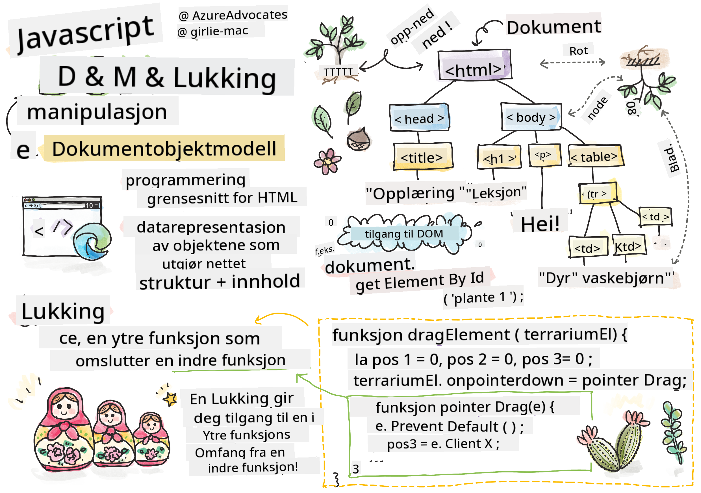
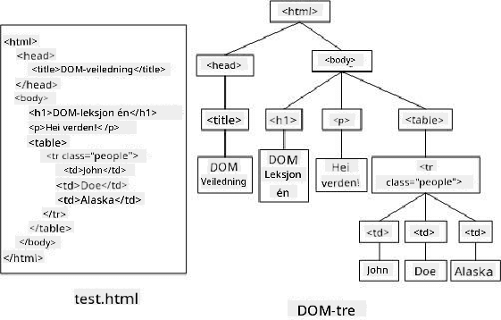

<!--
CO_OP_TRANSLATOR_METADATA:
{
  "original_hash": "30f8903a1f290e3d438dc2c70fe60259",
  "translation_date": "2025-08-26T21:34:32+00:00",
  "source_file": "3-terrarium/3-intro-to-DOM-and-closures/README.md",
  "language_code": "no"
}
-->
# Terrariumprosjekt del 3: DOM-manipulering og en closure


> Sketchnote av [Tomomi Imura](https://twitter.com/girlie_mac)

## Quiz før forelesning

[Quiz før forelesning](https://ff-quizzes.netlify.app/web/quiz/19)

### Introduksjon

Manipulering av DOM, eller "Document Object Model", er en viktig del av webutvikling. Ifølge [MDN](https://developer.mozilla.org/docs/Web/API/Document_Object_Model/Introduction), "The Document Object Model (DOM) er datarepresentasjonen av objektene som utgjør strukturen og innholdet i et dokument på nettet." Utfordringene rundt DOM-manipulering på nettet har ofte vært grunnen til at man bruker JavaScript-rammeverk i stedet for ren JavaScript for å håndtere DOM, men vi skal klare oss på egen hånd!

I tillegg vil denne leksjonen introdusere ideen om en [JavaScript closure](https://developer.mozilla.org/docs/Web/JavaScript/Closures), som du kan tenke på som en funksjon som er omsluttet av en annen funksjon, slik at den indre funksjonen har tilgang til den ytre funksjonens scope.

> JavaScript closures er et omfattende og komplekst tema. Denne leksjonen berører det mest grunnleggende: i koden til dette terrariet vil du finne en closure – en indre funksjon og en ytre funksjon konstruert på en måte som gir den indre funksjonen tilgang til den ytre funksjonens scope. For mye mer informasjon om hvordan dette fungerer, kan du besøke [den omfattende dokumentasjonen](https://developer.mozilla.org/docs/Web/JavaScript/Closures).

Vi vil bruke en closure for å manipulere DOM.

Tenk på DOM som et tre som representerer alle måtene et webdokument kan manipuleres på. Ulike API-er (Application Program Interfaces) er skrevet slik at programmerere, ved hjelp av sitt foretrukne programmeringsspråk, kan få tilgang til DOM og redigere, endre, omorganisere og ellers administrere det.



> En representasjon av DOM og HTML-markeringen som refererer til det. Fra [Olfa Nasraoui](https://www.researchgate.net/publication/221417012_Profile-Based_Focused_Crawler_for_Social_Media-Sharing_Websites)

I denne leksjonen vil vi fullføre vårt interaktive terrarieprosjekt ved å lage JavaScript som lar en bruker manipulere plantene på siden.

### Forutsetning

Du bør ha HTML- og CSS-filen for terrariet ditt ferdig. Innen slutten av denne leksjonen vil du kunne flytte plantene inn og ut av terrariet ved å dra dem.

### Oppgave

I terrariet-mappen din, opprett en ny fil kalt `script.js`. Importer denne filen i `<head>`-seksjonen:

```html
	<script src="./script.js" defer></script>
```

> Merk: bruk `defer` når du importerer en ekstern JavaScript-fil inn i HTML-filen for å sikre at JavaScript kun kjører etter at HTML-filen er fullstendig lastet. Du kan også bruke attributtet `async`, som lar skriptet kjøre mens HTML-filen parses, men i vårt tilfelle er det viktig at HTML-elementene er fullt tilgjengelige for dra-funksjonen før vi lar dra-skriptet kjøre.
---

## DOM-elementene

Det første du må gjøre er å opprette referanser til elementene du vil manipulere i DOM. I vårt tilfelle er det de 14 plantene som for øyeblikket venter i sidefeltene.

### Oppgave

```html
dragElement(document.getElementById('plant1'));
dragElement(document.getElementById('plant2'));
dragElement(document.getElementById('plant3'));
dragElement(document.getElementById('plant4'));
dragElement(document.getElementById('plant5'));
dragElement(document.getElementById('plant6'));
dragElement(document.getElementById('plant7'));
dragElement(document.getElementById('plant8'));
dragElement(document.getElementById('plant9'));
dragElement(document.getElementById('plant10'));
dragElement(document.getElementById('plant11'));
dragElement(document.getElementById('plant12'));
dragElement(document.getElementById('plant13'));
dragElement(document.getElementById('plant14'));
```

Hva skjer her? Du refererer til dokumentet og søker gjennom dets DOM for å finne et element med en bestemt Id. Husk at du i den første leksjonen om HTML ga individuelle Id-er til hvert plantebilde (`id="plant1"`)? Nå vil du dra nytte av den innsatsen. Etter å ha identifisert hvert element, sender du det til en funksjon kalt `dragElement` som du snart skal bygge. Dermed er elementet i HTML nå dra-aktivert, eller vil bli det snart.

✅ Hvorfor refererer vi til elementer via Id? Hvorfor ikke via deres CSS-klasse? Du kan referere til den forrige leksjonen om CSS for å svare på dette spørsmålet.

---

## Closuren

Nå er du klar til å lage `dragElement`-closure, som er en ytre funksjon som omslutter en indre funksjon eller funksjoner (i vårt tilfelle vil vi ha tre).

Closures er nyttige når én eller flere funksjoner trenger tilgang til en ytre funksjons scope. Her er et eksempel:

```javascript
function displayCandy(){
	let candy = ['jellybeans'];
	function addCandy(candyType) {
		candy.push(candyType)
	}
	addCandy('gumdrops');
}
displayCandy();
console.log(candy)
```

I dette eksemplet omgir funksjonen `displayCandy` en funksjon som legger til en ny type godteri i en array som allerede eksisterer i funksjonen. Hvis du kjører denne koden, vil `candy`-arrayet være undefined, siden det er en lokal variabel (lokal for closuren).

✅ Hvordan kan du gjøre `candy`-arrayet tilgjengelig? Prøv å flytte det utenfor closuren. På denne måten blir arrayet globalt, i stedet for å forbli kun tilgjengelig i closurens lokale scope.

### Oppgave

Under elementdeklarasjonene i `script.js`, opprett en funksjon:

```javascript
function dragElement(terrariumElement) {
	//set 4 positions for positioning on the screen
	let pos1 = 0,
		pos2 = 0,
		pos3 = 0,
		pos4 = 0;
	terrariumElement.onpointerdown = pointerDrag;
}
```

`dragElement` får sitt `terrariumElement`-objekt fra deklarasjonene øverst i skriptet. Deretter setter du noen lokale posisjoner til `0` for objektet som sendes inn i funksjonen. Dette er de lokale variablene som vil bli manipulert for hvert element når du legger til dra- og slipp-funksjonalitet innenfor closuren til hvert element. Terrariet vil bli fylt med disse dratte elementene, så applikasjonen må holde oversikt over hvor de plasseres.

I tillegg blir `terrariumElement` som sendes til denne funksjonen tildelt en `pointerdown`-hendelse, som er en del av [web-APIene](https://developer.mozilla.org/docs/Web/API) designet for å hjelpe med DOM-håndtering. `onpointerdown` utløses når en knapp trykkes, eller i vårt tilfelle, et dra-element berøres. Denne hendelseshåndtereren fungerer både på [nett- og mobilnettlesere](https://caniuse.com/?search=onpointerdown), med noen få unntak.

✅ [Hendelseshåndtereren `onclick`](https://developer.mozilla.org/docs/Web/API/GlobalEventHandlers/onclick) har mye mer støtte på tvers av nettlesere; hvorfor ville du ikke brukt den her? Tenk på den eksakte typen skjerminteraksjon du prøver å lage her.

---

## Pointerdrag-funksjonen

`terrariumElement` er klar til å dras rundt; når `onpointerdown`-hendelsen utløses, blir funksjonen `pointerDrag` kalt. Legg til den funksjonen rett under denne linjen: `terrariumElement.onpointerdown = pointerDrag;`:

### Oppgave 

```javascript
function pointerDrag(e) {
	e.preventDefault();
	console.log(e);
	pos3 = e.clientX;
	pos4 = e.clientY;
}
```

Flere ting skjer. Først hindrer du standardhendelsene som normalt skjer ved pointerdown fra å oppstå ved å bruke `e.preventDefault();`. På denne måten har du mer kontroll over grensesnittets oppførsel.

> Kom tilbake til denne linjen når du har bygget skriptfilen helt ferdig og prøv uten `e.preventDefault()` - hva skjer?

Deretter åpner du `index.html` i et nettleservindu og inspiserer grensesnittet. Når du klikker på en plante, kan du se hvordan 'e'-hendelsen fanges opp. Grav inn i hendelsen for å se hvor mye informasjon som samles inn ved én pointerdown-hendelse!  

Legg merke til hvordan de lokale variablene `pos3` og `pos4` settes til e.clientX. Du kan finne `e`-verdiene i inspeksjonsvinduet. Disse verdiene fanger opp x- og y-koordinatene til planten i det øyeblikket du klikker på eller berører den. Du trenger finjustert kontroll over oppførselen til plantene når du klikker og drar dem, så du holder oversikt over koordinatene deres.

✅ Blir det mer tydelig hvorfor hele appen er bygget med én stor closure? Hvis den ikke var det, hvordan ville du opprettholdt scope for hver av de 14 dra-elementene?

Fullfør den innledende funksjonen ved å legge til to flere pointer-hendelsesmanipulasjoner under `pos4 = e.clientY`:

```html
document.onpointermove = elementDrag;
document.onpointerup = stopElementDrag;
```
Nå indikerer du at du vil at planten skal dras med pekeren mens du flytter den, og at dra-bevegelsen skal stoppe når du velger bort planten. `onpointermove` og `onpointerup` er alle deler av det samme APIet som `onpointerdown`. Grensesnittet vil nå kaste feil siden du ennå ikke har definert funksjonene `elementDrag` og `stopElementDrag`, så bygg dem ut neste.

## Funksjonene elementDrag og stopElementDrag

Du vil fullføre closuren din ved å legge til to flere interne funksjoner som vil håndtere hva som skjer når du drar en plante og stopper å dra den. Oppførselen du ønsker er at du kan dra hvilken som helst plante når som helst og plassere den hvor som helst på skjermen. Dette grensesnittet er ganske fleksibelt (det er ingen drop zone, for eksempel) for å la deg designe terrariet ditt akkurat slik du vil ved å legge til, fjerne og reposisjonere planter.

### Oppgave

Legg til funksjonen `elementDrag` rett etter den avsluttende krøllparentesen til `pointerDrag`:

```javascript
function elementDrag(e) {
	pos1 = pos3 - e.clientX;
	pos2 = pos4 - e.clientY;
	pos3 = e.clientX;
	pos4 = e.clientY;
	console.log(pos1, pos2, pos3, pos4);
	terrariumElement.style.top = terrariumElement.offsetTop - pos2 + 'px';
	terrariumElement.style.left = terrariumElement.offsetLeft - pos1 + 'px';
}
```
I denne funksjonen gjør du mange endringer av de opprinnelige posisjonene 1-4 som du satte som lokale variabler i den ytre funksjonen. Hva skjer her?

Mens du drar, tilordner du `pos1` ved å gjøre det lik `pos3` (som du satte tidligere som `e.clientX`) minus den nåværende `e.clientX`-verdien. Du gjør en lignende operasjon med `pos2`. Deretter tilbakestiller du `pos3` og `pos4` til de nye X- og Y-koordinatene til elementet. Du kan se disse endringene i konsollen mens du drar. Deretter manipulerer du plantens CSS-stil for å sette dens nye posisjon basert på de nye posisjonene til `pos1` og `pos2`, og beregner plantens topp- og venstre X- og Y-koordinater basert på sammenligning av dens offset med disse nye posisjonene.

> `offsetTop` og `offsetLeft` er CSS-egenskaper som setter et elements posisjon basert på dets forelder; dets forelder kan være hvilket som helst element som ikke er posisjonert som `static`. 

All denne omberegningen av posisjonering lar deg finjustere oppførselen til terrariet og dets planter.

### Oppgave 

Den siste oppgaven for å fullføre grensesnittet er å legge til funksjonen `stopElementDrag` etter den avsluttende krøllparentesen til `elementDrag`:

```javascript
function stopElementDrag() {
	document.onpointerup = null;
	document.onpointermove = null;
}
```

Denne lille funksjonen tilbakestiller `onpointerup`- og `onpointermove`-hendelsene slik at du enten kan starte plantens fremgang på nytt ved å begynne å dra den igjen, eller begynne å dra en ny plante.

✅ Hva skjer hvis du ikke setter disse hendelsene til null?

Nå har du fullført prosjektet ditt!

🥇Gratulerer! Du har fullført ditt vakre terrarium. 

---

## 🚀Utfordring

Legg til en ny hendelseshåndterer i closuren din for å gjøre noe mer med plantene; for eksempel, dobbeltklikk på en plante for å bringe den til fronten. Vær kreativ!

## Quiz etter forelesning

[Quiz etter forelesning](https://ff-quizzes.netlify.app/web/quiz/20)

## Gjennomgang og selvstudium

Selv om det å dra elementer rundt på skjermen virker trivielt, finnes det mange måter å gjøre dette på og mange fallgruver, avhengig av effekten du ønsker. Faktisk finnes det et helt [drag and drop API](https://developer.mozilla.org/docs/Web/API/HTML_Drag_and_Drop_API) som du kan prøve. Vi brukte det ikke i denne modulen fordi effekten vi ønsket var litt annerledes, men prøv dette APIet på ditt eget prosjekt og se hva du kan oppnå.

Finn mer informasjon om pointer-hendelser på [W3C-dokumentene](https://www.w3.org/TR/pointerevents1/) og på [MDN web docs](https://developer.mozilla.org/docs/Web/API/Pointer_events).

Sjekk alltid nettleserens kompatibilitet ved hjelp av [CanIUse.com](https://caniuse.com/).

## Oppgave

[Jobb litt mer med DOM](assignment.md)

---

**Ansvarsfraskrivelse**:  
Dette dokumentet er oversatt ved hjelp av AI-oversettelsestjenesten [Co-op Translator](https://github.com/Azure/co-op-translator). Selv om vi streber etter nøyaktighet, vær oppmerksom på at automatiserte oversettelser kan inneholde feil eller unøyaktigheter. Det originale dokumentet på sitt opprinnelige språk bør anses som den autoritative kilden. For kritisk informasjon anbefales profesjonell menneskelig oversettelse. Vi er ikke ansvarlige for misforståelser eller feiltolkninger som oppstår ved bruk av denne oversettelsen.