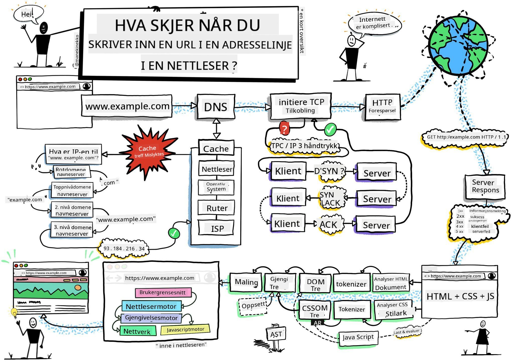
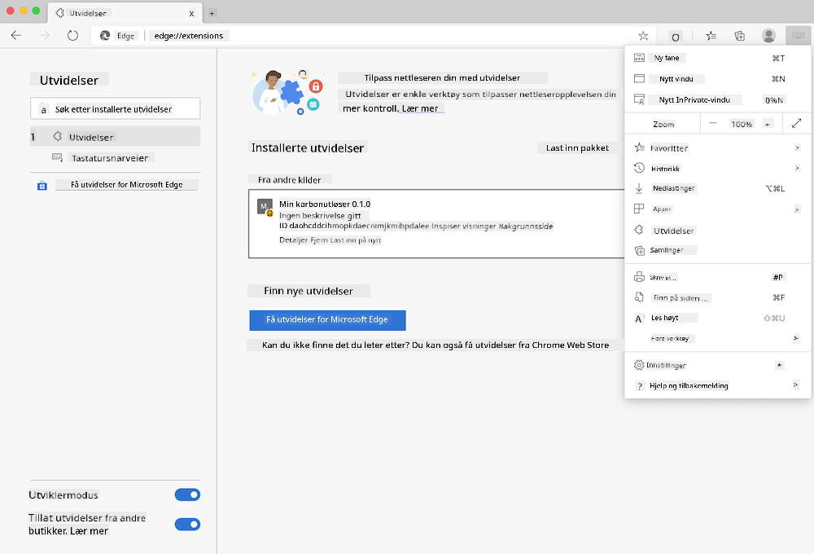
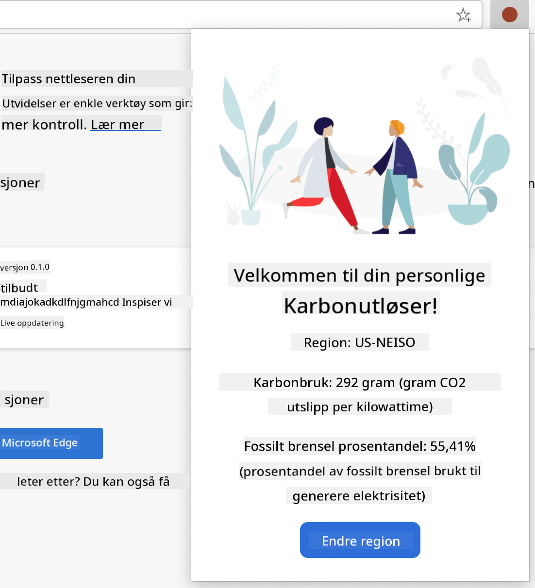

<!--
CO_OP_TRANSLATOR_METADATA:
{
  "original_hash": "0bb55e0b98600afab801eea115228873",
  "translation_date": "2025-08-26T22:39:50+00:00",
  "source_file": "5-browser-extension/1-about-browsers/README.md",
  "language_code": "no"
}
-->
# Nettleserutvidelsesprosjekt Del 1: Alt om nettlesere


> Sketchnote av [Wassim Chegham](https://dev.to/wassimchegham/ever-wondered-what-happens-when-you-type-in-a-url-in-an-address-bar-in-a-browser-3dob)

## Quiz før forelesning

[Quiz før forelesning](https://ashy-river-0debb7803.1.azurestaticapps.net/quiz/23)

### Introduksjon

Nettleserutvidelser gir ekstra funksjonalitet til en nettleser. Men før du bygger en, bør du lære litt om hvordan nettlesere fungerer.

### Om nettleseren

I denne serien med leksjoner vil du lære hvordan du bygger en nettleserutvidelse som fungerer på Chrome, Firefox og Edge. I denne delen vil du oppdage hvordan nettlesere fungerer og sette opp elementene til nettleserutvidelsen.

Men hva er egentlig en nettleser? Det er en programvareapplikasjon som lar en sluttbruker få tilgang til innhold fra en server og vise det på nettsider.

✅ Litt historie: Den første nettleseren het 'WorldWideWeb' og ble laget av Sir Timothy Berners-Lee i 1990.


> Noen tidlige nettlesere, via [Karen McGrane](https://www.slideshare.net/KMcGrane/week-4-ixd-history-personal-computing)

Når en bruker kobler seg til internett ved hjelp av en URL (Uniform Resource Locator)-adresse, vanligvis via Hypertext Transfer Protocol med en `http`- eller `https`-adresse, kommuniserer nettleseren med en webserver og henter en nettside.

På dette tidspunktet viser nettleserens renderingsmotor siden på brukerens enhet, som kan være en mobiltelefon, stasjonær PC eller bærbar PC.

Nettlesere har også muligheten til å cache innhold slik at det ikke trenger å hentes fra serveren hver gang. De kan registrere historikken til en brukers nettleseraktivitet, lagre 'cookies', som er små datastykker som inneholder informasjon brukt til å lagre en brukers aktivitet, og mer.

En veldig viktig ting å huske om nettlesere er at de ikke er like! Hver nettleser har sine styrker og svakheter, og en profesjonell webutvikler må forstå hvordan man får nettsider til å fungere godt på tvers av nettlesere. Dette inkluderer håndtering av små visningsvinduer, som en mobiltelefons, samt en bruker som er offline.

Et veldig nyttig nettsted som du sannsynligvis bør bokmerke i nettleseren du foretrekker å bruke, er [caniuse.com](https://www.caniuse.com). Når du bygger nettsider, er det veldig hjelpsomt å bruke caniuse sine lister over støttede teknologier slik at du best kan støtte brukerne dine.

✅ Hvordan kan du finne ut hvilke nettlesere som er mest populære blant brukerne av nettstedet ditt? Sjekk analysene dine – du kan installere ulike analysepakker som en del av webutviklingsprosessen, og de vil fortelle deg hvilke nettlesere som er mest brukt av de ulike populære nettleserne.

## Nettleserutvidelser

Hvorfor vil du lage en nettleserutvidelse? Det er en praktisk ting å legge til i nettleseren når du trenger rask tilgang til oppgaver du ofte gjentar. For eksempel, hvis du ofte trenger å sjekke farger på ulike nettsider du interagerer med, kan du installere en fargevelger-utvidelse. Hvis du har problemer med å huske passord, kan du bruke en passordhåndteringsutvidelse.

Nettleserutvidelser er også morsomme å utvikle. De har en tendens til å håndtere et begrenset antall oppgaver som de utfører godt.

✅ Hva er dine favorittnettleserutvidelser? Hvilke oppgaver utfører de?

### Installere utvidelser

Før du begynner å bygge, ta en titt på prosessen med å bygge og distribuere en nettleserutvidelse. Selv om hver nettleser varierer litt i hvordan de håndterer denne oppgaven, er prosessen lik på Chrome og Firefox som dette eksempelet på Edge:



> Merk: Sørg for å slå på utviklermodus og tillate utvidelser fra andre butikker.

I hovedsak vil prosessen være:

- bygg utvidelsen din ved hjelp av `npm run build` 
- naviger i nettleseren til utvidelsespanelet ved hjelp av "Innstillinger og mer"-knappen (ikonet `...`) øverst til høyre
- hvis det er en ny installasjon, velg `load unpacked` for å laste opp en ny utvidelse fra dens bygge-mappe (i vårt tilfelle er det `/dist`) 
- eller, klikk `reload` hvis du laster inn en allerede installert utvidelse på nytt

✅ Disse instruksjonene gjelder utvidelser du bygger selv; for å installere utvidelser som er utgitt til nettleserens utvidelsesbutikk, bør du navigere til disse [butikkene](https://microsoftedge.microsoft.com/addons/Microsoft-Edge-Extensions-Home) og installere utvidelsen du ønsker.

### Kom i gang

Du skal bygge en nettleserutvidelse som viser karbonavtrykket til regionen din, med energiforbruket og energikilden i regionen din. Utvidelsen vil ha et skjema som samler inn en API-nøkkel slik at du kan få tilgang til CO2 Signal sitt API.

**Du trenger:**

- [en API-nøkkel](https://www.co2signal.com/); skriv inn e-posten din i boksen på denne siden, og en nøkkel vil bli sendt til deg
- [koden for regionen din](http://api.electricitymap.org/v3/zones) som tilsvarer [Electricity Map](https://www.electricitymap.org/map) (i Boston, for eksempel, bruker jeg 'US-NEISO').
- [startkoden](../../../../5-browser-extension/start). Last ned `start`-mappen; du vil fullføre koden i denne mappen.
- [NPM](https://www.npmjs.com) - NPM er et verktøy for pakkehåndtering; installer det lokalt, og pakkene som er oppført i filen `package.json` vil bli installert for bruk av webressursen din

✅ Lær mer om pakkehåndtering i dette [utmerkede Learn-modulet](https://docs.microsoft.com/learn/modules/create-nodejs-project-dependencies/?WT.mc_id=academic-77807-sagibbon)

Ta et øyeblikk til å se gjennom kodebasen:

dist
    -|manifest.json (standardinnstillinger her)
    -|index.html (HTML-markup for front-end her)
    -|background.js (bakgrunns-JS her)
    -|main.js (bygget JS)
src
    -|index.js (din JS-kode går her)

✅ Når du har API-nøkkelen og regionkoden klar, lagre dem et sted i en notat for fremtidig bruk.

### Bygg HTML for utvidelsen

Denne utvidelsen har to visninger. En for å samle inn API-nøkkelen og regionkoden:


Og den andre for å vise regionens karbonforbruk:



La oss starte med å bygge HTML for skjemaet og style det med CSS.

I `/dist`-mappen vil du bygge et skjema og et resultatområde. I filen `index.html`, fyll ut det avgrensede skjemaområdet:

```HTML
<form class="form-data" autocomplete="on">
	<div>
		<h2>New? Add your Information</h2>
	</div>
	<div>
		<label for="region">Region Name</label>
		<input type="text" id="region" required class="region-name" />
	</div>
	<div>
		<label for="api">Your API Key from tmrow</label>
		<input type="text" id="api" required class="api-key" />
	</div>
	<button class="search-btn">Submit</button>
</form>	
```
Dette er skjemaet der den lagrede informasjonen din vil bli lagt inn og lagret i lokal lagring.

Deretter oppretter du resultatområdet; under den siste skjema-taggen, legg til noen div-er:

```HTML
<div class="result">
	<div class="loading">loading...</div>
	<div class="errors"></div>
	<div class="data"></div>
	<div class="result-container">
		<p><strong>Region: </strong><span class="my-region"></span></p>
		<p><strong>Carbon Usage: </strong><span class="carbon-usage"></span></p>
		<p><strong>Fossil Fuel Percentage: </strong><span class="fossil-fuel"></span></p>
	</div>
	<button class="clear-btn">Change region</button>
</div>
```
På dette tidspunktet kan du prøve en bygging. Sørg for å installere pakkene som er avhengige av denne utvidelsen:

```
npm install
```

Denne kommandoen vil bruke npm, Node Package Manager, til å installere webpack for byggeprosessen til utvidelsen din. Webpack er en bundler som håndterer kompilering av kode. Du kan se resultatet av denne prosessen ved å se i `/dist/main.js` - du ser at koden har blitt bundlet.

For nå bør utvidelsen bygges, og hvis du distribuerer den til Edge som en utvidelse, vil du se et skjema pent vist.

Gratulerer, du har tatt de første stegene mot å bygge en nettleserutvidelse. I påfølgende leksjoner vil du gjøre den mer funksjonell og nyttig.

---

## 🚀 Utfordring

Ta en titt på en nettleserutvidelsesbutikk og installer en til nettleseren din. Du kan undersøke filene på interessante måter. Hva oppdager du?

## Quiz etter forelesning

[Quiz etter forelesning](https://ashy-river-0debb7803.1.azurestaticapps.net/quiz/24)

## Gjennomgang og selvstudium

I denne leksjonen lærte du litt om historien til nettleseren; benytt denne anledningen til å lære om hvordan oppfinnerne av World Wide Web så for seg bruken ved å lese mer om historien. Noen nyttige nettsteder inkluderer:

[Historien til nettlesere](https://www.mozilla.org/firefox/browsers/browser-history/)

[Historien til nettet](https://webfoundation.org/about/vision/history-of-the-web/)

[Et intervju med Tim Berners-Lee](https://www.theguardian.com/technology/2019/mar/12/tim-berners-lee-on-30-years-of-the-web-if-we-dream-a-little-we-can-get-the-web-we-want)

## Oppgave 

[Restyle utvidelsen din](assignment.md)

---

**Ansvarsfraskrivelse**:  
Dette dokumentet er oversatt ved hjelp av AI-oversettelsestjenesten [Co-op Translator](https://github.com/Azure/co-op-translator). Selv om vi streber etter nøyaktighet, vær oppmerksom på at automatiserte oversettelser kan inneholde feil eller unøyaktigheter. Det originale dokumentet på sitt opprinnelige språk bør anses som den autoritative kilden. For kritisk informasjon anbefales profesjonell menneskelig oversettelse. Vi er ikke ansvarlige for misforståelser eller feiltolkninger som oppstår ved bruk av denne oversettelsen.